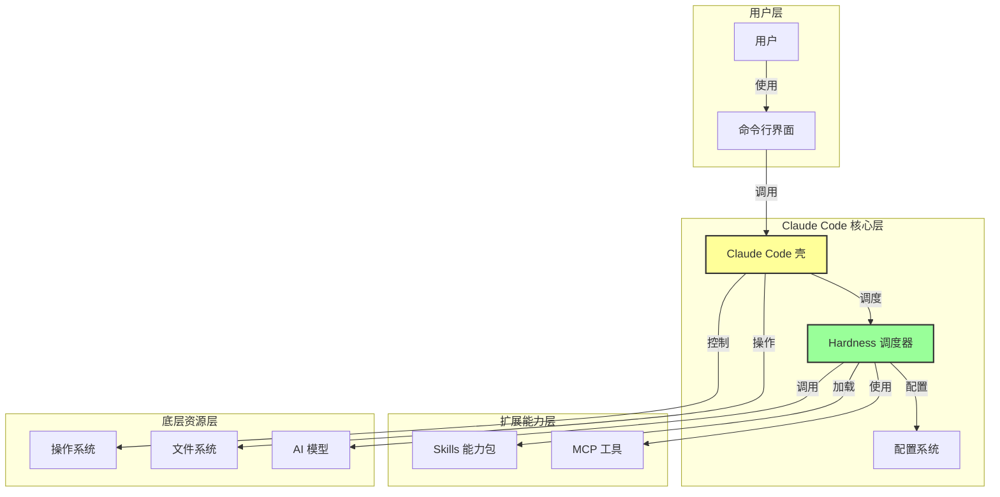
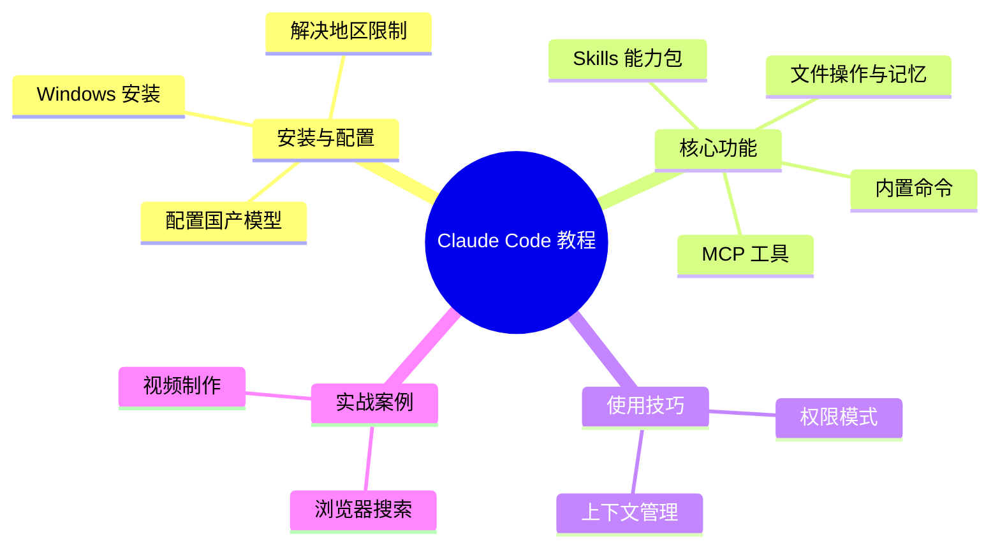
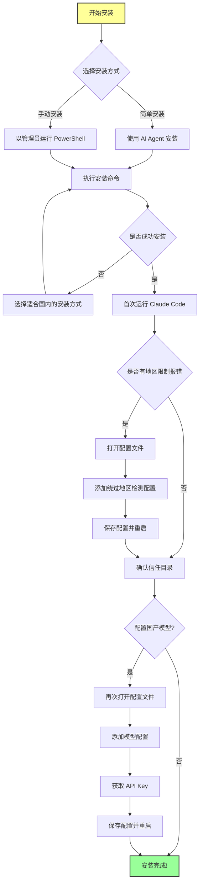
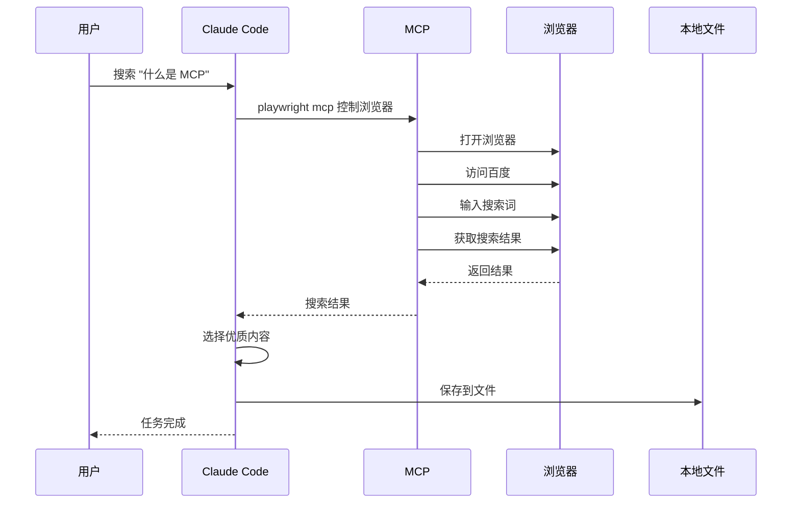
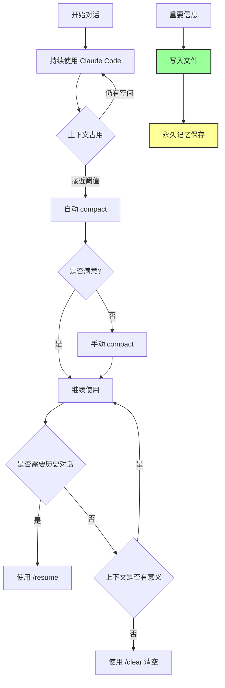
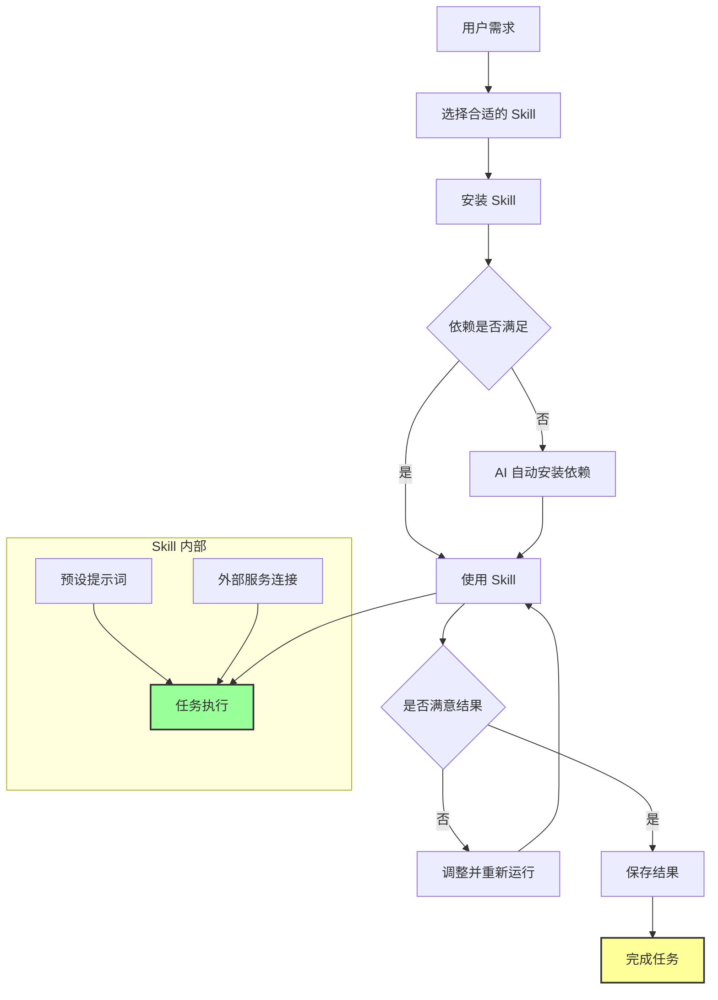

# Claude Code 保姆级教程

## 概述

Claude Code 是 Anthropic 推出的 AI 驱动开发工具，可能是现在最值得安装的 AI 工具之一。它不仅是程序员的工具，还可以作为通用的 AI Agent 使用。

### 为什么重要

- 可以直接操作你的电脑（读写文件、安装工具、控制浏览器）
- 提供无限的、可持久保存的记忆（通过文件）
- 支持 MCP 和 Skills 扩展功能
- 国内网络环境也可正常使用

### 常见误区

**误区 1：Claude Code 只是程序员的工具**

虽然它写代码确实很好用，但它也是一个通用的 AI Agent，可以：
- 做自动化任务
- 控制浏览器
- 开发 Skills
- 制作 PPT
- 操作飞书
- 剪辑视频

**误区 2：使用 Claude Code 必须订阅 Claude**

事实上，Claude Code 只是一个壳，大多数国产模型也能用在这层壳里面。

### Claude Code 架构图

### 教程内容概览

---

## 安装教程

### Claude Code 完整安装流程图

### Windows 环境安装

#### 方法一：简单安装（推荐）

下载任意一个免费的、能在电脑本地执行命令的 AI Agent（比如免费的「翠中国版」），然后告诉它：
> "请用尽一切方法帮我安装 Claude Code"

#### 方法二：手动安装

1. 在电脑搜索栏搜索 "PowerShell"，以管理员身份运行
2. 使用适合国内网络环境的安装命令
3. 安装成功后，重启 PowerShell
4. 输入 `cloud` 命令运行

**注意：**
大多数安装命令在国内网络环境会失败，需要选择特定的安装方式。

### 解决地区限制报错

安装后首次运行，你可能会看到报错提示：
> "我们处在 Anthropic 不服务的国家或地区"

不要慌，这是正常的。解决方法：

1. 打开 Claude Code 的配置文件
2. 添加一行配置来绕过地区检测
3. 保存并关闭文件
4. 再次运行 Claude Code
5. 按 Enter 确认信任当前目录

现在你应该看不到之前的报错了！

---

## 配置国产模型

Claude Code 和 OpenCloud、Urban's Agent 等产品一样，本质上是一个壳。Hardness 负责调度，背后的模型负责思考。

### 推荐模型：Kimi K2.6

在国产第一梯队模型中，Kimi K2.6 性价比最高：
- 价格是 Claude Opus 4.7 的六分之一
- 支持最多模态（包括图片和视频）
- 在开发前端、剪辑视频、制作 PPT 等任务中，模型的视觉能力很重要

### 配置步骤

1. 再次打开配置文件（运行过一次后会自动生成很多配置）
2. 添加配置指定使用的模型
3. 从 Kimi 开放平台获取 API Key（第一次用可以只充 10 块钱感受一下）
4. 保存配置文件
5. 再次运行 Claude Code，和它打招呼说 "你好"

如果它正常回复，并且显示当前模型为 Kimi K2.6，说明配置成功了！

---

## 核心功能

### 文件操作与记忆

Claude Code 和一般 AI 的区别在于，它可以直接操作你的电脑：
- 读写文件
- 安装工具
- 控制浏览器

**文件的重要性：**
文件给 AI 提供了无限的、可以持久保存的记忆。

**工作目录：**
当你运行 `cloud` 命令时，当时所在的目录就是它的工作目录。可以通过 `cd` 命令进入任意文件夹。

### 内置命令

在 Claude Code 里，任何时候按下 `/` 可以看到内置的各种命令：
- `/mcp` - 查看所有安装的 MCP
- `/skills` - 查看所有安装的 Skills
- `/context` - 查看当前上下文占用情况
- `/compact` - 总结前面的内容，释放上下文
- `/clear` - 清空上下文
- `/resume` - 找回之前的历史对话

---

## MCP（Model Context Protocol）

### MCP 工作原理图

### 什么是 MCP

MCP 可以理解成 Claude Code 连接外部工具的一个接口。

### 常用 MCP

- **playwright mcp** - 控制浏览器
- 更多 MCP 可以在 MCP Market 等网站找到

### 安装 MCP

通过相应的命令可以安装 MCP。安装后再次打开 Claude Code，输入 `/mcp` 可以看到所有安装的 MCP。

### 解决报错

安装 MCP 后可能会有报错，不需要手动执行各种命令去解决，直接让 Claude Code 自己去想办法就行。

它会帮你安装好 Node 之类的依赖环境，解决各种报错。全都搞定后，它会提醒你重启一下 Claude Code。

**注意：**
重启后没有上次的聊天记录了，需要输入 `/resume` 可以找到之前所有的历史对话，通过方向键选择，确认后回到之前的上下文。

### 常见依赖

装过几个 MCP 之后，它们常见的依赖就是那几个，所以以后就不太会有报错了。

### 实战：控制浏览器搜索

让 AI 控制浏览器到百度去搜索 "什么是 MCP"，然后选两篇优质的内容阅读，再保存到一个本地的文件。

**这一整套流程的意义：**
你不一定要照着做，但是要知道以后你在想安装什么开源项目或者命令行工具，都可以直接让 Claude Code 帮你安装运行。包括前段时间很多人花 500 块钱去找别人安装的 Open Cloud，通过 Claude Code 都是可以轻松安装的，彻底摆脱痛苦。

---

## 权限模式

### 默认模式

Claude Code 默认的权限模式下，AI 每运行一条命令都需要你批准才能继续执行。你可能需要按几十次同意，完全没有自动化的感觉。

### 其他模式

Claude Code 还有很多其他的权限模式。如果你比较清楚自己在做什么，可以使用最激进的 `bypass permissions`，绝大部分命令都不再需要你批准。这是最常用的方式，其实还是比较安全的。

---

## 上下文管理

### 上下文管理流程图

### 为什么重要

有一个词叫 "上下文不滥"，也就是当上下文占用过多的时候，模型会越来越笨。因此有意识的管理上下文是非常重要的。

### 查看上下文

输入 `/context` 可以看当前上下文的占用情况，会明确标注出：
- 有多少是你的对话造成的
- 有多少是你安装的 MCP 工具
- 有多少是 Skills

### 自动 compact

当上下文占用达到一个阈值的时候，会自动触发 `compact`。你可以理解成就是总结前面的所有内容，释放掉大部分的上下文。

### 手动 compact

更推荐你手动去 compact。当完成了一些阶段性的任务，前面的上下文还有一点点用，但又没那么有用的时候，就通过 `/compact` 来触发。

**示例：** compact 之后上下文的使用，从之前的 50% 降到了 16%。

### 清空上下文

如果上下文已经完全没有意义了，就通过 `/clear` 来清空上下文。

### 永久记忆

要记住，上下文里的信息永远都是临时的，重要的内容你都让 AI 直接写到文件里，成为永久的记忆。

---

## Skills

### Skills 工作流程图

### 什么是 Skills

Skills 你可以理解成给 Claude Code 装的一个现成的能力包。它既像 MCP 一样让 AI 能够连接外部的服务，同时还预设了大量的提示词，用来指导 AI 如何完成某一个特定的工作。

### 常用 Skills

像 Skillhub 这类网站可以找到大量优质的 Skills，让你快速体会到 Claude Code 的强大。

### 安装 Skills

我们可以直接把安装的命令发给 AI，让它帮我们去安装。如果电脑连 Git 都没有装，它直接帮你装上（Mac 没有这个问题）。

### 实战：视频制作

安装一个可以通过编程来剪辑视频的 Skills，比如 hyperframes：

1. 输入 `/skills` 可以看到所有安装的 Skills
2. 通过输入 `@` 可以选择一个工作目录下的文件
3. 选择之前生成的 Markdown 文件（比如 "什么是 MCP"）
4. 让 AI 根据这个文件去制作科普视频

**调整效果：**
第一次做完可能不是特别满意，可以截图发给模型让它再调整调整。最终效果可能会先展示没有 MCP 的情况，然后是有 MCP 的情况，动画震撼大气，原理解释直观易懂。

---

## 常用命令总结

虽然 Claude Code 还有很多的命令我们没有覆盖，但这也符合 28 定律，就是最常用的其实只有那 20% 的命令：

| 命令 | 功能 |
|------|------|
| `/` | 查看内置命令 |
| `/mcp` | 查看所有 MCP |
| `/skills` | 查看所有 Skills |
| `/context` | 查看上下文占用 |
| `/compact` | 总结并释放上下文 |
| `/clear` | 清空上下文 |
| `/resume` | 找回历史对话 |

---

## 相关概念

- [[AI 工具与技术/AI 技术/MCP]] - Model Context Protocol 详细介绍
- [[AI 工具与技术/AI 技术/Skills]] - Skills 的详细介绍
- [[AI 工具与技术/AI 技术/RAG]] - 检索增强生成技术

## 参考资料

- 原始视频：[保姆级Claude Code速成，必学！简单！【附完整文档】](https://www.bilibili.com/video/BV1kX546QEjG/)
- 资料存档：[[资料存档/原始视频/保姆级Claude Code速成]]
