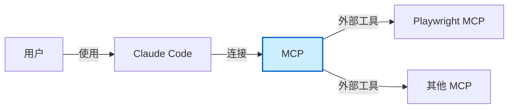
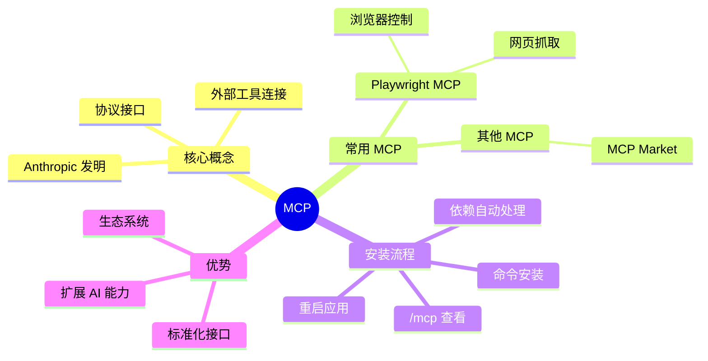

# MCP (Model Context Protocol)

## 概述

MCP（Model Context Protocol）是 Anthropic 提出的一种协议，可以理解成 Claude Code 连接外部工具的一个接口。

### 为什么重要

- 让 AI 能够连接和使用各种外部工具
- 扩展 AI 的能力范围
- 是 Claude Code 生态系统的核心组成部分

### 发明公司

MCP 概念是由 Anthropic（Claude Code 背后的公司）发明的。

## MCP 架构图示

---

## 常用 MCP

### Playwright MCP

用于控制浏览器的 MCP，可以：
- 自动访问网页
- 搜索内容
- 阅读文章
- 保存信息到本地文件

### 其他 MCP

更多 MCP 可以在 MCP Market 等网站找到。

---

## 安装 MCP

### 安装步骤

1. 使用相应的命令安装 MCP
2. 再次打开 Claude Code
3. 输入 `/mcp` 可以看到所有安装的 MCP

### 解决报错

安装 MCP 后可能会有报错：

**解决方法：**
不需要手动执行各种命令去解决报错，直接让 Claude Code 自己去想办法就行。

它会帮你：
- 安装好 Node 之类的依赖环境
- 解决各种报错
- 全都搞定后提醒你重启一下 Claude Code

**注意：**
重启后没有上次的聊天记录了，需要输入 `/resume` 可以找到之前所有的历史对话，通过方向键选择，确认后回到之前的上下文。

### 常见依赖

装过几个 MCP 之后，它们常见的依赖就是那几个，所以以后就不太会有报错了。

---

## 实战案例

### 浏览器自动搜索

任务：让 AI 控制浏览器到百度去搜索 "什么是 MCP"，然后选两篇优质的内容阅读，再保存到一个本地的文件。

**这一整套流程的意义：**
你不一定要照着做，但是要知道以后你在想安装什么开源项目或者命令行工具，都可以直接让 Claude Code 帮你安装运行。

包括前段时间很多人花 500 块钱去找别人安装的 Open Cloud，通过 Claude Code 都是可以轻松安装的，彻底摆脱痛苦。

---

## 相关概念

- [[AI 工具与技术/AI 技术/Skills]] - Skills 的详细介绍
- [[AI 工具与技术/AI 工具/Claude Code 保姆级教程]] - Claude Code 使用教程
- [[AI 工具与技术/AI 技术/RAG]] - 检索增强生成技术

## MCP 思维导图

## 参考资料

- 原始视频：[保姆级Claude Code速成，必学！简单！【附完整文档】](https://www.bilibili.com/video/BV1kX546QEjG/)
