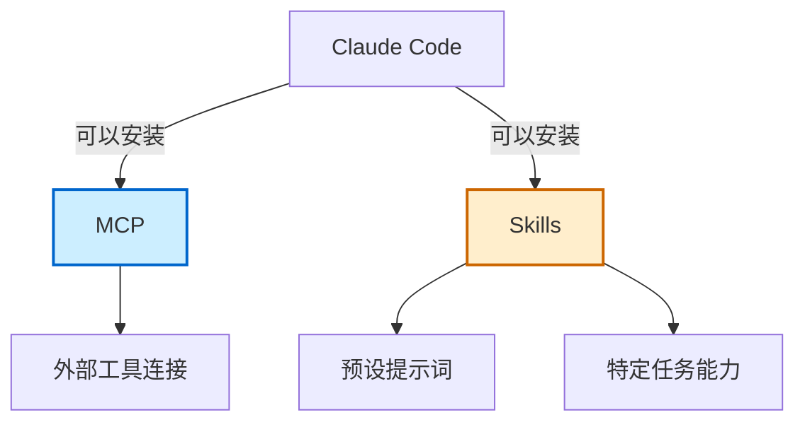
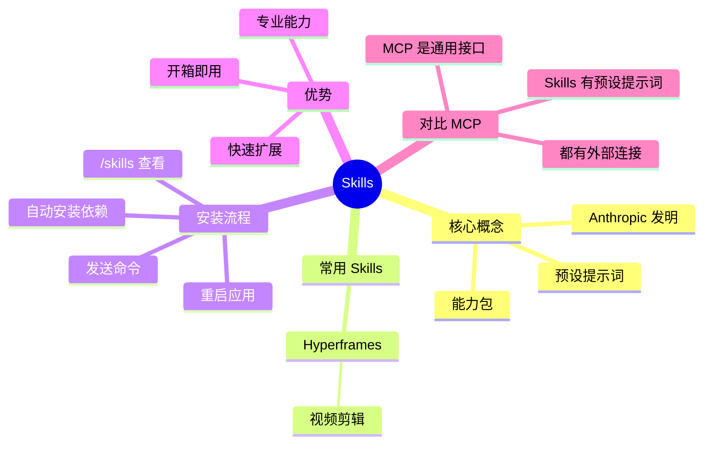

# Skills

## 概述

Skills 是给 Claude Code 装的一个现成的能力包。它既像 MCP 一样让 AI 能够连接外部的服务，同时还预设了大量的提示词，用来指导 AI 如何完成某一个特定的工作。

### 为什么重要

- 提供开箱即用的专业能力
- 预设了高质量的提示词
- 可以快速扩展 AI 的功能范围

### 发明公司

Skills 概念是由 Anthropic（Claude Code 背后的公司）发明的。

## Skills vs MCP 关系图示

---

## 常用 Skills

### Hyperframes

一个可以通过编程来剪辑视频的 Skills。

### 其他 Skills

像 Skillhub 这类网站可以找到大量优质的 Skills，让你快速体会到 Claude Code 的强大。

---

## 安装 Skills

### 安装步骤

1. 直接把安装的命令发给 AI
2. 让它帮你去安装
3. 如果电脑连 Git 都没有装，它直接帮你装上（Mac 没有这个问题）
4. 安装完后它提示你重启一下 Claude Code

### 查看已安装的 Skills

通过 `/skills` 命令可以看到所有安装的 Skills。

---

## 实战案例

### 视频制作

任务：让 AI 根据一个 Markdown 文件去制作科普视频。

步骤：
1. 输入 `@` 可以选择一个工作目录下的文件
2. 选择之前生成的 Markdown 文件（比如 "什么是 MCP"）
3. 让 AI 根据这个文件去制作科普视频

**调整效果：**
第一次做完可能不是特别满意，可以截图发给模型让它再调整调整。最终效果可能会先展示没有 MCP 的情况，然后是有 MCP 的情况，动画震撼大气，原理解释直观易懂。

---

## Skills vs MCP

| 特性 | Skills | MCP |
|------|--------|-----|
| 连接外部服务 | ✅ | ✅ |
| 预设提示词 | ✅ | ❌ |
| 专注特定任务 | ✅ | 通用接口 |

---

## 相关概念

- [[AI 工具与技术/AI 技术/MCP]] - Model Context Protocol 详细介绍
- [[AI 工具与技术/AI 工具/Claude Code 保姆级教程]] - Claude Code 使用教程
- [[AI 工具与技术/AI 技术/RAG]] - 检索增强生成技术

## Skills 思维导图

## 参考资料

- 原始视频：[保姆级Claude Code速成，必学！简单！【附完整文档】](https://www.bilibili.com/video/BV1kX546QEjG/)
