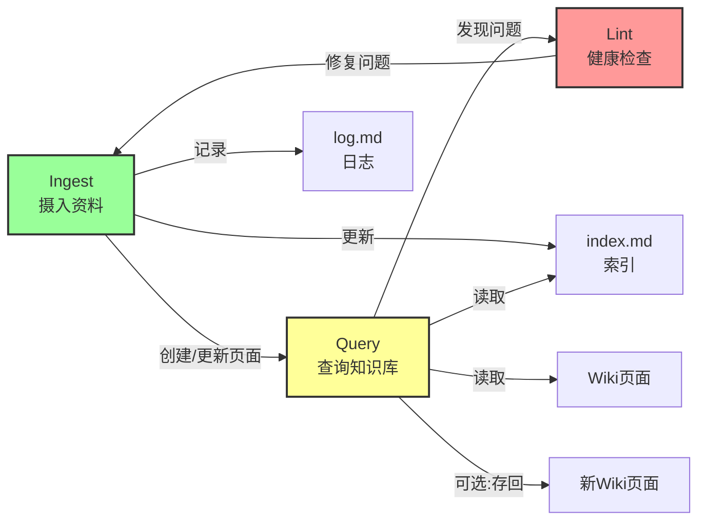
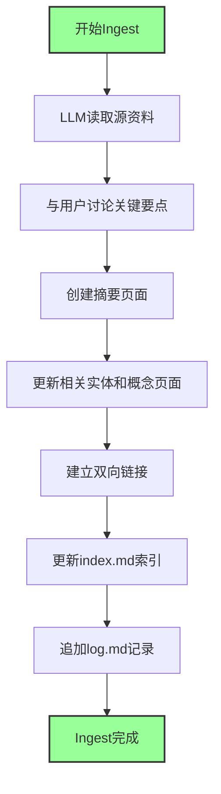

# LLM Wiki 操作流程

## 概述

LLM Wiki 模式有三个核心操作：Ingest（摄入）、Query（查询）、Lint（检查）。

可以把这三个操作想象成一个图书馆的日常工作：
- **Ingest** - 新书入馆
- **Query** - 读者查询
- **Lint** - 定期整理

## 什么是操作流程？

操作流程就是 LLM Wiki 的「工作手册」。它告诉你如何与 LLM 配合，共同维护和使用你的知识库。

就像学开车一样，你需要知道几个基本操作：
- 启动、行驶、停车、检查保养

LLM Wiki 有三个基本操作，学会了就能顺畅使用！

## 操作 1：Ingest（摄入）

### 描述

Ingest 就是「摄入新资料」，让 LLM 处理它。

就像把一本新书进图书馆：
- 先买下这本书
- 编目分类
- 放到合适的位置
- 与其他书建立关联

### 典型流程

Ingest 的具体步骤是：

1. **LLM 读取源资料**
   - 仔细阅读你提供的资料
   - 理解核心内容

2. **与你讨论关键要点**
   - LLM 总结重点
   - 确认理解无误
   - 讨论如何处理

3. **在 wiki 中编写摘要页面**
   - 创建源资料的精华版
   - 提取关键信息

4. **更新索引**
   - 把新页面添加到目录中

5. **更新整个 wiki 中的相关实体和概念页面**
   - 找到相关的已有页面
   - 建立连接
   - 补充相关内容

6. **向日志追加一条记录**
   - 记录这次操作
   - 便于追溯

### 规模说明

一个源资料可能会触及 10-15 个 wiki 页面。

想象一下：
- 你看了一篇关于「人工智能」的文章
- LLM 可能会更新：
  - 人工智能概念页面
  - 相关技术的页面
  - 相关人物的页面
  - 应用场景的页面
  - 等等...

这就是知识的复利效应！

### 工作流风格选择

你可以选择两种风格：

| 风格 | 特点 | 适合场景 |
|------|------|---------|
| **个人风格** | 一次一个源，保持参与 | 认真学习，深度理解 |
| **批量风格** | 一次批量摄入多个源 | 快速收集，先存起来 |

#### 个人风格
- 一次只处理一个资料
- 你全程参与
- 阅读摘要，检查更新
- 指导 LLM 强调什么
- 适合深度学习和理解

#### 批量风格
- 一次处理多个资料
- 监督较少
- 快速积累资料
- 适合先攒起来

### 实际例子

假设你看到一篇好文章：

1. 你：「帮我 ingest 这篇文章」
2. LLM：阅读文章
3. LLM：「这篇文章讲了 A、B、C 三个要点，我觉得可以这样组织...」
4. 你：「好的，不过我觉得 B 点很重要，多强调一下」
5. LLM：好的，我创建摘要页面，并且更新相关的概念页面
6. LLM：完成了，我更新了索引和日志

## 操作 2：Query（查询）

### 描述

Query 就是「向知识库提问」。

就像去图书馆问管理员：「帮我找一下关于 XX 的资料？」

LLM 会搜索相关页面，阅读它们，并综合出带引用的答案。

### 答案形式

根据问题不同，答案可以采取不同形式：

| 形式 | 适用场景 |
|------|---------|
| **Markdown 页面** | 详细的文字说明 |
| **比较表格** | 对比多个事物 |
| **幻灯片（Marp）** | 演示和分享 |
| **图表** | 数据可视化 |
| **Canvas** | 图形化展示 |

### 关键洞见

这是 LLM Wiki 最强大的地方！

好的答案可以存回 wiki 作为新页面！

你要求的比较、分析、你发现的连接 — 这些都是有价值的，不应该消失在聊天历史中。

这样你的探索就像摄入的源一样在知识库中复利！

### 为什么要存回 wiki？

因为：
- **保存你的思考过程**
- **避免重复工作**
- 让知识持续积累
- 下次直接用，不用再问一遍

就像做笔记一样，好的问题和答案也要记下来！

### 实际例子

你问：「X 和 Y 有什么区别？」

1. LLM 搜索相关页面
2. LLM 阅读并理解
3. LLM 创建一个比较表格
4. LLM 说：「我整理好了，要不要存成一个新页面？」
5. 你：「好的，存起来！」
6. 下次有人问同样的问题，直接看这个页面就好！

## 操作 3：Lint（检查）

### 描述

Lint 就是「定期健康检查」，让 LLM 检查一下你的知识库，发现问题并改进。

就像给汽车做保养一样，定期检查，发现问题，及时修复。

### 检查内容

Lint 会检查这些方面：

| 检查项 | 说明 |
|--------|------|
| **页面之间的矛盾** | 有没有说法不一致的地方 |
| **过期声明** | 被新源推翻的旧内容 |
| **孤立页面** | 没有被其他页面链接到的页面 |
| **缺失概念** | 被提及但没有自己页面的概念 |
| **缺失交叉引用** | 应该有连接但没连的地方 |
| **数据空白** | 可以通过网络搜索补的内容 |

### 额外价值

LLM 不仅擅长发现问题，还擅长建议：
- 建议新的调查问题
- 建议新的资料来源
- 建议可以深入的方向

这使你的 wiki 在成长过程中保持健康！

### 为什么叫 Lint？

Lint 是编程中的术语，指检查代码问题的工具。这里借用过来，指检查知识库问题。

## 两个特殊文件

LLM Wiki 有两个非常重要的特殊文件：

### index.md（索引）

这是你的知识库的「目录」或「地图」。

| 特点 | 说明 |
|------|------|
| **内容导向** | wiki 中所有内容的目录 |
| **组织方式** | 按类别（实体、概念、源等） |
| **更新时机** | 每次摄入时更新 |
| **查询使用** | LLM 先读取索引找到相关页面，再深入 |
| **规模** | 中等规模（~100 个源，~数百个页面）下效果惊人好 |

好处：避免了需要复杂的基于嵌入的 RAG 基础设施！

简单的索引就够了！

### log.md（日志）

这是你的知识库的「时间线」或「历史记录」。

| 特点 | 说明 |
|------|------|
| **时间导向** | 发生了什么和何时发生的追加记录 |
| **条目格式** | 一致的前缀，例如 `## [2026-04-02] ingest | Article Title` |
| **工具友好** | 可以用简单工具解析，看最后几条记录 |
| **用途** | wiki 演进的时间线 |

就像项目的 changelog，帮助 LLM 理解最近做了什么。

## LLM Wiki 三大操作关系图

## Ingest 详细流程图

## 完整工作流示例

让我们看一个完整的使用场景：

### 星期一：Ingest

1. 你找到一篇好文章
2. Ingest 它
3. LLM 创建摘要页面
4. 更新相关概念页面
5. 更新 index 和 log

### 星期三：Query

1. 你有个问题
2. Query 提问
3. LLM 给出好答案
4. 把答案存成新页面

### 星期五：Lint

1. Lint 检查一下
2. 发现一些小问题
3. 修复它们
4. LLM 建议一些新方向

### 下周：继续

1. 又找到新文章
2. 继续 Ingest
3. 知识库越来越强大！

## 常见问题

### Q1：这三个操作我每天都要做吗？
A：Ingest 和 Query 经常用，Lint 定期做就可以了，比如每周一次。

### Q2：Ingest 一个资料要多久？
A：取决于资料长短，一般几分钟到几十分钟。可以边做边和 LLM 讨论。

### Q3：Query 的答案一定要存回 wiki 吗？
A：建议存！因为好的答案下次还会用，而且存入后知识会复利。

### Q4：Lint 发现问题怎么办？
A：让 LLM 帮你修复！或者你自己手动修改。

## 最佳实践

### 1. Ingest 的技巧

- 保持小批量 ingest，不要攒太多
- 每次 ingest 后检查一下结果
- 给 LLM 清晰的指示

### 2. Query 的技巧

- 好问题要存回 wiki
- 问有深度的问题
- 让 LLM 用表格、对比等多种形式

### 3. Lint 的技巧

- 定期 lint，不要等问题太多
- 重视 LLM 的建议
- 用 lint 也是学习的机会

## 相关概念

- [[LLM Wiki 生态/LLM Wiki 基础/LLM Wiki]] - 整体概念
- [[LLM Wiki 生态/LLM Wiki 基础/LLM Wiki 三层架构]] - 架构说明

## 参考资料

- [[资料存档/原始文章/llm-wiki-by-karpathy]]
