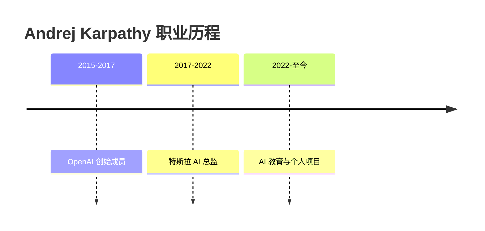

# Andrej Karpathy

## 概述

Andrej Karpathy 是一位在人工智能领域极具影响力的研究者和工程师。他最广为人知的身份是特斯拉 AI 总监，以及 [[核心概念/LLM Wiki 基础/LLM Wiki]] 模式的提出者。他在计算机视觉、深度学习和 AI 教育方面都做出了重要贡献。

可以说，他是 AI 领域的「明星研究者」+「布道者」+「创新者」！

## 背景介绍

### 学术经历

**教育背景：**
- 斯坦福大学计算机科学博士
- 师从李飞飞（Fei-Fei Li），研究计算机视觉和深度学习
- 在计算机视觉和 ImageNet 相关研究的早期贡献

**职业经历：**

- **OpenAI 创始成员和研究科学家（2015-2017）**
- **特斯拉 AI 总监（2017-2022）**
- 之后专注于 AI 教育和个人项目（2022 至今）

### 主要成就

- **计算机视觉先驱**：在深度学习和计算机视觉的早期推动者
- **特斯拉自动驾驶**：领导特斯拉 Autopilot 的 AI 团队
- **AI 教育者**：通过博客、视频和开源项目教育大众
- **LLM Wiki**：提出 LLM Wiki 个人知识管理模式

## 主要贡献

### 1. LLM Wiki 模式

**2024 年，Andrej Karpathy 提出了 [[核心概念/LLM Wiki 基础/LLM Wiki]] 模式，这是他最具影响力的创新之一。**

**核心理念：**
- 让 LLM 不是作为程序员
- Wiki 作为代码库
- Obsidian 作为 IDE
- 知识像代码一样管理和进化

**三层架构：**
1. **Raw Sources** - 原始资料（不可变）
2. **The Wiki** - AI 生成的结构化知识
3. **The Schema** - 规则和工作流程

**经典比喻：**
> Obsidian is the IDE, LLM is the programmer, wiki is the codebase.

**三个核心操作：**
- **Ingest** - 处理新资料
- **Query** - 向知识库提问
- **Lint** - 检查和优化

这个模式启发了社区中的多个项目，包括本网站！

### 2. 计算机视觉研究

Andrej 在计算机视觉领域做出了多个重要贡献：

- **CNN 理解和教育**
- **ImageNet** 相关研究
- **深度学习** 最佳实践总结
- **迁移学习** 应用探索

### 3. AI 教育工作

Andrej 也是一位杰出的 AI 教育者：

- **博客文章**：深入浅出解释复杂概念
- **开源项目**：分享代码和教程
- **YouTube 视频**：直观演示 AI 应用
- **演讲分享**：在各种场合分享见解

他的特点是能用大白话解释高深的技术，让更多人能理解和学习 AI！

## 重要观点和理念

### 关于 AI 的未来

Andrej 对 AI 的未来有独特的见解：

- **AI 即编程**：未来的编程会更自然语言化
- **知识复利**：知识应该像代码一样复利增长
- **个人知识库**：每个人都应该有自己的 AI 驱动的知识库
- **渐进式完善**：不要追求完美，持续迭代就好

### 关于学习建议

他经常分享的建议：

- **动手实践**：最好的学习方式是动手做
- **项目驱动**：通过项目学习
- **记录笔记**：好记性不如烂笔头（最好有个 wiki！
- **社区参与**：和他人交流和分享

## 影响力

### 技术影响力

- **LLM Wiki 社区**：多个项目基于他的理念发展
- **教育资源**：帮助无数人通过他的内容入门 AI
- **行业实践**：他的想法影响了很多 AI 应用和产品

### 社区项目

基于 LLM Wiki 理念的社区项目：

| 项目 | 说明 |
|------|------|
| [[人物与工具/LLM Wiki 工具/NEXUS]] | 多代理记忆系统 |
| [[人物与工具/LLM Wiki 工具/llmwiki]] | CLI 工具（1K+ stars |
| [[人物与工具/LLM Wiki 工具/SeekLink]] | 行级检索工具 |
| [[人物与工具/LLM Wiki 工具/Keel]] | Mac 应用 |
| **本网站** | 也是一个 LLM Wiki 实现 |

## 为什么 Andrej Karpathy 重要？

### 1. 从 理论到实践

他不仅做研究，还能把想法变成实际可用的模式！

### 2. 教育和传播

他擅长把复杂的技术用简单的方式讲清楚，让更多人受益。

### 3. 前瞻思维

LLM Wiki 模式展示了对 AI 未来应用的深刻洞察。

## 相关链接

### 核心概念
- [[核心概念/LLM Wiki 基础/LLM Wiki]] - LLM Wiki 详细介绍
- [[核心概念/LLM Wiki 基础/LLM Wiki 三层架构]] - 架构详解
- [[核心概念/LLM Wiki 基础/LLM Wiki 操作流程]] - 操作流程

### 系统介绍
- [[关于本站/系统介绍/LLM Wiki 模式原文]] - 模式原文介绍
- [[关于本站/系统介绍/LLM Wiki 介绍]] - 简化版介绍

### 工具
- [[人物与工具/笔记工具/Obsidian]] - 他推荐的工具
- [[人物与工具/LLM Wiki 工具/NEXUS]] - 社区项目
- [[人物与工具/LLM Wiki 工具/llmwiki]] - CLI 工具
- [[人物与工具/LLM Wiki 工具/SeekLink]] - 检索工具
- [[人物与工具/LLM Wiki 工具/Keel]] - Mac 应用
- [[人物与工具/LLM Wiki 工具/scaffy]] - 启动工具

## 学习资源

想了解更多，可以查找：
- 他的博客文章
- YouTube 视频
- GitHub 开源项目
- 各种演讲和访谈

## 总结

Andrej Karpathy 是一位在 AI 多个领域都做出重要贡献的人。从计算机视觉研究，到特斯拉自动驾驶，再到 LLM Wiki 模式，他一直在推动着 AI 的发展和普及。

**他用自己的方式，让 AI 变得更加可理解、可应用、可普及！**
