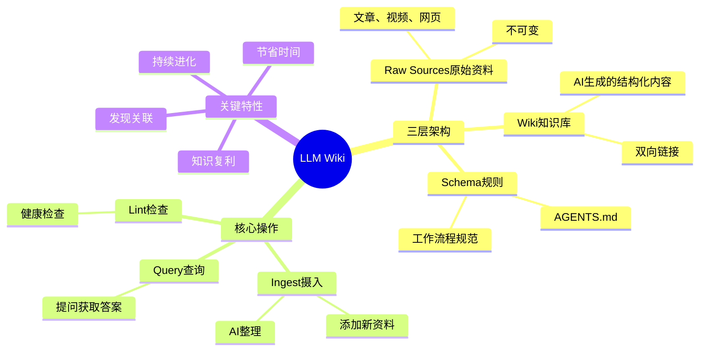
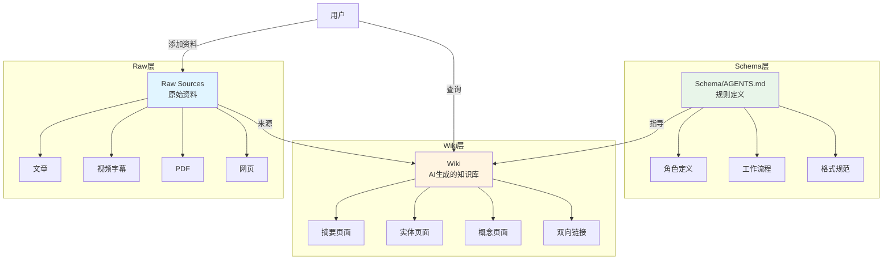
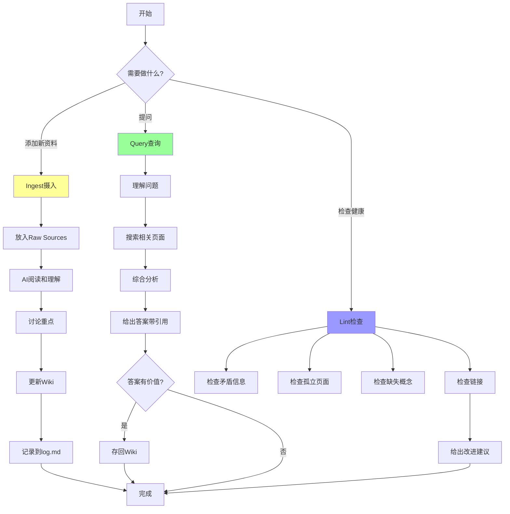

# LLM Wiki 介绍

## LLM Wiki核心架构总览



## 概述

LLM Wiki 是一种革命性的个人知识管理模式，它让 AI 成为你的知识管家，帮你整理、关联、完善知识库。

简单来说，它就像请了一个 24 小时不睡觉的图书管理员，帮你把零散的资料变成结构化的百科全书！

## 什么是 LLM Wiki？

[[核心概念/LLM Wiki 基础/LLM Wiki]] 是 [[人物与工具/重要人物/Andrej Karpathy]] 在 2024 年提出的一种创新的个人知识管理模式。

它与传统笔记软件最大的不同在于：AI 不是被动检索，而是主动维护你的知识网络。

### 核心思想

传统的笔记方法是「你整理，AI 检索」，而 LLM Wiki 是「你提供资料，AI 负责整理」。

这就像：
- 传统方法：你自己把书分类上架，查书时自己找
- LLM Wiki：你把书交给图书管理员，他帮你分类、做笔记、建立引用关系，你提问时他直接给你答案

## 与传统 RAG 的区别

LLM Wiki 和传统的 [[核心概念/AI 技术/RAG]]（检索增强生成）有本质区别。

### 对比分析

| 方面 | 传统 RAG | LLM Wiki |
|------|----------|----------|
| **知识状态** | 静态存储，每次重新检索 | 动态维护，持续进化 |
| **积累效应** | 无 | 有，知识复利增长 |
| **组织方式** | 原始文件堆积 | 结构化 wiki + 双向链接 |
| **维护者** | 你自己 | AI 为主，你为辅 |
| **查询方式** | 搜索原始片段 | 综合已有知识回答 |

### 形象比喻

传统 RAG 就像每次做饭时去图书馆翻书，每次都要重新找。

LLM Wiki 就像图书管理员已经把所有书的内容整理成了一本百科全书，你直接查百科全书就行！

## 三层架构详解

### 三层架构图



LLM Wiki 由三层清晰的结构组成，每层有明确的职责。

### 1. Raw Sources（原始源）

**这是你的资料仓库。**

- 存放所有原始文件：文章、视频字幕、网页、PDF 等
- **不可变**：一旦存入就不修改，保证资料真实性
- 就像图书馆的原始藏书区

**可以存放的内容：**
- 网页文章
- 视频字幕
- 播客文字稿
- PDF 文件
- 个人笔记
- 图片说明

### 2. Wiki（知识库）

**这是 AI 的工作成果。**

- AI 基于 Raw Sources 生成的结构化 Markdown 文件
- 包含摘要、实体页面、概念页面、对比表格等
- 相互链接，形成知识网络
- 就像图书馆的百科全书区

**通常包含的内容：**
- 摘要页面
- 实体页面（人物、工具、项目）
- 概念页面
- 对比分析
- 综合概览

### 3. Schema/AGENTS.md（规则）

**这是游戏规则。**

- 定义 AI 如何工作的规则文件
- 告诉 AI 如何组织知识、使用什么格式
- 就像图书馆的管理手册

**通常包含的内容：**
- 角色定义
- 工作流程
- 页面格式规范
- 分类体系
- 质量标准

### 三层关系图示

```
┌─────────────────────────────────────┐
│  Schema（规则）- 告诉 AI 怎么做    │
├─────────────────────────────────────┤
│  Wiki（知识）- AI 生成的成果       │ ← 你看这一层
├─────────────────────────────────────┤
│  Raw Sources（原始资料）- 不变     │ ← 你往这一层加资料
└─────────────────────────────────────┘
```

## 核心工作流程

### 工作循环流程图



LLM Wiki 有三个核心操作，组成完整的工作循环。

### 1. Ingest（摄入）

**添加新资料的过程。**

当你有新资料时：
1. 把资料放入 Raw Sources
2. AI 阅读和理解资料
3. AI 与你讨论重点
4. AI 更新 Wiki（创建摘要、更新相关页面、建立链接）
5. 记录到 log.md

**类比：**
就像你买了新书交给图书馆，管理员帮你编目、上架、做索引、写内容摘要，还把它和其他相关的书建立关联！

### 2. Query（查询）

**向知识库提问的过程。**

当你有问题时：
1. 你提问
2. AI 搜索 Wiki 中的相关页面
3. AI 综合分析已有知识
4. AI 给你完整的答案（带引用）
5. 如果答案有价值，可以存回 Wiki

**类比：**
就像你问图书管理员问题，他不仅给你找书，还给你综合所有相关书的内容，给你一个完整的答案！

### 3. Lint（检查）

**定期检查知识库健康的过程。**

定期做的事情：
- 检查有没有矛盾的信息
- 检查有没有孤立页面
- 检查有没有缺失的概念
- 检查链接是否正确
- 给出改进建议

**类比：**
就像图书馆定期盘点，看看有没有放错架的书、有没有书损坏了、有没有需要补充的书！

## 为什么要用 LLM Wiki？

### 优势 1：知识复利

每添加一点新知识，整个知识库都会变得更强大。

就像滚雪球，越滚越大！

### 优势 2：节省时间

你不需要花时间整理笔记，AI 帮你做。

你只需要负责收集资料和提问！

### 优势 3：发现关联

AI 能发现你发现不了的知识关联。

不同领域的知识会碰撞出新想法！

### 优势 4：持续进化

知识库会越来越完善，不会过时。

每次查询和更新都让它变得更好！

## Obsidian 集成

因为 Wiki 就是纯 Markdown 文件，你可以直接用 [[人物与工具/笔记工具/Obsidian]] 打开 Wiki 目录作为 Vault！

### 你能享受的功能

- ✅ **Graph View（图谱视图）** - 直观看到知识之间的连接
- ✅ **双向链接** - 点击链接跳转到相关页面
- ✅ **快速搜索** - 在所有知识中快速查找
- ✅ **标签系统** - 用标签组织内容
- ✅ **离线使用** - 所有文件都在本地，无需联网

### 如何设置

1. 打开 Obsidian
2. 选择「打开另一个 Vault」
3. 选择你的 wiki 目录
4. 开始探索！

## 常见问题

### Q1：我需要懂技术才能用 LLM Wiki 吗？

不需要！这个网站就是一个 LLM Wiki 的实际例子。你只需要知道如何使用界面命令就行。

### Q2：LLM 会犯错怎么办？

没关系！LLM Wiki 的核心理念是「渐进式完善」。一次不完美很正常，持续迭代就好。

而且 Raw Sources 是不变的，如果 Wiki 出错了，你随时可以查看原始资料。

### Q3：我的数据安全吗？

这取决于你选择的实现方式。像这个网站，所有数据都在你本地，完全由你控制！

### Q4：和 Obsidian 有什么区别？

Obsidian 是工具，LLM Wiki 是模式。你可以用 Obsidian 作为查看和编辑 LLM Wiki 的界面，但 LLM Wiki 的核心是 AI 主动维护知识！

## 最佳实践

### 1. 持续添加，不要等完美

不要等资料收集全了才开始，先开始，慢慢添加！

### 2. 多提问，多探索

Query 不只是找答案，也是发现知识连接的好方法！

### 3. 定期检查

偶尔做一次 Lint，保持知识库健康！

### 4. 让 AI 工作

不要自己花太多时间整理，让 AI 帮你做！

## 相关概念

- [[核心概念/LLM Wiki 基础/LLM Wiki]] - 详细的 LLM Wiki 概念介绍
- [[核心概念/LLM Wiki 基础/LLM Wiki 三层架构]] - 三层架构详解
- [[核心概念/LLM Wiki 基础/LLM Wiki 操作流程]] - 工作流程详解
- [[核心概念/AI 技术/RAG]] - 检索增强生成
- [[关于本站/系统介绍/LLM Wiki 模式原文]] - Karpathy 的原始文章

## 下一步

想深入了解？继续阅读：
1. [[核心概念/LLM Wiki 基础/LLM Wiki]] - 完整概念介绍
2. [[核心概念/LLM Wiki 基础/LLM Wiki 三层架构]] - 架构详解
3. [[核心概念/LLM Wiki 基础/LLM Wiki 操作流程]] - 操作指南

或者直接试试：
- `/query 什么是 LLM Wiki？` - 向知识库提问
- `/ingest-status` - 查看有哪些资料可以处理
