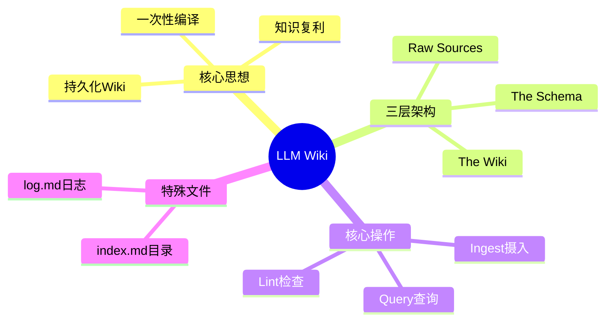
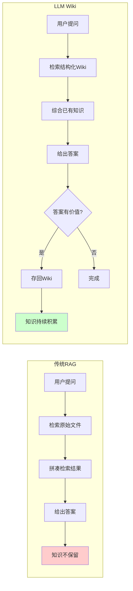
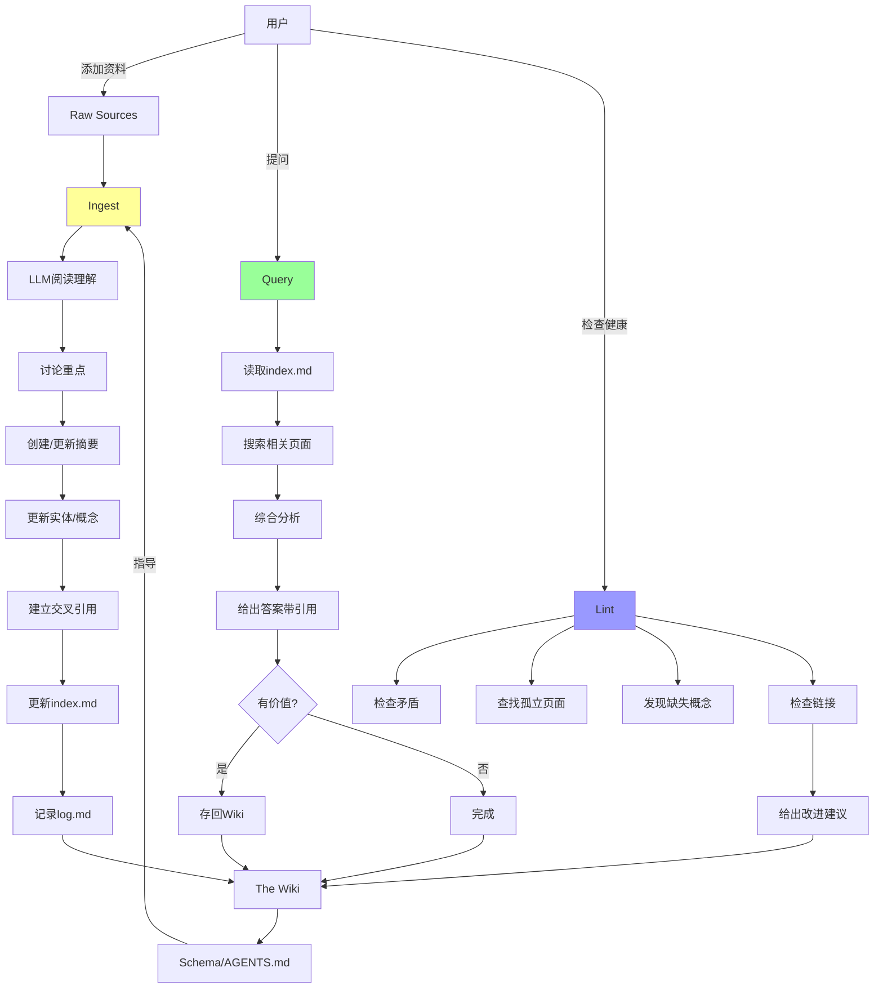

# LLM Wiki 模式原文

## LLM Wiki核心思想概览



## 概述

[[核心概念/LLM Wiki 基础/LLM Wiki]] 是 [[人物与工具/重要人物/Andrej Karpathy]] 在 2024 年提出的一种创新性知识管理模式。它用 LLM 来维护一个结构化的、复利增长的个人知识库，而不是像传统 [[核心概念/AI 技术/RAG]] 那样每次查询都重新检索。

这就像从「每次做饭都去超市买菜」升级为「有一个随时更新的、组织良好的冰箱和厨房」！

## 核心思想

### 传统 RAG 的问题

传统的检索增强生成有几个明显的局限：

| 问题 | 说明 | 类比 |
|------|------|------|
| **每次重新开始** | 每次查询都从零开始重新检索信息 | 每次做饭都去超市重新买菜 |
| **没有积累** | 知识不保存，下次还要重新找 | 没有冰箱，买的菜吃完就没了 |
| **拼凑片段** | 需要把零散的检索结果拼起来 | 每次都要自己把食材切好配好 |
| **无法复用** | 上次的理解不保留，下次还要重来 | 做完饭就把菜谱扔了 |

### LLM Wiki 的解决方案

LLM Wiki 彻底改变了这个模式：

- ✅ **持久化 Wiki**：LLM 持续构建和维护一个 Markdown 文件组成的 Wiki
- ✅ **结构化**：内容组织良好，相互链接
- ✅ **一次性编译**：知识只需处理一次，然后保持最新状态
- ✅ **复利效应**：知识库随时间变得越来越强大

**核心理念：**

> Wiki 是一个持久的、复利的人工制品。

这就像：
- 传统 RAG 是「每次都重新拼乐高」
- LLM Wiki 是「有一个已经拼好、还在不断丰富的乐高城市」

## 三层架构详解

### 传统RAG vs LLM Wiki对比



LLM Wiki 由三层清晰分离的架构组成，每层职责明确。

### 1. Raw Sources（原始源）

**这是你的「原料仓库」。**

- 存放所有原始资料：文章、视频、网页、PDF 等
- **不可变原则**：一旦存入就不修改，保证资料的原始真实性
- 只追加不修改，保证历史可追溯

**可以存放的内容：**
- 📄 网页文章
- 📹 视频字幕
- 🎧 播客文字稿
- 📚 PDF 电子书
- 💭 个人笔记
- 🖼️ 图片说明

**为什么不可变？**
- 就像图书馆的藏书，不能随便涂改
- 保证知识来源的真实性
- 如果 wiki 出错，可以回到原始资料检查

### 2. The Wiki（知识库）

**这是 AI 的「厨房成品」。**

- LLM 完全拥有和维护这一层
- 由结构化的 Markdown 文件组成
- 页面之间有双向链接，形成知识网络
- 持续更新，保持最新状态

**Wiki 包含的内容类型：**
- 📝 **摘要页面** - 原始资料的精华总结
- 👤 **实体页面** - 人物、项目、工具等
- 💡 **概念页面** - 定义、解释、原理
- 📊 **对比表格** - 相似事物的对比分析
- 🗺️ **概览页面** - 某个领域的鸟瞰图
- 🔗 **交叉引用** - 页面之间的关联

**类比：**
就像有一个专业的编辑团队，持续把你的原料加工成百科全书！

### 3. The Schema（规则）

**这是「游戏规则」。**

- 定义 LLM 如何工作的配置文件
- 就像这个项目中的 `AGENTS.md` 和规则文件
- 告诉 LLM 使用什么格式、遵循什么流程
- 可以随着需求一起进化

**Schema 通常包含：**
- 🎭 角色定义 - LLM 是谁，负责什么
- 📋 工作流程 - 每一步做什么
- 📐 页面格式 - Markdown 用什么格式
- 🗂️ 分类体系 - 知识如何组织
- ✅ 质量标准 - 内容要求是什么

### 三层关系图示

```
┌─────────────────────────────────────────┐
│  The Schema（规则）- 告诉 AI 怎么做    │ ← 配置层
├─────────────────────────────────────────┤
│  The Wiki（知识库）- AI 生成的成果     │ ← 知识层（你看这层）
├─────────────────────────────────────────┤
│  Raw Sources（原始资料）- 不可变       │ ← 资料层（你往这层加）
└─────────────────────────────────────────┘
```

**数据流：**
1. 你往 Raw Sources 加新资料
2. LLM 根据 Schema 处理资料
3. LLM 更新 The Wiki
4. 你查询时直接访问 The Wiki

## 三个核心操作

### 完整工作循环图



LLM Wiki 有三个核心操作，形成完整的工作循环。

### Ingest（摄入）

**处理新资料的过程。**

**完整流程：**
1. LLM 读取并理解新的源文件
2. 与用户讨论关键点（可选）
3. 创建/更新摘要页面
4. 更新相关的实体页面
5. 更新相关的概念页面
6. 建立交叉引用链接
7. 更新 index.md 索引
8. 在 log.md 记录操作

**类比：**
就像新书进图书馆：
- 编目
- 分类上架
- 写内容摘要
- 与其他书建立关联
- 录入图书系统

### Query（查询）

**向知识库提问的过程。**

**完整流程：**
1. 用户提问
2. LLM 读取 index.md 了解有什么
3. LLM 搜索相关 Wiki 页面
4. LLM 综合分析已有知识
5. LLM 给出带引用的完整答案
6. 如果答案有价值，存回 Wiki

**关键洞见：**
> 好的答案应该存回 Wiki，就像摄入源一样！

**类比：**
就像问图书管理员，他不仅给你找书，还给你整理一份完整的专题报告！

### Lint（检查）

**知识库的健康检查。**

**检查的内容：**
- 🔍 检查页面之间的矛盾
- 📅 识别过期的声明
- 🏝️ 查找孤立页面（没有被链接的）
- ❓ 发现被提及但缺失的概念
- 🔗 寻找应该建立但缺失的交叉引用
- 💡 建议新的调查问题和来源

**类比：**
就像图书馆的定期盘点：
- 检查有没有放错架的书
- 检查有没有书损坏了
- 发现哪些书需要补充
- 优化书架布局

## 两个特殊文件

LLM Wiki 有两个非常重要的特殊文件。

### index.md

**这是「图书馆目录」。**

- 内容导向的索引，而不是时间导向
- 按类别组织所有内容
- LLM 查询时先读这个，快速了解有什么
- 类似维基百科的首页或分类导航

**类比：**
就像图书馆的总目录，让你快速找到想要的内容！

### log.md

**这是「操作日志」。**

- 按时间顺序的操作记录
- 记录每次 Ingest、Lint 等操作
- 帮助 LLM 理解最近发生了什么
- 类似 Git 的 commit history

**类比：**
就像图书馆的工作日志，记录每天新进了什么书、做了什么整理！

## 应用场景

LLM Wiki 可以应用于很多场景，这里是一些例子：

### 个人应用
- 🎯 **目标追踪** - 跟踪个人目标和进度
- 🏃 **健康管理** - 记录和分析健康数据
- 🧠 **心理笔记** - 记录自我反思和成长
- 📖 **自我提升** - 组织学习资料和感悟

### 研究场景
- 🔬 **深入研究** - 对某个主题进行深入研究
- 📚 **文献整理** - 组织和关联多篇论文
- 💡 **想法孵化** - 让想法在知识库中发酵

### 读书/娱乐
- 📖 **阅读笔记** - 构建人物、主题、情节的丰富 wiki
- 🎬 **影视分析** - 整理电影、剧集的分析
- 🎮 **游戏攻略** - 记录游戏经验和发现

### 专业场景
- 🏢 **企业/团队** - 内部知识库
- 🕵️ **竞争分析** - 整理竞争对手信息
- 🔍 **尽职调查** - 收集和分析调查资料
- ✈️ **旅行规划** - 组织旅行信息
- 📚 **课程笔记** - 整理课程学习资料
- ⚽ **爱好研究** - 深入研究兴趣爱好

## 社区项目

LLM Wiki 概念提出后，社区已经涌现了很多项目：

| 项目 | 类型 | 说明 |
|------|------|------|
| [[人物与工具/LLM Wiki 工具/NEXUS]] | 多代理系统 | 多代理协作记忆系统 |
| [[人物与工具/LLM Wiki 工具/llmwiki]] | CLI 工具 | 命令行工具，超过 1K GitHub stars |
| [[人物与工具/LLM Wiki 工具/SeekLink]] | 检索工具 | 行级锚定检索工具 |
| [[人物与工具/LLM Wiki 工具/Keel]] | Mac 应用 | macOS 原生应用 |
| [[人物与工具/LLM Wiki 工具/scaffy]] | 项目启动 | 新项目脚手架工具 |

**这个网站就是一个 LLM Wiki 的实现！**

## 与 Obsidian 集成

因为 Wiki 就是纯 Markdown 文件，你可以用 [[人物与工具/笔记工具/Obsidian]] 打开 Wiki 目录作为 Vault！

**你能获得：**
- Graph View - 可视化知识图谱
- 双向链接 - 轻松跳转相关内容
- 强大的搜索 - 快速找到需要的内容
- 标签系统 - 灵活的组织方式
- 完全离线 - 所有数据在本地

## 常见问题

### Q1：LLM 真的能维护好 Wiki 吗？

是的！核心思想是「渐进式完善」，一次不完美没关系，持续迭代就好！

而且 Raw Sources 是不变的，随时可以验证。

### Q2：这需要很多技术知识吗？

不需要！像这个网站，你只需要知道几个简单的命令就行。

### Q3：和普通 Wiki 有什么区别？

普通 Wiki 需要你手动写、手动链接、手动维护。

LLM Wiki 是 AI 帮你写、AI 帮你链接、AI 帮你维护！

### Q4：从哪里开始？

很简单：
1. 先收集一些资料到 Raw Sources
2. 用 Ingest 处理
3. 开始 Query 提问
4. 看着你的知识复利增长！

## 相关概念

- [[核心概念/LLM Wiki 基础/LLM Wiki]] - LLM Wiki 详细介绍
- [[核心概念/LLM Wiki 基础/LLM Wiki 三层架构]] - 架构详解
- [[核心概念/LLM Wiki 基础/LLM Wiki 操作流程]] - 操作流程
- [[关于本站/系统介绍/LLM Wiki 介绍]] - 简化版介绍
- [[人物与工具/重要人物/Andrej Karpathy]] - 提出者介绍
- [[核心概念/AI 技术/RAG]] - 传统检索增强生成
