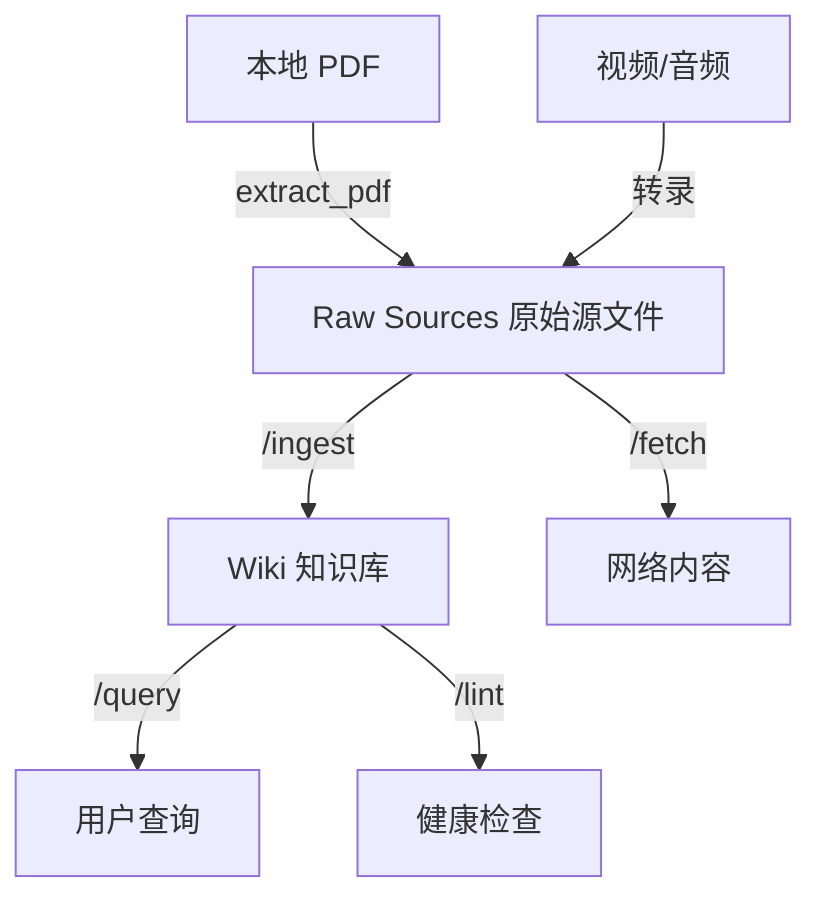
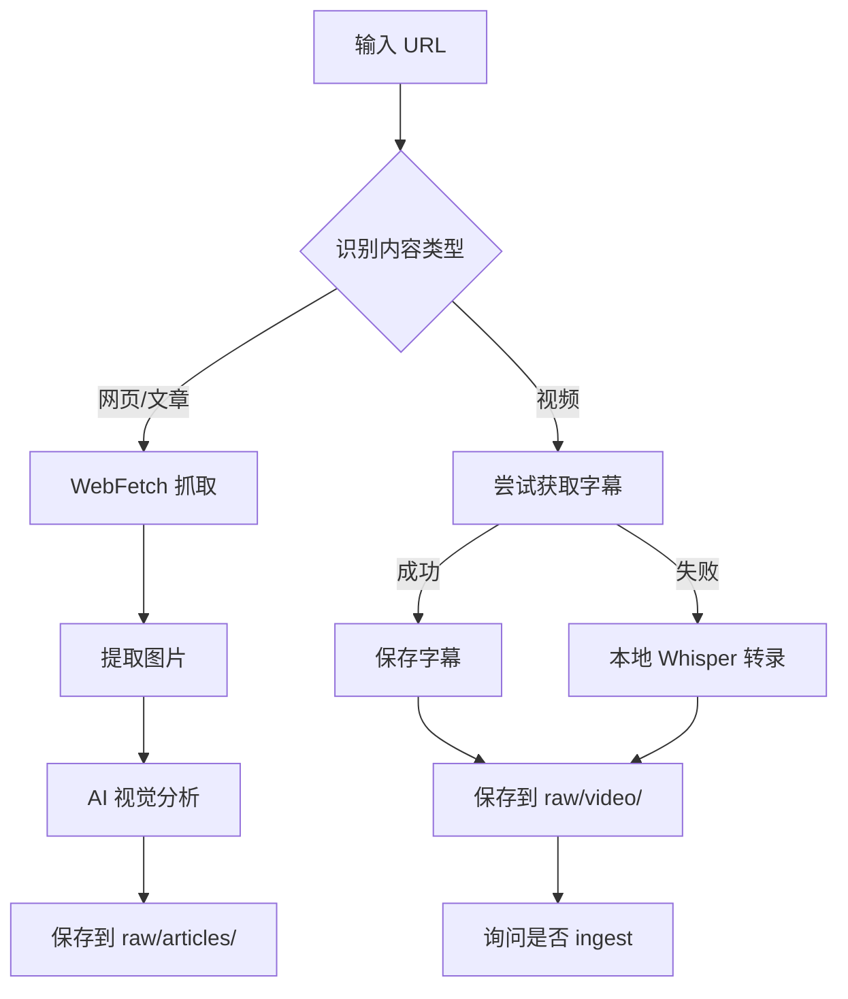
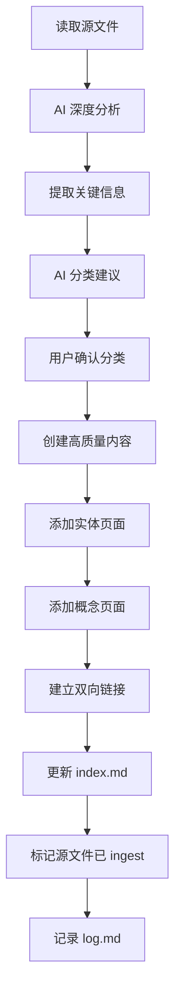

# 个人知识库系统使用教程

## 概述

这是一个基于 Karpathy 的 LLM Wiki 模式构建的个人知识管理系统，拥有美观的前端展示、强大的搜索功能、天然的 Obsidian 集成，支持一键部署到 Vercel。

### 为什么要使用这个系统？

- **知识复利**：每次新增内容都与现有知识建立连接，让知识库随时间变得更有价值
- **AI 驱动**：利用 AI 智能整理内容，生成百科全书级别的高质量内容
- **双向链接**：知识之间建立连接，形成知识网络
- **灵活分类**：支持任意层级的嵌套分类
- **美观展示**：柔和奢华的设计风格，优质的排版体验

## 系统架构

### 三层结构

系统采用经典的 LLM Wiki 三层架构：



1. **Raw Sources（原始源文件）** - 只读的原始内容
2. **Wiki（知识库）** - AI 整理后的高质量内容
3. **规则定义** - 系统运行的规则和流程

### 目录结构

```
个人知识库网站/
├── raw/                    # 原始源文件（只读！）
│   ├── articles/          # 文章
│   ├── papers/            # 论文
│   ├── images/            # 图片
│   ├── pdfs/              # PDF
│   ├── audio/             # 音频
│   └── video/             # 视频
├── wiki/                   # AI 生成的知识库
│   ├── [自定义分类]/       # 灵活的分类体系
│   ├── 人物与工具/        # 实体页面
│   ├── 核心概念/          # 概念页面
│   ├── 资料存档/          # 摘要页面
│   ├── index.md           # 内容索引
│   └── log.md            # 操作日志
└── AGENTS.md              # AI 规则文件（核心！）
```

## 核心功能

### 1. 从网络获取内容 - /fetch

**功能**：抓取网页、视频等内容，保存到 `raw/` 目录。

**工作流程**：



**支持的内容类型**：
- **网页/文章** - 自动抓取、图片提取和分析
- **视频** - 先获取字幕，失败则本地转录
- **论文** - 学术论文整理
- **播客/音频** - 音频内容转录

**使用示例**：
```
/fetch https://example.com/article
/fetch https://youtube.com/watch?v=xxx video
```

### 2. 智能整理内容 - /ingest

**功能**：读取 `raw/` 目录中的源文件，智能分类并整理到知识库。

**核心目标**：生成百科全书级别的高质量内容——既详实全面，又浅显易懂。

**内容质量标准**：
- ✅ **全面覆盖**：不遗漏任何重要知识点
- ✅ **由浅入深**：从入门概念开始，逐步深入
- ✅ **简短段落**：每段 2-4 句话，易于阅读
- ✅ **浅显易懂**：用大白话解释专业概念
- ✅ **先定义后展开**：每个主题先给出清晰定义

**工作流程**：



**使用示例**：
```
/ingest raw/articles/hello-world.md
```

### 3. 批量处理 - /ingest-all

**功能**：自动扫描 `raw/` 目录，找出尚未整理的新文件并全部处理。

### 4. 查看状态 - /ingest-status

**功能**：查看 `raw/` 目录中哪些文件已处理，哪些还没处理。

### 5. 整理分类 - /classify

**功能**：分析知识库中的文章，智能创建子分类或将文章归类到合适的分类中。

**分类命名原则**：
- 通俗易懂，让人一眼就能理解
- 避免过于正式或技术化的术语
- 保持简洁明了

### 6. 优化内容 - /optimize-wiki

**功能**：按照最新的百科全书级内容质量标准，全面检查和优化 wiki 文章。

### 7. 添加图表 - /diagramize

**功能**：智能分析 wiki 文章，识别复杂概念和流程，自动生成合适的 Mermaid 图表。

**支持的图表类型**：
- **流程图** - 涉及步骤/决策逻辑
- **思维导图** - 模块关系/层级
- **类图** - 面向对象设计
- **时序图** - 数据流转/交互

### 8. 智能查询 - /query

**功能**：基于现有知识库内容回答问题，AI 增强版。

### 9. 健康检查 - /lint

**功能**：检查知识库的一致性和完整性。

## 快速入门

### 第一步：添加内容

**方式 1：从网络获取**
```
/fetch https://example.com/article
```

**方式 2：手动添加文件**
直接将文件放入 `raw/` 对应目录。

**方式 3：处理本地 PDF**
```bash
python extract_pdf.py raw/pdfs/your-file.pdf
```

### 第二步：智能整理

```
/ingest raw/articles/your-file.md
```

AI 会：
1. 深度分析内容
2. 建议合适的分类
3. 生成高质量的百科全书级内容
4. 自动添加相关实体和概念页面
5. 建立双向链接
6. 更新索引

### 第三步：查询和使用

```
/query 你的问题
```

### 第四步：用 Obsidian 编辑

1. 打开 Obsidian
2. 选择"打开文件夹作为 vault"
3. 选择本项目的 `wiki/` 目录
4. 开始编辑！

## 页面格式规范

### YAML Frontmatter

所有 wiki 页面必须包含 frontmatter：

```yaml
---
title: 页面标题
created: 2026-05-12
updated: 2026-05-12
categories: [分类1, 分类2]
categoryPath: "分类路径/子分类"
tags: [标签1, 标签2]
sources: [raw/articles/source.md]
confidence: high
---

页面内容...
```

### 分类页面

每个分类文件夹可以有一个 `_category.md` 介绍页面：

```yaml
---
title: 分类名称
description: 分类的简短描述
created: 2026-05-12
---

关于这个分类的详细介绍...
```

### 双向链接

使用 `[[Page Name]]` 格式链接到其他 wiki 页面。

## 分类体系

### 自定义分类

支持灵活的自定义分类体系，可以创建任意深度的嵌套分类：

```
wiki/
├── AI 工具与技术/
│   ├── AI 工具/
│   └── AI 技术/
├── 安全/
│   ├── CTF/
│   │   ├── Web安全/
│   │   └── pwn/
│   └── ...
├── 投资理财/
└── ...
```

### 保留分类

- `人物与工具/` - 实体页面（人物、项目、工具等）
- `核心概念/` - 概念解释页面
- `资料存档/` - 源文件摘要

## 实用技巧

### 1. 知识复利

每次新增内容时，思考：
- 这与现有哪些知识相关？
- 可以建立哪些双向链接？
- 需要创建哪些实体或概念页面？

### 2. 分类原则

- **高度相关内容放在一起** - 同一主题内容放在同一个父分类下
- **根目录分类要具体** - 直接体现内容领域
- **渐进式迁移** - 现有内容可以逐步分类

### 3. 内容质量

- **简短段落** - 每段 2-4 句话
- **先定义后展开** - 先给出清晰定义，再详细展开
- **用大白话** - 避免过度技术化
- **添加图表** - 复杂流程用图表展示

### 4. 双向链接

- 在相关概念之间建立连接
- 使用 `[[Page Name]]` 格式
- 定期检查链接健康状态

## 常见问题

### Q: raw/ 目录可以修改吗？

**A**: 除了标记 ingest 状态（添加 frontmatter）外，**不要修改** raw/ 目录内容。raw/ 是原始源文件，应该保持不变。

### Q: 如何用 Obsidian 编辑？

**A**: 将 Obsidian 的 vault 路径设为 `wiki/` 目录即可。

### Q: 如何部署到 Vercel？

**A**: 参考 [部署指南.md](../../部署指南.md)。

### Q: AI 分类建议可以拒绝吗？

**A**: 当然！每次 AI 建议分类时都会先向你确认，你可以接受、拒绝或提出修改意见。

### Q: 如何处理大量内容？

**A**: 使用 `/ingest-all` 批量处理所有未处理的内容。

## 相关概念

- [[LLM Wiki]] - 使用 LLM 构建个人知识库的模式
- [[LLM Wiki 三层架构]] - Raw sources → Wiki → Schema
- [[Obsidian]] - 基于本地 Markdown 的笔记软件
- [[双向链接]] - 知识之间的连接

## 参考资料

- [Andrej Karpathy 的 LLM Wiki 理念](https://gist.github.com/karpathy/442a6bf555914893e9891c11519de94f)
- [README.md](../../README.md)
