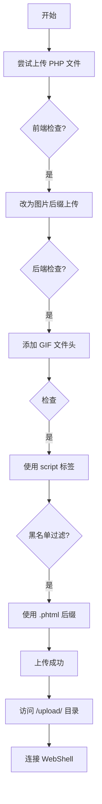

# 文件上传漏洞

## 概述

文件上传漏洞是 Web 应用程序中常见且危险的安全漏洞。当应用程序允许用户上传文件，但缺乏严格的安全验证时，攻击者可以通过上传恶意文件（如 WebShell）获取服务器的控制权，进而执行任意代码、窃取敏感数据或控制整个服务器。

**为什么重要：**
- 文件上传功能在现代 Web 应用中非常普遍（头像上传、文档分享等）
- 一旦被利用，攻击者可以完全控制服务器
- 是 CTF Web 题目中常见的考点

## 漏洞形成条件

文件上传漏洞的形成通常需要满足以下条件：

1. **文件上传功能存在** - 应用允许用户上传文件
2. **验证机制不完善** - 缺乏对文件的严格验证
3. **上传文件可访问** - 上传后的文件可以通过 Web 访问
4. **文件可被执行** - 服务器会将上传文件作为脚本解析

## 常见验证绕过技术

### 1. 文件后缀绕过

**原理：** 应用使用黑名单过滤后缀，但黑名单不完全。

**常见绕过方式：**
- 使用替代后缀：`.phtml`, `.php3`, `.php4`, `.php5`, `.php7`
- 使用大小写绕过：`.pHp`, `.PHTML`
- 使用特殊后缀：`.php.`, `.php.xxx`, `.php%00`（00截断）
- 使用配置文件：`.htaccess`, `.user.ini`

### 2. 文件头绕过

**原理：** 应用检查文件头来判断文件类型，可以伪造文件头。

**常见文件头：**
```
GIF89a          - GIF 图片
FF D8 FF        - JPEG 图片
89 50 4E 47    - PNG 图片
```

**示例：**
```
GIF89a
<?php eval($_POST['cmd']); ?>
```

### 3. Content-Type 绕过

**原理：** 应用检查 HTTP 请求的 Content-Type 头，修改即可绕过。

**绕过方法：**
- 将 `Content-Type: application/x-php` 改为 `Content-Type: image/png`

### 4. 双写绕过

**原理：** 应用过滤关键字但逻辑有缺陷，双写后被过滤留下正确内容。

**示例：**
- `pphphp` → 过滤 `php` → 剩下 `php`

### 5. 图片马

**原理：** 将 WebShell 代码插入图片文件中，结合文件包含漏洞使用。

**制作方法：**
```bash
copy image.jpg/b + shell.php/a image_shell.jpg
```

### 6. 条件竞争

**原理：** 利用上传和删除文件之间的时间窗口，在文件被删除前访问执行。

## 题目分析示例：极客大挑战 2019 Upload

### 题目特点

这道题目综合了多种文件上传绕过技术：

1. **前端后缀检查** - JavaScript 验证文件后缀
2. **后端 MIME 类型检查** - 验证 Content-Type
3. **文件内容检查** - 检查 `<?` 标签
4. **后缀黑名单** - 过滤 `.php` 等后缀

### 解题思路



### 关键技术点

#### 绕过文件内容检查

**问题：** 服务器检查文件内容，包含 `<?` 就拒绝。

**解决方案：** 使用 `<script>` 标签替代：
```php
<script language="php">eval($_POST['pwd']);</script>
```

这种写法仍然是有效的 PHP 代码，可以正常执行。

#### 选择合适的后缀

**常见可执行后缀：**
- `.phtml` - 最常用
- `.php3`, `.php4`, `.php5`
- `.phar` - PHP 归档文件

## 修复建议

### 1. 服务器配置

- **将上传目录设置为不可执行** - 防止脚本执行
- **禁用上传目录的脚本解析** - 在 Apache/Nginx 配置中设置
- **避免文件解析漏洞** - 如 Apache 的 AddHandler 配置不当

### 2. 服务端验证

- **使用白名单而非黑名单** - 只允许指定后缀上传
- **验证文件后缀与 MIME 类型匹配**
- **验证文件头与文件后缀匹配**
- **对文件进行二次渲染** - 图片重新生成，破坏 WebShell
- **限制文件大小和数量** - 防止拒绝服务攻击

### 3. 文件存储

- **随机重命名文件** - 防止文件名猜测和覆盖
- **将文件存储在 Web 根目录外** - 无法直接通过 Web 访问
- **使用独立的文件服务器** - 降低风险
- **文件名输入校验和输出编码** - 防止路径遍历等漏洞

### 4. 日志记录

记录详细的上传日志，包括：
- 时间
- 用户信息
- IP 地址
- 操作内容
- 校验失败的参数

## 相关题目

- [[极客大挑战 2019 Upload 题解]]
- [[BUUCTF-ACTF2020新生赛-Include-1题解]] - 文件包含漏洞，常与文件上传结合使用

## 相关工具

- **蚁剑** - 中国菜刀的继任者，WebShell 管理工具
- **Burp Suite** - 用于抓包和修改请求
- **御剑** - 后台扫描工具，可用于寻找上传目录

## 参考资料

- [OWASP - Unrestricted File Upload](https://owasp.org/www-community/vulnerabilities/Unrestricted_File_Upload)
