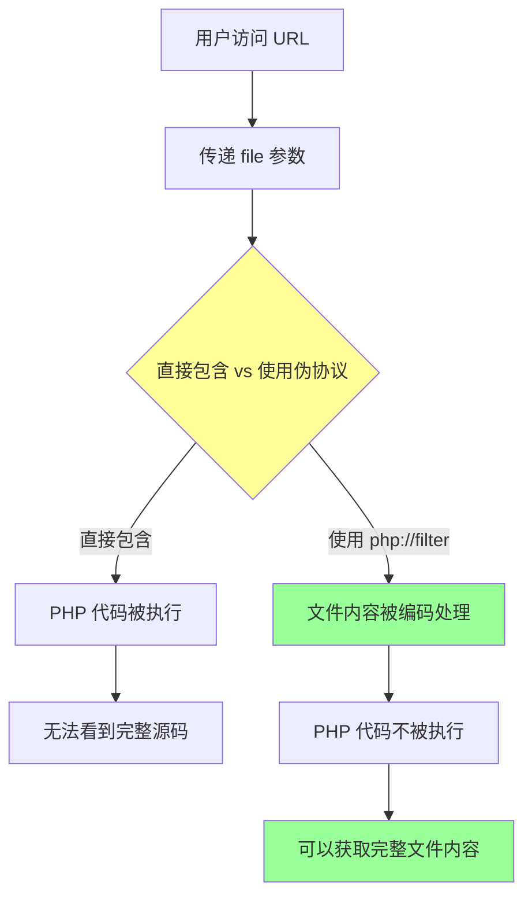
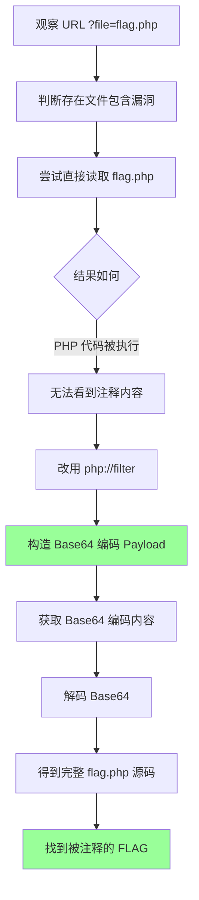

# BUUCTF[ACTF2020 新生赛]Include 1题解

## 概述

本题是一道基础的 **文件包含漏洞** 题目，主要考察对 PHP 文件包含漏洞和 PHP 伪协议的理解。题目提示清晰，适合初学者入门。

### 核心概念
- 文件包含漏洞
- PHP伪协议
- php://filter

---

## 题目分析

### 题目信息
- 题目名称：Include 1
- 比赛：ACTF2020 新生赛
- 平台：BUUCTF

### 初步探测

按照标准的 CTF 题目探测流程：

1. 生成靶机，打开网址
2. 查看页面源码
3. 抓包查看有无隐藏信息

### 发现漏洞

点击页面 tips 发现一段留言：`Can you find out the flag?`

同时观察 URL：
```
http://xxx.node5.buuoj.cn:81/?file=flag.php
```

结合题目标题 "Include" 以及 URL 中的 `?file=flag.php` 参数，几乎可以断定存在 **文件包含漏洞**。

---

## 知识准备

在开始解题之前，我们需要了解 **PHP伪协议** 的知识。

### PHP伪协议简介

PHP 伪协议是 PHP 内置的一些特殊协议，通过这些协议可以实现一些特殊功能，如：
- 读取文件
- 写入文件
- 执行代码
- 过滤数据流

在 CTF 中，PHP 伪协议常用于绕过文件包含漏洞的防护，读取敏感文件。

### php://filter 协议详解

`php://filter` 是一个非常强大的过滤器协议，可以在读取或写入文件时对数据流进行各种处理。

#### 参数说明

| **参数类型** | **参数格式** | **作用** |
|---|---|---|
| **必须项** | `resource=&lt;要过滤的数据流&gt;` | 指定待筛选的数据流（必填） |
| **读链** | `read=&lt;过滤器1\|过滤器2&gt;` | 为读操作设置一个或多个过滤器，用 `\|` 分隔 |
| **写链** | `write=&lt;过滤器1\|过滤器2&gt;` | 为写操作设置一个或多个过滤器，用 `\|` 分隔 |
| **默认链** | `&lt;过滤器1\|过滤器2&gt;` | 未加前缀的过滤器根据操作类型自动应用 |

#### 常用过滤器

| **过滤器类型** | **过滤器名称** | **作用** |
|---|---|---|
| **字符串过滤器** | `string.rot13` | 进行 ROT13 字符变换 |
|  | `string.toupper` | 将字符串转为大写 |
|  | `string.tolower` | 将字符串转为小写 |
|  | `string.strip_tags` | 移除 HTML/PHP 标签 |
| **转换过滤器** | `convert.base64-encode` | 进行 Base64 编码 |
|  | `convert.base64-decode` | 进行 Base64 解码 |
|  | `convert.quoted-printable-encode` | 编码为 Quoted-Printable 格式 |
|  | `convert.quoted-printable-decode` | 解码 Quoted-Printable 格式 |

---

## 解题过程

### 原理解析

后端代码可能类似于：

```php
include($_GET['file']);
```

#### 漏洞利用原理



如果直接使用 `?file=flag.php`，`include()` 会执行其中的 PHP 代码，导致无法在前端看到完整源码（特别是被注释掉的内容）。

**关键思路**：使用 `php://filter` 对文件内容进行处理，让 PHP 代码不被执行，而是作为普通文本返回。

### 构造 Payload

我们使用 `convert.base64-encode` 过滤器将文件内容编码为 Base64，这样即使是 PHP 代码也不会被执行：

```
?file=php://filter/read=convert.base64-encode/resource=flag.php
```

#### 完整解题流程



### 获取 Flag

访问上述 URL 后，会返回 Base64 编码的内容。解码后得到：

```php
<?php echo "Can you find out the flag?";
//flag{5b7c82b0-4473-42a3-bb8c-068dcd50a1d0}
```

FLAG 被注释掉了，但通过 PHP 伪协议成功找到了！

---

## 总结

本题是一道经典的文件包含漏洞入门题：

- 题目提示明显，没有绕弯
- 考察对文件包含漏洞的理解
- 考察对 PHP 伪协议的掌握
- 特别适合初学者

### 知识拓展

以下资源可以帮助进一步提升：
- 安全攻防技能30讲

---

## 相关概念

- [[安全/CTF/Web安全/文件包含漏洞/文件包含漏洞]]
- [[安全/CTF/Web安全/文件包含漏洞/PHP伪协议]]
