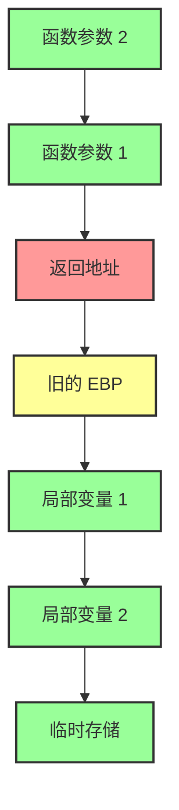
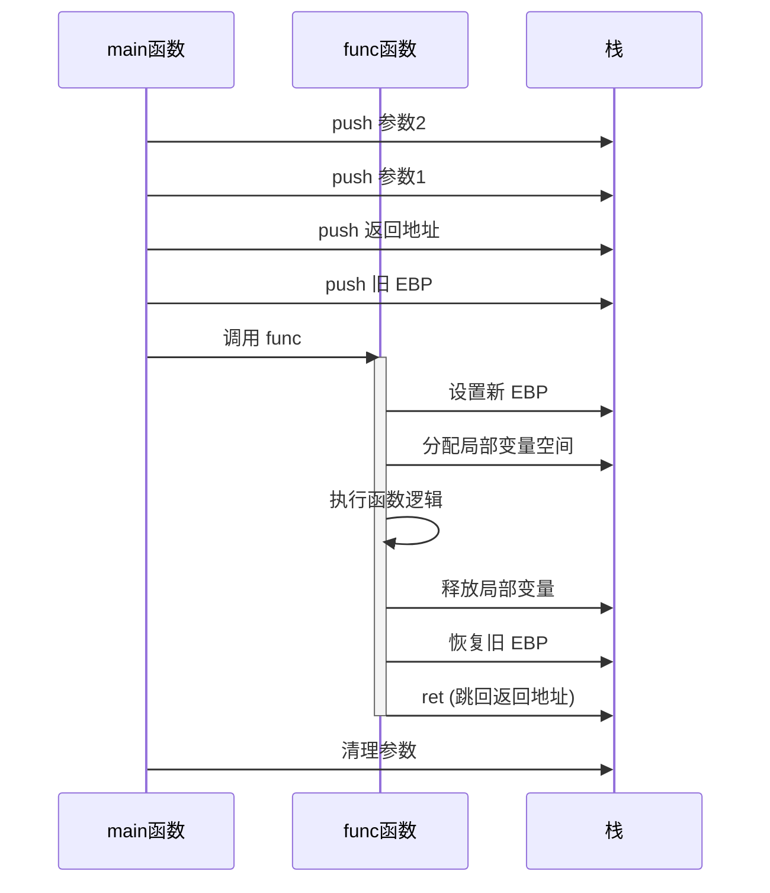

# C语言函数调用栈（一）：栈帧结构

## 概述

程序的执行过程可看作连续的函数调用。当一个函数执行完毕时，程序要回到调用指令的下一条指令处继续执行。

这就像你看一本书，看到一半被叫去做别的事，做完回来要从上次停下的地方接着看！

## 什么是栈帧？

每个函数调用都会创建一个新的**栈帧**（stack frame）。

栈帧就是栈上的一块连续内存区域，用来保存这个函数调用的所有信息。

想象一下：
- 每调用一个函数，就在栈上放一个「盒子」（栈帧）
- 盒子里装着这个函数需要的所有东西
- 函数执行完，就把这个盒子拿走
- 继续用上一个盒子

## 典型栈帧布局

让我们看看一个典型的栈帧长什么样！

从**高地址**到**低地址**依次是：

| 位置 | 内容 | 说明 |
|------|------|------|
| ↑ 高地址 | **函数参数** | 调用者传给这个函数的参数 |
| | **返回地址** | 函数执行完要回到哪里 |
| | **旧的基址指针** | 上一个栈帧的 EBP |
| | **局部变量** | 当前函数的临时变量 |
| ↓ 低地址 | **临时存储** | 临时用的空间 |

### 栈帧结构示意图



### 函数调用栈帧流程图



### 图解栈帧

让我们画出来看看：

```
高地址
    ↑
    | [函数参数 2]   ← 第二个参数
    | [函数参数 1]   ← 第一个参数
    | [返回地址]     ← 执行完函数要回到这里
    | [旧的 EBP]    ← 保存上一个栈帧的基地址
    | [局部变量 1]  ← 这个函数的变量
    | [局部变量 2]
    | [临时存储]
    ↓
低地址
```

## 栈帧各部分详解

让我们一个一个来看：

### 1. 函数参数（Arguments）

这是调用者传给函数的数据。

比如：
```c
void add(int a, int b) {  // a 和 b 就是参数
    return a + b;
}

add(3, 5);  // 把 3 和 5 传给函数
```

这些参数会被压到栈上。

### 2. 返回地址（Return Address）

这非常重要！

返回地址告诉 CPU：**这个函数执行完了，接下来去哪里？**

类比：
- 你在看第 100 页
- 你朋友叫你去帮他拿个东西（调用函数）
- 你在第 100 页夹个书签（保存返回地址）
- 你去帮朋友
- 回来从第 100 页接着看（跳回返回地址）

### 3. 旧的基址指针（Old EBP）

基址指针（EBP）就像是一个「锚」，用来找到当前栈帧的各个部分。

每次调用新函数：
1. 先把旧的 EBP 保存下来
2. 然后把 EBP 移动到新栈帧的位置

这样无论栈怎么变，我们都能通过 EBP 找到东西！

### 4. 局部变量（Local Variables）

函数里定义的变量都在这里！

比如：
```c
void hello() {
    int x = 1;      // 在局部变量区域
    char y = 'a';   // 在局部变量区域
    // ...
}
```

### 5. 临时存储（Temporary Storage）

放一些临时数据，比如计算的中间结果。

## 一个完整的例子

让我们看一个简单的 C 程序：

```c
void func(int a, int b) {
    int x = a + b;
    // ...
}

int main() {
    func(3, 5);
    return 0;
}
```

当调用 `func(3, 5)` 时，栈是这样的：

```
高地址
    ↑
    | [ 5 ]       ← 参数 2 (b)
    | [ 3 ]       ← 参数 1 (a)
    | [返回地址]  ← func 执行完回 main
    | [旧 EBP]    ← 保存 main 的 EBP
    | [x]         ← 局部变量 x
    ↓
低地址
```

## 为什么要这样设计？

栈帧这种设计有几个好处：

### 1. 自动管理
- 调用函数自动分配
- 函数结束自动释放
- 不用手动管理内存

### 2. 方便访问
- 通过 EBP + 偏移量就能找到东西
- 不管栈怎么变，EBP 是固定锚点

### 3. 支持递归
- 每次递归调用都有自己的栈帧
- 互不干扰

## 栈与安全的关系

理解栈帧结构对安全很重要！

因为：
- 如果能覆盖「返回地址」，就能控制程序跳转
- 这就是「栈溢出漏洞」的原理

这就是为什么我们要学这个！

## 相关概念

- [[栈介绍]] - 先看这个了解栈基础
- [[C语言函数调用栈（二）]] - 调用约定详解
- [[EBP]] - 帧基指针
- [[ESP]] - 栈顶指针

## 下一步

想了解更多细节？请看：
- [[C语言函数调用栈（二）]] - 了解调用约定

## 参考资料

- csapp（深入理解计算机系统）
- 各种计算机系统教材

