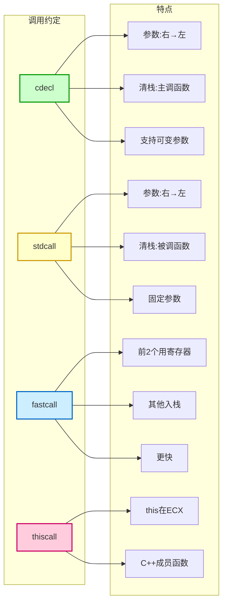
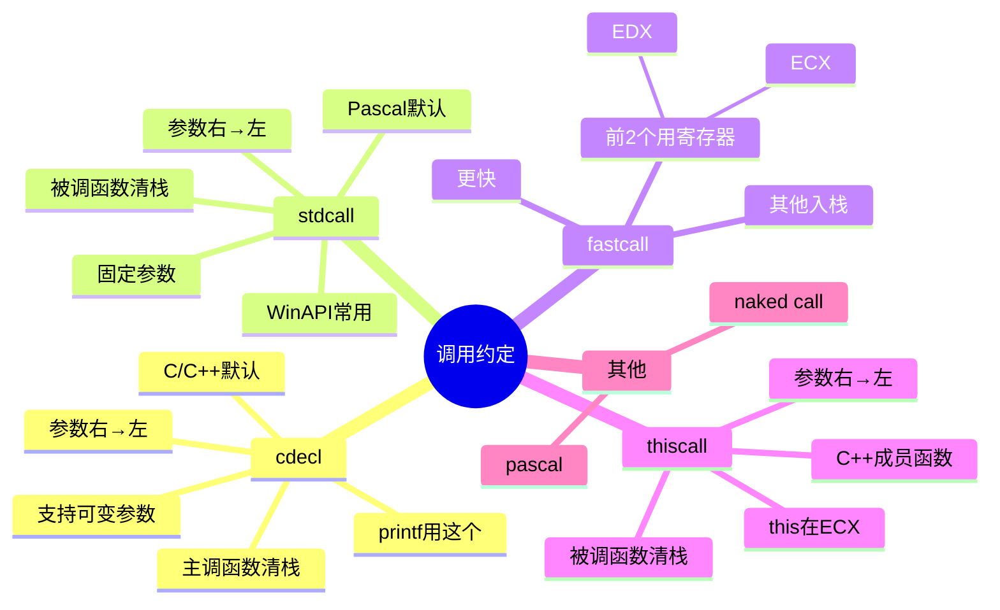
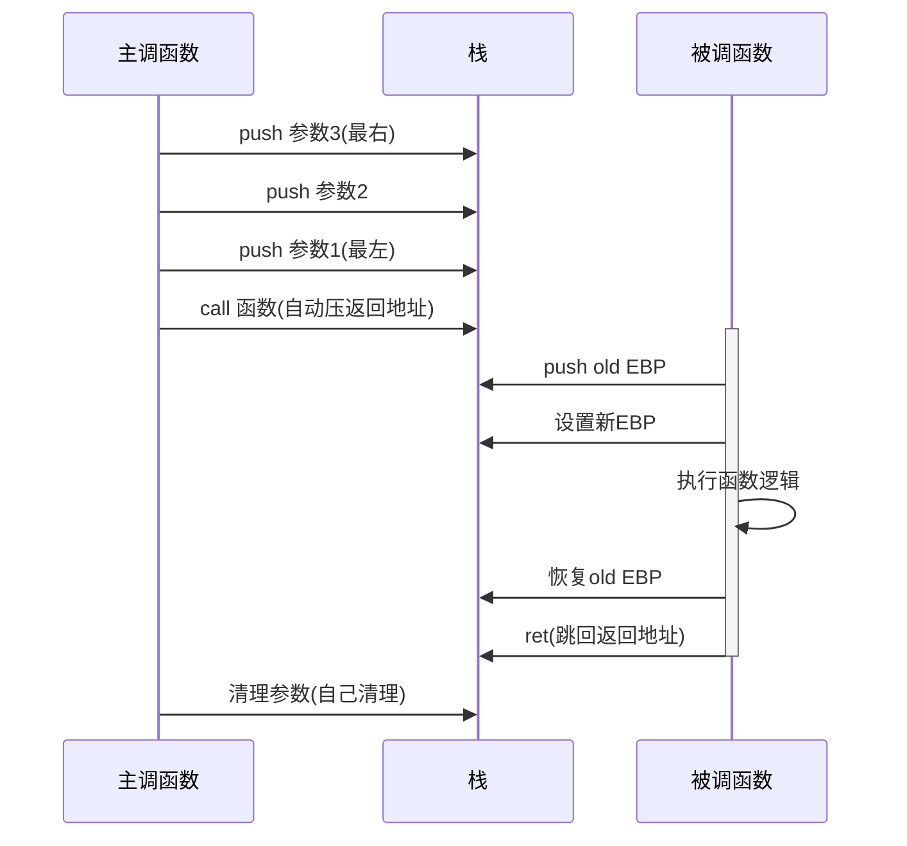

# C语言函数调用栈（二）：调用约定

## 概述

函数调用约定规定了函数参数的传递方式、栈的维护方式以及名字修饰策略。

简单说：**调用约定就是一套规矩，告诉大家怎么一起配合调用函数！**

## 什么是调用约定？

想象一下：
- 你想给朋友打电话
- 你得知道拨什么号码、怎么拨号、先说什么、最后怎么挂
- 这些就是「打电话的约定」

调用约定就是「调用函数的约定」：
- 参数怎么传？
- 传完栈谁来收拾？
- 返回值放哪里？
- ...

## 为什么需要调用约定？

因为：
- **编译器需要知道** 怎么生成代码
- **不同编程语言要一起工作** 比如 C 和汇编
- **库函数要和你的代码配合** 大家按同样的规矩来

不然就鸡同鸭讲，程序会崩溃！

## 常见调用约定

让我们看看主要的几种！

### 调用约定对比图解



### 调用约定思维导图



### 1. cdecl 调用约定

**特点：**
- C/C++ 编译器默认的函数调用约定
- **参数从右向左入栈**
- **主调函数负责清除栈中的参数**
- 支持可变参数函数（如 printf）
- 名字修饰：在函数名前添加下划线

#### 为什么 cdecl 支持可变参数？

关键原因：
- 参数自右向左进栈，第一个参数最接近栈顶
- 主调函数知道参数数目，可安全清栈

就像你请朋友吃饭，你知道要叫几个人，你自己收拾桌子！

#### cdecl 调用流程图解



#### cdecl 的栈操作流程

```
主调函数：
1. 把参数从右往左压栈
2. call 函数（自动压入返回地址）

被调函数：
3. 执行自己的逻辑
4. ret 返回

主调函数：
5. 把栈里的参数清理掉（自己收拾自己摆的盘子）
```

### 2. stdcall 调用约定

**特点：**
- Pascal 程序缺省调用方式，WinAPI 多采用此约定
- **参数从右向左入栈**
- **被调函数负责清除栈中的参数**
- 仅适用于参数个数固定的函数
- 名字修饰：`_functionname@number`

#### 为什么 WinAPI 喜欢 stdcall？

因为：
- 函数自己清理，调用者代码更简洁
- Windows 系统 API 都是参数固定的

#### stdcall 的栈操作流程

```
主调函数：
1. 把参数从右往左压栈
2. call 函数（自动压入返回地址）

被调函数：
3. 执行自己的逻辑
4. ret n 返回（顺便把栈里 n 字节的参数也清理了）
```

就像餐厅服务员，吃完饭服务员帮你收盘子！

### 3. fastcall 调用约定

**特点：**
- 使用寄存器传递前两个参数（ECX、EDX）
- 其余参数从右向左入栈
- 被调函数负责清栈
- 比 stdcall 和 cdecl 快！

#### 为什么 fastcall 快？

因为：
- 寄存器比内存快得多
- 不用做压栈、弹栈操作
- 常见的小参数（2个以内）直接寄存器搞定

就像你递东西给朋友：
- 直接放手里（寄存器） → 快！
- 先放桌子上（栈）再拿 → 慢！

### 4. thiscall 调用约定

**特点：**
- C++ 类中非静态函数的默认调用约定
- **this 指针通过 ECX 寄存器传递**（VC）
- 参数从右向左入栈
- 被调函数负责清栈

#### 为什么 this 指针要特殊处理？

因为 C++ 的成员函数需要知道自己属于哪个对象！

比如：
```cpp
class Person {
    void sayHello() { /* 要用 this 指针找到自己 */ }
};

Person p;
p.sayHello();  // 这个 this 指向 p
```

### 5. 其他调用约定

还有一些特殊的：

| 约定 | 说明 |
|------|------|
| **naked call** | 不自动生成保存和恢复寄存器的代码 |
| **pascal** | 参数从左至右入栈，被调函数清栈 |

## 调用约定对比表

让我们用表格对比一下：

| 调用方式 | 参数压栈顺序 | 负责清栈 | 支持可变参数 | 用途 |
|---------|-------------|---------|-------------|------|
| **cdecl** | 从右至左 | 主调函数 | ✅ 是 | C/C++ 默认、printf 等可变参数 |
| **stdcall** | 从右至左 | 被调函数 | ❌ 否 | WinAPI、Pascal |
| **fastcall** | 从右至左，前 2 个用寄存器 | 被调函数 | ❌ 否 | 追求性能的场景 |
| **thiscall** | 从右至左，this 在 ECX | 被调函数 | ❌ 否 | C++ 成员函数 |

## x86 函数参数传递

不同类型的参数怎么传递？

| 类型 | 传递方式 | 说明 |
|------|---------|------|
| **整型和指针** | 通过栈 | 简单 |
| **浮点** | 通过栈 | 占 8 字节 |
| **结构体** | 通过栈 | 大小 4 字节对齐 |

## x86 函数返回值传递

函数返回值怎么传回来？

| 大小 | 传递方式 | 说明 |
|------|---------|------|
| **≤ 4 字节** | EAX 寄存器 | 小值直接放寄存器 |
| **5-8 字节** | EAX + EDX | EDX 高 4 字节，EAX 低 4 字节 |
| **浮点** | 协处理器浮点数寄存器栈顶 | 专门的浮点寄存器 |
| **结构体** | 主调函数传额外参数，指向返回值地址 | 大对象特殊处理 |

## 一个具体的例子

让我们看 cdecl 的例子：

```c
int add(int a, int b, int c) {
    return a + b + c;
}

int main() {
    add(1, 2, 3);  // 调用 add
    return 0;
}
```

栈操作（从高地址到低地址）：

```
1. 压入 3          ← 参数 c
2. 压入 2          ← 参数 b
3. 压入 1          ← 参数 a
4. 压入返回地址
5. 执行 add 函数
6. add 返回，EAX = 6
7. main 清栈（跳过 3 个参数）
```

## 调用约定与安全

了解调用约定对安全有帮助！

比如：
- 构造漏洞利用时要知道栈布局
- 要知道谁来清理栈，避免破坏栈
- 分析二进制时要知道调用约定

## 相关概念

- [[栈介绍]] - 栈的基础知识
- [[C语言函数调用栈（一）]] - 栈帧结构
- [[调用约定]] - 总结页面
- [[cdecl]]
- [[stdcall]]
- [[fastcall]]
- [[thiscall]]

## 参考资料

- csapp（深入理解计算机系统）
- Calling conventions for different C++ compilers and operating systems, Agner Fog

