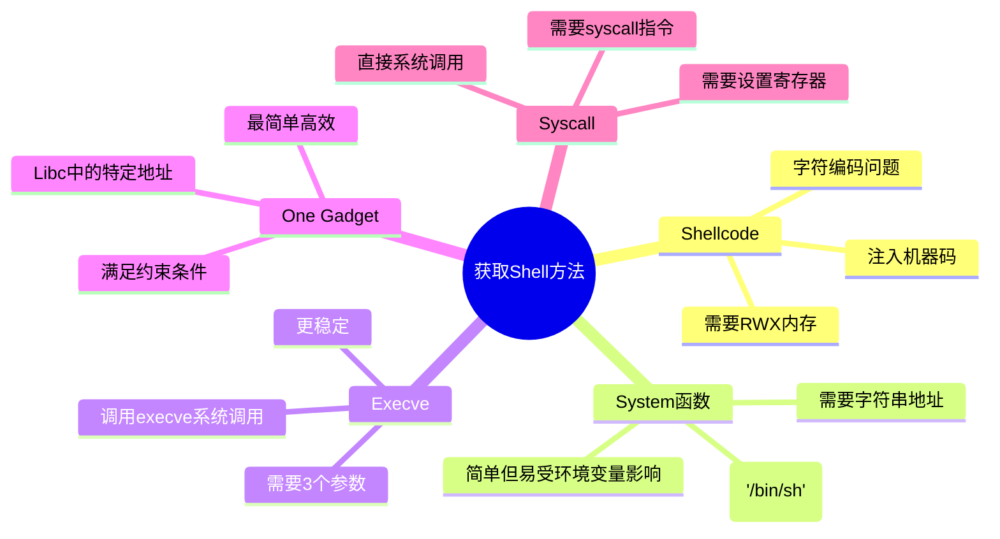
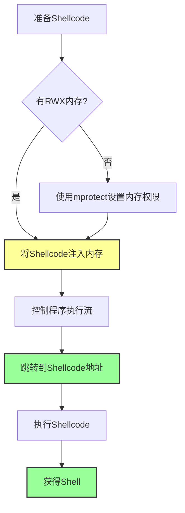
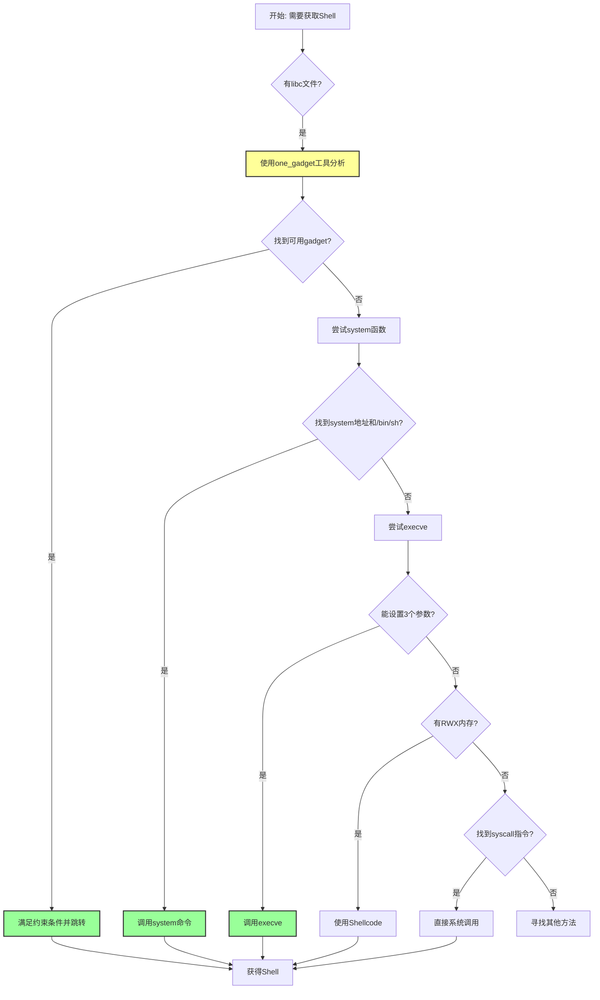

# shell获取

## 获取shell方法总览

获取 shell 是 PWN 题型的最终目标之一。一旦我们获取了目标程序的 shell，就能够执行任意命令，完全控制目标系统。

## 概述

我们获取到的 shell 一般有两种形式：

1. **直接可交互的 shell**：可以直接与 shell 交互，输入命令
2. **绑定 shell**：将 shell 绑定到指定 IP 的指定端口，需要通过网络连接

下面总结几种常见的获取 shell 的方式，从简单到复杂依次递进。

## shellcode

使用 shellcode 是最直接的获取 shell 的方式。

### Shellcode执行流程

### 原理

shellcode 是一段机器码，执行后可以获取 shell。我们需要：
1. 将 shellcode 注入到程序的内存中
2. 让程序跳转到 shellcode 执行

### 基本要求

在利用 shellcode 获取 shell 时，基本要求就是我们能够将 shellcode 布置在**可写可执行的内存区域**中。

### 常见问题和解决方案

1. **没有可写可执行的内存区域**
   - 利用 `mprotect` 等函数设置相关内存的权限为 RWX

2. **shellcode 字符限制**
   - 有时候可能 shellcode 中的字符必须满足某些要求（可打印字符、字母、数字等）
   - 需要使用编码或特殊构造的 shellcode

### 如何获取 shellcode

- 使用 pwntools 的 `shellcraft` 模块生成
- 从 shellcode 数据库获取（如 exploit-db）
- 自己编写汇编然后编译

**相关概念**：[[基本ROP]]、[[栈溢出原理]]

## system

调用 libc 的 `system` 函数是最常用的获取 shell 的方式。

### 原理

我们需要执行 `system("/bin/sh")` 或 `system("sh")` 来获取 shell。

### 需要的地址

参考[[获取地址]]的方法，我们需要找到：

1. **system 函数的地址**
2. **"/bin/sh" 或 "sh" 字符串的地址**

### "/bin/sh" 字符串的来源

- **binary 里面是否有该字符串**：检查程序自身是否包含
- **考虑自己读取对应字符串**：如果程序没有，可以自己写到内存中
- **libc 中其实是有 /bin/sh 的**：通常 libc 中都包含这个字符串

### 优缺点

**优点**：
- 只需要布置一个参数，相对简单

**缺点**：
- 在布置参数时，可能因为破坏了环境变量而无法执行

**相关概念**：[[获取地址]]、[[控制程序执行流]]

## execve

直接调用 `execve` 系统调用是另一种方式。

### 原理

执行 `execve("/bin/sh", NULL, NULL)` 来获取 shell。

### 优缺点

**优点**：
- 几乎不受环境变量的影响，更稳定

**缺点**：
- 需要布置三个参数，相对复杂

### one_gadget

在 glibc 中，我们还可以使用 **one_gadget** 来获取 shell。

**什么是 one_gadget？**
- one_gadget 是 libc 中的一些特定地址
- 在满足某些条件的情况下，直接跳转到这些地址就可以获取 shell
- 不需要构造复杂的参数，更加方便

**如何使用 one_gadget**：
1. 使用 one_gadget 工具分析 libc 文件
2. 找到可用的 gadget
3. 满足 gadget 的约束条件
4. 跳转到该地址

**相关概念**：[[中级ROP]]

## syscall

直接通过系统调用指令来执行 `execve`。

### 系统调用号

系统调用号 `__NR_execve`：
- 在 **IA-32 (32位)** 中为 **11**
- 在 **x86-64 (64位)** 中为 **59**

### 优缺点

**优点**：
- 几乎不受环境变量的影响

**缺点**：
- 需要找到 `syscall` 之类的系统调用指令
- 需要设置好相应的寄存器参数

### 参数传递（64位）

在 x86-64 系统调用中：
- **RDI**：第1个参数（"/bin/sh" 的地址）
- **RSI**：第2个参数（NULL）
- **RDX**：第3个参数（NULL）
- **RAX**：系统调用号（59）

**相关概念**：[[中级ROP]]

## 总结

### 获取Shell方法选择流程

获取 shell 的方法有很多，需要根据具体的题目环境选择合适的方法：

| 方法 | 复杂度 | 稳定性 | 推荐度 |
|------|--------|--------|--------|
| system | ⭐ 简单 | ⭐⭐ 一般 | ⭐⭐⭐ |
| execve | ⭐⭐ 中等 | ⭐⭐⭐ 好 | ⭐⭐⭐⭐ |
| one_gadget | ⭐ 简单 | ⭐⭐⭐ 好 | ⭐⭐⭐⭐⭐ |
| shellcode | ⭐⭐ 中等 | ⭐⭐ 一般 | ⭐⭐ |
| syscall | ⭐⭐⭐ 较难 | ⭐⭐⭐ 好 | ⭐⭐⭐ |

**使用建议**：
1. **首选**：one_gadget（如果可用）
2. **其次**：system（简单）或 execve（稳定）
3. **然后**：shellcode（需要可写可执行内存）
4. **最后**：syscall（需要找 syscall 指令）

**相关页面**：
- [[获取地址]]
- [[控制程序执行流]]
- [[基本ROP]]
- [[中级ROP]]
- [[栈溢出原理]]
- [[Canary保护机制]]
