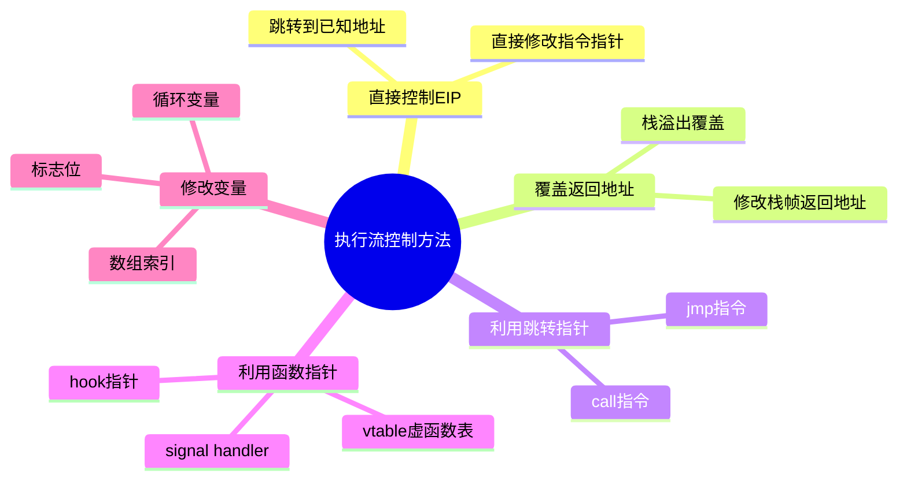
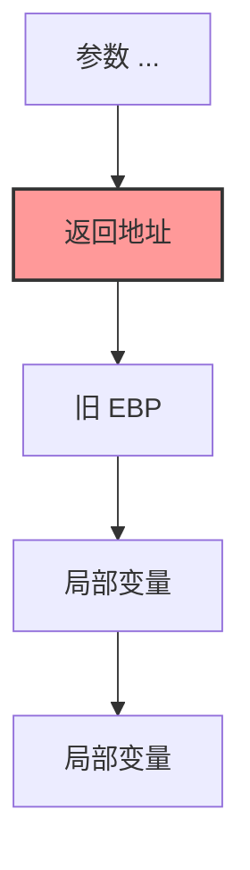
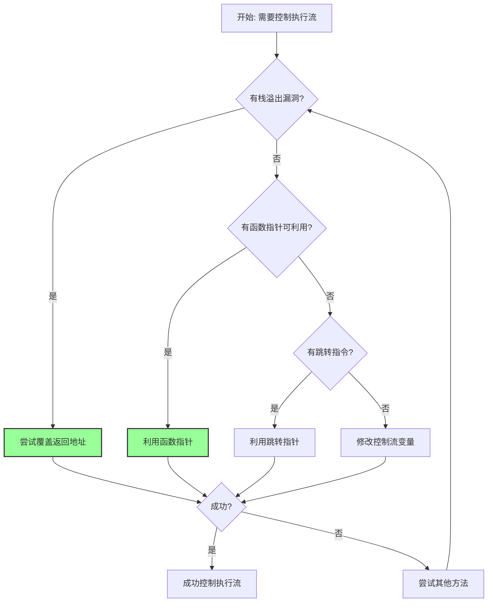

# 控制程序执行流

## 执行流控制方法总览



控制程序执行流是漏洞利用的核心目标。一旦我们控制了程序的执行流，就可以让程序执行我们想要的代码，从而获取 shell 或者实现其他恶意目的。

## 概述

在控制程序执行流的过程中，我们可以考虑多种方式，从简单到复杂依次递进：

1. **直接控制 EIP**
2. **覆盖返回地址**
3. **利用跳转指针**
4. **利用函数指针**
5. **修改控制流相关变量**

## 直接控制 EIP

直接控制 EIP（Instruction Pointer，指令指针）是最直接的方式。

### 原理

EIP 寄存器存储着下一条要执行的指令的地址。如果我们能够直接控制 EIP 的值，就可以让程序跳转到任意地址执行代码。

### 适用场景

这种方式通常需要：
- 有漏洞可以直接覆盖 EIP
- 目标地址上有我们想要执行的代码
- 或者我们可以把 shellcode 放在某个已知地址

**相关概念**：[[栈溢出原理]]、[[基本ROP]]

## 返回地址

通过覆盖程序栈上的返回地址是最常见的执行流控制方式。

### 栈帧结构可视化



### 原理

在函数调用栈中，每个函数栈帧的底部（通常在 EBP/RBP 后面存储的就是返回地址。当函数执行完毕返回时，会将这个地址弹出到 EIP/RIP 中，从而继续执行调用者的代码。

如果我们能够覆盖这个返回地址，就可以控制程序跳转到我们想要的位置。

### 栈帧结构示例（32位）：

```
高地址
+-----------------+
|  参数 ...       |
+-----------------+
|  返回地址       | <-- 我们要覆盖的位置
+-----------------+
|  旧 EBP        |
+-----------------+
|  局部变量       |
低地址
```

**相关概念**：[[函数调用栈]]、[[栈溢出原理]]

## 跳转指针

除了覆盖返回地址，我们还可以利用程序中的跳转指针来控制执行流。

### call 指令

`call` 指令会：
1. 将下一条指令的地址压入栈中（作为返回地址）
2. 跳转到目标地址执行

如果我们能够控制 `call` 指令的目标地址，就可以：
- 跳转到任意地址执行
- 同时还能在栈上留下一个返回地址（可以被后续利用）

### jmp 指令

`jmp` 指令直接跳转到目标地址执行，不保存返回地址。

**优点**：更灵活，可以直接跳转
**缺点**：没有返回地址，有时候不如 call 方便构造 ROP 链

**相关概念**：[[基本ROP]]

## 函数指针

利用程序中的函数指针是高级的执行流控制方式。

### vtable 和 function table

虚函数表（vtable）和其他函数表中存储着函数指针。

**示例**：
- **IO_FILE 的 vtable**：在 file stream 相关的利用中经常被使用
- **printf function table**：格式化字符串漏洞中可能被利用

### hook 指针

某些库中存在 hook 指针，覆盖这些指针可以劫持函数调用。

**常见的 hook 指针**：
- `malloc_hook`：malloc 函数的 hook
- `free_hook`：free 函数的 hook
- `realloc_hook`：realloc 函数的 hook

当对应的函数被调用时，如果 hook 指针被设置了，就会优先调用 hook 函数。

### handler

信号处理函数（signal handler）也是函数指针的一种。

如果我们能够修改某个信号的处理函数指针，当对应信号触发时，程序就会执行我们指定的代码。

**相关概念**：[[堆利用]]

## 修改控制流相关变量

除了上述方式外，还有一些其他方式可以通过修改变量来控制执行流。

**示例**：
- 修改循环变量，改变循环次数或条件
- 修改某个标志位，改变程序分支
- 修改数组索引，造成越界读写，进而控制执行流

## 总结

### 执行流控制方法选择流程



控制程序执行流的方法有很多，需要根据具体的题目环境选择合适的方法：

1. **首选**：覆盖返回地址（最简单）
2. **其次**：利用函数指针（更灵活）
3. **然后**：利用跳转指针
4. **最后**：修改控制流相关变量

**相关页面**：
- [[获取地址]]
- [[基本ROP]]
- [[中级ROP]]
- [[shell获取]]
- [[栈溢出原理]]
- [[Canary保护机制]]
