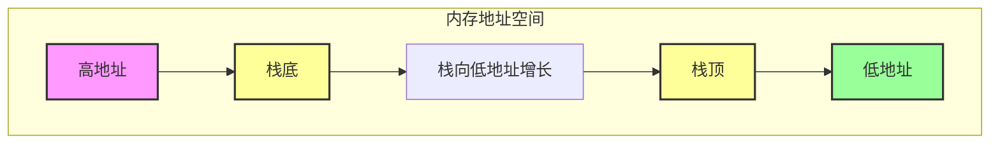
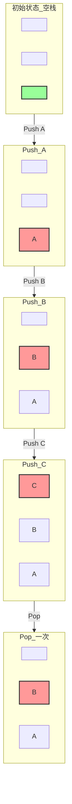

# 栈（Stack）介绍

## 概述

栈是一种典型的「后进先出」（Last In First Out，LIFO）的数据结构。

想象一下：堆盘子！最后放上去的盘子，第一个被拿走。这就是栈！

## 什么是栈？

栈就像一个「弹夹」或者「堆盘子」：
- 只能从最上面放东西
- 只能从最上面拿东西
- 最后放上去的，第一个被拿下来

这就叫「后进先出」。

## 基本概念

栈有几个重要的概念：

| 概念 | 说明 | 类比 |
|------|------|------|
| **栈底** | 栈的起始位置（高地址） | 一堆盘子的最下面 |
| **栈顶** | 栈的当前位置（低地址） | 一堆盘子的最上面 |
| **push** | 把数据压入栈，栈顶向低地址移动 | 往上面放一个盘子 |
| **pop** | 把数据弹出栈，栈顶向高地址移动 | 从上面拿走一个盘子 |

### 一个简单的例子

让我们看一下栈的操作：

```
初始状态（空栈）：
栈底 → [ ]
        [ ]
        [ ] ← 栈顶

push A（放入 A）：
栈底 → [ ]
        [ ]
        [A] ← 栈顶

push B（放入 B）：
栈底 → [ ]
        [B]
        [A] ← 栈顶

push C（放入 C）：
栈底 → [C]
        [B]
        [A] ← 栈顶

pop（拿出一个）：
栈底 → [ ]
        [B]
        [A] ← 栈顶（现在栈顶是 B）

pop（再拿出一个）：
栈底 → [ ]
        [ ]
        [A] ← 栈顶（现在栈顶是 A）
```

看到了吗？**最后放进去的，第一个拿出来！**

### 重要：栈的增长方向

**注意！** 程序的栈是从进程地址空间的**高地址向低地址**增长的！

这和人们的直觉可能相反。让我们用图表来看：



让我们用另一种方式展示：

```
高地址
    ↑
    | 栈底（固定在这里）
    |
    | 栈向低地址增长 ← 栈顶移动方向
    |
    ↓
低地址
```

### 栈操作演示图



## 栈在程序中的应用

高级语言在运行时都会被转换为汇编程序，在汇编程序运行过程中，充分利用了栈这一数据结构。

栈主要用来做这些事：

### 1. 保存函数调用信息

当你调用一个函数时，栈会保存：
- 函数调用完要返回到哪里
- 传给函数的参数
- 等等...

这就像你看书时夹书签，记住上次看到哪里了。

### 2. 存储局部变量

函数里定义的临时变量，就放在栈上！

比如：
```c
void hello() {
    int a = 1;      // 在栈上
    char b = 'x';   // 在栈上
    // ...
}
```

### 3. 保存寄存器原有值（函数调用上下文）

函数调用时，会保存一些寄存器，用完再恢复。

就像你用别人的书桌，先把人家的东西收拾好放一边，用完再给人放回去。

## 函数调用栈

函数调用栈是栈的最经典应用！

当程序运行函数时，每调用一个函数，就会往栈上放一个「栈帧」。

想深入了解函数调用栈的细节？请看：

- [[C语言函数调用栈（一）]] - 栈帧结构
- [[C语言函数调用栈（二）]] - 调用约定

## x86 vs x64 区别

x86（32位）和 x64（64位）在函数调用约定上有一些区别：

### x86（32位）

特点：
- 所有函数参数都通过栈来传递
- 函数参数在函数返回地址的上方（高地址）

简单说：全部塞栈上！

### x64 (System V AMD64 ABI)

特点：
- 前六个整型或指针参数依次保存在 **RDI, RSI, RDX, RCX, R8 和 R9** 寄存器中
- 如果还有更多的参数才会保存在栈上
- 内存地址不能大于 0x00007FFFFFFFFFFF（6 个字节长度）

简单说：先用寄存器，不够再用栈！

### 为什么 x64 要用寄存器？

因为：
- 寄存器比内存快得多
- 减少内存操作，提高性能
- 大多数函数参数都不会超过 6 个，够用了！

这就是为什么 64 位程序通常更快的原因之一。

## 栈与安全

学习栈很重要，因为很多安全漏洞都和栈有关！

比如：
- 栈溢出（Stack Overflow）
- 栈格式化攻击
- 等等...

这就是为什么这篇文章在「安全/CTF/pwn」分类里！

理解了栈，才能理解很多漏洞原理！

## 一个形象的类比

把栈想象成：

### 餐厅的餐盘堆

- 新盘子放最上面
- 拿盘子从最上面拿
- 最后放的，最先拿

### 电梯

- 电梯从顶楼开始
- 往下一层就多装一些人
- 要让人出去，得从最后进来的开始

## 常见问题

### Q1：为什么栈要从高地址向低地址增长？
A：历史原因和设计选择。这样堆和栈可以从两头向中间增长，充分利用空间。

### Q2：栈和堆有什么区别？
A：栈是后进先出，自动管理；堆是动态分配，手动管理。它们在内存中是不同区域。

### Q3：栈空间有多大？
A：通常是几 MB（比如 8MB）。可以改，但别放太多东西，否则会栈溢出！

## 相关概念

- [[C语言函数调用栈（一）]] - 栈帧结构详解
- [[C语言函数调用栈（二）]] - 调用约定详解

## 参考资料

- csapp（深入理解计算机系统）
- Calling conventions for different C++ compilers and operating systems, Agner Fog

