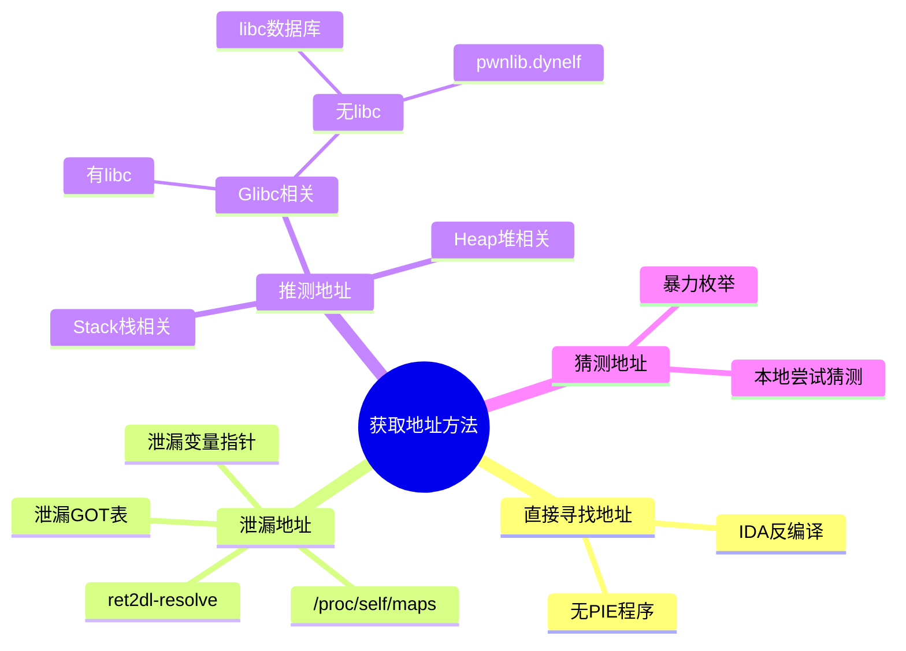
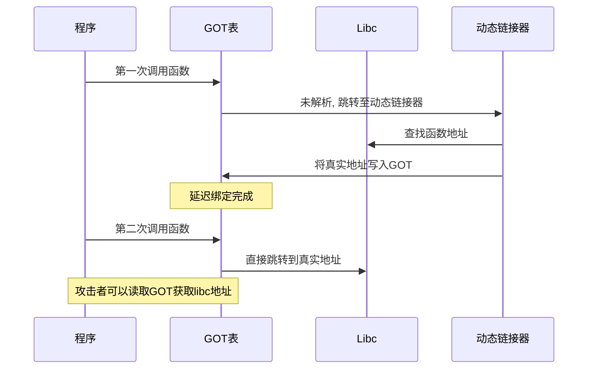
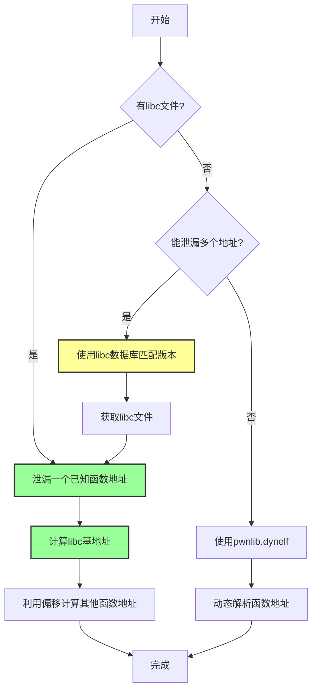
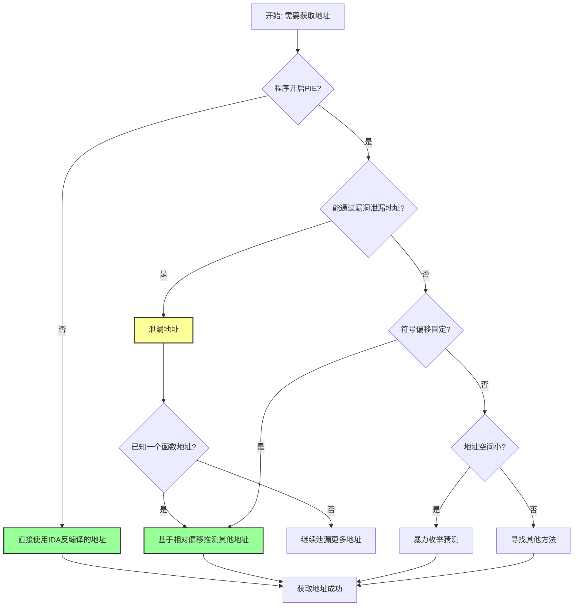

# 获取地址

## 地址获取方法总览



在漏洞利用的过程中，我们常常需要获取一些变量、函数的地址，以便于能够进行进一步的利用。获取地址是 PWN 题型中的关键环节，因为很多漏洞利用都需要知道具体的内存地址才能进行后续操作。

## 概述

获取地址的方法可以分为以下几类，这是一种递进的思考方式：

1. **直接寻找地址** - 通过反编译等手段直接看到对应符号的地址
2. **泄漏地址** - 通过控制程序的执行流来泄漏程序中的某些符号指针的内容
3. **推测地址** - 根据某个段内的符号之间的偏移是固定的来推断地址
4. **猜测地址** - 通过暴力枚举等方式猜测地址

### 核心思想

获取地址主要依赖于两个核心思想：

1. **充分利用代码本身的性质**
   - 程序某些代码的位置就是固定的（如不开启 PIE 时，代码段的位置）
   - glibc 的后三位通常是固定的

2. **充分利用相对偏移的性质**
   - 程序加载时内存是一段一段加载的，所以相对偏移往往是固定的
   - 知道一个符号的地址，就可以推断出其他符号的地址

## 直接寻找地址

程序中已经给出了相关变量或者函数的地址了，这时候我们就可以直接进行利用。

### 适用场景

这种情形往往适用于**程序没有开启 PIE** 的情况。

> **PIE（Position Independent Executable）**：位置无关可执行文件，是一种安全机制，使程序每次加载的基地址随机化。如果程序没有开启 PIE，那么代码段、数据段等都会加载在固定的地址上。

### 如何检查 PIE

使用 `checksec` 工具可以快速检查程序是否开启了 PIE：

```bash
checksec ./binary
```

如果看到 `PIE: No PIE (0x400000)` 或类似输出，说明没有开启 PIE，可以直接使用 IDA 反编译得到的函数地址。

## 泄漏地址

在泄漏地址的过程中，我们往往需要找到一些敏感的指针，这些指针里存储着要么就是我们想要的符号的地址，要么就是与我们想要的符号的地址相关。

### 泄漏变量指针

泄漏程序中的变量指针可以获取有用的地址信息。

**示例**：

1. 泄漏 main arena 中各种 bin 的头表指针，可能就可以获取堆中或者 glibc 中某个变量的地址。
2. 泄漏栈上某个指针的值，可以获取栈的基地址。

### 泄漏 GOT 表

GOT（Global Offset Table，全局偏移表）是动态链接中用于存储函数地址的表。

#### GOT 表工作原理



#### 原理

有时候我们并不一定非得直接知道某个函数的地址，可以利用 GOT 表跳转到对应函数的地址。当然，如果我们非得知道这个函数的地址，我们可以利用 write、puts 等输出函数将 GOT 表中地址处对应的内容输出出来。

**重要前提**：这个函数必须已经被解析一次了（延迟绑定机制）。

#### 延迟绑定机制

ELF 文件采用动态链接时，GOT 表会采用延迟绑定技术。函数第一次被调用时才会解析其真实地址并写入 GOT 表。因此：

- 如果函数已经被调用过，GOT 表中存储的就是真实地址
- 如果函数还没被调用过，GOT 表中存储的是指向动态链接器的地址

### ret2dl-resolve

当 ELF 文件采用动态链接时，我们可以利用延迟绑定机制来伪造函数解析。

#### 原理

- 第一次调用某个 libc 函数时，程序会调用 `_dl_runtime_resolve` 函数对其地址解析
- 我们可以利用栈溢出构造 ROP 链，伪造对其他函数（如：system）的解析
- 这是高级 ROP 中常用的技巧

**相关概念**：[[中级ROP]]

### /proc/self/maps

我们可以考虑通过读取程序的 `/proc/self/maps` 来获取与程序相关的基地址。

`/proc/self/maps` 是 Linux 系统下的一个特殊文件，它显示了当前进程的内存映射情况，包括各个段的基地址、权限等信息。

## 推测地址

### Libc 地址计算流程



在大多数情况下，我们都不能直接获取想要的函数的地址，往往需要进行一些地址的推测。这里重点依赖于**符号间的偏移是固定的**这一思想。

### Stack Related（栈相关）

关于栈上的地址，其实我们大多时候并不需要具体的栈地址，但是我们可以根据栈的寻址方式，推测出栈上某个变量相对于 EBP 的位置。

**相关概念**：[[函数调用栈]]、[[EBP]]、[[ESP]]

### Glibc Related（Glibc 相关）

这里主要考虑的是如何找到 Glibc 中相关的函数。

#### 有 libc

如果我们有目标程序使用的 libc 文件，那就好办了。

**方法**：
- 利用 libc 中函数的基地址一样这个特性来寻找
- 通过泄漏一个已知函数（如 `__libc_start_main`）的地址来计算 libc 在内存中的基地址
- 然后根据偏移计算出其他函数（如 `system`、`execve`）的地址

**注意**：不要选择有 wrapper 的函数，这样会使得函数的基地址计算不正确。

**常见的 wrapper 函数**：
- `printf` 可能是 `__printf_chk` 的 wrapper
- `gets` 可能是 `__gets_chk` 的 wrapper
- 等等...

#### 无 libc

如果我们没有目标程序使用的 libc 文件，解决策略分为两种：

1. **想办法获取 libc**
   - 通过泄漏多个函数地址，然后使用 libc 数据库匹配

2. **想办法直接获取对应的地址**
   - 使用 `pwnlib.dynelf` 等工具

对于想要泄露的地址，我们只是单纯地需要其对应的内容，所以 `puts`、`write`、`printf` 均可以：

- **puts、printf**：会有 `\x00` 截断的问题
- **write**：可以指定长度输出内容，推荐使用

##### pwnlib.dynelf

DynELF 是 pwntools 提供的一个工具，可以在没有 libc 文件的情况下，通过泄漏任意地址内容来解析符号。

**前提**：我们可以泄露任意地址的内容。

**注意**：如果要使用 write 函数泄露的话，一次最好多输出一些地址的内容，因为我们一般只是不断地向高地址读内容，很有可能导致高地址的环境变量被覆盖，就会导致 shell 不能启动。

##### libc 数据库

通过泄漏至少两个函数的地址，我们可以在 libc 数据库中查找匹配的 libc 版本。

**常用工具**：

1. **命令行工具**
   ```bash
   # 更新数据库
   ./get
   # 将已有libc添加到数据库中
   ./add libc.so
   # 在数据库中查找匹配的 libc
   ./find function1 addr function2 addr
   # 导出有用的偏移
   ./dump __libc_start_main_ret system dup2
   ```

2. **在线网站**
   - [libcdb.com](http://libcdb.com/)
   - [libc.blukat.me](https://libc.blukat.me/)

3. **LibcSearcher**
   - GitHub: [https://github.com/lieanu/LibcSearcher](https://github.com/lieanu/LibcSearcher)

### Heap Related（堆相关）

关于堆的一些地址的推测，这就需要我们比较详细地知道堆里分配了多少内存，目前泄漏出的内存地址是哪一块，进而获取堆的基地址，以及堆中相关的内存地址。

**相关概念**：堆利用、chunk、main arena

## 猜测地址

在一些比较特殊的情况下，我们可能可以使用猜测的方式。

### 暴力枚举

使用暴力的方法来获取地址。

**适用场景**：
- 32 位时，地址随机化的空间比较小，暴力枚举可行
- 某些情况下，即使是 64 位，也可能有某些位是固定的，可以缩小猜测范围

### 本地尝试猜测

当程序被特殊部署时，其不同的库被加载的位置可能会比较特殊。我们可以在本地尝试，然后猜测远程的情况。

## 总结

### 地址获取方法选择流程



获取地址的方法有很多，需要根据具体的题目环境选择合适的方法：

1. **首选**：直接寻找（无 PIE）
2. **其次**：泄漏地址（GOT、变量指针等）
3. **然后**：推测地址（基于相对偏移）
4. **最后**：猜测地址（暴力枚举）

**相关页面**：
- [[基本ROP]]
- [[中级ROP]]
- [[控制程序执行流]]
- [[shell获取]]
- [[栈溢出原理]]
- [[Canary保护机制]]
