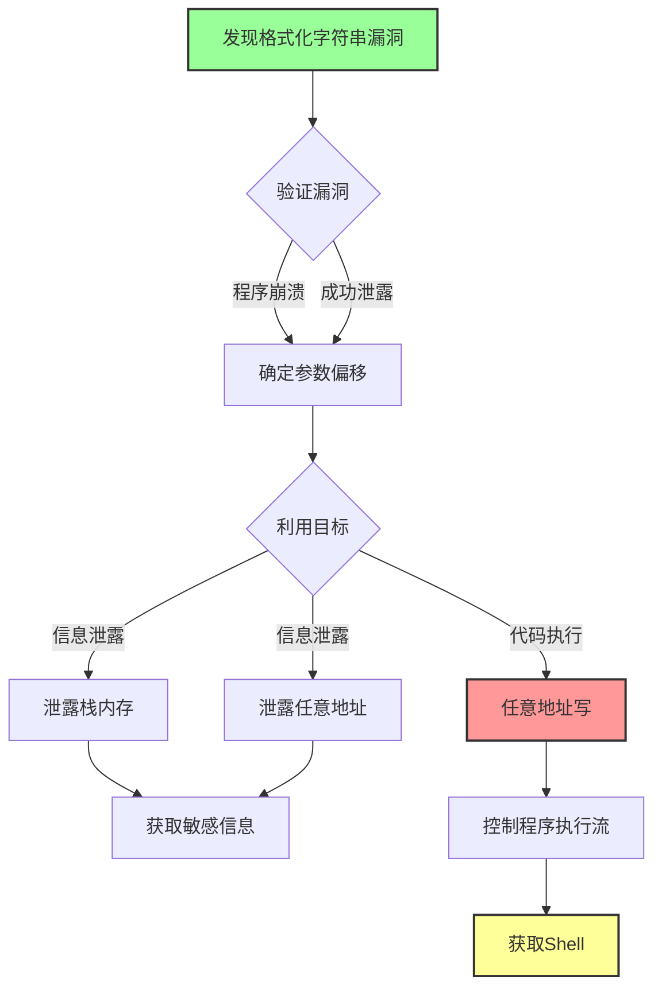
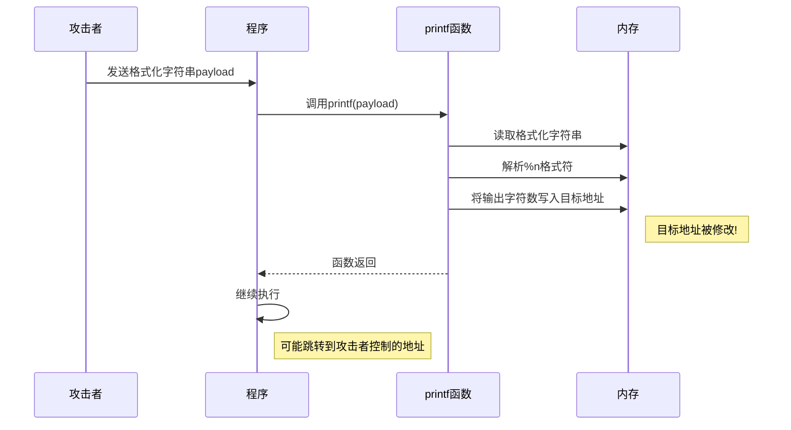

# 格式化字符串漏洞利用

## 简介

格式化字符串漏洞不仅可以使程序崩溃或泄露信息，还可以通过精心构造的 payload 来控制程序执行流程。本文将详细介绍格式化字符串漏洞的各种利用技术。

## 格式化字符串漏洞利用技术概览

### 利用技术流程图



### 格式化字符串漏洞利用技术思维导图


### 任意地址写操作时序图



## 基础知识

在深入学习利用技术之前，建议先了解：
- [[格式化字符串漏洞原理介绍]]

## 程序崩溃

### 原理

利用格式化字符串漏洞使程序崩溃是最简单的利用方式。只需要输入多个 `%s` 格式符即可。

```
%s%s%s%s%s%s%s%s%s%s
```

### 为什么有效

栈上不可能每个值都是合法的字符串地址。当 `printf` 尝试解析一个非法地址作为字符串时，程序就会崩溃。

### 应用场景

虽然这种方式不能直接控制程序，但可以用于：
- 攻击远程服务的可用性
- 验证漏洞是否存在
- 作为漏洞利用的第一步

## 泄露栈内存

### 示例程序

假设有以下程序：

```c
#include <stdio.h>
int main() {
    char s[100];
    int a = 1, b = 0x22222222, c = -1;
    scanf("%s", s);
    printf("%08x.%08x.%08x.%s\n", a, b, c, s);
    printf(s);
    return 0;
}
```

### 获取栈变量数值

使用 `%x` 或 `%p` 可以获取栈上变量的数值：

```
%08x.%08x.%08x
```

输出示例：
```
00000001.22222222.ffffffff.%08x.%08x.%08x
ffcfc400.000000c2.f765a6bb
```

### 指定参数位置

使用 `%n$x` 格式可以直接获取指定位置的参数值：

```
%3$x
```

注意：`n` 表示该格式化字符串对应的第 n 个输出参数，相对于输出函数来说就是第 n+1 个参数。

### 获取栈变量对应字符串

使用 `%s` 可以获取栈上变量所指地址的字符串内容：

```
%s
```

但要注意，如果对应地址不是合法的字符串地址，程序会崩溃。

### 小技巧总结

1. 使用 `%p` 代替 `%x`，可以不用考虑位数区别
2. 使用 `%s` 获取变量对应地址的内容，但可能导致程序崩溃
3. 使用 `%order$x` 获取指定参数的值
4. 使用 `%order$s` 获取指定参数对应地址的内容

## 泄露任意地址内存

### 原理

格式化字符串本身通常存储在栈上。如果我们知道格式化字符串相对于输出函数调用是第几个参数，就可以构造 payload 来读取任意地址的内容。

基本思路：
```
addr%k$s
```

其中 `addr` 是要读取的地址，`k` 是格式化字符串在栈上的偏移。

### 确定参数偏移

使用如下方式确定格式化字符串是第几个参数：

```
[tag]%p%p%p%p%p%p%p%p...
```

通过观察输出中 tag 出现的位置来确定偏移。

### 应用场景

- 利用 GOT 表获取 libc 函数地址
- 泄露程序中的敏感信息
- 获取程序基址（ASLR 绕过）

## 任意地址写

### %n 格式符

`%n` 格式符是格式化字符串漏洞最强大的功能之一。它不会输出任何内容，但会将已成功输出的字符数写入对应指针所指的变量。

### 基本用法

```c
int num;
printf("hello%n\n", &num);
// num 的值会被设置为 5
```

### 利用 %n 写任意地址

结合任意地址读的技术，我们可以向任意地址写入数据：

1. 将目标地址放在格式化字符串中
2. 使用 `%k$n` 格式符，其中 k 是该地址在栈上的偏移
3. 通过控制输出字符数来控制写入的值

### 分字节写入

直接写入大数值可能需要输出大量字符。更好的方法是分字节写入：
- `%hhn` - 写入 1 字节
- `%hn` - 写入 2 字节
- `%n` - 写入 4 字节
- `%lln` - 写入 8 字节

## 常见问题

1. **Q: 如何确定参数偏移？**
   A: 使用 `[tag]%p%p%p...` 模式观察输出

2. **Q: 程序有 ASLR 保护怎么办？**
   A: 先利用格式化字符串泄露地址，再计算基址

3. **Q: 写入大数值太麻烦？**
   A: 使用分字节写入技术，如 `%hhn`

## 最佳实践

1. 先确定参数偏移
2. 利用信息泄露获取必要地址
3. 使用 pwntools 的 `fmtstr_payload` 函数简化 payload 构造
4. 考虑使用分字节写入来避免输出过多字符

## 进阶主题

查看 [[格式化字符串漏洞例子]] 了解这些技术在实际 CTF 题目中的应用，包括：
- GOT 表劫持
- 返回地址劫持
- 64 位程序利用
- 堆上的格式化字符串漏洞

## 相关概念

- [[格式化字符串漏洞原理介绍]]
- [[格式化字符串漏洞例子]]
- [[控制程序执行流]]
- [[获取地址]]
