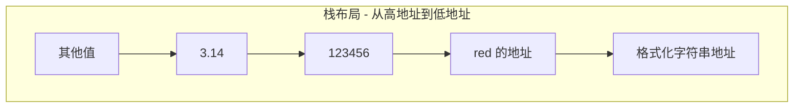
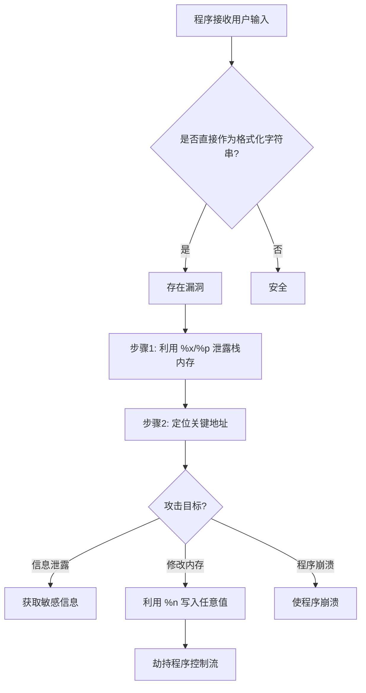
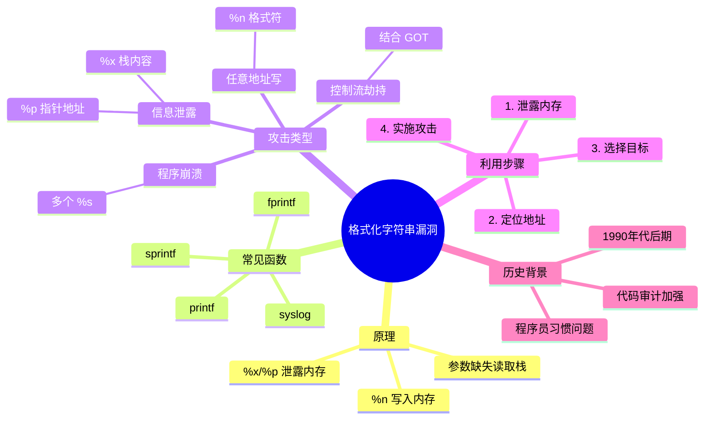

# 格式化字符串漏洞原理介绍

## 概述

格式化字符串漏洞是一类常见的软件安全漏洞，主要存在于使用 C/C++ 等编程语言编写的程序中。当程序将用户可控的数据直接作为格式化字符串函数的参数时，攻击者可以利用这个漏洞读取或修改内存内容，甚至控制程序执行流程。

**为什么重要：** 这类漏洞在 CTF 比赛和真实世界的安全漏洞中非常常见，掌握其原理对于二进制安全研究至关重要。

**简单比喻：** 把格式化字符串想象成餐厅的点餐小票，上面写着"一份牛排 %d，一份沙拉 %s"。如果服务员直接让顾客自己写小票，顾客可能会乱写导致混乱。

## 格式化字符串函数介绍

格式化字符串函数的作用是将计算机内存中表示的数据转化为人类可读的字符串格式。几乎所有的 C/C++ 程序都会使用这类函数来输出信息、调试程序或处理字符串。

### 常见格式化字符串函数

**输入类：**
- `scanf` - 从标准输入读取格式化数据

**输出类：**

| 函数 | 基本介绍 |
|------|----------|
| `printf` | 输出到标准输出 stdout |
| `fprintf` | 输出到指定文件流 |
| `vprintf` | 根据参数列表格式化输出到 stdout |
| `vfprintf` | 根据参数列表格式化输出到指定文件流 |
| `sprintf` | 输出到字符串 |
| `snprintf` | 输出指定字节数到字符串 |
| `vsprintf` | 根据参数列表格式化输出到字符串 |
| `vsnprintf` | 根据参数列表格式化输出指定字节到字符串 |
| `setproctitle` | 设置进程标题 |
| `syslog` | 输出系统日志 |

### 格式化字符串语法

格式化字符串的基本格式如下：

```
%[parameter][flags][field width][.precision][length]type
```

**关键类型说明：**

- `d/i` - 有符号整数
- `u` - 无符号整数
- `x/X` - 十六进制无符号整数，x 使用小写字母，X 使用大写字母
- `o` - 八进制无符号整数
- `s` - 字符串
- `c` - 字符
- `p` - 指针地址
- `n` - 不输出字符，但将已成功输出的字符数写入对应指针所指变量
- `%` - 输出 % 字面值

## 格式化字符串漏洞原理

格式化字符串函数根据格式化字符串来解析后续参数。当程序员没有正确提供参数时，函数会继续从栈上读取数据，这就导致了漏洞。

### 正常使用示例

```c
printf("Color %s, Number %d, Float %4.2f", "red", 123456, 3.14);
```

输出结果：`Color red, Number 123456, Float 3.14`

在调用 `printf` 函数执行前，栈上的布局（从高地址到低地址）如下：



### 漏洞产生原因

当程序写成这样时：

```c
printf("Color %s, Number %d, Float %4.2f");
```

此时没有提供参数，但程序仍然会运行，将栈上格式化字符串地址上面的三个变量分别解析为对应的参数。

对于 `%s` 来说，如果提供了一个不可访问地址（如 0），程序就会崩溃。这就是格式化字符串漏洞的基本原理。

**简单理解：** 就像服务员照着顾客的乱填的小票去后厨取餐，结果拿到了一堆不该拿的东西。

## 格式化字符串攻击流程



## 主要特性/关键点

1. **参数缺失导致栈读取** - 格式化字符串函数会持续从栈上读取数据，即使没有提供足够的参数
2. **格式化占位符控制** - 攻击者可以通过构造特殊的格式化字符串来控制程序行为
3. **%n 格式符的威力** - `%n` 格式符可以向内存写入数据，这是利用格式化字符串漏洞进行写操作的关键
4. **栈内存泄露** - 使用 `%x`、`%p` 等格式符可以泄露栈上的内存内容

## 历史背景

格式化字符串漏洞最早在 1990 年代后期被广泛发现，由于当时很多程序员习惯直接将用户输入传递给 printf 等函数而不进行过滤。这类漏洞曾导致许多知名软件的安全问题，直到后来人们逐渐意识到其危险性并加强了代码审计。

## 应用场景

1. **程序崩溃攻击** - 使用多个 `%s` 可以导致程序崩溃
2. **信息泄露** - 读取栈上或任意地址的内容
3. **任意地址写** - 利用 `%n` 格式符修改内存内容
4. **控制流劫持** - 结合其他技术（如 GOT 表劫持）获取程序控制流

## 格式化字符串漏洞思维导图



## 相关概念

- [[格式化字符串漏洞利用]] - 学习如何利用这类漏洞
- [[格式化字符串漏洞例子]] - 查看实际 CTF 题目中的应用
- [[栈介绍]] - 了解栈的基本原理
- [[C语言函数调用栈（一）]] - 了解函数调用时的栈布局
