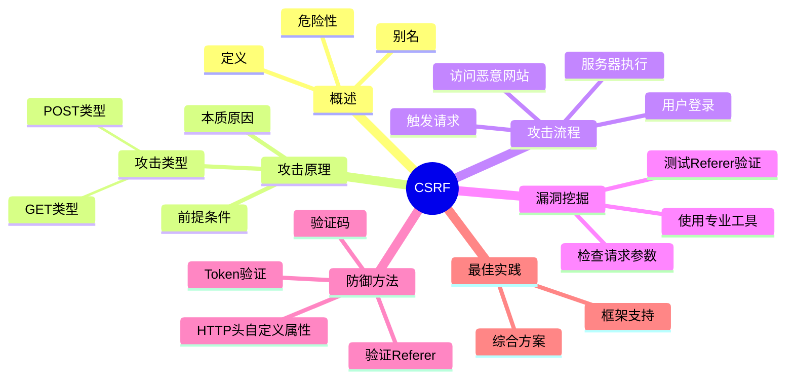
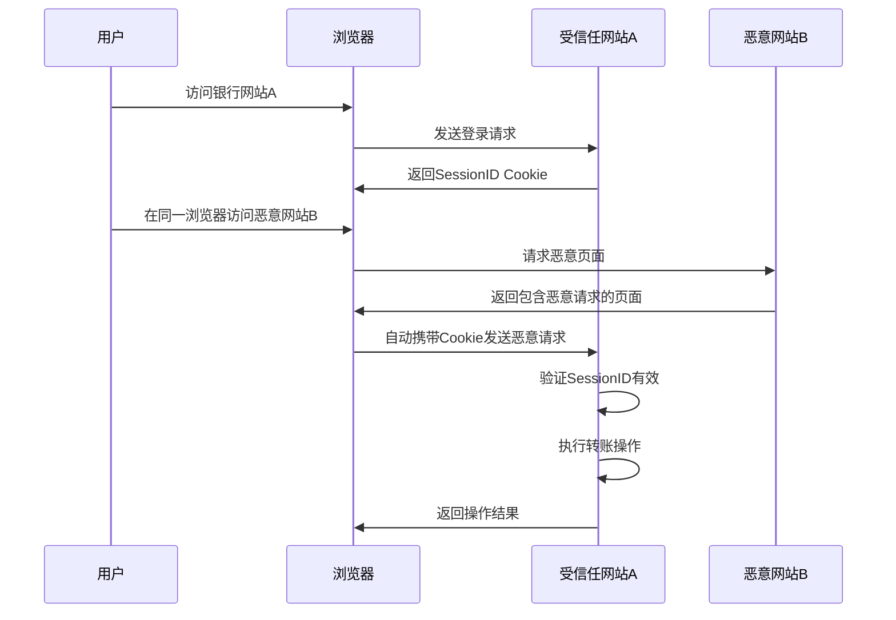
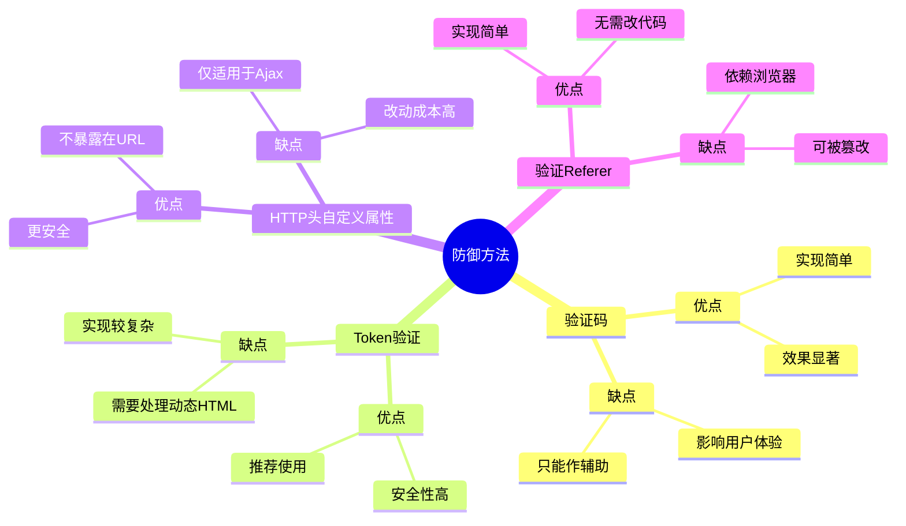
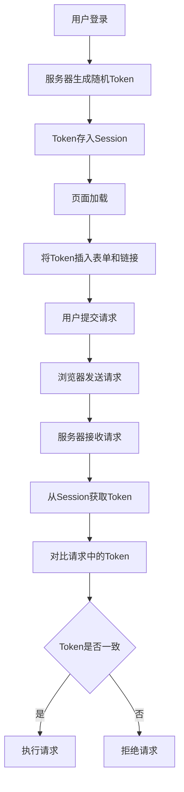

# CSRF跨站请求伪造

## 知识结构



## 概述

**CSRF（Cross-Site Request Forgery，跨站请求伪造）**，也被称为 **One Click Attack（一键攻击）** 或 **Session Riding（会话劫持）**，是一种常见的Web安全漏洞。

简单来说，CSRF攻击就是：**攻击者盗用了你的身份，以你的名义发送恶意请求，而服务器却认为这是你本人的合法操作。**

### 为什么CSRF如此危险？

CSRF可以让攻击者在用户不知情的情况下执行各种操作：
- 发送邮件、消息
- 购买商品
- 转账汇款
- 修改账户设置
- 添加系统管理员
- 其他任何用户有权限执行的操作

## 详细解释

### CSRF攻击的本质原因

CSRF能够成功攻击的核心原因是：**重要操作的所有参数都可以被攻击者猜测到。**

只有当攻击者能够预测出URL的所有参数和参数值时，才能成功构造伪造请求。反之，如果参数中包含攻击者无法获取的信息（如随机Token），攻击就无法成功。

### CSRF攻击的前提条件

要完成一次CSRF攻击，受害者必须同时满足两个条件：

1. **登录受信任网站A** - 并在本地浏览器中生成有效的Cookie或Session
2. **在不登出A的情况下，访问危险网站B** - 攻击者通过网站B来触发恶意请求

### CSRF攻击的完整流程



让我们通过一个完整的例子来理解攻击过程：

1. **用户登录网站A**
   - 用户访问银行网站 `www.mybank.com`
   - 输入用户名和密码登录
   - 网站验证成功，生成SessionID并返回给浏览器
   - 浏览器将SessionID存储在Cookie中

2. **用户访问恶意网站B**
   - 用户在同一浏览器中打开新标签页
   - 访问了攻击者构造的恶意网站 `www.evil.com`
   - 这个过程用户可能完全不知情（比如通过钓鱼链接、广告等）

3. **恶意网站触发请求**
   - 恶意网站中包含指向银行网站A的恶意请求
   - 请求可以是图片、表单、脚本等形式
   - 浏览器自动携带网站A的Cookie发起请求

4. **服务器执行操作**
   - 网站A收到请求，检查SessionID
   - SessionID有效，服务器认为是用户本人操作
   - 执行请求中的操作（如转账）

5. **攻击完成**
   - 用户账户中的资金被转走
   - 用户可能直到查看账户明细时才发现

## 主要特性/关键点

### CSRF的两种主要类型

#### 1. GET类型的CSRF

这是最简单的CSRF攻击类型，只需要一个HTTP请求就能完成。

**攻击示例：**

银行网站A有一个转账接口，使用GET请求：
```
http://www.mybank.com/Transfer.php?toBankId=11&money=1000
```

恶意网站B构造这样的代码：
```html

```

**攻击过程：**
1. 用户登录银行网站A
2. 用户访问恶意网站B
3. 浏览器自动加载图片，同时也会向银行发送GET请求
4. 银行收到请求，验证SessionID有效，执行转账
5. 用户损失1000元

**防御提示：** 永远不要用GET请求来执行修改数据的操作！

#### 2. POST类型的CSRF

POST类型的CSRF比GET类型更复杂一些，但同样危险。

**常见误解：** "只要用POST请求就不会被CSRF攻击" —— 这是错误的！

**攻击方法：**

攻击者可以在恶意网站中构造一个隐藏的表单，然后用JavaScript自动提交：

```html
<form action="http://www.mybank.com/Transfer.php" method="POST" id="evilForm">
  <input type="hidden" name="toBankId" value="11">
  <input type="hidden" name="money" value="1000">
</form>
<script>
  document.getElementById('evilForm').submit();
</script>
```

**进阶技巧：**
- 可以将表单放在隐藏的iframe中，用户完全看不见
- 可以使用CSS将表单隐藏（`display: none`）
- 整个过程用户无感知

**真实案例：Gmail CSRF漏洞（2007年）**

安全研究者pdp展示了如何利用CSRF攻击Gmail：
1. 用户登录Gmail
2. 访问恶意网站
3. 恶意网站通过iframe向Gmail发送POST请求
4. 在用户邮箱中自动创建邮件转发规则
5. 所有带附件的邮件都转发到攻击者邮箱

## 漏洞挖掘

如何发现一个网站是否存在CSRF漏洞？

### 方法1：检查请求参数

抓取一个正常请求的数据包，检查：
- 是否有Referer字段
- 是否有Token或其他随机参数

**如果两者都没有，很可能存在CSRF漏洞！**

### 方法2：测试Referer验证

如果请求中有Referer字段，尝试：
1. 发送正常请求，记录Referer
2. 去掉Referer字段，重新发送请求
3. 如果请求仍然有效，说明存在CSRF漏洞

### 方法3：使用专业工具

有一些专门的CSRF漏洞检测工具：
- **CSRFTester** - 抓取链接和表单，修改后重新提交测试
- **CSRF Request Builder** - 构造CSRF攻击请求

这些工具的工作原理：
1. 抓取浏览器访问过的所有链接和表单
2. 修改表单参数
3. 重新提交请求
4. 如果服务器接受修改后的请求，说明存在漏洞

## 防御方法



CSRF有多种防御方法，各有优缺点。

### 1. 验证码

**原理：** 强制用户与应用交互，证明这是真人操作。

**优点：**
- 实现简单
- 效果显著
- 用户容易理解

**缺点：**
- 影响用户体验
- 不能给所有操作都加验证码
- 只能作为辅助手段，不能作为主要解决方案

### 2. Token验证（推荐）



**原理：** 在请求中加入一个攻击者无法伪造的随机Token。

**为什么有效？**
- CSRF攻击只能利用用户的Cookie
- Token不在Cookie中，攻击者无法获取
- 服务器验证Token是否正确

**实现方法：**

**对于GET请求：**
```
http://url?csrftoken=tokenvalue
```

**对于POST请求：**
```html
<form action="/transfer" method="POST">
  <input type="hidden" name="csrftoken" value="tokenvalue">
  <input type="text" name="toBankId">
  <input type="text" name="money">
  <input type="submit" value="转账">
</form>
```

**Token生成与验证流程：**
1. 用户登录后，服务器生成随机Token并存入Session
2. 页面加载时，将Token插入到所有表单和链接中
3. 用户提交请求时，Token随请求一起发送
4. 服务器验证Session中的Token与请求中的Token是否一致

**自动添加Token的技巧：**
```javascript
// 页面加载时遍历所有a标签和form标签，自动添加token
document.addEventListener('DOMContentLoaded', function() {
  const token = getCsrfTokenFromSession();
  
  // 给所有链接添加token
  document.querySelectorAll('a').forEach(link => {
    const url = new URL(link.href);
    if (url.origin === window.location.origin) {
      url.searchParams.set('csrftoken', token);
      link.href = url.toString();
    }
  });
  
  // 给所有表单添加token
  document.querySelectorAll('form').forEach(form => {
    if (form.action === '' || new URL(form.action).origin === window.location.origin) {
      const input = document.createElement('input');
      input.type = 'hidden';
      input.name = 'csrftoken';
      input.value = token;
      form.appendChild(input);
    }
  });
});
```

**注意事项：**
- 对于动态生成的HTML，需要手动添加Token
- Token要保证足够随机，不能被猜测
- Token应该有有效期

### 3. HTTP头自定义属性

**原理：** 将Token放在HTTP头中，而不是请求参数中。

**实现方法：**
```javascript
// 使用XMLHttpRequest
const xhr = new XMLHttpRequest();
xhr.open('POST', '/transfer', true);
xhr.setRequestHeader('X-CSRF-Token', token);
xhr.send(data);

// 使用fetch
fetch('/transfer', {
  method: 'POST',
  headers: {
    'X-CSRF-Token': token
  },
  body: data
});
```

**优点：**
- URL不会被记录到浏览器地址栏
- 不用担心Referer泄露Token
- 更安全

**缺点：**
- 只能用于Ajax请求
- 普通表单提交不适用
- 对遗留系统改动太大

### 4. 验证HTTP Referer字段

**原理：** 检查请求的来源地址是否合法。

**HTTP Referer是什么？**
Referer是HTTP头中的一个字段，记录了请求是从哪个页面发起的。

**验证逻辑：**
```javascript
// 伪代码示例
function validateReferer(request) {
  const referer = request.headers.referer;
  if (!referer) {
    return false;
  }
  
  const refererUrl = new URL(referer);
  // 检查Referer是否来自本站
  return refererUrl.origin === 'https://www.mybank.com';
}
```

**优点：**
- 实现简单
- 不需要修改现有代码逻辑
- 对用户体验无影响

**缺点：**
- 依赖浏览器，安全性不高
- 某些浏览器可以被篡改Referer（如旧版本IE、Firefox）
- 用户可能禁用Referer
- 不是100%可靠

## 最佳实践

### 防御CSRF的综合方案

1. **主要防御：使用Token验证**
   - 这是最安全、最常用的方法
   - 大多数Web框架都有内置支持

2. **辅助防御：验证Referer**
   - 作为Token验证的补充
   - 增加攻击难度

3. **关键操作：使用验证码**
   - 对于转账、修改密码等敏感操作
   - 可以有效防止自动化攻击

4. **安全编码：区分GET和POST**
   - GET只用于查询，不修改数据
   - POST用于修改数据的操作

### 常见框架的CSRF防护

大多数现代Web框架都内置了CSRF防护：

- **Django**：`` 模板标签
- **Spring Security**：`CsrfFilter`
- **Express.js**：`csurf` 中间件
- **Rails**：`protect_from_forgery`

使用框架提供的防护机制，不要自己重复造轮子！

## 相关概念

- [[XSS跨站脚本攻击]] - 另一种常见的Web安全漏洞
- [[Web安全基础]] - Web安全基础知识
- [[文件上传漏洞]] - 另一种Web漏洞类型
- [[文件包含漏洞]] - 另一种Web漏洞类型

## 参考资料

- [CSRF漏洞原理攻击与防御（非常细）](https://blog.csdn.net/qq_43378996/article/details/123910614) - CSDN博客
- OWASP CSRF Prevention Cheat Sheet - OWASP官方文档
