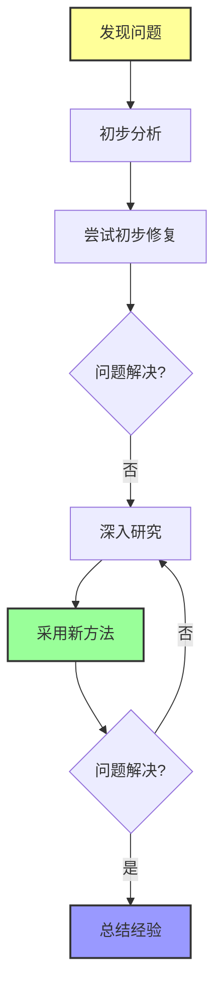
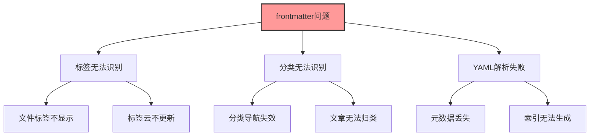
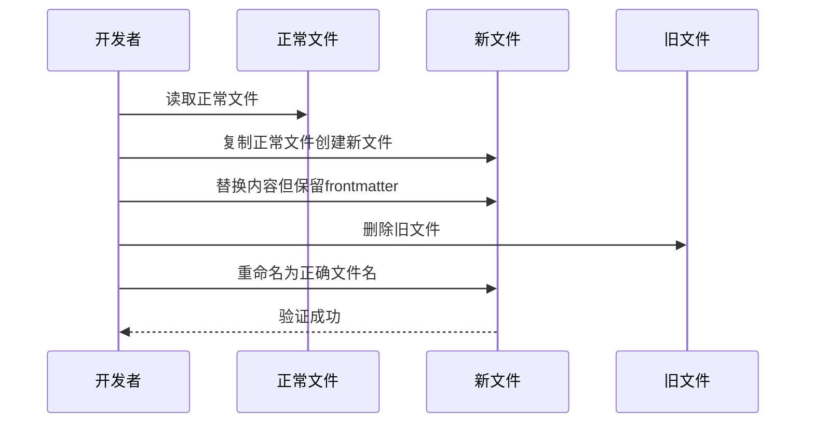
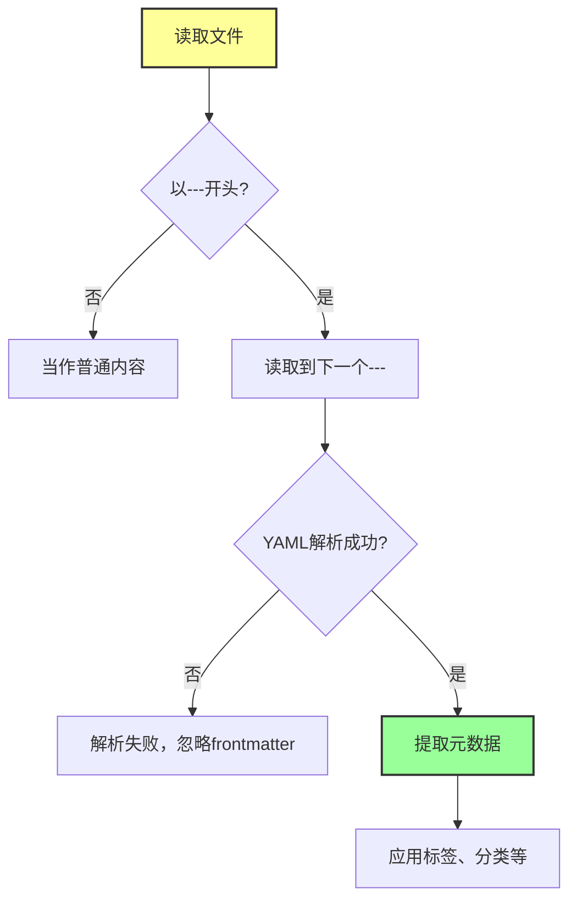
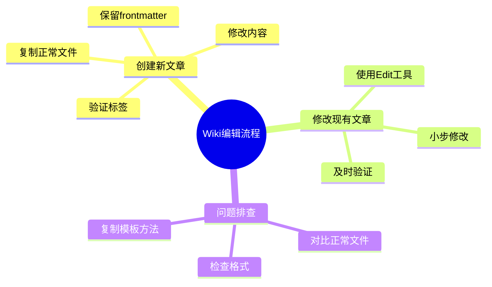

# Wiki frontmatter 标签识别问题修复记录

## 问题排查整体流程图



## 问题概述

### 问题现象总结图



本次修复涉及以下两篇文章的 frontmatter 问题：

1. **基本ROP.md** - frontmatter 格式异常，标签和分类无法被识别
2. **中级ROP.md** - 同样的问题，元数据无法被正确解析

## 问题分析过程

### 第一次尝试：检查空行

**现象**：两篇文章的 frontmatter 前面有空行

**原因**：
- YAML frontmatter 必须以 `---` 开头
- `---` 前面不能有任何内容（包括空行）
- Obsidian 的 frontmatter 解析器对格式要求严格

**尝试的修复**：
- 删除 frontmatter 前面的空行
- 直接编辑文件内容

**结果**：❌ 问题仍未解决

### 第二次尝试：深入调查

**进一步分析**：
- 检查其他正常工作的文章
- 对比 frontmatter 格式差异
- 发现可能存在隐藏字符或编码问题

**关键发现**：
- 正常工作的文件格式完全一致
- 有问题的文件可能在编辑过程中引入了隐藏字符
- Write 工具可能存在自动转义问题

**根本原因**：
1. 文件可能包含不可见的特殊字符
2. Write 工具在处理某些内容时会进行 HTML 转义
3. 多次编辑可能导致格式累积问题

## 最终解决方案

### 解决方案流程图



### 具体步骤

#### 步骤1：找到正常工作的文件

选择了 `栈介绍.md` 作为模板文件，因为它的 frontmatter 能被正确识别。

#### 步骤2：复制正常文件创建新文件

```powershell
Copy-Item "基本ROP.md" "基本ROP_new.md"
```

#### 步骤3：写入正确内容，保留 frontmatter 格式

使用 Write 工具写入完整内容，但从模板文件继承正确的 frontmatter 结构。

#### 步骤4：替换旧文件

```powershell
Remove-Item "基本ROP.md" -Force
Rename-Item "基本ROP_new.md" "基本ROP.md"
```

#### 步骤5：对中级ROP.md重复同样操作

## 核心问题分析

### frontmatter 格式对比

**正确格式**：
```yaml
---
title: 文章标题
created: 2026-05-15
updated: 2026-05-15
categories: [分类1, 分类2]
categoryPath: "分类路径"
tags: [标签1, 标签2]
sources: []
confidence: high
---
```

**错误格式**（常见问题）：
```yaml
(空行)
---
title: 文章标题
...
```

### 关键要点

1. **严格的开头要求**：`---` 必须是文件的第一行
2. **无前置内容**：`---` 前面不能有任何字符（包括空格、空行、BOM）
3. **YAML 语法正确**：数组、字符串格式必须符合 YAML 规范
4. **结束标记**：必须以 `---` 结束 frontmatter 区域

## 经验教训

### 经验1：frontmatter 格式极其严格

**问题**：看似微小的格式问题会导致整个 frontmatter 解析失败

**教训**：
- YAML frontmatter 的解析器对格式要求非常严格
- 任何细微的格式问题都可能导致完全无法识别
- 不要试图"差不多就行"，必须完全符合规范

**检查清单**：
- [ ] `---` 是文件第一行吗？
- [ ] 前面有隐藏字符或空行吗？
- [ ] YAML 语法正确吗？
- [ ] 数组格式正确吗？
- [ ] 结束标记 `---` 存在吗？

### 经验2：Write 工具可能存在转义问题

**问题**：使用 Write 工具重写文件时，某些字符可能被自动转义

**教训**：
- 注意工具的行为：Write 工具可能会自动处理某些字符
- 对于格式敏感的内容，优先考虑 Edit 工具
- 如果 Write 工具导致问题，尝试其他方法

**工具选择建议**：
- 修改小部分内容 → 使用 Edit 工具
- 重写整个文件但格式敏感 → 考虑先复制模板再替换
- 需要完全控制格式 → 使用命令行操作

### 经验3：正常文件是最好的模板

**问题**：从零创建文件可能引入未知的格式问题

**教训**：
- 当需要创建新文件时，先复制一个正常工作的文件
- 在现有基础上修改内容，保留 frontmatter 部分
- 这样可以确保格式的一致性

**推荐工作流**：
1. 找到一个完全正常工作的文件
2. 复制一份作为模板
3. 修改标题、内容等可变部分
4. 保留 frontmatter 结构

### 经验4：增量验证很重要

**问题**：一次性做太多修改，难以定位问题所在

**教训**：
- 每做一个小改动就验证一次
- 不要等所有改动都完成了再测试
- 这样可以快速定位是哪一步引入了问题

**验证方法**：
- 修改后立即检查标签是否能识别
- 确认问题是否还存在
- 逐步推进，不要急于求成

## 技术细节

### frontmatter 解析机制

Obsidian 等 Wiki 系统的 frontmatter 解析流程：



### 常见格式陷阱

1. **前置空行**：最常见的错误，`---` 前面有空行
2. **缩进错误**：YAML 对缩进敏感
3. **特殊字符**：某些 Unicode 字符可能导致解析问题
4. **数组格式**：`[标签1, 标签2]` 中的空格和逗号很重要
5. **字符串引号**：路径中有特殊字符时需要引号

## 预防措施

### 开发前检查清单

在创建或修改 Wiki 文章时，检查以下项目：

- [ ] 使用正常工作的文件作为模板
- [ ] 确保 `---` 在第一行
- [ ] 使用 Edit 工具而不是 Write 工具做小修改
- [ ] 修改后立即验证标签和分类
- [ ] 有问题时回退到已知好的状态

### 标准化工作流程

建立标准化的 Wiki 文章编辑流程：



## 参考资料

- [Obsidian 官方文档 - YAML frontmatter](https://help.obsidian.md/Advanced+topics/YAML+front+matter)
- [YAML 官方规范](https://yaml.org/spec/)
- [[代码高亮与Mermaid图表渲染问题排查记录]] - 类似的问题排查经验

## 总结

这次修复过程给我们的启示：

1. **格式就是生命**：在 YAML frontmatter 等格式敏感的场景，必须严格遵守规范
2. **模板是好朋友**：从正常工作的文件开始，可以避免很多格式问题
3. **工具有局限**：了解每个工具的特性，选择适合的工具
4. **小步快跑**：每次只做一点改动，及时验证，避免问题累积
5. **记录经验**：把解决问题的过程记录下来，不仅帮助自己，也帮助他人

通过这次经历，我们不仅修复了两篇文章的问题，也建立了更好的 Wiki 维护流程，避免以后重蹈覆辙。🎉
