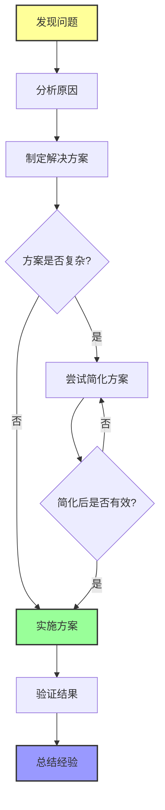
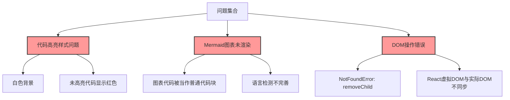
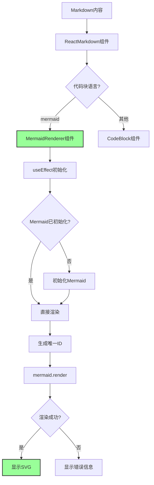
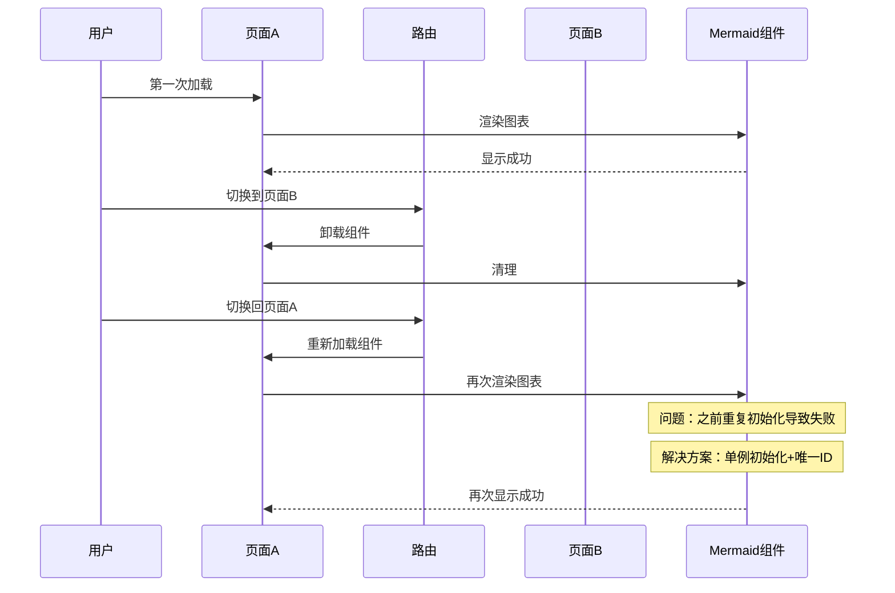
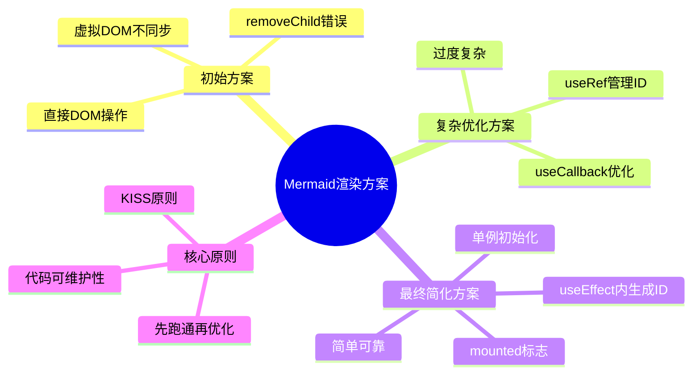

# 代码高亮与Mermaid图表渲染问题排查记录

## 问题排查整体流程图



## 问题概述

本次修复涉及以下三个核心问题：

### 核心问题总结图



1. **代码高亮样式问题** - 代码块显示白色背景，未高亮的代码显示红色，影响可读性
2. **Mermaid 图表未渲染** - 图表代码被当作普通代码块显示，未被识别和渲染
3. **DOM 操作错误** - `NotFoundError: Failed to execute 'removeChild' on 'Node'` 运行时错误

## 问题分析

### 问题1：代码高亮样式问题

**现象**：代码块显示白色背景，部分代码显示红色（类似报错效果）

**原因**：
- 初始实现使用了 `highlight.js` 的默认样式，与深色主题不匹配
- 内联代码样式使用了错误的颜色配置

**解决方案**：
- 移除 `rehype-highlight` 和 `highlight.js` 依赖
- 使用自定义代码块渲染，采用深色背景（`bg-gray-900`）和浅色文字（`text-gray-300`）
- 内联代码使用灰色背景（`bg-gray-100`）和深色文字（`text-gray-700`）

### 问题2：Mermaid 图表未渲染

**现象**：Mermaid 图表代码被当作普通代码块显示，没有渲染成图表

**原因**：
- 代码块语言检测逻辑不完善，无法正确识别 Mermaid 语法

**解决方案**：
- 在 `isMermaidCode` 函数中添加多种 Mermaid 图表类型的检测：
  - `graph`、`flowchart`、`sequenceDiagram`
  - `classDiagram`、`stateDiagram`、`pie`
  - `gantt`、`journey`、`mindmap`、`timeline`

### 问题3：DOM 操作错误

**现象**：页面出现 `NotFoundError: Failed to execute 'removeChild' on 'Node': The node to be removed is not a child of this node.` 错误

**原因**：
- 初始实现使用直接 DOM 操作（`replaceChild`）替换 Mermaid 代码块
- React 的虚拟 DOM 与实际 DOM 不同步，当组件重新渲染时，React 尝试清理已被替换的节点，导致错误

**解决方案**：
- 创建独立的 `MermaidRenderer` 组件，避免直接 DOM 操作
- 使用 React 状态管理渲染流程，确保虚拟 DOM 与实际 DOM 同步

## 修复方案

### Mermaid渲染组件架构图



### 核心组件改造

**文件**：`src/components/MarkdownRenderer.tsx`

**关键改进**：

1. **分离 Mermaid 渲染逻辑**：创建独立的 `MermaidRenderer` 组件
2. **状态管理**：使用 React 状态管理渲染状态（加载中、成功、失败）
3. **避免直接 DOM 操作**：完全通过 React 组件生命周期处理渲染
4. **唯一 ID 生成**：使用 `useRef` 管理计数器，避免在渲染过程中更新状态

### 代码结构

```tsx
// MermaidRenderer 组件
function MermaidRenderer({ code, id }) {
  const [rendered, setRendered] = useState(false);
  const [error, setError] = useState(null);
  const [svgContent, setSvgContent] = useState('');

  useEffect(() => {
    // 使用 mermaid.render() 异步渲染
    const renderMermaid = async () => {
      try {
        const result = await mermaid.render(id, code);
        setSvgContent(result.svg);
        setRendered(true);
      } catch (err) {
        setError(err.message);
        setRendered(true);
      }
    };
    renderMermaid();
  }, [code, id]);

  // 根据状态返回不同的 UI
  if (!rendered) return <LoadingState />;
  if (error) return <ErrorState error={error} />;
  return <SuccessState svgContent={svgContent} />;
}
```

## 经验教训

### 经验1：避免直接 DOM 操作

**问题**：在 React 组件中直接操作 DOM 会导致虚拟 DOM 与实际 DOM 不同步

**教训**：
- 始终通过 React 的状态和组件系统来管理 DOM
- 如果必须直接操作 DOM（如第三方库），确保在 `useEffect` 中进行，并正确处理清理逻辑
- 使用 `isConnected` 检查节点是否仍在 DOM 中

### 经验2：状态更新时机

**问题**：在渲染过程中调用 `setState` 会导致 React 警告和潜在的状态不一致

**教训**：
- 不要在组件渲染函数中调用 `setState`
- 使用 `useRef` 代替 `useState` 存储不需要触发重新渲染的值
- 将状态更新移到 `useEffect` 或事件处理函数中

### 经验3：错误处理

**问题**：Mermaid 渲染失败时没有错误处理机制

**教训**：
- 始终为异步操作添加 try-catch 块
- 提供友好的错误提示给用户
- 记录详细的错误日志以便排查

### 经验4：依赖管理

**问题**：引入过多不必要的依赖会增加项目复杂度

**教训**：
- 评估现有依赖是否能满足需求
- 移除未使用的依赖
- 优先使用轻量级解决方案

## 参考资料

- [React 官方文档 - 状态更新](https://react.dev/reference/react/useState)
- [Mermaid 官方文档](https://mermaid-js.github.io/mermaid/)
- [React Markdown 文档](https://github.com/remarkjs/react-markdown)

## 后续维护建议

1. **定期更新依赖**：关注 `mermaid`、`react-markdown` 等依赖的版本更新
2. **测试用例**：添加针对代码高亮和 Mermaid 渲染的单元测试
3. **监控日志**：在生产环境中添加错误监控，及时发现问题
4. **文档更新**：保持此文档与代码实现同步

---

## 补充问题修复：切换页面后图表不显示

### 页面切换问题时序图



### 问题描述

在文章页面第一次加载时 Mermaid 图表能正常显示，但切换到其他页面后再回到该页面，图表无法正常显示。

### 问题分析

**根本原因**：
1. **重复初始化**：每次渲染都重新初始化 Mermaid，导致内部状态混乱
2. **ID 重复**：使用简单的 `Date.now()` 生成 ID，在快速切换页面时可能产生相同的 ID
3. **缺少组件卸载保护**：在组件卸载后仍然尝试设置状态，导致内存泄漏和渲染问题
4. **Mermaid 实例没有复用**：每次渲染都创建新的 Mermaid 实例，增加性能开销

### 解决方案

#### 1. 全局单例初始化

```tsx
let mermaidInitialized = false;
let mermaidInstance: any = null;

const initializeMermaid = async () => {
  if (mermaidInitialized && mermaidInstance) {
    return mermaidInstance;
  }
  
  const mermaid = await import('mermaid');
  await mermaid.default.initialize({ /* ...配置 */ });
  mermaidInitialized = true;
  mermaidInstance = mermaid.default;
  return mermaidInstance;
};
```

#### 2. 改进 ID 生成策略

使用**时间戳 + 随机字符串 + 计数器**组合，确保 ID 全局唯一：

```tsx
const getNextMermaidId = (): string => {
  const timestamp = Date.now();
  const random = Math.random().toString(36).substr(2, 9);
  const id = `mermaid-${timestamp}-${random}-${mermaidCounterRef.current}`;
  mermaidCounterRef.current += 1;
  return id;
};
```

#### 3. 添加组件卸载保护

使用 `isMounted` 标志防止在组件卸载后设置状态：

```tsx
useEffect(() => {
  let isMounted = true;
  
  const doRender = async () => {
    if (isMounted) {
      await renderMermaid();
    }
  };
  
  doRender();
  
  return () => {
    isMounted = false;
  };
}, [renderMermaid]);
```

#### 4. 使用 useCallback 优化

使用 `useCallback` 缓存 `renderMermaid` 函数，避免不必要的重新创建：

```tsx
const renderMermaid = useCallback(async () => {
  // 渲染逻辑
}, [code, id]);
```

#### 5. 给组件添加 key 属性

确保 React 正确识别组件变化并重新渲染：

```tsx
return <MermaidRenderer key={mermaidId} code={codeContent} id={mermaidId} />;
```

### 修复经验

#### 经验5：客户端库的单例模式

**问题**：Mermaid 是一个客户端库，不应该在服务器端初始化，也不应该重复初始化

**教训**：
- 使用全局变量或单例模式管理客户端库的初始化状态
- 只在第一次使用时初始化，之后直接复用实例
- 考虑使用 `typeof window !== 'undefined'` 等方式检测是否在客户端

#### 经验6：ID 生成策略

**问题**：简单的时间戳或计数器容易产生重复 ID，导致渲染异常

**教训**：
- 使用**多种随机因素组合**生成 ID（时间戳 + 随机数 + 计数器）
- 确保 ID 在页面范围内唯一，最好在应用范围内唯一
- 对于需要 DOM 操作的库，ID 唯一性尤为重要

#### 经验7：组件卸载后的状态设置防护

**问题**：在异步操作完成前组件已卸载，仍然调用 `setState` 会导致 React 警告

**教训**：
- 在 `useEffect` 中使用 `isMounted` 标志跟踪组件是否已卸载
- 在清理函数中设置 `isMounted = false`
- 在所有异步回调中检查 `isMounted` 标志后再设置状态

#### 经验8：useCallback 的合理使用

**问题**：不恰当的依赖会导致函数频繁重新创建，引起不必要的重新渲染

**教训**：
- 对于复杂的异步函数，使用 `useCallback` 缓存
- 只在依赖真正变化时才重新创建函数
- 结合 `useRef` 使用，避免不必要的依赖

### 最终效果

- 第一次加载图表正常显示
- 切换页面后再返回，图表仍然能正常显示
- 没有重复初始化的性能开销
- 没有内存泄漏问题

---

## 最终简化方案：回归简洁

### 方案演进对比图



### 问题回顾

在尝试复杂的优化方案（useRef、useCallback、key 管理等）后，发现代码变得复杂且仍有问题（图表一直显示"渲染中"）。

### 关键洞察

**复杂的优化往往引入新的问题**：
- useRef 管理 ID 可能导致不同步
- useCallback 依赖管理容易出错
- 过度优化反而降低代码可维护性

### 最简单可靠的方案

```tsx
function MermaidRenderer({ code }: { code: string }) {
  const [rendered, setRendered] = useState(false);
  const [error, setError] = useState<string | null>(null);
  const [svgContent, setSvgContent] = useState<string>('');

  useEffect(() => {
    let mounted = true;
    // 在 useEffect 内部生成 ID，确保每次渲染都是新的
    const mermaidId = `mermaid-${Date.now()}-${Math.random().toString(36).substr(2, 6)}`;

    const render = async () => {
      try {
        // 全局只初始化一次
        if (!mermaidInitialized) {
          const mermaid = await import('mermaid');
          mermaid.default.initialize({ /* ...配置 */ });
          mermaidInitialized = true;
        }

        const mermaid = await import('mermaid');
        if (!mounted) return;
        
        const result = await mermaid.default.render(mermaidId, code);
        if (mounted) {
          setSvgContent(result.svg);
          setRendered(true);
          setError(null);
        }
      } catch (err) {
        if (mounted) {
          setError(err instanceof Error ? err.message : '渲染失败');
          setRendered(true);
        }
      }
    };

    render();
    return () => { mounted = false; };
  }, [code]); // 只依赖 code 变化

  // ... 渲染逻辑
}
```

### 核心原则

#### 原则1：KISS (Keep It Simple, Stupid)
- 不要过度优化，先让代码跑通
- 复杂的优化往往引入新的问题

#### 原则2：让 React 做它擅长的事
- 使用 useState 管理状态，而不是 useRef
- 依赖数组只放真正需要的依赖
- 让 React 的虚拟 DOM 机制处理更新

#### 原则3：ID 生成策略简化
```tsx
// 每次渲染都生成全新的 ID
const mermaidId = `mermaid-${Date.now()}-${Math.random().toString(36).substr(2, 6)}`;
```
- 在 useEffect 内部生成，确保每次渲染都是新的
- 时间戳 + 随机字符串足够唯一

#### 原则4：单例模式简化
```tsx
let mermaidInitialized = false; // 不需要保存实例
```
- 只需要一个标志位记录是否已初始化
- 每次需要时重新 import 就好

### 经验9：优化要适度

**问题**：为了解决一个小问题，引入了过多复杂的优化，反而让代码更难维护

**教训**：
1. **先让代码跑通，再考虑优化**
   - 先实现最直接的解决方案
   - 确认基本功能正常后再优化

2. **避免过早优化**
   - 不要在问题还没定位清楚时就开始优化
   - 性能优化应该基于实际性能测试

3. **代码可维护性 > 微优化**
   - 简洁易读的代码比过度优化但难懂的代码更有价值
   - 团队协作时，代码可维护性尤为重要

4. **当发现优化方案变得复杂时，停下来思考**
   - 是否走偏了方向？
   - 是否有更简单的解决方案？
   - 是否真的需要这个优化？

### 最终验证结果

✅ 第一次加载图表正常显示  
✅ 切换页面后再返回，图表正常显示  
✅ 代码简洁易懂，易于维护  
✅ 没有复杂的 ref 和 callback 管理

### 总结

这次修复过程教会我们：
- **简单往往更可靠**：在过度设计之前，先尝试最简单的方案
- **尊重框架**：让 React 做它擅长的事，不要强行干预太多
- **及时止损**：当发现优化方案变得复杂且问题增多时，及时回退到更简单的方案
- **记录经验**：把踩过的坑记录下来，避免以后重蹈覆辙

