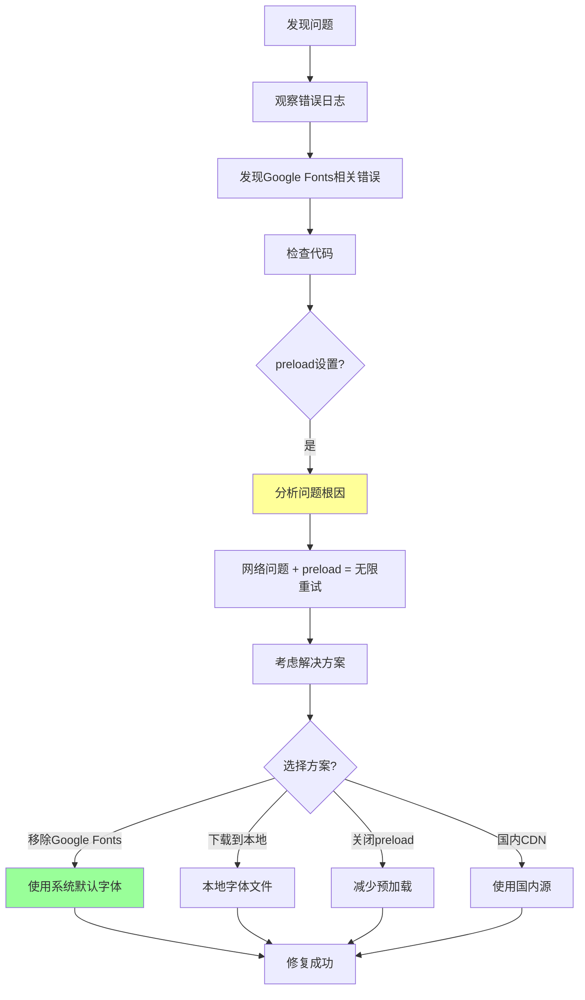

# Google Fonts 性能问题修复

## 问题排查流程图



## 概述

这是一篇真实的技术实践记录！在开发个人知识库网站时，我们遇到了一个严重的 Google Fonts 性能问题，导致开发服务器启动非常慢，页面加载也很慢！这篇文章记录了整个问题的排查和解决过程！

**简单来说：这篇文章告诉你，如果你在中国用 Next.js 和 Google Fonts 遇到网络问题怎么办！**

## 问题现象

问题发生时，有这些现象：

| 现象 | 描述 |
|------|------|
| **开发服务器启动** | 非常非常慢，等半天 |
| **访问页面时** | 后台产生大量错误 |
| **错误信息** | `AbortError: The user aborted a request.` |
| **错误关联** | 与 Google Fonts 下载相关：`Failed to download 'Inter' from Google Fonts` |

## 问题分析过程

我们是这样一步步找到问题的：

### 1. 观察错误日志

首先看终端输出，发现大量重复的错误：

```
Retrying 3/3...
AbortError: The user aborted a request.
⨯ Failed to download `Inter` from Google Fonts. Using fallback font instead.
```

这些日志一直在刷屏，说明有什么东西一直在重试！

### 2. 定位问题代码

检查 `src/app/layout.tsx`，发现使用了 `next/font/google` 加载 `Inter` 字体：

```typescript
import { Inter } from "next/font/google";

const sans = Inter({
  variable: "--font-sans",
  subsets: ["latin"],
  display: "swap",
  preload: true,  // 这里是关键！
  fallback: ["system-ui", "arial", "sans-serif"],
  adjustFontFallback: true,
});
```

注意到 `preload: true` 这个配置！

## 问题根因

找到问题了！有这几个原因：

| 原因 | 说明 |
|------|------|
| **网络问题** | 无法访问 Google Fonts CDN（可能是网络限制或地区问题） |
| **preload 配置** | `preload: true` 强制在服务器启动时预加载字体 |
| **无限重试** | Next.js 在字体加载失败时会不断重试，产生大量错误日志 |
| **性能影响** | 每次页面请求都会尝试重新加载字体，严重拖慢响应速度 |

**总结一下**：
- 在中国访问 Google Fonts 很慢，甚至访问不了
- Next.js 的 `preload: true` 又强制要预加载
- 加载失败 → 重试 → 又失败 → 又重试 → 无限循环
- 结果就是：服务器慢，错误多，体验差

## 解决方案

我们最终选择的方案：**直接移除 Google Fonts 依赖，使用系统默认字体**！

### 修改 `src/app/layout.tsx`

```typescript
// 删除这两行
// import { Inter } from "next/font/google";
// const sans = Inter({ ... });

export default function RootLayout({
  children,
}: Readonly<{
  children: React.ReactNode;
}>) {
  return (
    <html lang="zh-CN">
      {/* 删除 ${sans.variable} 引用 */}
      <body className="antialiased min-h-screen flex flex-col">
        <Header />
        <main className="flex-1">{children}</main>
        <Footer />
      </body>
    </html>
  );
}
```

就这么简单！把 Google Fonts 去掉，用系统默认字体！

### 其他可选方案

如果你还是想用 Google Fonts，也有其他办法：

| 方案 | 说明 | 优缺点 |
|------|------|--------|
| **下载字体到本地** | 把字体文件下载下来，放到项目里 | 可行，但要注意版权 |
| **用国内 CDN** | 用中文字体 CDN 替代 Google Fonts | 可能字体不全 |
| **关闭 preload** | 把 `preload` 设为 `false` | 能缓解，但还是可能有问题 |
| **用系统字体** | 直接用系统默认字体 | 简单、稳定、快！（我们选的） |

## 修复后的效果

修复后，效果立竿见影！

| 指标 | 修复前 | 修复后 |
|------|--------|--------|
| **服务器启动速度** | 超慢，等半天 | 6.8 秒完成启动 |
| **错误日志** | 大量 `AbortError` | 完全消除了 Google Fonts 相关错误 |
| **页面加载** | 慢，有网络问题 | 更快更稳定 |
| **网络依赖** | 依赖 Google CDN | 移除了对外部 CDN 的依赖，适合离线开发 |

**改善太明显了！**

## 经验总结

从这次踩坑中，我们学到了很多！

### 1. 性能优化要点

- **避免外部依赖预加载**：特别是可能无法访问的 CDN 资源
- **检查网络请求**：注意页面加载时的网络请求瀑布图
- **权衡功能与稳定性**：Google Fonts 虽然美观，但系统字体更稳定可靠
- **考虑地区差异**：有些服务在某些地区访问不了

### 2. 调试方法论

- **观察错误日志**：终端和浏览器控制台的错误信息是重要线索
- **逐步注释代码**：通过注释法快速定位问题源
- **对比测试**：有问题和没问题时的表现差异

### 3. Next.js 开发最佳实践

- **字体加载策略**：优先使用系统字体，或提供可靠的字体文件
- **错误边界**：合理使用 try-catch 防止整个应用崩溃
- **网络依赖处理**：考虑网络不可达的情况，提供降级方案

## 相关技术栈

- **框架**：Next.js 14
- **语言**：TypeScript
- **项目**：个人知识库网站

## 相关概念

- [[核心概念/LLM Wiki 基础/LLM Wiki]] - LLM Wiki 模式介绍

## 总结

这次问题告诉我们：有时候，简单的方案反而是最好的！系统字体虽然看起来没有 Google Fonts 那么酷炫，但它稳定、快速、不依赖网络！

**记住：开发时优先考虑稳定性和性能！外观好看很重要，但好用更重要！**
