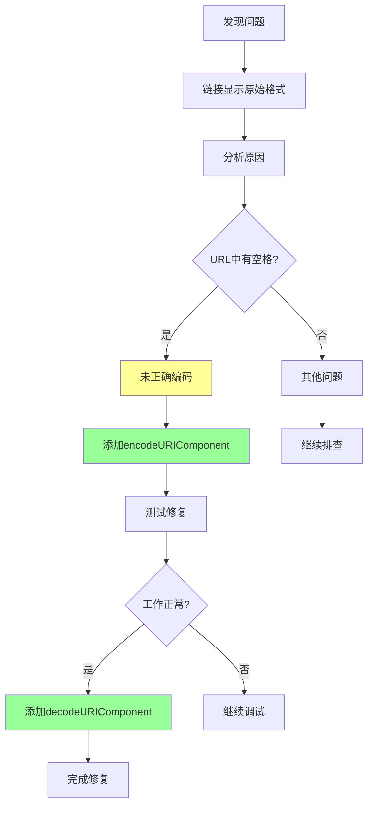
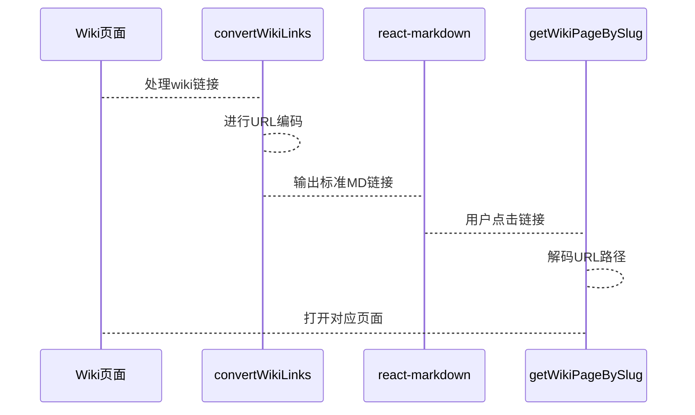

# Markdown 链接编码问题修复

## 问题解决流程图



## 编码与解码流程



## 问题现象

在使用 Next.js + react-markdown 构建个人知识库网站时，发现部分 Markdown 链接无法被正确识别和渲染，表现为：

- 链接显示为 `[链接文本](URL)` 的原始格式，而不是可点击的 HTML 链接
- 只有不带空格的链接（如 `Obsidian`）能正常工作，带空格或特殊字符的链接（如 `LLM Wiki 模式原文`）无法识别

## 问题分析过程

### 1. 初步排查
- 检查 Markdown 渲染器配置，确认已正确配置 remark-gfm 插件
- 检查链接转换逻辑，怀疑是转换过程中的问题

### 2. 添加调试信息
- 在首页添加临时调试区域，显示原始内容和处理后的内容
- 通过对比发现：处理后的链接格式看起来是正确的

### 3. 定位根因
通过调试输出发现：
- **正常链接**：`[Obsidian](/wiki/人物与工具/笔记工具/Obsidian)` - 工作正常
- **问题链接**：`[LLM Wiki 模式原文](/wiki/关于本站/系统介绍/LLM Wiki 模式原文)` - URL 中有空格

**根本原因**：URL 路径中的**空格和特殊字符没有被正确编码**，导致 react-markdown 解析器在遇到空格时就截断了 URL，无法识别完整的链接。

## 问题根因

Markdown 链接格式 `[text](url)` 中，URL 部分如果包含空格或特殊字符，必须进行 URL 编码，否则解析器会在空格处中断识别。

原始代码问题：
```typescript
return `[${displayName}](/wiki/${targetSlug})`;
// 输出：`[LLM Wiki 模式原文](/wiki/关于本站/系统介绍/LLM Wiki 模式原文)`
// 问题：URL 中的空格导致解析失败
```

## 解决方案

### 修复代码

修改 `src/lib/markdown.ts` 中的 `convertWikiLinks` 函数：

```typescript
// 对 URL 路径进行编码，特别是空格和特殊字符
const encodedSlug = targetSlug.split('/').map(encodeURIComponent).join('/');
return `[${displayName}](/wiki/${encodedSlug})`;
```

### 保持解码兼容性

同时确保 `getWikiPageBySlug` 函数能正确解码 URL：

```typescript
export async function getWikiPageBySlug(slug: string, existingSlugMap?: Map<string, string>): Promise<WikiPage | null> {
  // 简单解码 slug
  let decodedSlug = slug;
  try {
    decodedSlug = decodeURIComponent(slug);
  } catch (e) {
    // 如果解码失败，使用原始 slug
  }
  const filePath = path.join(WIKI_DIR, `${decodedSlug}.md`);
  // ...
}
```

## 修复后的效果

修复后：
- 原始链接：`[[关于本站/系统介绍/LLM Wiki 模式原文]]`
- 转换后的链接：`[LLM Wiki 模式原文](/wiki/关于本站/系统介绍/LLM%20Wiki%20模式原文)`
- 空格被编码为 `%20`，其他特殊字符也会被正确编码

所有链接现在都能被 react-markdown 正确识别并渲染为可点击的 HTML 链接。

## 经验总结

### 1. URL 编码的重要性
- 任何包含非 ASCII 字符或特殊字符（如空格、中文、标点等）的 URL 都必须进行编码
- 使用 `encodeURIComponent` 对路径的每一段单独编码，而不是整个路径一起编码

### 2. 调试方法
- 在问题不明确时，添加临时调试输出，对比原始数据和处理后的数据
- 创建最小化的测试用例，快速定位问题

### 3. 双向兼容
- 输出时编码，输入时解码，确保系统两端都能正确处理

### 4. Markdown 解析器特性
- react-markdown 等解析器对 URL 格式有严格要求
- 不要依赖框架"自动处理"，显式进行编码更可靠

## 相关技术栈
- **框架**：Next.js 14
- **Markdown 渲染**：react-markdown + remark-gfm
- **语言**：TypeScript
- **功能**：个人知识库网站

## 相关链接
- [[核心概念/LLM Wiki 基础/LLM Wiki]] - LLM Wiki 模式介绍
