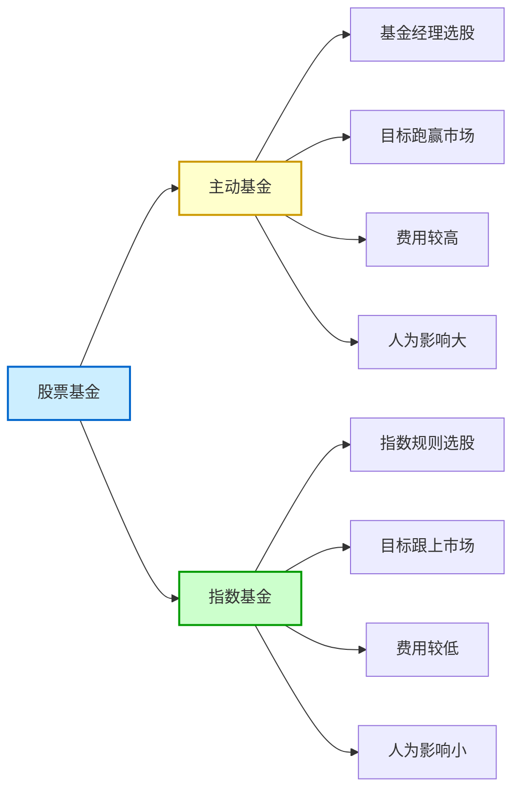
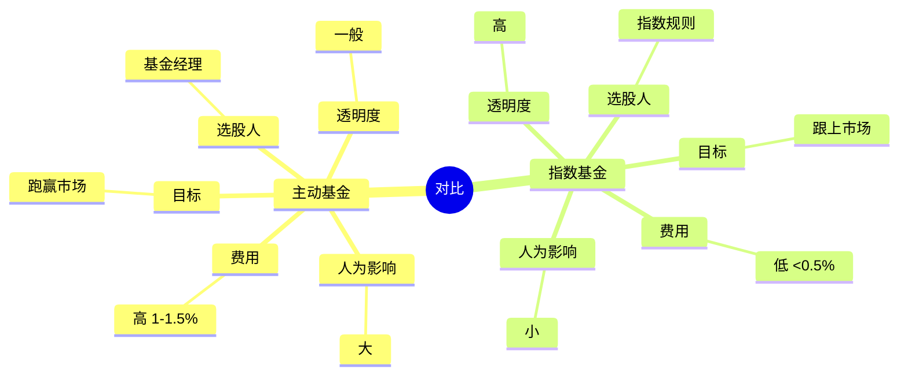
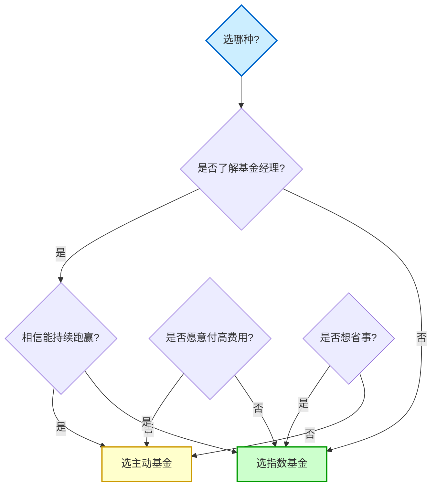

# 主动基金 vs 指数基金

## 概述

股票基金按「挑股票的方式」分为两类：

| 类型 | 谁来选股 | 核心逻辑 |
|------|---------|---------|
| **主动基金** | 基金经理 | 基金经理帮你选股，跑赢市场 |
| **指数基金** | 指数规则 | 复制指数表现，不求跑赢 |

---

## 一、主动基金

### 是什么？

股票由基金经理根据自己的判断挑选的基金。

### 包括哪些？

- 行业基金（如消费、医药、新能源）
- 主题基金（如黄金、碳中和）
- 明星基金经理管理的基金

### 本质

买主动基金 = **赌基金经理的投资水准**

你相信：
- 这个基金经理能跑赢市场
- 虽然你可能根本不认识他

### 真实案例：张坤「坤坤」

**辉煌时期（2020年前后）：**
- 张坤管理的易方达蓝筹精选
- 重仓茅台等白酒股
- 不到两年狂赚192亿
- 成为无数年轻人心中的「坤神」

**后来：**
- 2022-2023年市场大跌
- 前几年赚的钱又还回去了
- 很多高位入场的人被套牢

**教训：**
- 过往成绩不代表未来收益
- 看到辉煌战绩就激情下单
- 很可能买在最高点
- 根本看不到解套的希望

---

## 二、指数基金

### 是什么？

不需要基金经理选股，直接复制某个指数的基金。

### 什么是指数？

指数是一套固定的股票组合：

| 指数 | 包含什么 | 代表什么 |
|------|---------|---------|
| **沪深300** | 沪深两市市值前300的股票 | 中国股市整体 |
| **标普500** | 美国市值前500的公司 | 美国股市整体 |
| **纳斯达克100** | 美国最大100家科技公司 | 美国科技股 |

### 指数基金怎么运作？

- 指数基金的「篮子」里装的就是这个指数的成分股
- 不需要基金经理特意挑选
- 涨跌主要跟市场整体走势相关

### 巴菲特的赌局

最著名的例子是2007年巴菲特发起的挑战：

| 赌注方 | 选择 | 结果 |
|-------|------|------|
| **巴菲特** | 标普500指数基金 | 年化7.1% |
| **华尔街基金经理** | 一组主动基金组合 | 年化2.2% |

**结论：** 从长期来看，指数基金可能比绝大多数基金经理都更会赚钱！

---

## 对比分析

### 主动基金 vs 指数基金

| 对比维度 | 主动基金 | 指数基金 |
|---------|---------|---------|
| **选股人** | 基金经理 | 指数规则 |
| **费用** | 高（管理费1-1.5%） | 低（管理费通常<0.5%） |
| **目标** | 跑赢市场 | 跟上市场 |
| **人为影响** | 大（看基金经理能力） | 小（规则固定） |
| **透明度** | 一般（季度才公布持仓） | 高（指数成分股公开） |

### 该选哪个？

**选指数基金，如果你：**
- 不想花时间研究基金经理
- 相信市场长期向上
- 想省钱（低费率）

**选主动基金，如果你：**
- 非常了解某个基金经理
- 相信他能持续跑赢市场
- 愿意为此付更高的费用

---

## 指数基金也不是稳赚！

**真实案例：**
- 某人2020年高位开始买沪深300指数基金
- 不断补仓
- 至今（假设）还亏损10%
- 回本遥遥无期

**结论：**
- 指数基金长期可能更好
- 但不代表买了就能赚钱
- 买在高点一样被套
- 所以定投可能是更好的方式（参考[[基金定投]]）

---

## 相关概念

- [[基金分类]] - 先搞懂基金有哪些类型
- [[基金定投]] - 投资指数基金的常用策略
- [[基金费率]] - 主动基金和指数基金的费用差异
