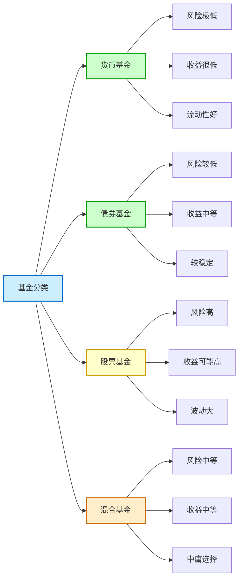
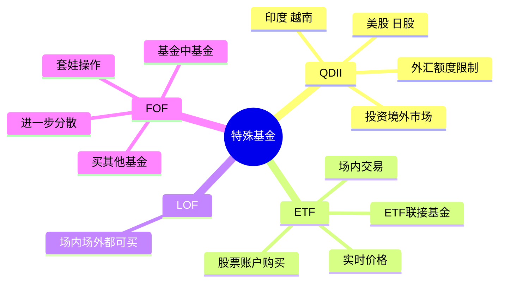
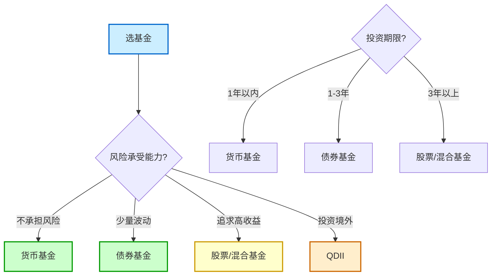

# 基金分类

## 概述

按照「篮子里装的东西」不同，基金主要分为四大类：

| 基金类型 | 主要投资 | 风险 | 收益 |
|---------|---------|------|------|
| **货币基金** | 货币市场工具 | 极低 | 很低 |
| **债券基金** | 债券 | 较低 | 较低 |
| **股票基金** | 股票 | 高 | 高 |
| **混合基金** | 股票+债券+其他 | 中等 | 中等 |

---

## 一、货币基金

### 是什么？

货币基金主要投资于货币市场工具，风险极低。

### 你可能已经在用了！

- 余额宝
- 零钱通
- 各种「宝」类产品

本质上都是货币基金！

### 特点

| 特点 | 说明 |
|------|------|
| **风险** | 极低，几乎不会亏本金 |
| **收益** | 年化不到2% |
| **流动性** | 随时可取，像活期存款 |

### 收益举例

买100万货币基金，一天收益：
- 大约30-40块钱
- 估计你看不上这点小钱

### 适合场景

- 放零花钱
- 应急资金
- 短期不用的闲钱

---

## 二、债券基金

### 是什么？

主要投资于债券的基金。

### 特点

| 特点 | 说明 |
|------|------|
| **风险** | 较低，但不是零风险 |
| **收益** | 年化约4%左右 |
| **安全性** | 通常比较保险 |

### 不是绝对安全！

真实案例：
- 某基金2018年两次踩雷
- 买到了爆雷企业的债券
- 6个月内跌了14.22%

### 总结

货币基金和债券基金：
- 大概率能保本
- 赚点零花钱
- 但别指望靠它们暴富

---

## 三、股票基金（重点！）

### 是什么？

主要投资于股票的基金。

### 特点

| 特点 | 说明 |
|------|------|
| **风险** | 高，波动大 |
| **收益** | 可能很高，也可能亏很多 |
| **体验** | 大起大落，非常刺激 |

这是真正能让你「为知识付费、亏出心得」的类型！

### 股票基金的细分

股票基金还可以按「挑股票的方式」继续分：

| 类型 | 谁来选股 | 特点 |
|------|---------|------|
| **主动基金** | 基金经理 | 靠基金经理的能力 |
| **指数基金** | 指数规则 | 不需要基金经理选股 |

详见：[[主动基金 vs 指数基金]]

---

## 四、混合基金

### 是什么？

既买股票，又买债券，还可能买其他资产的基金。

### 特点

- 比纯股票基金稳健一点
- 比纯债券基金收益潜力高一点
- 「中庸」选择

---

## 特殊类型基金

除了上面四大类，还有一些带英文缩写的基金：

### QDII

**是什么？** 可以投资境外市场的基金。

**能投什么？**
- 美国股市
- 日本股市
- 印度股市
- 越南股市
- 等等

**特点：**
- 让你「跨国亏钱」
- 沉浸式体验外国人民的水深火热
- 很多有单日限购额度（外汇额度限制）

### ETF

**全称：** 交易所交易基金（Exchange Traded Fund）

**特点：**
- 属于「场内基金」
- 需要开股票账户才能买
- 交易更及时
- 价格跟股票一样实时变化

**小常识：**
- 不开股票账户也能买「ETF联接基金」
- 这是场外产品，跟普通基金一样
- 只是投资目标跟场内ETF挂钩

### LOF

可以场内场外都买的基金。

### FOF

**全称：** 基金中的基金（Fund of Funds）

**是什么？**
- 一个更大的篮子
- 里面装了很多只基金
- 套娃式操作

**特点：**
- 理论上进一步分散风险
- 当然还是有风险
- 甚至可能比买单一基金亏更多

---

## 怎么选？

### 看你的风险承受能力

| 你的情况 | 建议 |
|---------|------|
| **不想承担任何风险** | 货币基金 |
| **能接受少量波动** | 债券基金 |
| **追求高收益，能接受亏损** | 股票基金/混合基金 |
| **想投资海外** | QDII |

### 看你的投资期限

| 期限 | 建议 |
|------|------|
| **1年以内** | 货币基金 |
| **1-3年** | 债券基金 |
| **3年以上** | 股票基金/混合基金 |

---

## 相关概念

- [[基金入门]] - 基金是什么
- [[主动基金 vs 指数基金]] - 股票基金的两种选择
- [[基金费率]] - 买基金的成本
