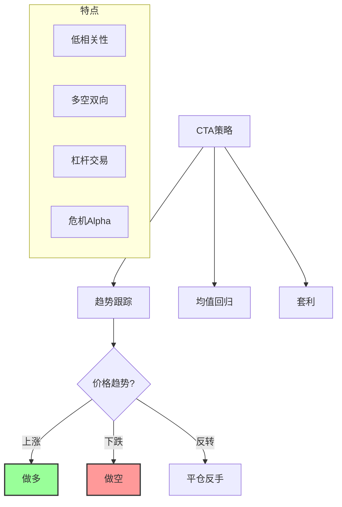
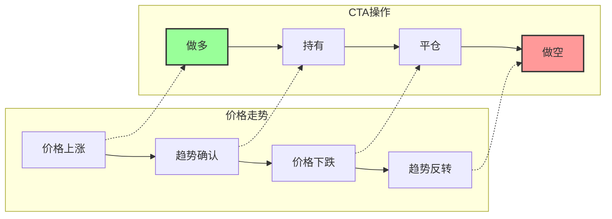

# CTA策略

## 概述

CTA（Commodity Trading Advisor，商品交易顾问）策略是一种主要投资于期货等衍生品的投资策略！它是资产配置中的重要组成部分，因为它和股市等传统资产的相关性很低！

**简单来说：CTA策略 = 做期货、期权等衍生品，趋势跟踪为主，和股市经常涨跌互现！**

## 什么是 CTA策略？

CTA 策略的特点：

- **主要投资品种**：商品期货、股指期货、债券期货、外汇期货等
- **主要策略类型**：趋势跟踪（Trend Following）为主
- **谁在做**：由专业的商品交易顾问（CTA）来管理
- **常见形式**：私募基金、资管产品等

### 经典比喻

想象一下：
- 股票多头 = 只在牛市赚钱，熊市就亏
- CTA策略 = 不管牛市熊市，只要有大趋势，都能赚钱
- 两者搭配起来，组合更稳！

## CTA策略的特点

CTA策略有几个鲜明的特点：

| 特点 | 说明 |
|------|------|
| **与股票指数相关性很低** | 在示例中，CTA策略与中证800的相关性甚至为负 |
| **多空双向交易** | 可以做多（看涨），也可以做空（看跌） |
| **杠杆交易** | 期货本身有杠杆，收益和波动都会放大 |
| **覆盖面广** | 可以交易商品、股指、债券、外汇等很多品种 |
| **趋势跟踪为主** | 很多CTA策略都是"追涨杀跌"，抓住大趋势 |

## 为什么 CTA策略和股市低相关？

为什么CTA策略能和传统资产低相关？

### 1. 投资品种不同

- 股票市场：投资股票
- CTA策略：投资商品期货、股指期货、债券期货等
- 涨跌逻辑不完全一样

### 2. 可以做空

- 股票多头：只有涨了才能赚钱
- CTA策略：跌了也能通过做空赚钱
- 所以股市大跌时，CTA策略有时候反而在赚钱

### 3. 交易逻辑不同

- 股票投资：看公司基本面、估值等
- CTA策略：主要看价格趋势、技术指标
- 赚钱的逻辑不一样

## 在资产配置中的作用

由于与传统资产的低相关性，CTA策略是资产配置的重要组成部分！

### 它能帮我们做什么？

| 作用 | 说明 |
|------|------|
| **降低整体组合波动** | 涨跌不同步，组合更稳 |
| **危机保护** | 股市大跌时，CTA策略可能反而在赚钱 |
| **多样化收益来源** | 不只是靠股票赚钱 |

### 举个简单例子

假设你的组合是：
- 50% 股票
- 50% CTA策略

如果股市大跌 30%：
- 股票部分亏了 15%
- 但 CTA策略可能赚了 10%
- 整个组合只亏了 5%
- 比全仓股票好太多！

## CTA策略的常见类型

CTA策略有几种常见类型：

| 类型 | 特点 |
|------|------|
| **趋势跟踪策略** | 最常见，"追涨杀跌"，抓住大趋势 |
| **均值回归策略** | 相反，认为涨多了会跌，跌多了会涨 |
| **套利策略** | 寻找不同品种之间的价差机会 |
| **多策略组合** | 同时用多种策略，更稳健 |

## CTA策略的优缺点

### 优点

| 优点 | 说明 |
|------|------|
| **低相关性** | 与股票等传统资产相关性低 |
| **多空都能赚** | 有趋势就能赚，不管涨跌 |
| **衍生品丰富** | 能投资很多品种 |
| **危机Alpha** | 市场大跌时，可能反而表现好 |

### 缺点

| 缺点 | 说明 |
|------|------|
| **波动大** | 有杠杆，波动可能很大 |
| **震荡市亏钱** | 没有趋势、来回震荡时，容易亏钱 |
| **手续费高** | 交易频繁，手续费成本不低 |
| **有门槛** | 很多CTA产品对投资者有门槛 |

## 趋势跟踪策略是怎么赚钱的？

趋势跟踪是最常见的CTA策略，它的逻辑很简单：

1. **价格上涨** → 做多（买入）
2. **价格下跌** → 做空（卖出）
3. **趋势反转** → 平仓，反手

### 经典例子

比如原油价格：
- 从 50 美元涨到 100 美元 → 趋势跟踪策略做多，赚 50 美元
- 从 100 美元跌回 60 美元 → 趋势跟踪策略反手做空，又赚 40 美元
- 来回都赚！

## CTA策略结构图

## 趋势跟踪流程图

## 个人投资者怎么参与？

普通个人投资者想参与CTA策略，有几种方式：

| 方式 | 说明 |
|------|------|
| **买CTA私募基金** | 找专业的CTA基金，但通常有门槛 |
| **买CTA资管产品** | 有些公募或券商资管也有 |
| **自己做期货** | 自己直接做，但难度高、风险大 |
| **买相关指数产品** | 有些指数挂钩CTA策略 |

## 相关概念

- [[资产配置]]
- [[市场中性策略]]
- [[全天候策略]]

## 相关文章

- [深度好文：资产配置的基本原理](../投资理论/深度好文：资产配置的基本原理.md)

## 总结

CTA策略是一种很有特色的投资策略！它和传统资产低相关，能很好地分散风险！但要注意它的高波动，建议只拿出一小部分钱配置！

**记住：配置CTA策略，不是为了暴富，而是为了让整体组合更稳健！**
