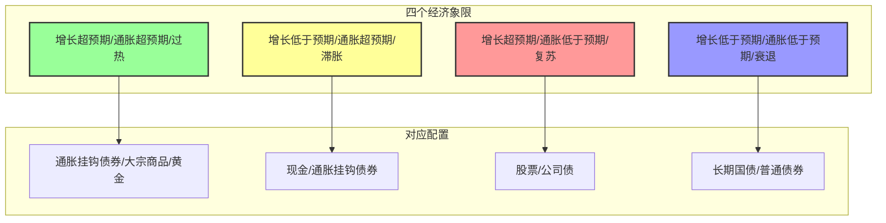
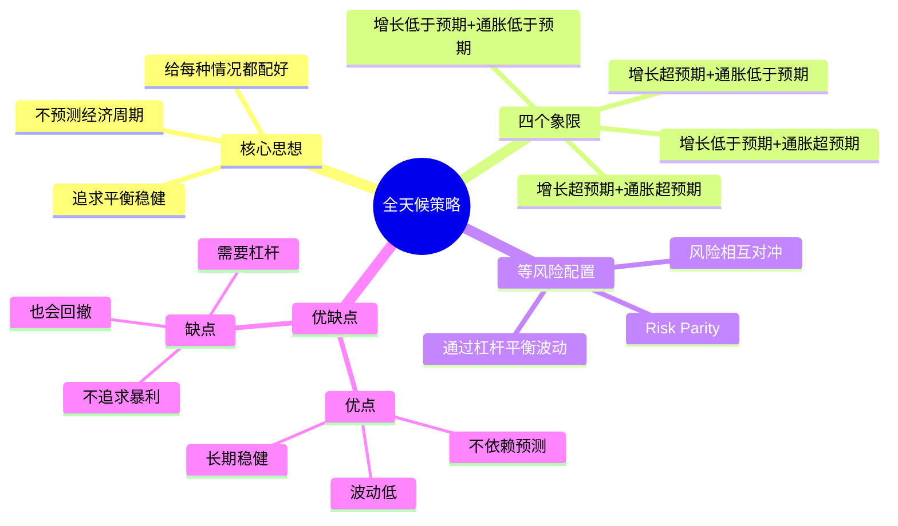

# 全天候策略

## 概述

全天候策略（All Weather Strategy）是由全球最大的对冲基金——桥水基金（Bridgewater Associates）的创始人瑞·达利欧（Ray Dalio）提出的资产配置策略！它是一个非常经典的策略，与 [[美林时钟]] 有千丝万缕的关系，但又有所不同！

**简单来说：全天候策略 = 放弃预测，配置各种情况，让组合在任何经济环境下都能表现不错！**

## 什么是全天候策略？

美林时钟是试图预测经济周期，然后配置相应的资产。而全天候策略的思路完全不同：

- **不预测经济周期**：因为根本没人能持续准确预测
- **给每种情况都配好**：不管经济怎么样，我的组合里都有能表现好的资产
- **追求平衡**：不是追求某一年赚大钱，而是追求每一年都表现得还可以

### 经典比喻

想象一下：
- 美林时钟 = 看天气预报，今天下雨就带伞，明天晴天就戴墨镜
- 全天候策略 = 不管天气预报怎么说，包里都带上伞、墨镜、外套、防晒霜，什么天气都不怕

## 核心思想：四个经济象限

全天候策略不是按经济周期划分，而是将经济状态划分为四个象限，取决于两个因素：

| 因素 | 变化方向 |
|------|----------|
| **经济增长** | 超预期 / 低于预期 |
| **通货膨胀** | 超预期 / 低于预期 |

这两个因素组合，就形成了四个象限：

1. **增长超预期 + 通胀超预期** → 经济过热
2. **增长低于预期 + 通胀超预期** → 滞胀
3. **增长超预期 + 通胀低于预期** → 复苏
4. **增长低于预期 + 通胀低于预期** → 衰退

全天候策略的核心是：**给这四个象限都配上相应的资产，不管未来是哪个象限，组合都能受益！**

## 对美林时钟的改进

全天候策略相比 [[美林时钟]]，有两个关键的改进：

### 1. 放弃周期判断

全天候策略的第一个重大改进是：**不预测经济运行处于哪个周期，也不预测未来会到哪个周期**

为什么？
- 因为没有人能够以较高胜率做好这个工作
- 经济学家的预测经常错
- 与其预测，不如准备好所有情况

### 2. 等风险配置（Risk Parity）

全天候策略的第二个核心创新是 **等风险配置**（Risk Parity），而不是等金额配置。

这是什么意思？

- 传统资产配置：比如 60% 股票 + 40% 债券
  - 但股票的波动率比债券高很多
  - 结果是：组合的风险 90% 以上都来自股票
  - 股票一跌，组合就跟着大跌

- 等风险配置：让每个资产对组合风险的贡献差不多
  - 通过杠杆把低波动资产（如债券）的波动提到和高波动资产（如股票）差不多
  - 然后把资金等风险地配置在四个象限里

## 风险对冲原理

为什么要提高波动率？为了更好地对冲！

### 为什么需要杠杆？

举个例子：
- 股票和债券是低相关的（经常一个涨，一个跌）
- 但股票的波动是债券的 5 倍
- 假设股票跌了 10%
- 想要债券的涨幅来对冲掉很难，因为债券波动太小了
- 但如果给债券加 5 倍杠杆
- 债券只需要涨 2%，在一个 50% vs 50% 的配置中就能完全对冲股票的下跌

### 核心逻辑

通过杠杆让各类资产的波动率差不多，然后利用它们之间的低相关性，让风险相互对冲！

## 底层假设

全天候策略有一个重要的底层假设：

> **在长期，风险资产的收益率高于无风险资产。**

这是什么意思？

- 短期看：风险对冲了，好像收益也对冲了
- 长期看：风险资产的收益率会比无风险资产高
- 加了杠杆之后，这个收益会被放大

## 全天候策略的典型配置

桥水基金的全天候策略具体配置（类似的思路）：

| 经济环境 | 主要资产 | 配置比例 |
|----------|----------|----------|
| 通胀上升 | 通胀挂钩债券、大宗商品、黄金 | 25% |
| 通胀下降 | 普通债券 | 25% |
| 增长上升 | 股票、公司债 | 25% |
| 增长下降 | 长期国债、普通债券 | 25% |

每个部分都是 25% 的**风险贡献**，而不是 25% 的资金！

## 全天候策略四象限图

## 全天候策略思维导图

## 全天候策略的优缺点

### 优点

| 优点 | 说明 |
|------|------|
| **不依赖预测** | 不需要猜经济怎么走 |
| **长期稳健** | 各种环境下都表现不错 |
| **波动率低** | 因为配置均衡，波动小 |
| **容易执行** | 不需要频繁调仓 |

### 缺点

| 缺点 | 说明 |
|------|------|
| **需要杠杆** | 个人投资者可能不太方便加杠杆 |
| **不追求暴利** | 牛市里可能跑输满仓股票 |
| **也会回撤** | 不是永远不跌，只是跌得少一些 |

## 与美林时钟的对比

| 方面 | 美林时钟 | 全天候策略 |
|------|----------|------------|
| **是否需要预测** | 是 | 否 |
| **配置思路** | 抓住周期，集中配置 | 放弃预测，分散配置 |
| **表现特征** | 好的时候很好，坏的时候可能坏 | 各种时候都还可以 |
| **操作难度** | 需要频繁调仓，判断周期 | 相对简单，不怎么需要动 |

## 个人投资者怎么用？

对于普通个人投资者，完全照搬全天候策略可能比较难（因为需要杠杆），但可以学习它的思路：

1. **分散配置**：不要把钱都押在一类资产上
2. **考虑相关性**：配置一些低相关的资产，分散风险
3. **不要频繁预测**：与其猜市场，不如做好配置，长期持有
4. **可以简化版**：比如 50% 宽基指数 + 50% 长期国债，定期再平衡

## 相关概念

- [[资产配置]]
- [[美林时钟]]
- [[基金定投]]

## 相关文章

- [深度好文：资产配置的基本原理](../投资理论/深度好文：资产配置的基本原理.md)

## 总结

全天候策略是一个非常有智慧的资产配置策略！它放弃了预测这个不可能的任务，转而追求在任何环境下都能表现不错，这种思路值得我们学习！

**记住：与其预测未来，不如为各种情况做好准备！**
