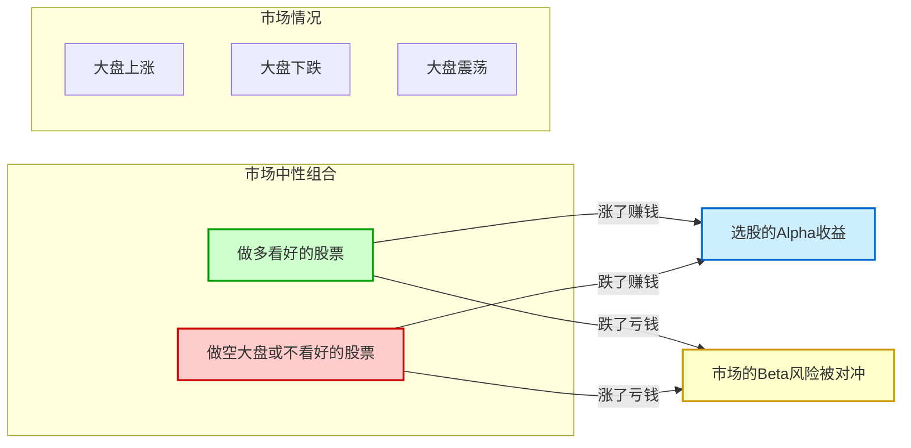
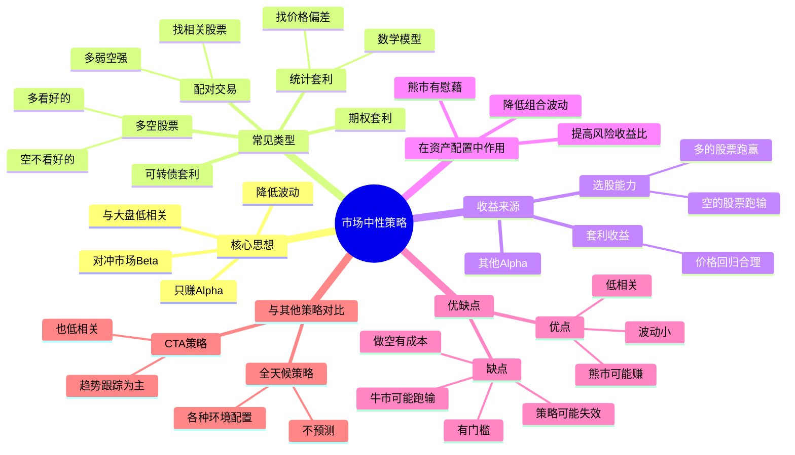

# 市场中性策略

## 概述

市场中性策略（Market Neutral Strategy）是一种试图对冲掉市场整体风险，只赚选股（或其他策略）钱的投资策略！它也是资产配置中的好工具，因为它和股市整体涨跌几乎没关系！

**简单来说：市场中性策略 = 买一些股票的同时，做空另一些股票（或股指），这样大盘涨跌都不太影响我，我只赚我选的股票比别人好的钱！**

## 什么是市场中性策略？

市场中性策略的核心思想：

- **对冲掉市场风险**（Beta）
- **只赚选股的钱**（Alpha）

### 举个简单例子

假设你：
1. **做多**：你认为会跑赢大盘的股票 A，买 100 万元
2. **做空**：沪深 300 股指期货，卖 100 万元

这会发生什么？
- **如果大盘涨了 10%**：
  - 股票 A 涨了 15% → 赚 15 万
  - 股指期货亏了 10% → 亏 10 万
  - **净赚 5 万**
- **如果大盘跌了 10%**：
  - 股票 A 只跌了 5% → 亏 5 万
  - 股指期货赚了 10% → 赚 10 万
  - **净赚 5 万**

不管大盘涨跌，只要你的股票 A 比大盘多涨 5%（或少跌 5%），你就能赚 5 万！这就是市场中性策略！

### 经典比喻

想象一下：
- 普通炒股 = 划船，水流（大盘）往东你也只能往东，水流往西你也只能往西
- 市场中性策略 = 装了马达的船，不管水流（大盘）往哪，你都能按自己的方向走！

## 市场中性策略的特点

市场中性策略有几个鲜明的特点：

| 特点 | 说明 |
|------|------|
| **与股票指数相关性很低** | 在示例中，CTA策略与中证800的相关性甚至为负 |
| **收益相对稳定** | 波动比纯股票低很多 |
| **需要同时做多和做空** | 有多头，也有空头 |
| **赚的是Alpha，不是Beta** | 赚选股的钱，不赚大盘的钱 |

### 市场中性策略图解

### 市场中性策略思维导图

## 市场中性策略是怎么做的？

常见的市场中性策略有几种做法：

### 1. 多空股票策略

最常见的一种：
- **做多**：看好的股票
- **做空**：不看好的股票（或股指）
- **保持敞口中性**：多头市值 ≈ 空头市值

### 2. 配对交易

找两个相关性很高的股票（比如两家银行股）：
- 当股票 A 比股票 B 涨得多时 → 做空 A，做多 B
- 当它们的价格回到正常关系时 → 平仓赚钱

### 3. 其他类型

还有：
- **统计套利**：用数学模型找机会
- **可转债套利**：可转债和股票之间的套利
- **期权套利**：用期权做套利
- 等等...

## 市场中性策略能赚什么钱？

市场中性策略主要赚这几类钱：

| 钱的类型 | 说明 |
|----------|------|
| **选股能力的钱** | 你选的股票比别人好，多涨或少跌 |
| **套利的钱** | 价格不合理，回归合理时的利润 |
| **其他Alpha** | 其他超越市场的能力 |

**关键是：不赚大盘涨的钱！**

## 在资产配置中的作用

由于与传统资产的低相关性，市场中性策略是资产配置的重要组成部分！

### 它能帮我们做什么？

| 作用 | 说明 |
|------|------|
| **降低整体组合波动** | 大盘跌的时候它可能还在赚钱 |
| **熊市里的慰藉** | 即使是熊市，它也有可能赚钱 |
| **提高组合风险收益比** | 加上它，组合可能更稳 |

### 简单示例

假设你的组合是：
- 50% 纯股票
- 50% 市场中性策略

如果股市大跌 30%：
- 纯股票部分亏了 15%
- 但市场中性策略赚了 5%
- 整个组合只亏了 10%
- 比全仓股票亏的少多了！

## 市场中性策略的优缺点

### 优点

| 优点 | 说明 |
|------|------|
| **波动小** | 不怎么受大盘影响 |
| **低相关性** | 和大盘涨跌关系不大 |
| **熊市有希望** | 熊市也可能赚钱 |
| **风险收益比好** | 每单位风险的收益可能不错 |

### 缺点

| 缺点 | 说明 |
|------|------|
| **牛市可能跑输** | 别人赚大钱时，你赚小钱 |
| **做空有成本** | 做空股票需要成本，有磨损 |
| **策略容易失效** | 用的人多了，策略可能就不灵了 |
| **有门槛** | 做空不是那么容易的 |

## 市场中性策略 vs CTA策略

市场中性策略和 [[CTA策略]] 都是低相关策略，但它们不一样：

| 方面 | 市场中性策略 | CTA策略 |
|------|--------------|---------|
| **主要盈利来源** | 选股、套利 | 趋势跟踪 |
| **与市场相关性** | 很低 | 很低 |
| **波动率** | 中等 | 可能较高 |
| **震荡市表现** | 可能还不错 | 可能会亏 |
| **大趋势市表现** | 不一定 | 可能很好 |

## 个人投资者怎么参与？

普通个人投资者想参与市场中性策略，有几种方式：

| 方式 | 说明 |
|------|------|
| **买中性策略私募基金** | 找专业的中性策略基金 |
| **买中性策略资管产品** | 券商、基金公司的资管产品 |
| **自己做** | 难度很高，需要懂做空 |

## 相关概念

- [[资产配置]]
- [[CTA策略]]
- [[全天候策略]]

## 相关文章

- [深度好文：资产配置的基本原理](../投资理论/深度好文：资产配置的基本原理.md)

## 总结

市场中性策略是一种很稳健的投资策略！它试图不赚大盘的钱，只赚自己能力的钱！和股票等传统资产低相关，是资产配置的好工具！

**记住：市场中性策略不是来帮你暴富的，是来帮你的组合更稳健的！**
