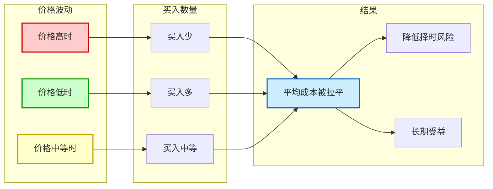
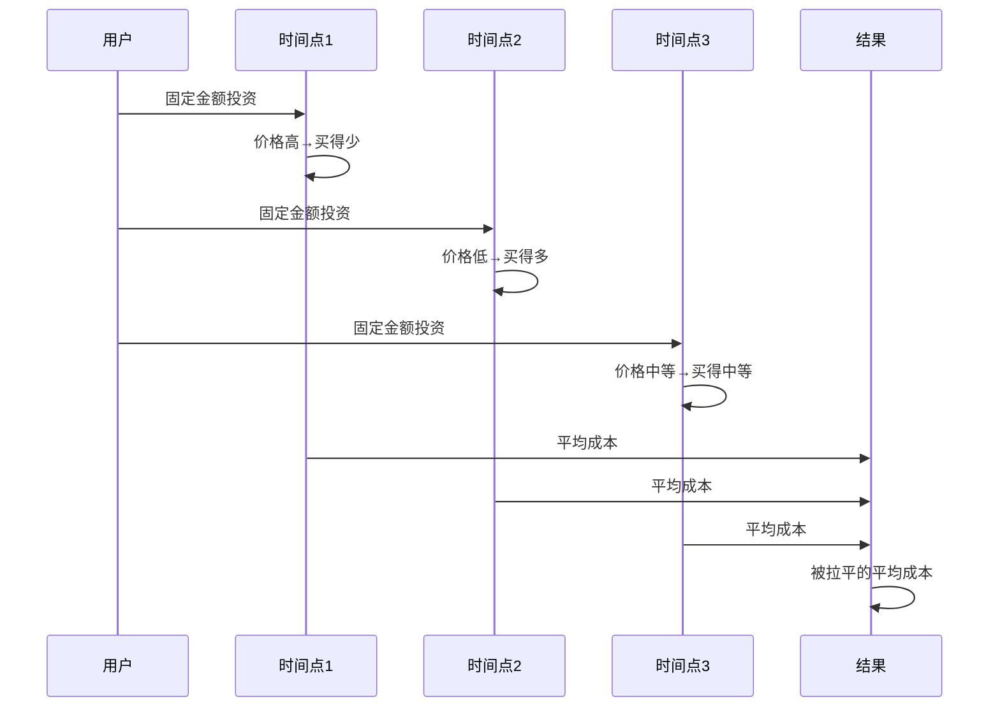
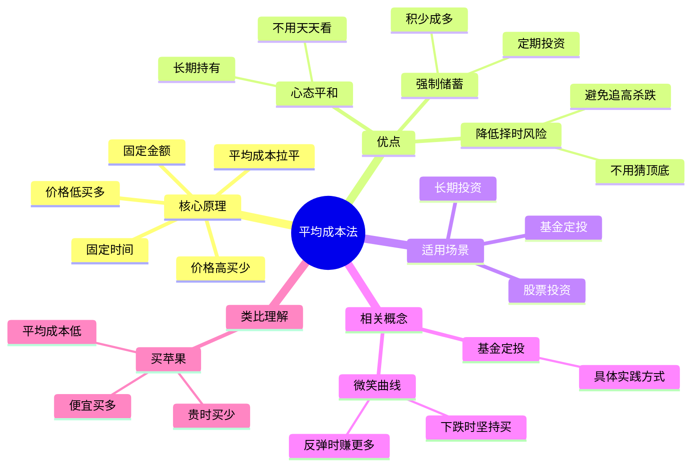

# 平均成本法

平均成本法（Dollar-Cost Averaging, DCA）是基金定投背后的核心逻辑。

## 核心概念

以固定的时间、固定的金额投资，当资产价格上涨时，买到的单位数较少；当价格下跌时，买到的单位数较多。长期下来，平均持有成本会被「拉平」。

### 平均成本法图解

### 平均成本法流程图解

### 平均成本法思维导图

## 类比理解

就像在菜市场买苹果：
- 本月价格10元/颗，100元买10颗
- 下月价格20元/颗，100元买5颗
- 再下月价格5元/颗，100元买20颗

总共300元买了35颗，平均成本约8.57元/颗，拉平了价格波动。

## 相关概念

- [[基金定投]]
- [[微笑曲线]]

## 相关文章

- [基金定投技巧终极指南-从入门到进阶-5大策略捕捉微笑曲线稳定增值](../投资策略/基金定投技巧终极指南-从入门到进阶-5大策略捕捉微笑曲线稳定增值.md)

