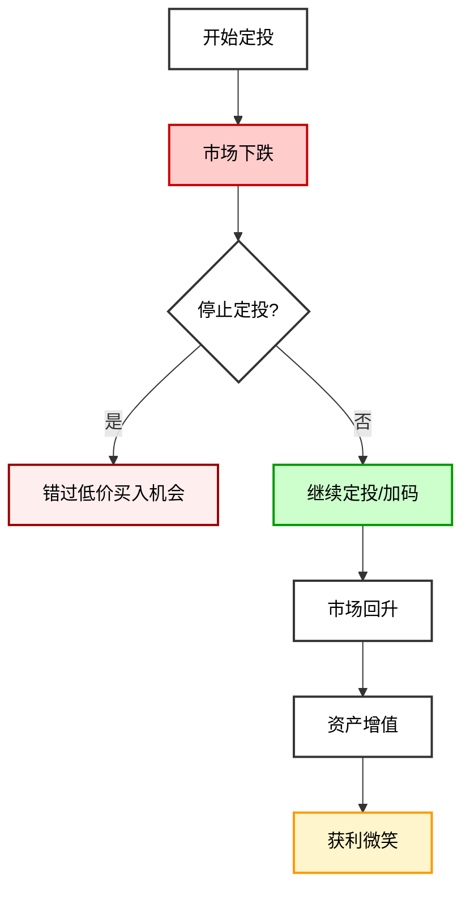
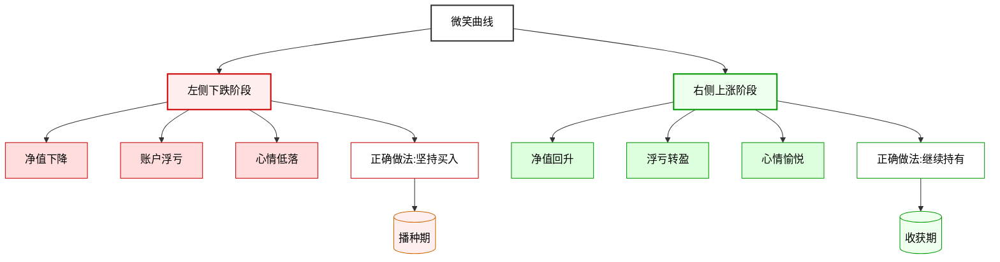
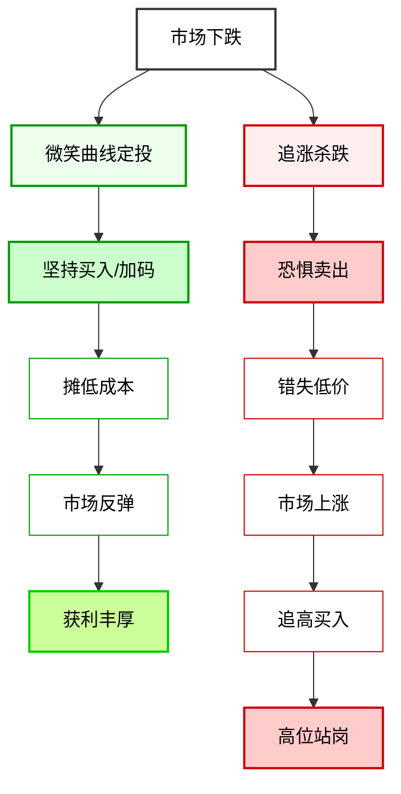

# 微笑曲线

## 概述

「微笑曲线」是基金定投最迷人的地方！它描述的是市场先下跌后回升的「U」型过程！如果你能坚持定投，微笑曲线会让你笑得很开心！

**简单来说：微笑曲线 = 市场先跌后涨，你在下跌时一直买，反弹时赚大钱！**

## 什么是微笑曲线？

微笑曲线是基金定投中一个非常经典的现象：

1. **开始定投**：你在某个位置开始定投
2. **市场下跌**：市场经历一段时间下跌（你可能会慌，想停止）
3. **继续定投**：你克服恐惧，继续扣款，甚至可能加码
4. **市场回升**：市场慢慢回升，反弹
5. **微笑收获**：当市场回到你的起点时，你已经赚了不少钱了！

### 经典比喻

想象一下：
- 你想攒一堆苹果
- 市场跌了 = 苹果便宜了 → 你买更多
- 市场涨了 = 苹果变贵了 → 你买的那些便宜苹果就值钱了
- 这就是微笑曲线！

### 流程图解

## 用数字理解微笑曲线

让我们用一个具体的例子来说明微笑曲线是怎么赚钱的！

### 假设

- **开始时间**：基金净值是 1 元
- **每月定投**：1000 元
- **市场走势**：先跌后涨，回到起点

### 具体过程

| 月份 | 净值 | 投金额 | 买到份额 | 累计份额 | 累计投入 | 资产市值 |
|------|------|--------|----------|----------|----------|----------|
| 1 | 1.00 | 1000 | 1000 | 1000 | 1000 | 1000 |
| 2 | 0.90 | 1000 | 1111 | 2111 | 2000 | 1900 |
| 3 | 0.80 | 1000 | 1250 | 3361 | 3000 | 2689 |
| 4 | 0.70 | 1000 | 1429 | 4790 | 4000 | 3353 |
| 5 | 0.80 | 1000 | 1250 | 6040 | 5000 | 4832 |
| 6 | 0.90 | 1000 | 1111 | 7151 | 6000 | 6436 |
| 7 | 1.00 | 1000 | 1000 | 8151 | 7000 | 8151 |

### 结果

- **累计投入**：7000 元
- **资产市值**：8151 元
- **盈利**：1151 元
- **收益率**：约 16.4%

**关键点**：市场回到了起点，一分没涨，但你却赚了 16%！这就是微笑曲线的魔力！

## 微笑曲线为什么能赚钱？

微笑曲线背后的逻辑就是 [[平均成本法]]：

- **市场下跌时**：同样的金额，能买更多份额，摊低成本
- **市场回升时**：你有大量便宜时买的份额，一涨就赚大钱！

## 操作要点

想抓住微笑曲线，记住这几点：

### 1. 市场下跌时不要恐惧停止扣款

这是很多人最容易犯的错！

- 市场跌了，账户浮亏 → 害怕，停止定投
- 但这正是最便宜的时候，应该买更多！
- 停止了，前面摊的低成本就白费了！

### 2. 更积极的做法：单笔加码

如果市场大幅回档（例如下跌 15% 或 20%）：
- 别慌，应该勇敢！
- 可以单笔加码一点
- 这样可以更快降低平均成本
- 未来市场反弹时获利会更丰厚！

### 3. 耐心，耐心，耐心

微笑曲线不是几天能完成的！
- 可能需要几个月，甚至一两年
- 别着急，坚持定投
- 时间够长，微笑曲线才会出现！

## 微笑曲线的两个阶段

微笑曲线可以分成两个阶段：

### 1. 左侧下跌（很痛苦）

- 看着账户亏钱
- 心情可能不好
- 怀疑自己是不是错了
- **但这正是播种的时候！**

### 2. 右侧上涨（很开心）

- 市场反弹
- 账户从亏变赚
- 赚得越来越多
- **这是收获的时候！**

**成功的关键**：熬过左侧，才能等到右侧！

### 阶段对比图解

## 微笑曲线 vs 追涨杀跌

我们对比一下两种做法：

| 做法 | 市场下跌时 | 市场上涨时 | 结果 |
|------|------------|------------|------|
| **微笑曲线定投** | 坚持买，甚至加码 | 继续买，收获利润 | 大概率赚 |
| **追涨杀跌** | 恐惧，卖出停止 | 追高，杀入 | 大概率亏 |

### 策略对比图解

## 常见问题

### Q1: 如果市场一直不涨怎么办？

如果市场一直不涨：
- 那你会一直以便宜价格买
- 但要注意：是买指数基金这种长期向上的品种
- 只要经济还在发展，长期看市场还是会向上的
- 而且你还有分红再投入！

### Q2: 我能提前知道微笑曲线什么时候来吗？

很遗憾，不能！
- 没人能预测市场什么时候跌到底
- 也没人能预测什么时候反弹
- 但只要你坚持定投
- 总会等来微笑曲线的！

### Q3: 有没有「悲伤曲线」？

如果市场一直跌，那不回头怎么办？
- 所以我们要选长期向上的品种（宽基指数等）
- 不要选可能归零的单个股票
- 这样微笑曲线才会有意义！

## 相关概念

- [[基金定投]]
- [[平均成本法]]

## 相关文章

- [基金定投技巧终极指南-从入门到进阶-5大策略捕捉微笑曲线稳定增值](../投资策略/基金定投技巧终极指南-从入门到进阶-5大策略捕捉微笑曲线稳定增值.md)

## 总结

微笑曲线是基金定投最吸引人的地方！它让你不需要择时，不需要预测，只要坚持，就能赚到钱！

**记住：下跌时的坚持，才是微笑曲线的关键！在别人恐惧的时候，你要贪婪一点！**
