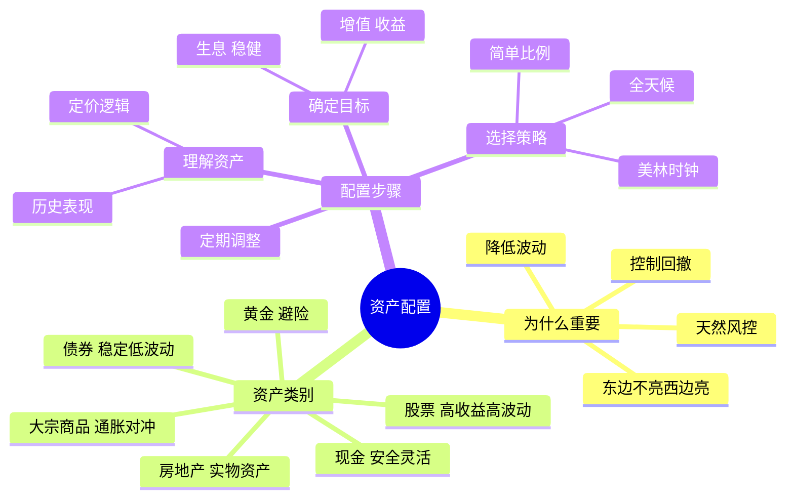

# 资产配置

## 概述

资产配置是指将资金在不同资产类别之间进行分配的过程，是投资理财的基本功。

这就像做饭：
- 你不能只吃白米饭，要搭配菜、肉、汤
- 不同食材有不同营养，搭配起来才健康
- 资产配置就是给你的资金「搭配营养」！

## 什么是资产配置？

简单说：**不把鸡蛋放在一个篮子里！**

更学术一点：
- 把钱分到不同的资产类别里
- 股票、债券、现金、黄金、房产...
- 让它们互相配合

## 为什么资产配置有用？

资产配置有两个核心假设：

### 假设 1：我们很难判断未来哪类资产表现更好

是的，猜市场很难！

- 去年股票好，今年可能债券好
- 没人能次次都猜对
- 与其猜，不如都配一点

### 假设 2：没有一类资产永远是最好的

各类资产会轮动：
- 经济好的时候，股票表现好
- 经济不好的时候，债券更安全
- 通胀的时候，黄金可能保值
- 没人能永远赢

## 资产配置的主要作用

### 1. 东边不亮、西边亮

这个资产跌了，那个资产可能涨了。

类比：
- 你去钓鱼，放了好几根鱼竿
- 一根没动静，另一根可能在上鱼
- 总有收获！

### 2. 降低波动

组合的波动比单一资产小。

想象：
- 只玩股票，像坐过山车，忽上忽下
- 股票 + 债券，像坐汽车，虽然慢但稳
- 体验好很多！

### 3. 控制回撤

连续下跌的时候，跌得少一些。

比如：
- 全仓股票可能跌 50%
- 股票 + 债券可能只跌 20%
- 回本更容易！

### 4. 天然具备风险控制

这是被动的风险控制，不用天天盯着。

## 资产配置的核心要义

找到 **低相关且预期回报较高的资产** 进行合理配置。

拆解一下：

| 要求 | 说明 | 为什么重要？ |
|------|------|-------------|
| **低相关** | 你跌的时候我不跌，甚至涨 | 真正的分散风险 |
| **预期回报高** | 长期看能赚钱 | 不然放着有什么用？ |
| **合理配置** | 比例要适合自己的情况 | 不能乱配 |

## 哪些是资产类别？

常见的：

| 类别 | 特点 | 风险 | 预期收益 |
|------|------|------|---------|
| **股票** | 高收益，高波动 | 高 | 高 |
| **债券** | 稳定收益，波动小 | 低 | 中 |
| **现金** | 安全，灵活 | 极低 | 低 |
| **大宗商品** | 通胀对冲 | 高 | 中 |
| **房地产** | 实物资产，周期长 | 中 | 中 |
| **黄金** | 避险资产 | 中 | 中 |

## 先想清楚你的目标

资产配置不能盲目，先看你的目标：

### 目标 1：生息（追求稳健）

特点：
- 在波动和回撤风险较低的情况下实现一定的增值
- 适合要保本、要养老、要存学费的钱

投资策略：
- 债券为主，股票为辅
- 追求稳，不追求高收益

### 目标 2：增值（追求收益）

特点：
- 对战术资产配置能力要求更高
- 适合长期不用的闲钱

投资策略：
- 股票为主，其他为辅
- 可以承受更大波动

## 做好资产配置需要三个理解

### 1. 理解资产定价的基本逻辑

理解为什么这个资产会涨会跌？

比如：
- 股票：看公司盈利、经济形势
- 债券：看利率、通胀
- 黄金：看避险情绪、美元强弱

### 2. 理解资产价格的历史

知道过去发生过什么。

比如：
- 2008 年发生了什么？
- 2020 年发生了什么？
- 历史上每次危机，各类资产怎么走的？

### 3. 理解主流的资产配置方法论

站在巨人肩膀上！

比如：
- [[美林时钟]]
- [[全天候策略]]
- 等等...

## 常见的资产配置策略

让我们简单介绍几个：

### 1. 简单比例配置

- 50% 股票 + 50% 债券
- 或者 60% + 40%
- 简单但有效！

### 2. 全天候策略

桥水基金的，据说很稳健。

- 在各种经济环境都还行
- 追求「全天候」都能赚钱

### 3. 美林时钟

根据经济周期配置。

- 经济好配股票
- 经济差配债券
- 以此类推...

## 一个简单的例子

假设你有 10 万元要配置：

```
3 万元 → 债券（安全垫）
5 万元 → 股票（增值主力）
2 万元 → 现金（灵活备用）

总配置：债券 30%，股票 50%，现金 20%
```

这样：
- 股票涨了，你赚大钱
- 股票跌了，债券和现金给你缓冲
- 进可攻，退可守！

## 资产配置流程图


## 资产配置思维导图



## 常见问题

### Q1：资产配置是不是就是分散投资？

A：不完全是！分散是手段，资产配置是系统工程。

- 简单分散：多买几个股票
- 资产配置：有逻辑的跨类别分配

### Q2：多久需要重新调整一次资产配置？

A：通常 1 年一次，或者比例偏离太多时再调整。

- 不用天天调
- 也不能永远不管

### Q3：资产配置适合所有人吗？

A：是的！无论是有 1 万还是 1000 万，都应该有资产配置的思维。

## 最佳实践

### 1. 先确定风险承受能力

你能接受多大亏损？
- 10% 以内？
- 20% 以内？
- 亏一半也能接受？

然后再配资产。

### 2. 不要过度交易

调整要有度，不要天天换组合。

### 3. 保持纪律

制定了计划就要遵守。

### 4. 定期回顾

每年看看：
- 资产比例还对不对？
- 有没有需要调整的地方？

## 相关概念

- [[美林时钟]] - 根据经济周期配置
- [[全天候策略]] - 桥水的策略
- [[CTA策略]]
- [[市场中性策略]]

## 相关文章

- [深度好文：资产配置的基本原理](../投资理论/深度好文：资产配置的基本原理.md)

## 参考资料

- 各种投资理财书籍
- 各大基金公司的报告

