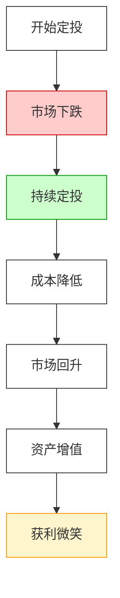

# 基金定投

## 概述

基金定投，又称定期定额，就是在**固定的时间**，以**固定的金额**，投资到**指定的开放式基金**中。

这就像定期存零花钱：
- 每个月发工资那天
- 固定拿 1000 块
- 买成基金
- 简单但强大！

## 什么是基金定投？

定投的三个「固定」：

| 「固定」项目 | 说明 | 例子 |
|-------------|------|------|
| **固定时间** | 固定日期投钱 | 每个月 1 号 |
| **固定金额** | 每次投一样多 | 每次投 1000 元 |
| **固定产品** | 投指定的基金 | 投沪深 300 指数基金 |

就像订阅杂志：
- 每期按时订
- 每期一样钱
- 自动收货
- 省心省力！

## 核心逻辑：平均成本法

定投背后的核心逻辑是**平均成本法**（Dollar-Cost Averaging, DCA）。

### 它是怎么工作的？

两个场景对比：

#### 场景 1：价格跌了，你买得更多

假设基金净值（价格）：
- 第一个月：2 元 → 1000 元买 500 份
- 第二个月：1 元 → 1000 元买 1000 份
- 第三个月：0.5 元 → 1000 元买 2000 份

三个月后：
- 总共花了：3000 元
- 总共买了：500 + 1000 + 2000 = 3500 份
- 平均每份成本：3000 / 3500 ≈ 0.86 元！

**关键点**：价格越低，买的份数越多！

#### 场景 2：价格涨了，你买得更少

价格回到 2 元：
- 第四个月：2 元 → 1000 元买 500 份

你发现：
- 你在价格低的时候买了很多
- 价格涨起来的时候，你已经有大量低成本份额了
- 一涨就赚大钱！

### 总结一下平均成本法

| 价格走势 | 你的行为 | 结果 |
|---------|---------|------|
| **价格下跌** | 同样的钱买更多份额 | 降低平均成本 |
| **价格上涨** | 同样的钱买更少份额 | 已有份额在升值 |

核心：长期下来，你的平均成本会被「拉平」，不会买在最高点，也不会错过最低点。

## 基金定投的优势

### 优势 1：投资门槛低

- 无需一次性投入大笔资金
- 每月仅需数千元即可开始
- 有些甚至 100 元起投

类比：
- 买不起一整箱苹果？
- 每次买 2 斤，慢慢吃，慢慢攒！

### 优势 2：分散择时风险

- 自动实现「低点多买、高点少买」
- 不用猜明天涨还是跌
- 不会因为恐惧而不敢买
- 不会因为贪婪而追高

类比：
- 就像下雨不知道带不带伞？
- 不管下不下，包里常备伞！
- 定投就是不管涨跌，都按时买！

### 优势 3：节省时间心力

- 系统自动执行
- 不用天天看盘
- 不用做复杂决策
- 适合懒人、忙人！

## 基金定投的风险与不足

定投不是万能的，也有局限性！

### 风险 1：时间成本较高

- 通常需要坚持至少 3 至 5 年才能看到显著效果
- 不是几个月就能暴富的
- 需要耐心

### 风险 2：错过牛市初期

- 在单边上扬行情中，单笔投入回报可能更高
- 比如 2015 年上半年那样的疯牛
- 定投会慢慢进场，错过初期大涨

### 风险 3：如果一直跌，你会很难受

虽然长期会拉平成本，但看着账户一直浮亏，心态可能会崩。

## 定投的经典场景：微笑曲线

**微笑曲线**是定投最经典的赚钱模式！

整个过程像人的笑脸，所以叫「微笑曲线」。

### 微笑曲线详解

| 阶段 | 市场情况 | 你的操作 | 心情 |
|------|---------|---------|------|
| **第一阶段** | 从高点下跌 | 继续定投 | 痛苦，在亏钱 |
| **第二阶段** | 低位震荡 | 继续定投 | 麻木，继续买 |
| **第三阶段** | 开始上涨 | 继续定投 | 开心，开始赚 |
| **第四阶段** | 加速上涨 | 可以考虑止盈了 | 狂喜！ |

**关键点**：定投在下跌时最痛苦，但正是此时积累了大量便宜筹码，为日后上涨做好准备！

## 基金定投适合谁？

| 人群 | 为什么适合？ |
|------|-------------|
| **上班族** | 每月有固定收入，适合定期投 |
| **小白投资者** | 不用懂太多，简单易上手 |
| **懒人** | 自动执行，不用管 |
| **长期储蓄者** | 为养老、子女教育存钱 |
| **管不住手的人** | 定投帮你强制储蓄，不追涨杀跌 |

## 基金定投不适合谁？

| 人群 | 为什么不适合？ |
|------|---------------|
| **想短期暴富的人** | 定投是长期游戏 |
| **追求完美择时的人** | 定投不需要择时 |
| **这笔钱很快要用到的人** | 定投需要长期资金 |

## 定投的常见问题

### Q1：投什么基金好？

A：指数基金是很多人的选择。
- 不用选个股，买指数就行
- 费用通常更低
- 长期看指数是向上的

### Q2：什么时候开始定投？

A：最好的开始时间是**现在**！
- 不用等回调
- 不用等低点
- 开始投就是了

### Q3：什么时候该止盈？

A：定投不是永远投下去的。
- 当估值很高了，可以考虑止盈
- 或者当达到你的目标收益了
- 止盈后可以继续定投下一轮

### Q4：熊市来了怎么办？

A：这是定投最喜欢的环境！
- 别人恐惧不敢买时
- 你在默默收集便宜筹码
- 等牛市一来就赚大钱了！

## 定投的最佳实践

### 1. 选择合适的标的

- 指数基金是首选
- 选波动大一些的（更容易摊低成本）
- 选长期趋势向上的

### 2. 坚持，坚持，再坚持

- 定投最重要的是坚持
- 不要跌一点就放弃
- 不要涨一点就卖光

### 3. 不要追涨杀跌

- 涨的时候不要加大投入
- 跌的时候不要停止定投
- 保持固定，保持纪律！

### 4. 考虑动态调整

不是完全死板！
- 如果牛市估值特别高，可以考虑多止盈
- 如果熊市估值特别低，可以考虑多投一点
- 但幅度不要太大，保持定投核心不变

## 一个真实的定投例子

假设你从 2015 年股灾后开始定投沪深 300：

| 时间 | 沪深 300 点位 | 定投 1000 元 | 累计份额 |
|------|-------------|-------------|---------|
| 2015 年 7 月 | 约 4000 点 | 1000 元 | 少量 |
| 2016 年低点 | 约 2800 点 | 1000 元 | 越买越多 |
| 2017 年上涨 | 约 4000 点 | 1000 元 | 继续买 |
| 2018 年再跌 | 约 3000 点 | 1000 元 | 买很多便宜货 |
| 2019 年上涨 | 约 4000 点 | 1000 元 | 已经盈利！ |
| 2020 年疫情跌下来 | 约 3500 点 | 1000 元 | 又一次捡便宜 |
| 2021 年上涨 | 约 5900 点 | 1000 元 | 赚很多！ |

结果：虽然中间经历了几次大跌，但只要坚持定投，最终会赚钱！

## 相关概念

- [[基金入门]] - 如果你是基金新手，先看这篇
- [[基金分类]] - 了解不同类型基金的区别
- [[主动基金 vs 指数基金]] - 定投选哪种好？
- [[基金费率]] - 别让手续费吃掉你的收益
- [[平均成本法]] - 定投背后的数学原理
- [[微笑曲线]] - 定投的经典盈利模式
- [[资产配置]] - 定投只是其中一部分

## 相关文章

- [基金定投技巧终极指南-从入门到进阶-5大策略捕捉微笑曲线稳定增值](../投资策略/基金定投技巧终极指南-从入门到进阶-5大策略捕捉微笑曲线稳定增值.md)

## 参考资料

- 各种基金公司的定投指南
- 银行、券商的投资者教育材料

