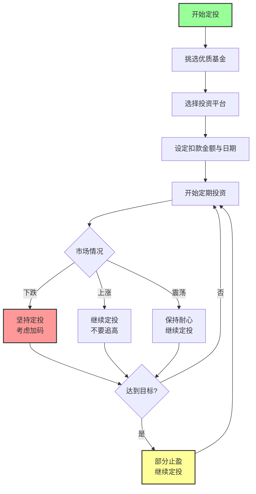
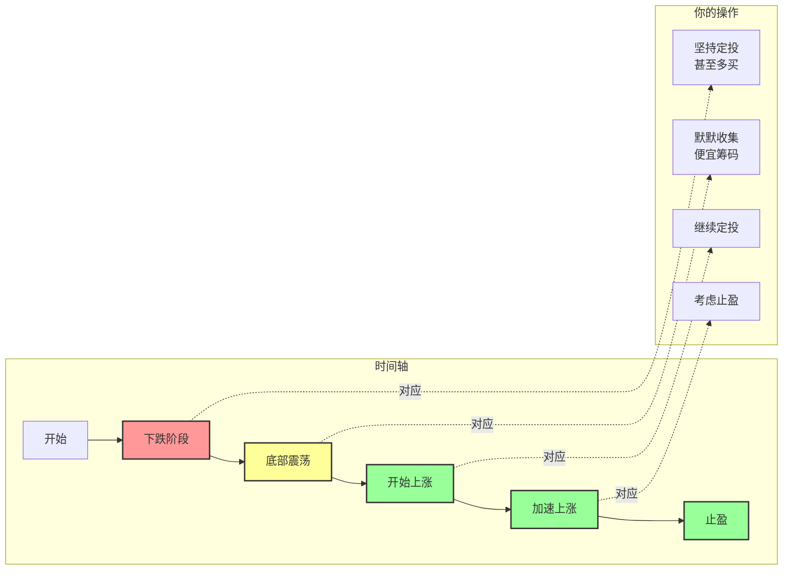
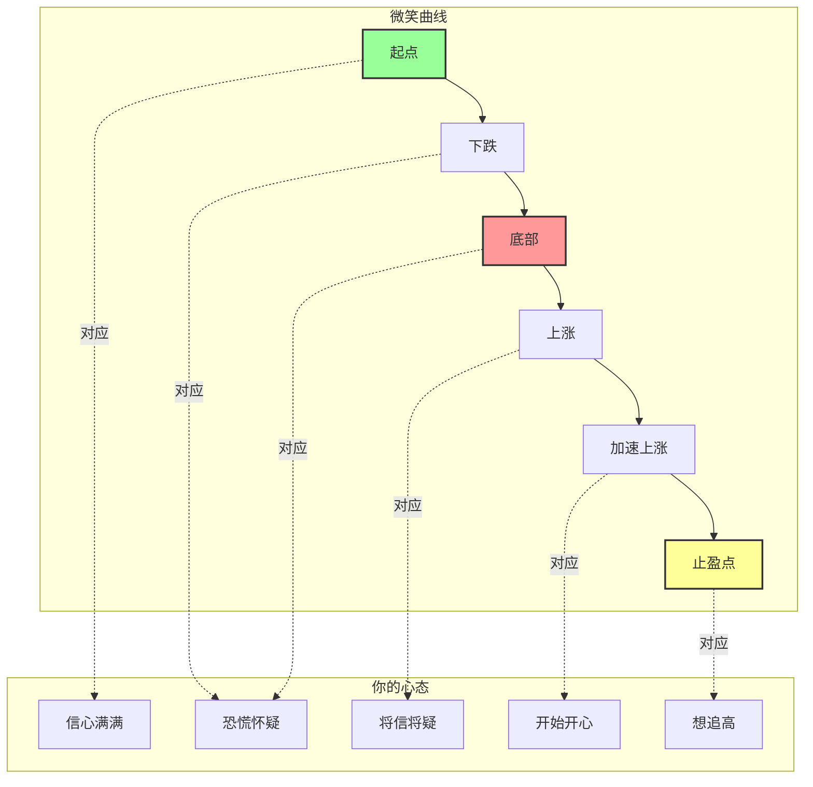

# 基金定投技巧终极指南

## 概述

本文来自看点资讯，是一篇全面的基金定投指南，从基础概念到进阶策略，助你告别月光，踏上财富累积的旅程。

这就像学开车：
- 先认识基本操作（入门）
- 再学习高级技巧（进阶）
- 最后熟练上路（实操）
- 这篇就是你的完整教科书！

## 文章来源

[原文链接](https://cj.sina.com.cn/articles/view/7857141524/1d452771401901qm1q?froms=ggmp&)

## 先回顾一下：什么是基金定投？

温故而知新！

基金定投，又称定期定额，就是在**固定的时间**，以**固定的金额**，投资到**指定的开放式基金**中。

背后的核心逻辑是**平均成本法**（Dollar-Cost Averaging, DCA）。

**经典类比**：就像在菜市场买苹果：
- 价格高时买得少
- 价格低时买得多
- 长期下来平均成本被拉平
- 简单但有效！

## 基金定投的 3 大优势与 2 大风险

让我们把优缺点摆上台面，诚实面对！

| 项目 | 说明 | 通俗解释 |
|------|------|---------|
| **优势一：投资门槛低** | 无需一次性投入大笔资金，每月仅需数千元即可开始 | 买不起房没关系，先从每月 1000 块开始！ |
| **优势二：分散择时风险** | 自动实现「低点多买、高点少买」，避免择时失误 | 不用天天猜涨跌，系统帮你自动处理！ |
| **优势三：节省时间心力** | 系统自动执行，无需频繁看盘，克服追高杀低弱点 | 懒人福音，忙人必备，不用当股神也能赚钱！ |
| **风险一：时间成本较高** | 通常需要坚持至少 3 至 5 年才能看到较显著效果 | 不是一夜暴富，是慢慢变富，需要耐心！ |
| **风险二：错过牛市初期** | 单边上扬行情中，单笔投入回报可能更高 | 疯牛时定投会踏空一些，但安全第一！ |

### 我的建议

**优势是主要的，风险是可以管理的。**
- 优势：简单、安全、省心
- 风险：长期收益不那么刺激，但更稳健

## 基金定投完整流程图

## 新手入门三步曲

从零开始，三步走！

### 第一步：挑选适合长期持有的优质基金

选什么基金？

| 选择原则 | 说明 | 推荐选择 |
|---------|------|---------|
| **波动大一些** | 波动大的更容易摊低成本 | 股票型、指数型 > 债券型 |
| **长期业绩好** | 观察 3 年、5 年、10 年长期绩效 | 不要只看去年赚最多的 |
| **规模适中** | 太小容易清盘，太大不够灵活 | 几十亿到几百亿之间 |
| **费用合理** | 费用长期影响也很大 | 选费率低的，特别是管理费 |

**新手最推荐：指数基金**
- 不用选股，买指数就行
- 费用通常更低
- 长期看指数是向上的

**常见指数基金**：
- 沪深 300
- 中证 500
- 创业板
- 纳斯达克 100（可以投美股的话）

### 第二步：选择合适的投资平台

在哪里买？

| 平台类型 | 优点 | 缺点 |
|---------|------|------|
| **银行** | 实体网点多，放心 | 手续费通常比较高 |
| **证券公司** | 选择多，有手续费折扣 | 要开股票账户 |
| **线上基金平台** | 手续费折扣大，操作便捷 | 纯线上，没有实体网点 |

**推荐**：线上基金平台或券商，手续费便宜最重要！

### 第三步：设定每月扣款金额与日期

钱从哪里来？什么时候扣？

| 项目 | 建议 | 说明 |
|------|------|------|
| **金额多少** | 量力而为，用闲钱投资（建议收入扣除必要支出后的 30%-50%） | 不要太激进，影响生活质量就不好了 |
| **扣款日期** | 选发薪日后几天（比如发薪日是 5 号，就选 8 号） | 钱刚到账就投掉，免得花光了！ |

**重要原则**：用**闲钱**！至少 3 年不用的钱才来定投！

## 3 大进阶技巧

学会了基础，来学高级技能！

### 技巧一：设定「停利点」，锁定获利

定投不是永动机！要知道什么时候收割！

两种方法：

| 方法 | 说明 | 适合谁 |
|------|------|-------|
| **回报率法** | 设定期望回报率（如 20% 或 30%） | 有明确收益率目标的人 |
| **目标金额法** | 设定具体金额目标（如教育基金、购房首付款） | 有特定储蓄目标的人 |

**高阶策略：停利不停扣！**
- 达到目标了，把利润拿出来
- 但继续每月定投
- 这样下一轮下跌时你还在继续买！

### 技巧二：善用「微笑曲线」，低挡加码

微笑曲线是定投最美好的时刻！让我们用图来看：

**微笑曲线可视化图**：

**怎么加码？**
- 市场大幅回档时（如下跌 15%-20%），勇敢单笔加码
- 比如平时每月投 1000 元，下跌 20% 时这个月投 2000 元
- 注意：别加太猛，保持安全边际！

**微笑曲线完整流程回顾**：
1. **下跌阶段**：大家都怕，你继续定投，甚至多买一点
2. **底部震荡**：没人关注，你默默收集便宜筹码
3. **开始上涨**：大家开始关注，你继续定投
4. **加速上涨**：大家疯狂进场，你考虑止盈了！

**核心心法**：别人恐惧时我贪婪，别人贪婪时我恐惧！

### 技巧三：执行「定期不定额」，更具弹性

不完全固定，有点弹性！

两种方法：

| 方法 | 说明 |
|------|------|
| **市场指标法** | 根据估值指标调整扣款金额，比如估值低时多投，估值高时少投 |
| **净值参考法** | 设定基准净值，低于时多买，高于时少买 |

**简单版定期不定额**：
- 正常情况：每月投 1000 元
- 下跌 10%：这个月投 1200 元
- 上涨 10%：这个月投 800 元
- 简单易操作！

## 常见问题解答

大家最关心的问题！

### Q1：每月最低投入多少？

A：不同平台不一样：
- 一般银行：3,000-5,000 元
- 线上平台：更低，有的 1,000 元即可
- 很多甚至 100 元起投！

**建议**：先从 500-1000 元开始，有感觉了再加！

### Q2：选择哪一天扣款？

A：长期来看对回报率影响微乎其微，选方便管理资金的日期就行。

- 不用纠结 1 号投还是 15 号投
- 选你能记住、方便操作的那天就好

### Q3：市场高位时应该暂停吗？

A：**不要！** 定投核心是避免主观择时。

- 可以适度减少金额，但不要停止
- 你不知道什么时候是真正的顶部
- 保持定投纪律最重要！

### Q4：定投计划应该持续多久？

A：建议至少跨越一个牛熊循环（3-5 年以上）。

- 太短了，可能正好在熊市就放弃了
- 跨越牛熊，才能看到微笑曲线的完整效果
- 这是一场马拉松，不是百米冲刺！

## 实战案例：一个完整的定投周期

让我们用一个假设案例，走完全程！

假设从 2015 年股灾后开始定投沪深 300：

| 年份 | 市场情况 | 你的操作 | 结果 |
|------|---------|---------|------|
| 2015-2016 | 下跌筑底 | 坚持定投，低位加大 | 成本很低！ |
| 2017 | 上涨 | 继续定投 | 开始赚钱了 |
| 2018 | 再跌 | 坚持定投，低位再加码 | 成本又拉低了 |
| 2019-2020 | 又上涨 | 继续定投 | 赚不少了 |
| 2021 | 疯涨 | 达到目标，部分止盈，继续定投 | 部分落袋为安，继续耕耘下一轮！ |

**结果**：经历一个完整牛熊，你会发现定投是有效的！

## 心理建设：定投最重要的是心态

技术重要，心态更重要！

| 阶段 | 你的心情 | 正确做法 |
|------|---------|---------|
| **下跌初期** | 慌，怕亏钱 | 别怕，这是正常波动，继续投 |
| **持续下跌** | 痛苦，怀疑人生 | 坚持住！现在买的都是便宜货 |
| **开始涨回来** | 将信将疑 | 继续投，不要停 |
| **加速上涨** | 开心，想追高 | 保持纪律，可以考虑止盈 |

**心态三原则**：
1. **不要急**：定投是长期游戏
2. **不要怕**：跌了反而是机会
3. **不要贪**：涨了要知道止盈

## 关键概念链接

这里有更详细的解释！

- [[基金定投]] - 基础概念详解
- [[平均成本法]] - 数学原理
- [[微笑曲线]] - 最经典的盈利模式
- [[资产配置]] - 更大的图景

## 总结

基金定投的 5 句口诀：

1. **选个好基** - 指数基金是好选择
2. **定期投入** - 固定时间固定金额
3. **坚持定投** - 穿越牛熊，不要停
4. **学会止盈** - 达到目标就收割
5. **心态平稳** - 不慌不贪，慢慢来

做到这 5 点，定投会给你带来满意的回报！

## 参考资料

- 新浪看点资讯原文
- 各大基金公司投资者教育材料
- 各类投资理财书籍

