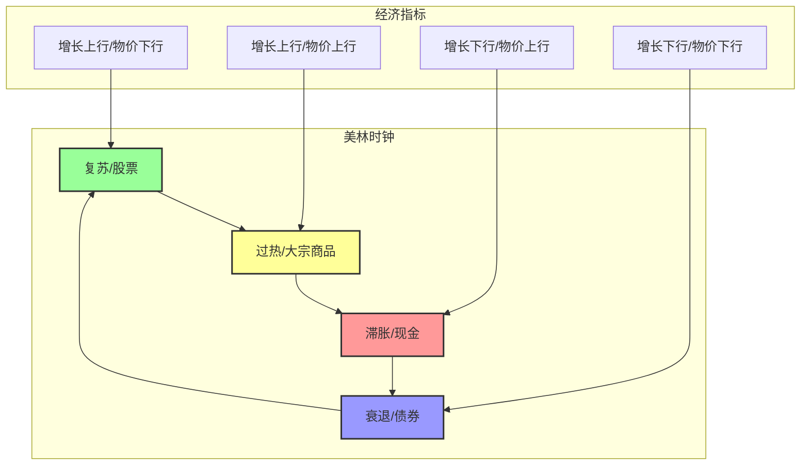

# 美林时钟

## 概述

美林时钟是资产配置理论中的经典模型，由美林证券（Merrill Lynch）2004年提出。

这就像看天气穿衣：
- 晴天穿短袖
- 下雨带雨伞
- 降温加外套
- 美林时钟就是根据「经济天气」来决定穿什么（配什么资产）！

## 什么是美林时钟？

美林时钟是一个**资产轮动模型**。

核心思想：
- 经济就像四季一样，有不同阶段
- 每个阶段，不同资产表现不一样
- 你要判断现在在哪个季节，然后配相应的资产

想象：
- 春天适合播种（买股票）
- 夏天适合收割（持有商品）
- 秋天适合储存（拿现金）
- 冬天适合保暖（持有债券）
- 美林时钟就是帮你判断现在是什么季节！

## 核心逻辑

美林时钟认为资产走势的核心驱动力是：**经济增长和物价水平**。

两个关键指标：
- **经济增长**（上行/下行）
- **通货膨胀**（上行/下行）

通过这两个维度，我们能画出一个 2×2 的四象限，把经济分为四个阶段。

## 四个经济阶段详解

让我们逐个看！

### 阶段 1：衰退 → 配债券

特点：
- **经济增长**：下行（不太行）
- **物价水平**：下行（通胀下来了）

为什么债券好？

好消息：
- 央行会降息（刺激经济）
- 利息降了，债券就值钱了
- 经济虽不好，但债券固定收益很稳

类比：
- 冬天太冷了，找个温暖的地方躲起来
- 债券就是那个安全的「窝」

### 阶段 2：复苏 → 配股票

特点：
- **经济增长**：上行（好起来了！）
- **物价水平**：下行（通胀还没起来）

为什么股票好？

完美组合：
- 经济好，企业盈利大幅上升
- 央行还在放水（维持宽松）
- 利率低，对股票估值有利
- 双击！业绩 + 估值

类比：
- 春天来了，万物复苏
- 是播种的好时候！

### 阶段 3：过热 → 配大宗商品

特点：
- **经济增长**：上行（继续好）
- **物价水平**：上行（通胀起来了）

为什么商品好？

需求旺盛：
- 经济好，大家都在生产
- 生产需要原材料
- 原材料供不应求，涨价！
- 商品（石油、金属、粮食）表现最好

类比：
- 夏天来了，万物生长
- 农作物涨价，能源紧张
- 是时候拿商品了！

### 阶段 4：滞胀 → 配现金

特点：
- **经济增长**：下行（不行了）
- **物价水平**：上行（通胀还在涨）

为什么现金好？

最惨的阶段：
- 经济不行，股票跌
- 通胀高，债券也难
- 股债双杀！
- 现金为王，拿着钱最安全

类比：
- 秋天，冬天要来了
- 先储备粮食（现金）
- 等春天再播种！

## 美林时钟速查表

让我们把四个阶段总结成表格：

| 阶段 | 经济增长 | 物价水平 | 最优资产 | 次优资产 |
|------|---------|---------|---------|---------|
| **衰退** | 下行 | 下行 | 📈 债券 | 股票 |
| **复苏** | 上行 | 下行 | 📈 股票 | 大宗商品 |
| **过热** | 上行 | 上行 | 📈 大宗商品 | 现金 |
| **滞胀** | 下行 | 上行 | 💵 现金 | 债券 |

## 美林时钟图示

想象一个时钟：

```
    [商品] 12:00
       ↗    ↖
[现金] 9:00  [股票] 3:00
       ↘    ↙
    [债券] 6:00
```

顺时针转动：
- 复苏（股票）→ 过热（商品）→ 滞胀（现金）→ 衰退（债券）→ 复苏...

## 美林时钟流程图



## 一个完整的周期例子

让我们看一轮完整周期：

1. **衰退期**（假设 2020 年初）
   - 疫情影响，经济不行
   - 降息，债券涨
   - 持有债券

2. **复苏期**（假设 2020 下半年）
   - 放水后经济复苏
   - 企业盈利好转
   - 换成股票

3. **过热期**（假设 2021 上半年）
   - 经济继续好
   - 大宗商品疯涨
   - 换成商品

4. **滞胀期**（假设 2022 上半年）
   - 通胀高，经济下来了
   - 现金最安全
   - 持有现金

5. 循环回到新的周期...

## 美林时钟的主要弱点

任何模型都有局限性！

### 弱点 1：过于重视轮动，忽视长期特征

比如：
- 股票长期是向上的
- 美林时钟可能让你经常换来换去
- 反而错过长期收益

### 弱点 2：需要准确判断经济周期

这个很难！

- 经济周期不是精确的钟表
- 有时很难判断现在在哪个阶段
- 等你确认了，可能已经晚了

### 弱点 3：忽视估值因素

如果某个资产已经很贵了呢？

- 比如股票已经涨到天上去了
- 但按照美林时钟你还在配股票
- 可能会买在高点

## 如何应用美林时钟？

### 建议 1：不要太机械

美林时钟只是一个参考，不是圣经。

- 看大方向，不要精确到分钟
- 结合其他因素一起用

### 建议 2：结合估值

看估值，不要只看周期。

- 股票便宜 + 周期支持 → 好机会！
- 股票很贵 + 周期支持 → 小心！

### 建议 3：可以作为参考，但不要全信

美林时钟是一个好的思考框架，但不要完全依赖它。

## 常见问题

### Q1：美林时钟现在还能用吗？

A：可以当思考框架，但别机械套用。现在的市场环境和 2004 年已经不一样了。

### Q2：央行政策会不会打乱时钟？

A：会！现在央行经常干预经济，周期可能被打乱。

### Q3：中国市场适用吗？

A：可以参考逻辑，但具体阶段划分可能不一样。

## 相关概念

- [[资产配置]] - 更广阔的资产配置概念
- [[全天候策略]] - 桥水的另一个策略

## 相关文章

- [深度好文：资产配置的基本原理](../投资理论/深度好文：资产配置的基本原理.md)

## 参考资料

- 美林证券 2004 年报告：The Investment Clock
- 各种券商关于美林时钟的解读

