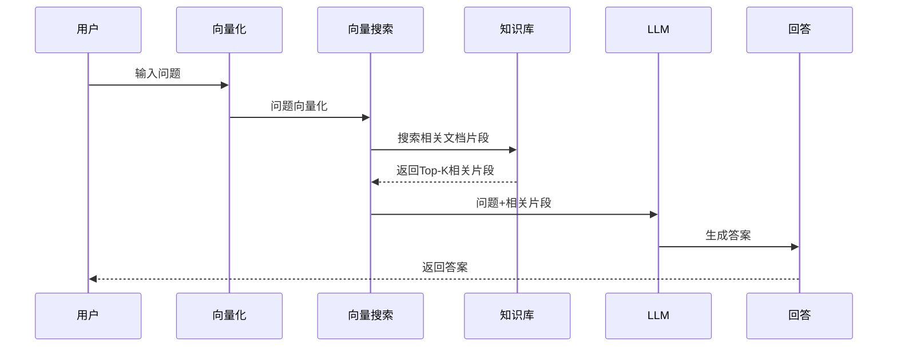
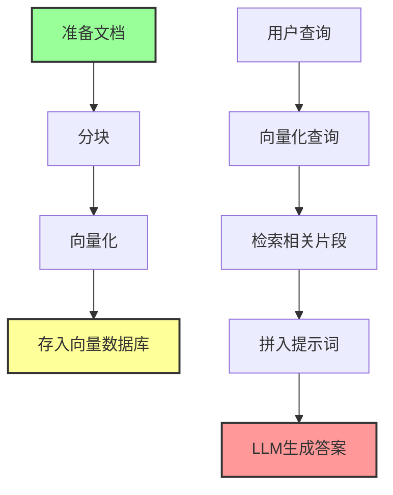

# RAG

## 概述

RAG（Retrieval-Augmented Generation，检索增强生成）是一种将检索与生成相结合的 LLM 应用模式！它是目前最常用的 LLM 知识增强方式之一！

**简单来说：RAG = 给 LLM 配了一个临时搜索引擎！**

## 什么是 RAG？

RAG 是一种让 LLM 能使用外部知识的技术，不用把所有知识都训练进模型里！

### 核心概念

| 概念 | 说明 |
|------|------|
| **检索（Retrieval）** | 从文档库中找相关内容 |
| **增强（Augmented）** | 把找到的内容加入上下文 |
| **生成（Generation）** | LLM 基于这些内容回答 |

### 经典比喻

想象一下：
- 传统 LLM = 闭卷考试，只能靠记忆
- RAG = 开卷考试，可以查资料
- 但每次都要临时翻书找！

## 工作原理详解

RAG 的工作原理其实很简单，只有 3 步！

### 1. 准备文档集合

- 上传一堆文档
- 分成小块（Chunks）
- 向量化（Embedding）
- 存入向量数据库

### 2. 查询时检索相关片段

- 用户问问题
- 把问题也向量化
- 在向量库中找相似的块
- 取回最相关的几个

### 3. 基于检索结果生成答案

- 把问题 + 检索到的内容给 LLM
- LLM 基于这些内容回答
- 就像开卷考试！

## 流程图

```
用户问题 → 向量化 → 检索相关片段 → 拼入提示词 → LLM 生成答案
```

## RAG工作流程图



## RAG处理流程图



## 优势

RAG 为什么受欢迎？

| 优势 | 说明 |
|------|------|
| **不需要训练** | 直接用，不用微调 |
| **知识实时** | 可以用最新的资料 |
| **可解释** | 能看到用了什么来源 |
| **成本较低** | 实现相对简单 |

## 局限性

RAG 也有一些局限性！这也是 [[核心概念/LLM Wiki 基础/LLM Wiki]] 想要解决的！

### 1. 每次查询都从零开始重新发现知识

- 没有积累
- 每次都重新找
- 效率低

### 2. 没有知识积累

- 这次查到的，下次还要重新查
- 不会形成知识库
- 没有复利效应

### 3. 需要每次都检索和拼凑相关片段

- 可能找到不相关的内容
- 需要拼凑多个片段
- 质量不稳定

## RAG vs LLM Wiki 详细对比

让我们详细对比一下 RAG 和 [[核心概念/LLM Wiki 基础/LLM Wiki]]！

| 特性 | RAG | LLM Wiki |
|------|-----|----------|
| **知识积累** | 无 | 有（复利） |
| **查询方式** | 每次重新检索 | 基于已整理的 wiki |
| **维护成本** | 低（无需维护） | 低（LLM 维护） |
| **知识关联** | 弱 | 强（双向链接） |
| **结构化程度** | 弱（片段化） | 强（结构化页面） |
| **知识质量** | 依赖检索质量 | 持续优化 |
| **发现矛盾** | 难 | 容易 |
| **知识进化** | 无 | 有 |

### 用图书馆比喻理解

- **RAG** = 每次去图书馆，临时翻书找几页
- **LLM Wiki** = 有一个整理好的百科全书，内容不断完善！

## 适用场景

RAG 适合这些场景：

| 场景 | 为什么适合 |
|------|-----------|
| **临时问答** | 不需要长期积累 |
| **简单知识库** | 内容不多，关系不复杂 |
| **快速原型** | 实现简单，上手快 |
| **动态资料** | 资料经常更新 |

## RAG 的常见改进

虽然 RAG 有局限性，但也有很多改进方式！

### 1. 更好的分块策略

- 语义分块
- 重叠窗口
- 层次化分块

### 2. 重排序（Rerank）

- 用小模型重新排序
- 提升相关度
- 类似 [[人物与工具/LLM Wiki 工具/qmd]] 做的

### 3. 图 RAG（GraphRAG）

- 建立实体关系
- 知识图谱
- [[人物与工具/LLM Wiki 工具/NEXUS]] 用了这个！

## 相关概念

- [[核心概念/LLM Wiki 基础/LLM Wiki]] - 另一种知识管理模式
- [[核心概念/LLM Wiki 基础/LLM Wiki 三层架构]] - LLM Wiki 的三层架构
- [[人物与工具/LLM Wiki 工具/qmd]] - 搜索工具
- [[人物与工具/LLM Wiki 工具/NEXUS]] - 用了 GraphRAG 的工具

## 总结

RAG 是一个强大且实用的技术！它简单易用，适合很多场景！但如果你想要知识复利和结构化管理，[[核心概念/LLM Wiki 基础/LLM Wiki]] 可能是更好的选择！

**理解 RAG，能帮你更好地理解 LLM Wiki 的优势！**
