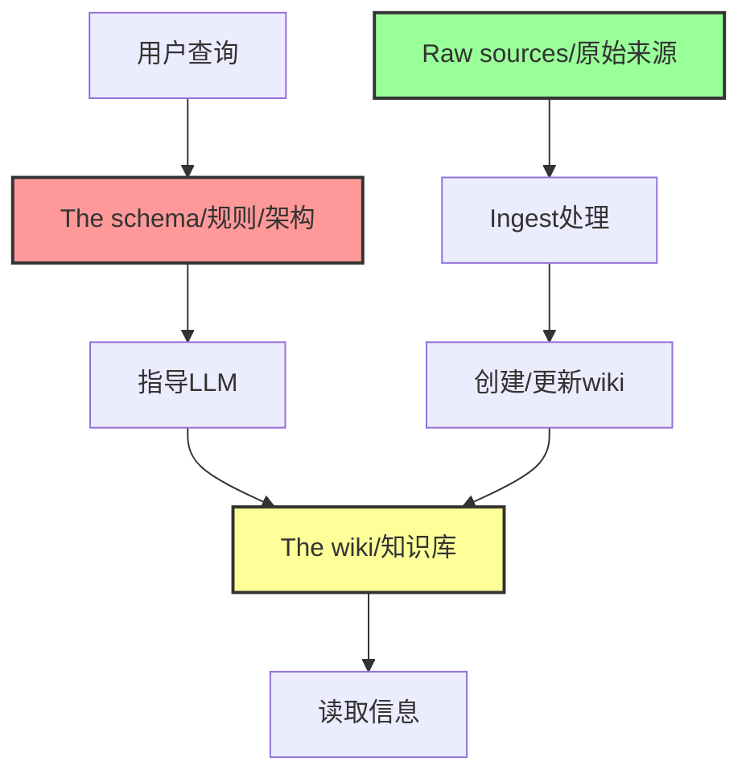
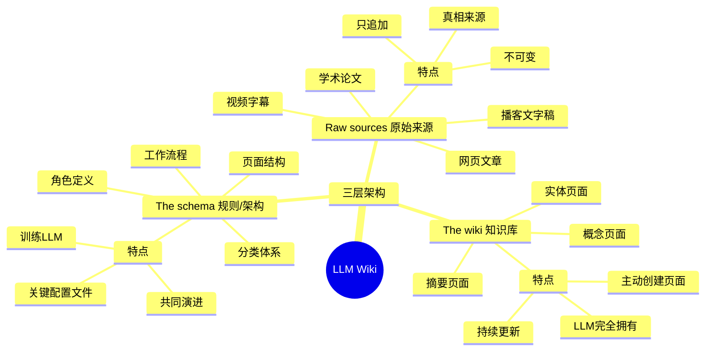

# LLM Wiki 三层架构

## 概述

LLM Wiki 模式由三层清晰的架构组成：Raw sources（原始来源）→ The wiki（知识库）→ The schema（规则/架构）。

这个架构就像一个图书馆的三层结构：一楼是原始藏书，二楼是整理好的百科全书，三楼是图书馆管理规则。

## 什么是三层架构？

三层架构是 LLM Wiki 的核心设计思想。它把知识管理过程分成了三个清晰的层次，每个层次都有明确的职责和边界。

这种分层设计的好处是：
- 职责清晰，不会混乱
- 原始数据安全不会被修改
- 知识可以独立演化
- 规则可以灵活调整

可以把三层架构想象成一个工厂的生产流程：
- **原材料仓库**（Raw sources）
- **生产车间**（The wiki）
- **生产线说明书**（The schema）

## 第一层：Raw sources（原始来源）

### 描述

Raw sources 是你的精选源文档集合。这里存放着所有的原始资料：文章、论文、网页、视频字幕、图片、数据文件等等。

可以把这一层想象成一个原始资料档案馆，所有东西都保持原样，从不修改。

### 核心特性

| 特性 | 说明 |
|------|------|
| **不可变** | LLM 从中读取但从不修改 |
| **真相来源** | 这是你最可靠的资料来源 |
| **只追加** | 新资料只能添加，不能修改已有资料 |
| **原始格式** | 保持原样，不做任何处理 |

### 什么是不可变（immutable）？

不可变是编程中的一个概念，意思是「一旦创建就不能修改」。

为什么需要不可变？因为：
- 保持原始资料的真实性
- 不会意外丢失信息
- 可以追溯知识来源
- 可以对比不同版本

就像历史档案一样，原始文档是不能修改的，这保证了知识来源的可靠性。

### 包含的内容

Raw sources 可以包含：
- 网页文章
- 学术论文
- 视频字幕
- 播客文字稿
- 书籍章节
- 个人笔记
- 数据文件
- 图片说明
- 等等

### 类比

可以把 Raw sources 想象成：
- 图书馆的原始藏书
- 博物馆的历史文物
- 档案库的原始文件

这些东西都是珍贵的原始资料，需要保持原样。

## 第二层：The wiki（知识库）

### 描述

The wiki 是 LLM 生成的 Markdown 文件目录。这里存放着：摘要、实体页面、概念页面、比较表格、概览、综合分析等等。

这一层是 LLM 的「工作成果」，是结构化、组织好的知识。

可以把这一层想象成一个由 AI 编写和维护的百科全书。

### 核心特性

| 特性 | 说明 |
|------|------|
| **LLM 完全拥有** | LLM 负责这一层的全部工作 |
| **主动创建页面** | LLM 根据需要创建新页面 |
| **持续更新** | 当新源到达时自动更新页面 |
| **维护交叉引用** | 自动建立知识之间的连接 |
| **保持一致性** | 确保整个 wiki 的风格和逻辑一致 |
| **人类阅读，LLM 编写** | 你是读者，LLM 是作者 |

### 包含的内容

The wiki 通常包含：
- **摘要页面** - 原始资料的精华
- **实体页面** - 人物、项目、工具等
- **概念页面** - 定义、解释、说明
- **比较页面** - 相似概念的对比
- **概览页面** - 某个领域的鸟瞰图
- **综合页面** - 跨领域的综合分析

### 工作方式

The wiki 的工作方式是：
1. LLM 读取 Raw sources
2. LLM 理解和消化内容
3. LLM 组织和结构化知识
4. LLM 编写 wiki 页面
5. LLM 建立页面之间的连接
6. 持续迭代和改进

就像一个专业的编辑团队在为你编写百科全书！

## 第三层：The schema（规则/架构）

### 描述

The schema 是一个特殊的文档（例如 Claude Code 的 CLAUDE.md 或我们的 AGENTS.md），它告诉 LLM wiki 的结构、约定是什么，以及在摄入源、回答问题或维护 wiki 时遵循什么工作流程。

可以把这一层想象成「游戏规则」或「工作手册」。

### 核心特性

| 特性 | 说明 |
|------|------|
| **关键配置文件** | 这是最重要的配置文件 |
| **训练 LLM** | 让 LLM 成为有纪律的 wiki 维护者 |
| **不是通用聊天机器人** | 让 LLM 专注于 wiki 维护任务 |
| **共同演进** | 你和 LLM 随着时间一起完善规则 |
| **领域定制** | 找出适合你领域的方案 |

### 包含的内容

The schema 通常包含：
- **角色定义** - LLM 的角色是什么
- **工作流程** - 处理资料的具体步骤
- **页面结构** - wiki 页面的标准格式
- **分类体系** - 知识如何分类组织
- **命名约定** - 文件和页面的命名规则
- **质量标准** - 内容质量的标准
- **操作命令** - 可用的命令和功能

### 为什么需要 schema？

Schema 很重要，因为：
- **保持一致** - 确保 wiki 风格统一
- **提高质量** - 定义质量标准
- **提升效率** - LLM 知道该怎么做
- **减少沟通** - 不用每次都重新解释
- **持续改进** - 规则可以不断完善

就像公司的员工手册一样，schema 告诉 LLM 怎么工作。

## 三层架构的关系

三层之间的关系非常清晰：

### 数据流向

```
Raw sources (原始资料)
       ↓
The wiki (结构化知识) ← The schema (规则指导)
```

### 控制关系

- **The schema** 指导 LLM 如何工作
- **The wiki** 是 LLM 根据 schema 处理 Raw sources 的结果
- **Raw sources** 永远保持不变，是知识的来源

### 一个形象的比喻

三层架构就像一家餐厅：

| 层级 | 餐厅类比 | 功能 |
|------|---------|------|
| Raw sources | 厨房的食材 | 原材料，不做改动 |
| The wiki | 餐桌上的美食 | 加工好的成品，供客人享用 |
| The schema | 菜谱和厨房规则 | 告诉厨师怎么烹饪 |

## 架构图示

```
┌─────────────────────────────────────────┐
│         The schema (AGENTS.md)          │  ← 配置层：告诉 LLM 怎么做
├─────────────────────────────────────────┤
│           The wiki (LLM-owned)          │  ← 知识层：结构化的知识
├─────────────────────────────────────────┤
│       Raw sources (immutable)           │  ← 资料层：原始来源
└─────────────────────────────────────────┘
```

## 三层架构关系图



## 三层架构思维导图



从下往上看：
- 最底层是原始资料，是基础
- 中间层是加工好的知识，是成果
- 最上层是规则，是指导

## 为什么这样设计？

### 1. 分离关注点

每层只做自己的事，不会混乱：
- Raw sources 负责保存原始资料
- The wiki 负责组织知识
- The schema 负责制定规则

### 2. 安全性

Raw sources 是不可变的，保证了知识来源的安全。就像备份一样，永远可以追溯。

### 3. 灵活性

如果对 wiki 不满意，只需要调整 schema，然后重新生成 wiki 就可以了。不需要改动原始资料。

### 4. 可演进

每层都可以独立演进：
- 可以不断添加 Raw sources
- 可以持续优化 The wiki
- 可以逐步完善 The schema

## 实际例子

让我们看一个具体的例子：

### 场景：学习机器学习

1. **Raw sources（原始来源）**
   - 收集一些论文
   - 保存一些教程网页
   - 记录视频课的字幕

2. **The schema（规则）**
   - 定义如何整理这些资料
   - 定义如何创建概念页面
   - 定义如何建立连接

3. **The wiki（知识库）**
   - LLM 阅读所有原始资料
   - LLM 创建「神经网络」页面
   - LLM 创建「梯度下降」页面
   - LLM 建立页面之间的连接
   - LLM 创建对比表格

## 常见问题

### Q1：我需要自己写 schema 吗？
A：可以从简单的开始，然后随着使用逐步完善。也可以参考其他人的 schema。

### Q2：如果我对 wiki 不满意怎么办？
A：修改 schema，然后让 LLM 重新生成。原始资料不会受影响。

### Q3：raw sources 可以是任何格式吗？
A：是的！可以是网页、PDF、视频字幕、音频文字稿等等。LLM 会处理。

### Q4：我需要懂技术来维护这个架构吗？
A：不需要！很多工具会帮你处理这些细节，你只需要理解这个概念就好。

## 最佳实践

### 1. 保持 raw sources 整洁
- 用清晰的文件夹结构
- 文件命名要有意义
- 可以给文件加标签

### 2. schema 要循序渐进
- 不要一开始就写得太复杂
- 用了之后再逐步完善
- 根据实际需要调整

### 3. 定期检查 wiki
- 看看 LLM 写得怎么样
- 发现问题调整 schema
- 持续优化质量

### 4. 备份所有层
- raw sources 要备份
- wiki 要备份
- schema 也要备份

## 相关概念

- [[核心概念/LLM Wiki 基础/LLM Wiki]] - 整体概念介绍
- [[核心概念/LLM Wiki 基础/LLM Wiki 操作流程]] - 具体操作步骤
- [[关于本站/系统介绍/LLM Wiki 介绍]] - 入门介绍

## 参考资料

- [[资料存档/原始文章/llm-wiki-by-karpathy]]
- [Karpathy 的原始 gist](https://gist.github.com/karpathy/442a6bf555914893e9891c11519de94f)

