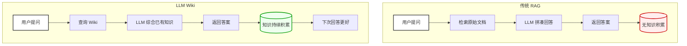
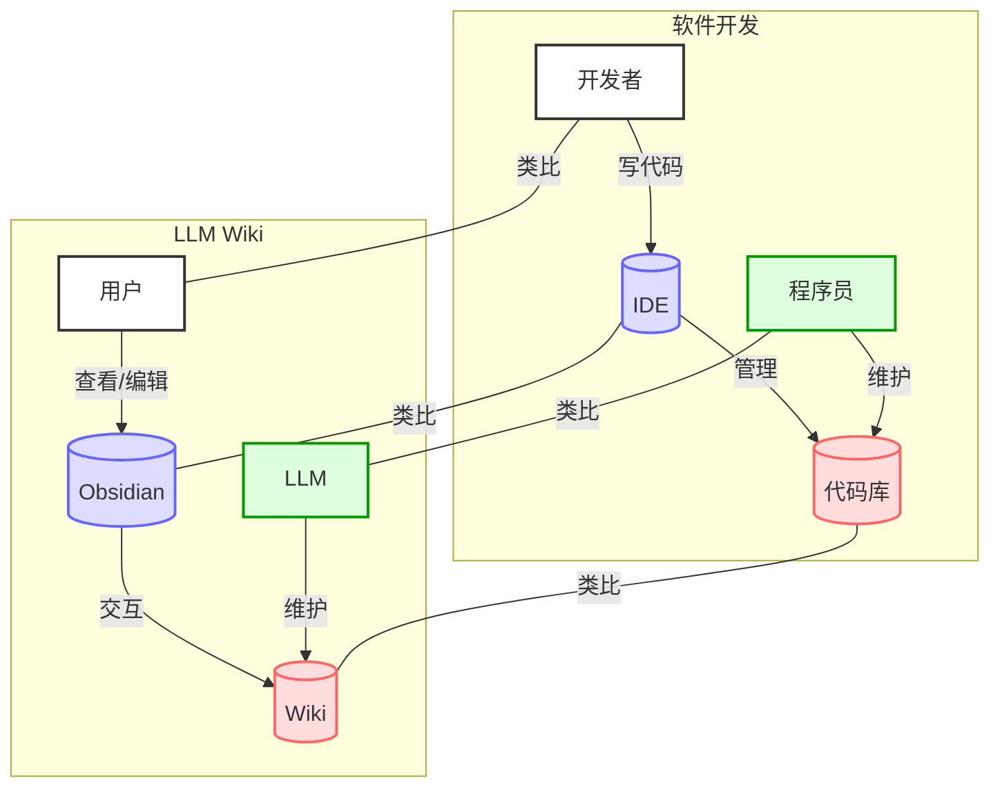
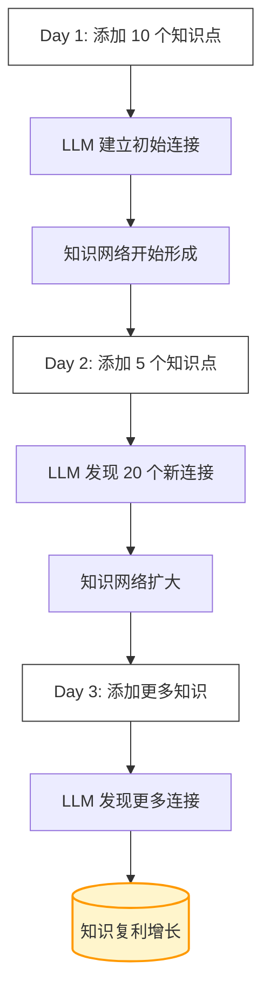

# LLM Wiki

## 概述

LLM Wiki 是一种使用大语言模型（LLM）构建个人知识库的创新模式。它由 Andrej Karpathy 在 2024 年提出，核心理念是让 AI 来维护你的知识，而不仅仅是检索知识。

简单来说，LLM Wiki 就像有一个永不睡觉的知识管家，帮你整理、连接、完善你的知识库。

## 什么是 LLM Wiki？

LLM Wiki 是 [[人物与工具/重要人物/Andrej Karpathy]] 在 2024 年提出的一种个人知识管理方法。它的名字来源于两个词的组合：LLM（大语言模型）+ Wiki（维基百科式的知识组织方式）。

传统的笔记软件主要依靠你自己动手整理笔记，但 LLM Wiki 不一样。它让 AI 来处理大部分工作，你只需要负责收集资料和提问。

可以把 LLM Wiki 想象成一个知识的「编译器，每次你添加新资料，AI 就帮你把新知识编译到已有的知识网络中去。

## 为什么叫 LLM Wiki？

### 为什么是 LLM？

LLM（大语言模型）是关键，因为：
- LLM 能理解自然语言
- LLM 能发现知识之间的连接
- LLM 能持续学习和进化

### 为什么是 Wiki？

Wiki（维基）模式是因为：
- 知识是相互链接的，不是孤立的
- 知识是持续演化的，不是固定的
- 知识是结构化的，不是混乱的

## 核心理念

LLM Wiki 的核心思想可以概括为以下几点：

### 1. Wiki 是一个持久的、复利的人工制品

这是最重要的核心理念。

就像银行的复利效应一样，你的知识库也会产生「利息。每次添加一点新知识，知识库就会变得更丰富，然后下次添加时就能更好地理解新的知识。

这就是知识的复利效应。

### 2. 交叉引用已经存在

在 LLM Wiki 中，知识之间的连接不需要你手动建立。LLM 会自动发现和建立这些连接。

### 3. 矛盾已经被标记

如果有相互矛盾的信息，LLM 会帮你标记出来，你不需要自己去发现。

### 4. 综合已经反映了你读过的所有内容

LLM 会把你读过的所有内容综合起来，形成连贯的知识体系。

### 5. 每次添加源或提问，wiki 都会变得更丰富

每一次交互都在让你的知识库变得更强大。

## 角色分工

在 LLM Wiki 模式中，人和 AI 有明确的分工：

### 人类的工作
| 任务 | 说明 |
|------|------|
| **源收集** | 收集各种资料（文章、视频、网页等 |
| **探索** | 提出问题，探索知识 |
| **提问** | 向知识库提问 |
| **思考** | 进行高层次的思考 |

可以把人类想象成一个「导演，负责提供原材料和提出问题。

### LLM 的工作
| 任务 | 说明 |
|------|------|
| **摘要** | 将长文档总结成精华 |
| **交叉引用** | 建立知识之间的连接 |
| **归档** | 组织和整理知识 |
| **记账** | 记录和追踪知识来源 |

LLM 就像一个勤劳的「图书管理员+编辑」，帮你处理所有繁琐的工作。

## 与传统 RAG 的区别

LLM Wiki 与传统的 RAG（检索增强生成）有本质的区别：

| 方面 | 传统 RAG | LLM Wiki |
|------|----------|----------|
| **知识获取** | 每次查询重新检索 | 知识已编译并保持最新 |
| **知识积累** | 无 | 有（复利效应） |
| **组织方式** | 原始文档集合 | 结构化、相互链接的 wiki |
| **维护者** | 用户 | LLM |
| **知识状态** | 静态 | 动态演化 |
| **连接性** | 孤立文档 | 网络状连接 |

### 流程对比图

### 一个形象的比喻

传统 RAG 就像每次做饭时去图书馆找书，每次都要重新找书。

LLM Wiki 就像有一个私人图书管理员，已经把所有书的内容都记下来，并做成了一本百科全书。

## 经典比喻

> Obsidian 是 IDE；LLM 是程序员；wiki 是代码库。

这个比喻非常精妙，可以用下面的图来理解：

### Obsidian = IDE
- IDE 是用来写代码的
- Obsidian 是用来查看和编辑知识的
- 你用 IDE 与代码库交互
- 你用 Obsidian 与 wiki 交互

### LLM = 程序员
- 程序员写代码
- LLM 「写」知识
- 程序员维护代码库
- LLM 维护 wiki

### Wiki = 代码库
- 代码库是结构化的代码
- wiki 是结构化的知识
- 代码库有版本历史
- wiki 也有演化历史

## 知识的复利效应

LLM Wiki 最强大的地方在于知识的复利效应。

想象一下：
- 第一天，你添加 10 个知识点
- 第二天，你添加另 5 个知识点
- LLM 自动发现这 15 个知识点之间的 20 个新连接
- 第三天，你的知识就变成了一个网络，而不是孤立的点

这就是知识复利的魔力！

## 应用场景

LLM Wiki 适用于以下场景：

### 1. 学习新领域
- 收集学习材料
- 让 LLM 帮你整理和连接
- 逐步建立知识体系

### 2. 研究项目
- 收集研究资料
- LLM 帮你发现关联
- 持续完善研究笔记

### 3. 个人知识管理
- 把你的想法、笔记、资料
- 让 LLM 帮你组织
- 建立个人知识体系

### 4. 写作素材整理
- 收集各种素材
- LLM 帮你分类和连接
- 发现新的写作灵感

## 优势

相比传统的笔记方法，LLM Wiki 有以下优势：

| 优势 | 说明 |
|------|------|
| **节省时间 | 不用花时间整理笔记 |
| **发现连接 | AI 能发现你发现不了的连接 |
| **持续进化 | 知识会自动变得更好 |
| **降低门槛 | 不需要复杂的笔记技巧 |

## 常见问题

### Q1：我需要懂技术才能用 LLM Wiki 吗？
A：不需要！LLM Wiki 的理念就是让 AI 处理复杂的工作，你只需要负责收集和提问。

### Q2：LLM Wiki 会自动整理笔记吗？
A：是的！你只需要把资料扔进去，LLM 就会帮你整理成结构化的 wiki。

### Q3：我的数据安全吗？
A：这取决于你使用的工具。你可以选择完全本地化的方案，数据完全在本地。

### Q4：LLM 会出错怎么办？
A：LLM Wiki 的理念是「渐进式完善，一次不完美没关系，持续迭代就好。

## 最佳实践

以下是使用 LLM Wiki 的一些建议：

1. **持续添加内容
- 不要等「准备好了才开始
- 一点点添加，持续迭代

2. **多提问
- 向你的知识库提问
- 这是发现知识连接的好方式

3. **定期回顾
- 看看 AI 是怎么组织知识的
- 发现新的连接和洞察

4. **不要过度优化
- 不要纠结完美
- 知识会自动变得更好

## 相关概念

- [[核心概念/LLM Wiki 基础/LLM Wiki 三层架构]] - LLM Wiki 的架构设计
- [[核心概念/LLM Wiki 基础/LLM Wiki 操作流程]] - 具体的操作步骤
- [[人物与工具/重要人物/Andrej Karpathy]] - 模式提出者
- [[核心概念/AI 技术/RAG]] - 检索增强生成
- [[人物与工具/笔记工具/Obsidian]] - 常用的工具
- [[关于本站/系统介绍/LLM Wiki 模式原文]] - 原文链接
- [[关于本站/系统介绍/LLM Wiki 介绍]] - 简化介绍

## 参考资料

- [Karpathy 的原始 gist](https://gist.github.com/karpathy/442a6bf555914893e9891c11519de94f)
- [[资料存档/原始文章/llm-wiki-by-karpathy]]

