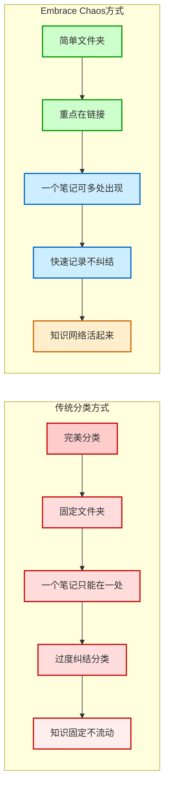
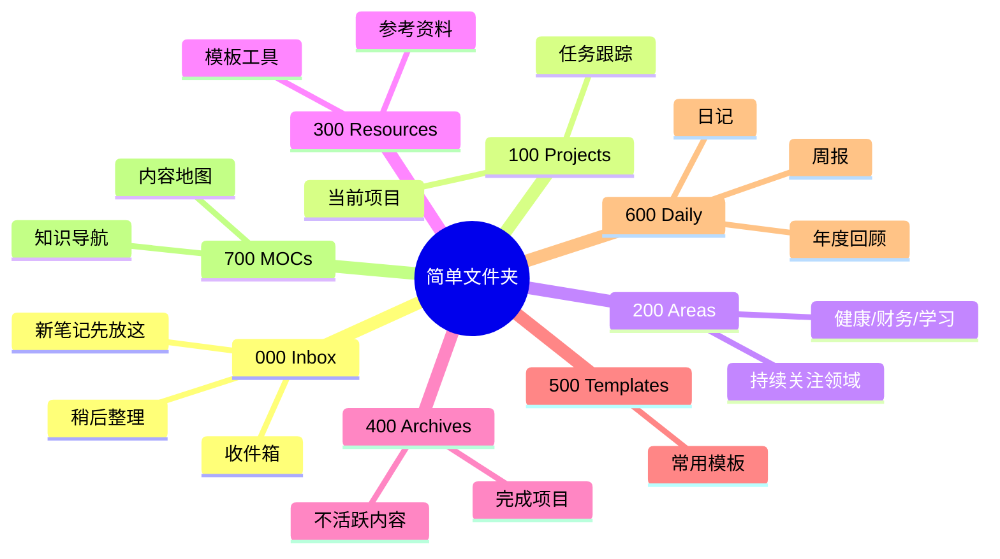
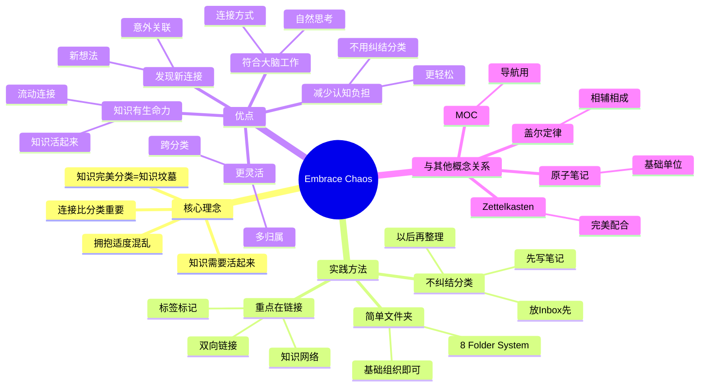

# Embrace Chaos（拥抱混乱）

## 概述

Embrace Chaos 是一种反直觉但非常有效的知识管理理念！它强调：**不要过度追求完美的分类，而是拥抱一定程度的混乱，更关注知识之间的连接！**

**简单来说：Embrace Chaos = 与其花时间分类，不如花时间连接！**

## 什么是 Embrace Chaos？

Embrace Chaos 的核心理念是：

> "知识完美分类等于给知识造一个完美的坟墓"

这句话是什么意思？
- 过度分类 = 把知识固定在一个地方
- 知识不再流动，不再连接
- 最后就"死"在那个文件夹里了
- 而连接才是知识的生命！

### 经典比喻

想象一下：
- 传统分类 = 把书放在固定的书架上，每本书只能在一个地方
- Embrace Chaos = 书可以到处放，但每本书上都有很多便签，连接到其他相关的书
- **找书时，你可以从任何一本书开始，通过便签找到其他所有相关的书！**

## 为什么要拥抱混乱？

为什么传统的分类方法不太行？有几个原因！

### 1. 大脑中的知识组织方式不是按文件夹分类的

大脑中的知识是怎么组织的？
- 不是按"科学"、"历史"、"艺术"这样分类的
- 而是通过连接！
- 比如："苹果" → "红色" → "国旗" → "中国" → "长城" → "旅游"
- 就像一张网！

### 2. 过度分类会增加认知负担

每次写笔记时：
- 这个笔记该放在哪个文件夹？
- 好像这个分类也可以，那个也可以
- 花 10 分钟想分类，最后笔记还没写
- **认知负担太重了！**

### 3. 知识之间的连接比分类更重要

分类是什么？
- 是一维的，一棵树状结构
- 一个笔记只能在一个分类里

连接是什么？
- 是多维的，一张网
- 一个笔记可以连接到无数其他笔记
- **连接比分类更强大！**

## 如何实践 Embrace Chaos？

拥抱混乱不是完全不组织！而是有方法的！

### 传统分类 vs Embrace Chaos 对比图解

### 1. 只需要简单的文件夹组织（如 8 Folder System）

不用太复杂的文件夹结构，简单就好！比如：
- 000 Inbox（收件箱）
- 100 Projects（项目）
- 200 Areas（领域）
- 300 Resources（资源）
- 400 Archives（归档）
- 简单清晰，足够了！

### 8 Folder System 图解

### 2. 用双链和标签来连接知识

重点放在连接上：
- 提到相关概念时，加上双向链接
- 用标签来标记主题
- 让知识形成网络
- **这才是重点！**

### 3. 不要花太多时间想笔记该放在哪个文件夹

写笔记时：
- 先写，随便放一个文件夹（或者先放在 Inbox）
- 重点是内容和链接
- 以后可以再整理
- **先完成，再完美！**

## 8 Folder System 示例

这是一个常用的简单文件夹系统！

| 文件夹 | 用途 | 说明 |
|--------|------|------|
| **000 Inbox** | 收件箱 | 新笔记先放这里，稍后整理 |
| **100 Projects** | 项目 | 当前正在进行的项目 |
| **200 Areas** | 领域 | 持续关注的领域（如健康、财务、学习） |
| **300 Resources** | 资源 | 参考资料、模板、工具等 |
| **400 Archives** | 归档 | 完成的项目，不再活跃的内容 |
| **500 Templates** | 模板 | 常用的笔记模板 |
| **600 Daily** | 日常 | 日记、周报、月度回顾 |
| **700 MOCs** | 内容地图 | 各种 MOC（Map of Content） |

### Embrace Chaos 思维导图

## Embrace Chaos 的好处

这么做有什么好处？

| 好处 | 详细说明 |
|------|----------|
| **减少认知负担** | 不用纠结分类，更轻松 |
| **知识更有生命力** | 通过连接，知识活起来了 |
| **更容易发现新连接** | 没有固定分类，更容易发现意外的联系 |
| **更灵活** | 知识可以属于多个主题 |
| **更符合大脑的工作方式** | 大脑就是通过连接工作的 |

## 常见问题

### Q1：拥抱混乱是不是完全不整理？

当然不是！
- 拥抱混乱 = 不过度分类，不追求完美分类
- 还是需要基本的组织的
- 只是重点从"分类"转到了"连接"

### Q2：没有分类，笔记会不会乱得找不到？

不会的！因为：
- 你有搜索功能
- 你有双向链接
- 你有 MOC（内容地图）
- 你有标签
- **这些比文件夹更强大！**

### Q3：那我完全不需要文件夹了吗？

还是需要的！
- 简单的文件夹还是有用的
- 但不要太复杂
- 不要在这上面花太多时间
- 重点是连接！

### Q4：Embrace Chaos 和 Zettelkasten 是什么关系？

它们是好搭档！
- Zettelkasten = 原子笔记 + 双向链接
- Embrace Chaos = 不过度分类，专注连接
- 完美配合！

## Embrace Chaos 与其他概念的关系

| 概念 | 关系 |
|------|------|
| **[[盖尔定律]]** | 相辅相成，都反对过度设计 |
| **[[Zettelkasten]]** | 完美配合，Zettelkasten 就是靠连接 |
| **[[MOC]]** | MOC 可以帮你在混乱中找到方向 |
| **[[原子笔记]]** | 原子笔记更容易连接 |

## 实践建议

刚开始可能不习惯，试试这些方法：

1. **先从简单文件夹开始**：用类似 8 Folder System 的简单结构
2. **写笔记时先不分类**：先放 Inbox，稍后再说
3. **多加点链接**：提到相关概念时，就加个链接
4. **定期做 MOC**：用 MOC 来组织你的知识
5. **不要焦虑**：混乱一点没关系，知识会自己长出来的

## 总结

Embrace Chaos 是一种解放的知识管理理念！它让你不再纠结于完美的分类，而是专注于更重要的事情——知识之间的连接！

**试试 Embrace Chaos，让你的知识活起来！**
