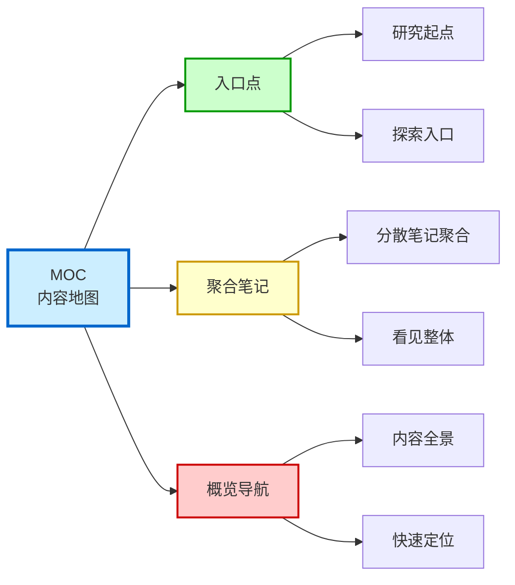
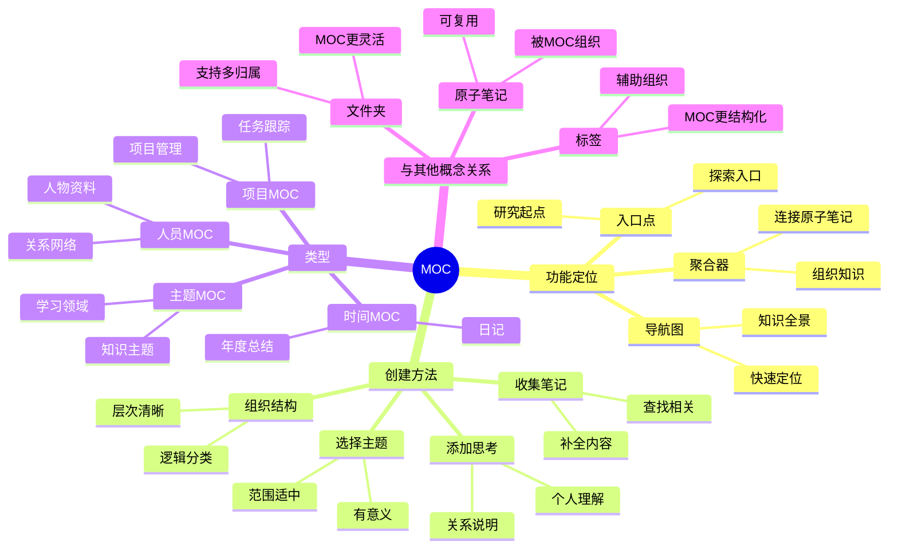

# MOC (Map of Content)

## 概述

MOC 是 Map of Content（内容地图）的缩写！它是一个用来组织和导航相关笔记的索引页面！在原子笔记满天飞的时候，MOC 就是你的导航图！

**简单来说：MOC = 某个主题的目录 + 地图 + 总索引！**

## 什么是 MOC？

MOC 是一个特殊的笔记页面，它的作用是**组织和导航某个主题的所有相关笔记**！

### 为什么叫"内容地图"？

- **地图** = 让你知道有什么，在哪里
- **内容地图** = 让你知道你有哪些相关知识，它们如何连接
- 就像旅游地图，帮你游览整个领域！

### 经典比喻

想象一下：
- 原子笔记 = 城市里的一个个景点
- MOC = 这个城市的旅游地图
- **看着地图，你知道先去哪，后去哪，景点之间怎么连！**

## MOC 的作用

MOC 有 3 个核心作用！

### 1. 作为某个主题的入口点

- 当你想研究某个主题时，先打开它的 MOC
- 从 MOC 出发，探索相关知识
- 就像打开一本书的目录！

### 2. 聚合相关的原子笔记

- 把分散的原子笔记聚合在一起
- 让你看到整体
- 不会只见树木，不见森林！

### 3. 提供知识的概览和导航

- 一眼看到这个主题有哪些内容
- 了解知识之间的关系
- 方便快速定位！

### MOC 作用图解



### MOC 与知识结构图解



## 如何创建一个好的 MOC？

创建 MOC 其实很简单！这里有一些技巧！

### 1. 选择一个清晰的主题

- 主题不要太宽，也不要太窄
- 比如："机器学习"（太宽）→ "监督学习"（合适）
- 比如："Python"（太宽）→ "Python装饰器"（太窄）→ "Python进阶技巧"（合适）

### 2. 收集相关笔记

- 找出现有相关的原子笔记
- 链接到 MOC 中
- 发现缺失的内容，后续补上

### 3. 组织成有意义的结构

- 不要只是简单的列表
- 按逻辑组织：
  - 按难度（入门 → 进阶 → 高级）
  - 按流程（步骤 1 → 步骤 2 → 步骤 3）
  - 按类别（概念 → 工具 → 实践）
- 让结构有意义！

### 4. 加入你的思考

MOC 不只是链接列表！加入：
- 你对这个主题的理解
- 笔记之间的关系说明
- 学习建议
- 让 MOC 成为你自己的知识地图！

## MOC 的具体示例

让我们看一个实际的例子！

### 示例：机器学习 MOC

```markdown
# 机器学习

## 概述
机器学习是让计算机从数据中学习的技术...

## 入门基础
- [[什么是机器学习]]
- [[机器学习的类型]]
- [[训练集与测试集]]

## 核心算法
- [[线性回归]]
- [[逻辑回归]]
- [[决策树]]
- [[神经网络]]

## 进阶主题
- [[过拟合与欠拟合]]
- [[特征工程]]
- [[模型评估]]

## 实践建议
1. 先学入门基础
2. 动手实现几个算法
3. 参加 Kaggle 比赛
```

## MOC 的不同类型

MOC 也有不同的类型！

| 类型 | 特点 | 适用场景 |
|------|------|----------|
| **主题 MOC** | 围绕一个主题 | 学习某个领域 |
| **项目 MOC** | 围绕一个项目 | 管理项目相关笔记 |
| **人员 MOC** | 围绕一个人 | 整理某个人物的资料 |
| **时间 MOC** | 按时间组织 | 日记、周报、年度总结 |

## MOC 与其他概念的关系

| 概念 | 关系 |
|------|------|
| **[[原子笔记]]** | MOC 组织原子笔记 |
| **[[Zettelkasten]]** | MOC 是 Zettelkasten 的一部分 |
| **文件夹** | MOC 比文件夹更灵活 |
| **标签** | 标签辅助，MOC 更结构化 |

## MOC vs 文件夹

很多人会问：MOC 和文件夹有什么不同？

| 特性 | 文件夹 | MOC |
|------|--------|-----|
| **灵活性** | 固定结构 | 灵活，可以跨分类 |
| **关系表达** | 弱 | 强（可以写说明） |
| **发现能力** | 弱 | 强（可以看到整体） |
| **多归属** | 难（一个文件只能在一个文件夹） | 易（一个笔记可以在多个 MOC） |

## 实践建议

创建 MOC 时，试试这些方法：

1. **先创建，后完善**：不用等所有笔记都有了才创建
2. **定期更新**：随着新知识加入，更新 MOC
3. **多个 MOC**：一个笔记可以在多个 MOC 中
4. **加入自己的理解**：MOC 不只是链接列表

## 总结

MOC 是组织原子笔记的强大工具！它让你看到知识的整体，发现知识之间的联系，让你的知识库不再是一堆散乱的笔记！

**有了 MOC，你的知识库就有了导航图！**
