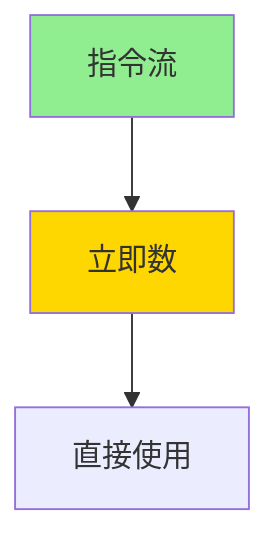
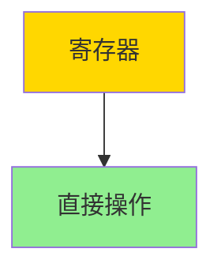
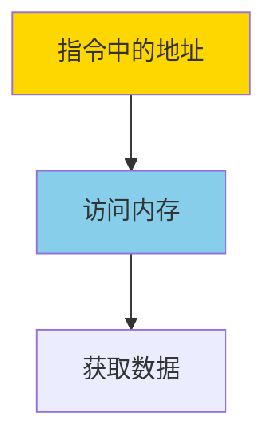
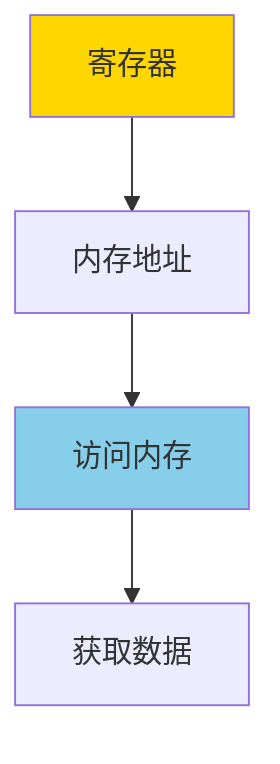
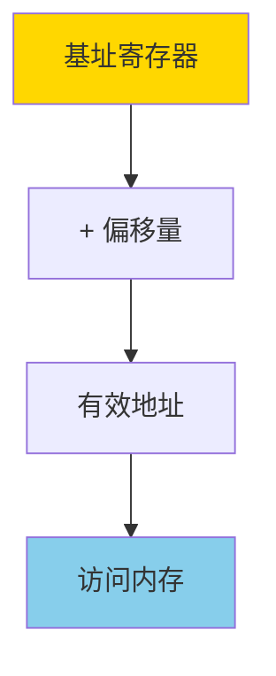
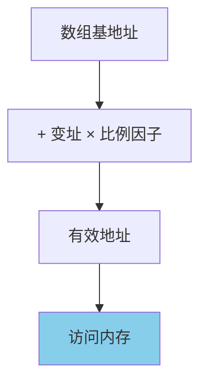
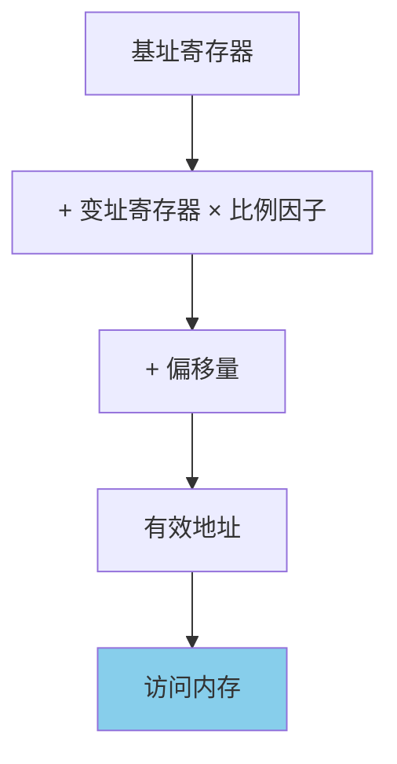

# 汇编语言寻址方式

寻址方式（Addressing Mode）决定了 CPU 如何定位指令的操作数——数据从哪里来、结果存到哪里去。

## 概述

### 什么是寻址方式

每条汇编指令的操作数可以是立即数、寄存器中的值或内存中的数据。

寻址方式就是告诉 CPU 如何计算操作数的实际地址或直接给出操作数值。

x86 架构提供了多种灵活的寻址方式，理解每种方式的使用场景是写出高效汇编代码的基础。

### 寻址方式的重要性

- **代码效率**：不同的寻址方式有不同的执行速度
- **灵活性**：丰富的寻址方式让汇编编程更简洁
- **底层理解**：理解寻址方式是理解计算机如何工作的关键

---

## 立即寻址（Immediate Addressing）

操作数直接包含在指令中，是一个常量值。

源操作数是立即数，CPU 直接从指令中读取，不需要访问内存或寄存器。

### 工作原理



### 实例

```nasm
; 立即寻址示例
mov eax, 42        ; 42 是立即数，直接编码在指令中
add ebx, 100       ; 100 是立即数
mov ecx, 0x2A      ; 十六进制立即数
mov edx, 'A'       ; 字符 'A' = 0x41，也是立即数
```

### 特点

- **速度最快**：数据就在指令流中，CPU 取指令的同时就拿到了数据
- **只能作为源操作数**：不能写 `mov 42, eax`
- **不占内存**：常量值直接编码在指令中

---

## 寄存器寻址（Register Addressing）

操作数存放在寄存器中，CPU 直接操作寄存器。

这同样是最快的操作方式之一，因为没有内存访问开销。

### 工作原理



### 实例

```nasm
; 寄存器寻址示例
mov eax, ebx       ; 将 ebx 的值复制到 eax（两个操作数都是寄存器寻址）
add ecx, edx       ; ecx = ecx + edx
push eax           ; 将 eax 的值压入栈
inc ebx            ; ebx = ebx + 1
```

### 特点

- **速度极快**：访问寄存器几乎零延迟
- **寄存器数量有限**：不能把所有数据都塞在寄存器中
- **优先选择**：写汇编代码时优先使用寄存器存放频繁访问的数据

---

## 直接寻址（Direct Addressing）

操作数是一个内存地址，地址直接写在指令中（以变量标签的形式）。

CPU 需要访问一次内存来读取或写入数据。

### 工作原理



### 实例

```nasm
; 文件路径：direct_addr.asm
; 直接寻址示例

section .data
    value dd 12345678  ; 在内存中定义一个双字变量
    name db 'runoob', 0

section .text
global _start

_start:
    ; 直接寻址读取内存
    mov eax, [value]   ; 从内存地址 value 读取 4 字节到 eax
    ; eax 现在是 12345678

    ; 直接寻址写入内存
    mov dword [value], 98765  ; 将 98765 写入 value 所在的内存地址

    ; 直接寻址读取字节
    mov al, [name]     ; 读取 name 的第一个字节 'r' = 0x72
    mov bl, [name + 1] ; 读取 name 的第二个字节 'u' = 0x75

    mov eax, 1
    mov ebx, 0
    int 0x80
```

### 特点

- **简单直观**：直接通过变量名访问
- **需要一次内存访问**：比寄存器寻址慢
- **用于全局变量**：适合访问固定地址的全局数据

---

## 寄存器间接寻址（Register Indirect Addressing）

寄存器中存放的是一个内存地址，CPU 用该地址去访问内存。

方括号内的寄存器被当作指针使用。

### 工作原理



### 实例

```nasm
; 文件路径：indirect_addr.asm
; 寄存器间接寻址示例

section .data
    msg db 'Hello, RUNOOB!', 0xA
    len equ $ - msg

section .text
global _start

_start:
    mov eax, msg       ; 将 msg 的地址（指针）放入 eax
    mov al, [eax]      ; 间接寻址：读取 eax 指向的内存字节
    ; 现在 al = 'H' = 0x48

    ; 遍历字符串，将小写字母转为大写
    mov esi, msg       ; esi 指向字符串起始位置
    mov ecx, len       ; ecx 存放字符串长度

convert_loop:
    mov al, [esi]      ; 间接寻址：读取 esi 指向的字符
    cmp al, 'a'        ; 是否大于等于 'a'
    jb next_char       ; 否，跳过
    cmp al, 'z'        ; 是否小于等于 'z'
    ja next_char       ; 否，跳过
    sub al, 32         ; 转为大写（ASCII 表中小写-大写=32）
    mov [esi], al      ; 间接寻址：写回 esi 指向的位置

next_char:
    inc esi            ; 指针移动到下一个字符
    loop convert_loop  ; 继续循环直到全部处理完

    ; 输出转换后的字符串
    mov eax, 4
    mov ebx, 1
    mov ecx, msg
    mov edx, len
    int 0x80

    mov eax, 1
    mov ebx, 0
    int 0x80
```

### 特点

- **灵活的指针操作**：寄存器可以动态变化
- **数组和字符串操作的基础**：配合 `inc esi` 可以轻松遍历连续内存
- **专用寄存器**：ESI 和 EDI 是专门设计用来配合间接寻址的

---

## 基址寻址（Base Addressing）

有效地址 = 基址寄存器的值 + 偏移量（位移量）。

基址寄存器可以是 EBX、EBP、ESI、EDI 等。

### 工作原理



### 实例

```nasm
; 基址寻址示例：访问结构体成员

section .data
    ; 模拟一个简单的结构体：{id, age, score}
    ; id = 2 字节
    ; age = 2 字节
    ; score = 4 字节
    student db 0x01, 0x00  ; id = 1
            db 0x14, 0x00  ; age = 20
            dd 95          ; score = 95

section .text
global _start

_start:
    mov ebx, student    ; ebx 存放结构体基址

    ; 基址 + 偏移量访问各成员
    mov ax, [ebx]       ; 读取 id（偏移 0）
    mov ax, [ebx + 2]   ; 读取 age（偏移 2）
    mov eax, [ebx + 4]  ; 读取 score（偏移 4）

    ; 修改 age
    mov word [ebx + 2], 21  ; age = 21

    ; 修改 score
    mov dword [ebx + 4], 98 ; score = 98

    mov eax, 1
    mov ebx, 0
    int 0x80
```

### 特点

- **结构体访问利器**：基址 + 固定偏移量完美对应结构体成员访问
- **灵活**：基址寄存器可以指向不同的结构体实例
- **常用场景**：访问数组元素、结构体成员、栈帧中的局部变量

---

## 变址寻址（Indexed Addressing）

使用变址寄存器（ESI 或 EDI）加上偏移量来访问数组元素。

### 工作原理



### 实例

```nasm
; 变址寻址示例：遍历数组

section .data
    array dd 10, 20, 30, 40, 50  ; 5 个双字元素的数组
    array_len equ ($ - array) / 4  ; 元素个数 = 总字节数 / 4

section .text
global _start

_start:
    mov ecx, array_len  ; 循环计数器
    mov esi, 0          ; 变址（下标从 0 开始）
    mov ebx, 0          ; 累加和

sum_loop:
    mov eax, [array + esi * 4]  ; 变址寻址：array + 下标 × 元素大小
    ; esi × 4 因为每个元素是 4 字节
    add ebx, eax        ; 累加到 ebx
    inc esi             ; 下标加 1
    loop sum_loop
    ; ebx = 10+20+30+40+50 = 150

    ; 变址 + 偏移：访问第二个元素
    ; array + 2*4 = array + 8，即 30
    mov eax, [array + 2*4]  ; eax = 30

    mov eax, 1
    mov ebx, 0
    int 0x80
```

### 特点

- **数组访问的标准方式**：`[array + esi * 4]` 模式非常常用
- **比例因子**：支持 1、2、4、8 倍的比例因子，方便不同大小的数组
- **动态索引**：变址寄存器可以在运行时变化

---

## 基址变址寻址（Base-Indexed Addressing）

有效地址 = 基址寄存器 + 变址寄存器 × 比例因子 + 偏移量。

这是 x86 中最强大的寻址方式，可以在一条指令中完成地址计算。

### 工作原理



### 注意事项

x86 仅支持一个变址寄存器 × 比例因子，不支持多个带比例因子的寄存器。

### 实例

```nasm
; 基址变址寻址示例：二维数组访问

section .data
    ; 3 行 4 列的二维数组
    matrix dd 1, 2, 3, 4
           dd 5, 6, 7, 8
           dd 9, 10, 11, 12

section .text
global _start

_start:
    ; 访问 matrix[1][2]（第 2 行第 3 列，下标从 0 开始）
    ; 地址 = matrix + 行*每行字节数 + 列*每元素字节数
    ; = matrix + 1*16 + 2*4
    ; = matrix + 24

    mov ebx, matrix     ; 基址寄存器
    mov esi, 24         ; 计算好的总偏移量

    ; 正确格式：基址 + 偏移量
    mov eax, [ebx + esi]  ; eax = 7

    ; 标准基址变址寻址格式：[基址 + 变址*比例因子 + 偏移量]
    ; 直接访问第 6 个元素（matrix[6] = 7）
    mov edi, 6
    mov eax, [matrix + edi*4]  ; eax = 7

    ; 程序退出
    mov eax, 1
    mov ebx, 0
    int 0x80
```

### 特点

- **最强大**：一条指令完成复杂的地址计算
- **二维数组访问**：基址 + 行索引 + 列索引
- **复杂数据结构**：适合访问复杂的嵌套数据结构

---

## 寻址方式总览

### 7 种寻址方式对比表

| 寻址方式   | 语法格式                       | 有效地址/值                  | 典型用途        | 速度对比 |
| ------ | -------------------------- | ------------------------ | ----------- | ---- |
| 立即寻址   | mov eax, 42                | 42（常数值）                 | 初始化、常量运算    | 🔴 最快 |
| 寄存器寻址  | mov eax, ebx               | 寄存器 ebx 的值              | 寄存器间数据传递    | 🔴 最快 |
| 直接寻址   | mov eax, \[var\]           | 内存地址 var 处的值            | 访问全局变量      | 🟡 快  |
| 间接寻址   | mov eax, \[ebx\]           | 地址 = ebx 的值             | 指针操作、遍历内存   | 🟡 快  |
| 基址寻址   | mov eax, \[ebx+8\]         | 地址 = ebx + 8            | 结构体成员访问     | 🟡 快  |
| 变址寻址   | mov eax, \[arr+esi*4\]     | 地址 = arr + esi × 4      | 一维数组访问      | 🟡 快  |
| 基址变址   | mov eax, \[ebx+esi*4+8\]   | 地址 = ebx + esi × 4 + 8  | 二维数组、复杂结构体 | 🟢 中  |

### 寻址方式选择建议


### 32 位 vs 16 位模式

在 32 位保护模式下，所有的通用寄存器都可以作为基址或变址寄存器。这与 16 位实模式有很大不同（16 位模式下只有 BX、BP、SI、DI 可用于寻址）。32 位的灵活性让寻址变得更加方便。

---

## 相关概念

- [[汇编语言寄存器]]
- [[汇编语言基础语法]]
- [[汇编语言内存分段]]
- [[汇编语言变量]]
- [[汇编语言系统调用]]
