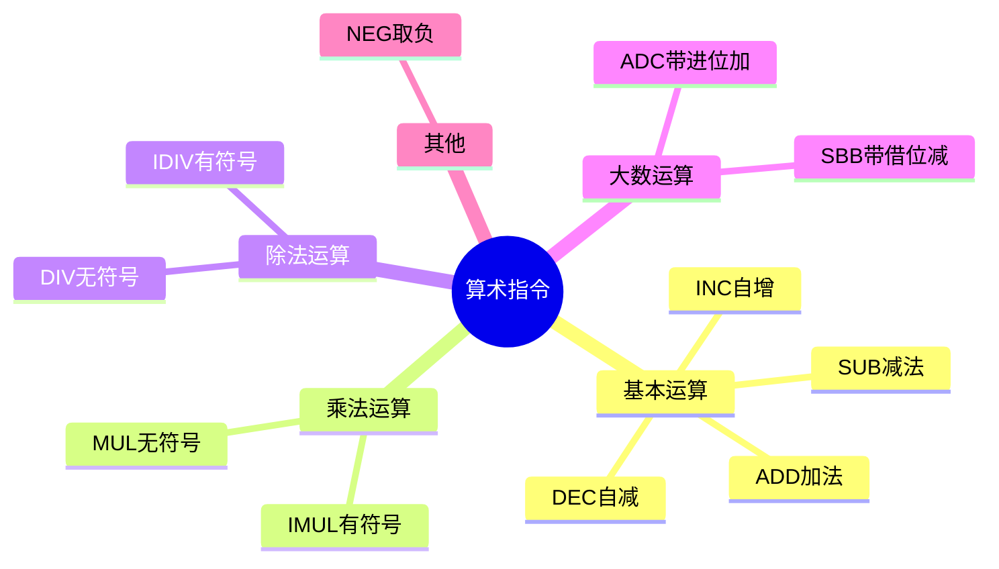
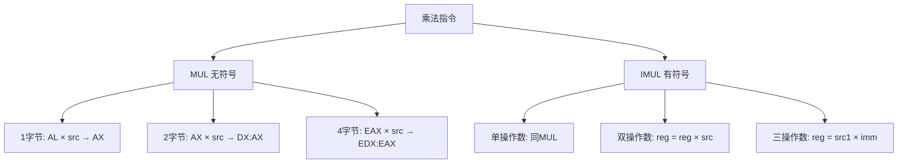
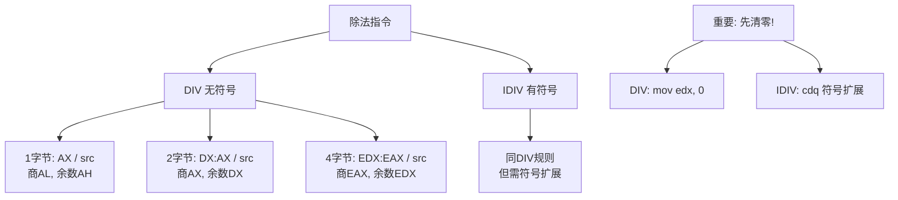
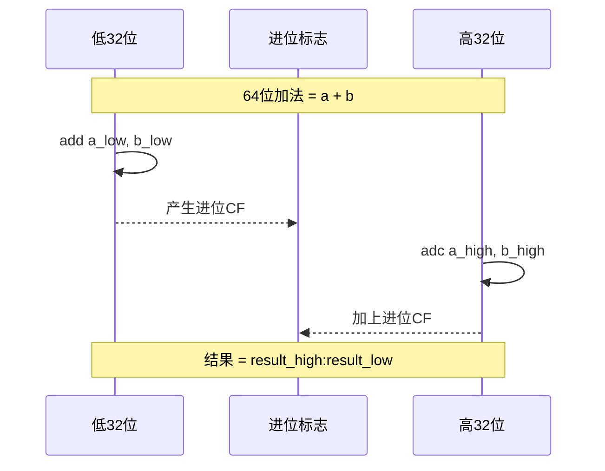

# 汇编语言算术指令

## 概述

算术指令是 CPU 执行数学运算的基础，也是汇编语言编程中最常用的指令之一。本章详细介绍 x86 架构中的加法、减法、乘法、除法以及相关进位运算指令。

掌握算术指令对于理解底层计算原理、编写高效代码以及进行逆向工程都至关重要。



## 基本算术指令

### ADD - 加法指令

**定义**：`ADD` 将源操作数和目标操作数相加，结果存入目标操作数。

**功能**：
- 语法：`add dest, src`
- 执行：`dest = dest + src`
- 影响标志位：CF、ZF、SF、OF、PF

**使用方式**：
1. 寄存器 += 立即数
2. 寄存器 += 寄存器
3. 寄存器 += 内存

**示例代码**：
```nasm
; 文件路径：add_demo.asm
; ADD 指令示例：计算 100 + 200 + 300

section .data
 a dd 100
 b dd 200
 c dd 300
 sum dd 0

section .text
global _start

_start:
 ; 方式1：寄存器 += 立即数
 mov eax, [a]      ; eax = 100
 add eax, 200       ; eax = 100 + 200 = 300

 ; 方式2：寄存器 += 寄存器
 mov ebx, [b]      ; ebx = 200
 add eax, ebx       ; eax = 300 + 200 = 500

 ; 方式3：寄存器 += 内存
 add eax, [c]       ; eax = 500 + 300 = 800

 ; 存储结果
 mov [sum], eax     ; sum = 800

 ; 加法对标志位的影响
 mov eax, 0xFFFFFFFF ; eax = 最大的 32 位无符号数
 add eax, 1          ; eax = 0（溢出回绕）
 ; CF = 1（产生进位）
 ; ZF = 1（结果为 0）
 ; OF = 0（有符号视角无溢出）

 mov eax, 1
 mov ebx, 0
 int 0x80
```

---

### SUB - 减法指令

**定义**：`SUB` 从目标操作数中减去源操作数，结果存入目标操作数。

**功能**：
- 语法：`sub dest, src`
- 执行：`dest = dest - src`
- 影响标志位：CF、ZF、SF、OF、PF

**实用技巧**：使用 `sub eax, eax` 可以高效地将寄存器清零。这种方式只占用 2 字节，而 `mov eax, 0` 占用 5 字节，在需要极致优化体积的场景（如 shellcode）中常用。

**示例代码**：
```nasm
; 文件路径：sub_demo.asm
; SUB 指令示例

section .data
 x dd 1000
 y dd 300

section .text
global _start

_start:
 ; 基本减法
 mov eax, [x]      ; eax = 1000
 sub eax, [y]       ; eax = 1000 - 300 = 700

 ; 减法对标志位的影响
 mov eax, 10
 sub eax, 20         ; eax = -10（即 0xFFFFFFF6）
 ; CF = 1（产生借位：10 < 20）
 ; SF = 1（结果为负）
 ; ZF = 0（结果非零）
 ; OF = 0（无符号溢出）

 ; 减自身：常用于清零
 mov eax, 12345
 sub eax, eax        ; eax = 0
 ; ZF = 1, CF = 0
 ; 这是一条将寄存器清零的经典方式（比 mov eax, 0 效率高）

 mov eax, 1
 mov ebx, 0
 int 0x80
```

---

### INC / DEC - 自增/自减指令

**定义**：比 ADD/SUB 更简洁的加 1 和减 1 指令。

**功能**：
- `inc dest`：`dest = dest + 1`
- `dec dest`：`dest = dest - 1`
- 影响标志位：ZF、SF、OF、PF（**不影响 CF 标志位）

**重要区别**：与 ADD/SUB 不同，INC/DEC 指令不影响 CF 标志位，这是它们的重要特性。

**示例代码**：
```nasm
; INC 和 DEC 示例

section .data
 counter dd 0

section .text
global _start

_start:
 mov dword [counter], 0   ; counter = 0
 inc dword [counter]      ; counter = 1（内存操作数）
 inc dword [counter]      ; counter = 2

 mov ecx, 10
 dec ecx                   ; ecx = 9
 dec ecx                   ; ecx = 8

 ; INC/DEC 不影响 CF 标志位（这是与 ADD/SUB 的重要区别）
 ; 但会影响 ZF、SF、OF、PF

 ; 循环中使用 INC
 mov ecx, 5
 mov eax, 0
loop_inc:
 inc eax                   ; eax 每次加 1
 loop loop_inc            ; 重复 5 次，eax 最终 = 5

 mov ebx, eax              ; 返回值 = 5
 mov eax, 1
 int 0x80
```

---

## 乘法指令



### MUL - 无符号乘法

**定义**：`MUL` 执行无符号乘法。

**特殊规则**：乘法指令的操作数规则比较特殊，被乘数是隐式的，结果存放在特定寄存器中：

| 操作数大小 | 乘数 | 被乘数（隐式） | 结果存放 |
|---------|-----|--------------|---------|
| 1 字节 | 任何 8 位寄存器或内存 | AL | AX = AL × 操作数 |
| 2 字节 | 任何 16 位寄存器或内存 | AX | DX:AX = AX × 操作数 |
| 4 字节 | 任何 32 位寄存器或内存 | EAX | EDX:EAX = EAX × 操作数 |

**影响标志位**：CF、OF

**示例代码**：
```nasm
; 文件路径：mul_demo.asm
; MUL 无符号乘法示例

section .data
 val1 dd 1000
 val2 dd 2000
 result_low dd 0
 result_high dd 0

section .text
global _start

_start:
 ; 32 位乘法：EDX:EAX = EAX × 操作数
 mov eax, [val1]         ; eax = 1000
 mul dword [val2]         ; edx:eax = 1000 × 2000 = 2,000,000
 ; 结果 = 2,000,000 = 0x001E8480
 ; EAX = 0x001E8480（低 32 位）
 ; EDX = 0x00000000（高 32 位，因为结果没超过 32 位）

 ; 大数乘法演示（结果超过 32 位）
 mov eax, 0xFFFFFFFF      ; eax = 4,294,967,295
 mov ebx, 2             ; ebx = 2
 mul ebx                 ; edx:eax = 0xFFFFFFFF × 2
 ; EAX = 0xFFFFFFFE
 ; EDX = 0x00000001（高 32 位）
 ; CF = 1（结果超出 32 位）

 ; 保存结果
 mov [result_low], eax
 mov [result_high], edx

 mov eax, 1
 mov ebx, 0
 int 0x80
```

---

### IMUL - 有符号乘法

**定义**：`IMUL` 用于有符号数的乘法，有三种形式。

**三种形式**：
1. **单操作数形式**：同 MUL，使用隐式被乘数
2. **双操作数形式**：`reg = reg × 操作数`
3. **三操作数形式**：`reg = 操作数1 × 立即数`

**与 MUL 的区别**：`MUL` 解释为无符号数，`IMUL` 解释为有符号数。比如 `0xFFFFFFFF` 在 MUL 中是 4294967295，在 IMUL 中是 -1。

**影响标志位**：CF、OF

**示例代码**：
```nasm
; 文件路径：imul_demo.asm
; IMUL 有符号乘法示例

section .data
 a dd -100
 b dd 3

section .text
global _start

_start:
 ; 单操作数形式：同 MUL
 mov eax, [a]          ; eax = -100
 imul dword [b]         ; edx:eax = -100 × 3 = -300
 ; EAX = -300（0xFFFFFED4）
 ; EDX = 0xFFFFFFFF（符号扩展）

 ; 双操作数形式：reg = reg × 操作数
 mov ebx, [a]          ; ebx = -100
 imul ebx, [b]         ; ebx = -100 × 3 = -300
 ; 结果必须是 32 位能容纳的

 ; 三操作数形式：reg = 操作数1 × 立即数
 imul ecx, [a], 5       ; ecx = -100 × 5 = -500

 mov eax, 1
 mov ebx, 0
 int 0x80
```

---

## 除法指令



### DIV - 无符号除法

**定义**：`DIV` 执行无符号除法，规则与 MUL 对称。

**特殊规则**：

| 除数大小 | 被除数（隐式） | 商 | 余数 |
|---------|------------|----|------|
| 1 字节 | AX | AL | AH |
| 2 字节 | DX:AX | AX | DX |
| 4 字节 | EDX:EAX | EAX | EDX |

**重要提示**：做除法前务必用 `mov edx, 0` 或 `xor edx, edx` 清零 EDX！如果 EDX 中有旧数据，被除数的值就不对了。这是初学者最常见的除法 bug。

**影响标志位**：无定义（不定）

**示例代码**：
```nasm
; 文件路径：div_demo.asm
; DIV 无符号除法示例

section .data
 dividend dd 1000
 divisor dd 7
 quotient dd 0
 remainder dd 0

section .text
global _start

_start:
 ; 32 位除法：edx:eax / 除数
 ; 被除数要先扩展到 EDX:EAX
 mov eax, [dividend]     ; eax = 1000
 mov edx, 0              ; edx = 0（高 32 位清零）
 div dword [divisor]      ; edx:eax / 7
 ; EAX = 142（商）
 ; EDX = 6（余数：1000 = 142×7 + 6）

 mov [quotient], eax     ; quotient = 142
 mov [remainder], edx     ; remainder = 6

 ; 字节除法示例：55 / 4
 mov ax, 55              ; 被除数
 mov bl, 4               ; 除数
 div bl                  ; al = 13（商）, ah = 3（余数）

 mov eax, 1
 mov ebx, 0
 int 0x80
```

---

### IDIV - 有符号除法

**定义**：`IDIV` 用于有符号除法。

**重要操作**：做除法前需要用 `CDQ` 指令将 EAX 符号扩展到 EDX:EAX。

**CDQ 指令**：将 EAX 的符号位复制到 EDX 的所有位，实现符号扩展。

**影响标志位**：无定义（不定）

**示例代码**：
```nasm
; IDIV 有符号除法示例

; 计算 -100 / 3
 mov eax, -100       ; eax = -100
 cdq                   ; 符号扩展：edx:eax = -100
 ; cdq 将 eax 的符号位复制到 edx 的所有位
 mov ebx, 3            ; 除数
 idiv ebx              ; eax = -33（商）, edx = -1（余数）
 ; 验证：-100 = -33 × 3 + (-1)
```

---

## 大数运算



### ADC / SBB - 带进位/借位运算

**定义**：用于大数运算（超过 32 位的数据）。

**功能**：
- `adc dest, src`：`dest = dest + src + CF`（带进位加法）
- `sbb dest, src`：`dest = dest - src - CF`（带借位减法）
- 影响标志位：CF、ZF、SF、OF、PF

**工作原理**：对于 64 位或更大的数，将其拆分为低 32 位和高 32 位分别处理，使用 ADC/SBB 来传递进位/借位。

**示例代码**：
```nasm
; 文件路径：adc_sbb_demo.asm
; 64 位加法：两个 64 位数相加

section .data
 ; 64 位数 a = 0x00000001 FFFFFFFF
 a_low dd 0xFFFFFFFF
 a_high dd 0x00000001

 ; 64 位数 b = 0x00000000 00000005
 b_low dd 0x00000005
 b_high dd 0x00000000

 ; 结果
 result_low dd 0
 result_high dd 0

section .text
global _start

_start:
 ; 低 32 位相加
 mov eax, [a_low]
 add eax, [b_low]       ; eax = 0xFFFFFFFF + 5 = 0x00000004
 ; CF = 1（产生进位！）
 mov [result_low], eax  ; result_low = 0x00000004

 ; 高 32 位加进位
 mov eax, [a_high]
 adc eax, [b_high]      ; adc = add + CF
 ; eax = 1 + 0 + 1(进位) = 2
 mov [result_high], eax ; result_high = 2

 ; 最终 64 位结果：0x00000002 00000004
 ; 验证：0x1FFFFFFF + 5 = 0x200000004

 ; SBB 减法同理（带借位）
 mov eax, [a_low]
 sub eax, [b_low]       ; 低 32 位相减
 mov [result_low], eax

 mov eax, [a_high]
 sbb eax, [b_high]      ; sbb = sub - CF

 mov eax, 1
 mov ebx, 0
 int 0x80
```

---

## 算术指令速查表

| 指令 | 格式 | 功能 | 影响的标志位 |
|-----|-----|-----|-----------|
| ADD | `add dest, src` | `dest = dest + src` | CF, ZF, SF, OF, PF |
| SUB | `sub dest, src` | `dest = dest - src` | CF, ZF, SF, OF, PF |
| INC | `inc dest` | `dest = dest + 1` | ZF, SF, OF, PF（不影响 CF） |
| DEC | `dec dest` | `dest = dest - 1` | ZF, SF, OF, PF（不影响 CF） |
| MUL | `mul src` | 无符号乘法 | CF, OF |
| IMUL | `imul src` | 有符号乘法 | CF, OF |
| DIV | `div src` | 无符号除法 | 无定义（不定） |
| IDIV | `idiv src` | 有符号除法 | 无定义（不定） |
| ADC | `adc dest, src` | `dest = dest + src + CF` | CF, ZF, SF, OF, PF |
| SBB | `sbb dest, src` | `dest = dest - src - CF` | CF, ZF, SF, OF, PF |
| NEG | `neg dest` | `dest = -dest`（取负） | CF, ZF, SF, OF, PF |

## 相关概念

- [[汇编语言寄存器]] - 了解 x86 架构的寄存器
- [[汇编语言内存分段]] - 了解内存访问方式
- [[汇编语言系统调用]] - 了解如何进行系统调用

## 参考资料

- 菜鸟教程 - https://www.runoob.com/assembly/assembly-arithmetic.html
